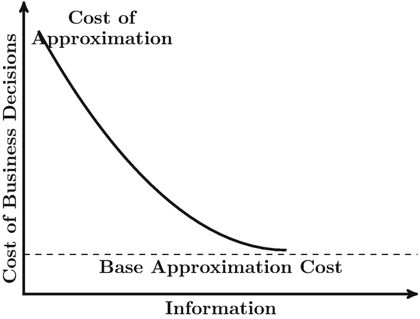
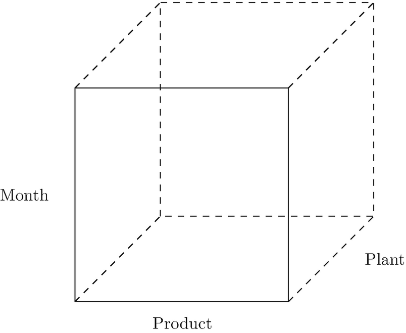
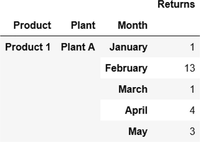
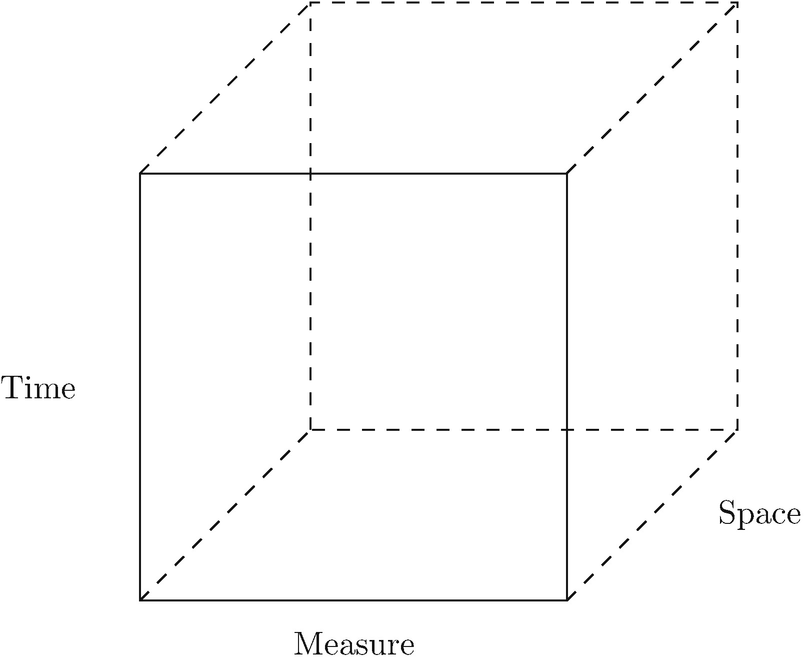
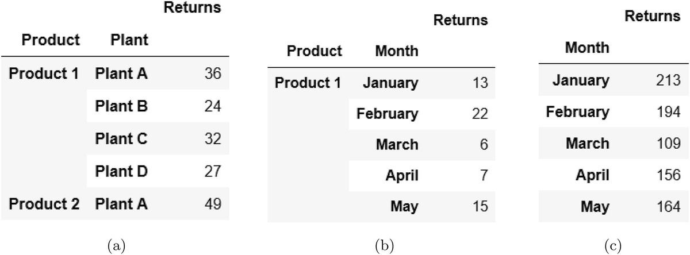
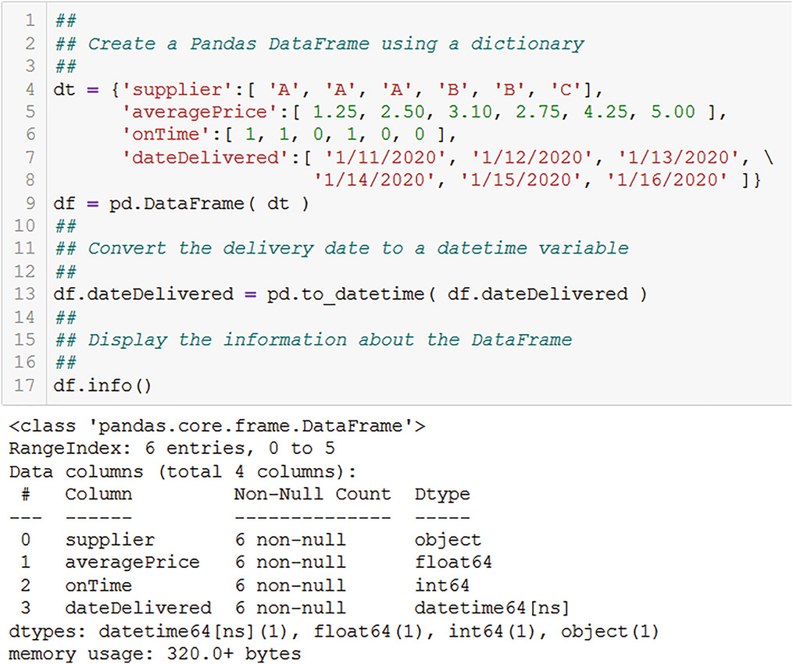
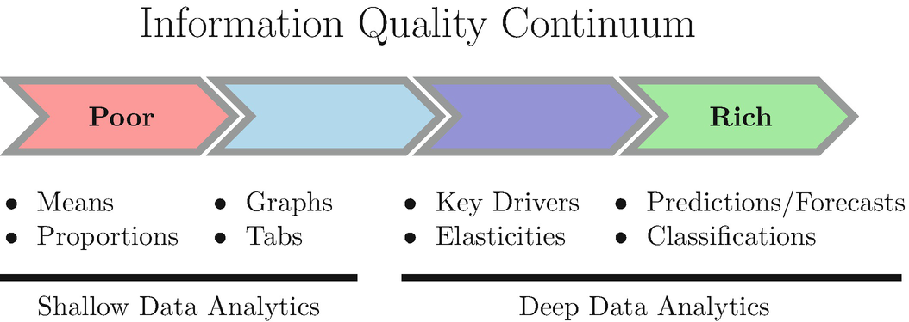
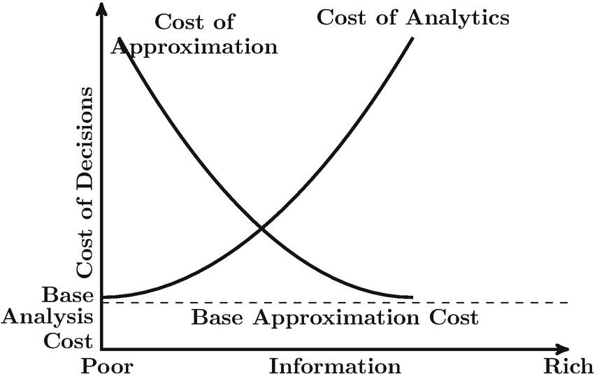
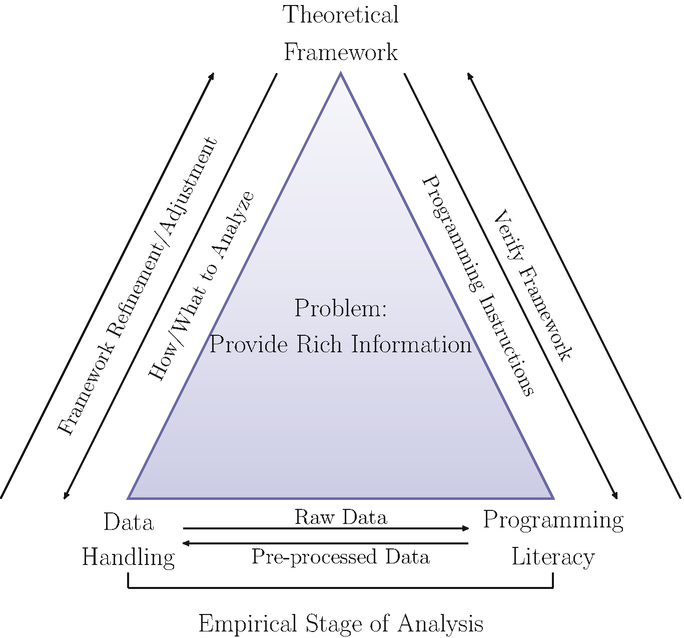
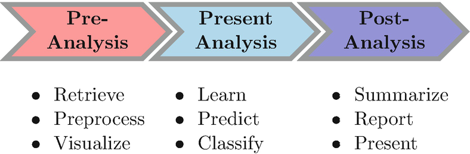

# 业务数据分析简介：搭建舞台
> 沃尔特·R·帕茨科夫斯基[^1]
> 数据分析公司，美国新泽西州普莱恩斯伯勒

剧透警告：本书的重点业务数据分析 (BDA) 只关注一项任务，而且只关注一项任务：为决策者提供尽可能丰富的信息。
在这个介绍性章节中，关于我的剧透警报，我有两个目标。我将首先讨论业务决策者面临的问题类型以及决策者是谁。然后，我将讨论信息的作用和重要性，为后续章节奠定基础。这将包括信息的定义。人们经常互换使用数据和信息这两个词，就好像它们具有相同的含义一样。我将区分它们。首先，尽管它们可以互换使用，但它们并不相同。其次，正如我将论证的那样，信息是潜在的，隐藏在数据中，必须被提取和揭示，这使得它成为一个更深入、更复杂的主题。作为数据分析师，你需要掌握信息的重要性，因为从数据中提取信息是 BDA 存在的唯一原因。
我将在讨论数据和信息之间的差异之后，对很少讨论的信息的两个维度进行比较：决策者所依赖的信息的数量和质量。决策的成本往往充其量被忽视或最坏的情况下被忽视。成本是由于两个维度。 BDA 的目标不仅是提供信息（即数量问题），而且还提供良好的信息（即质量问题）以降低决策成本。然而，提供好的信息本身并不是没有成本的。你需要适当的技能和资源来有效地从数据中提取信息。这是进行数据分析的成本。这两项成本——决策成本和数据分析成本——决定了可以向决策者提供哪些信息。这些对 BDA 的类型和深度都有影响。

## 1.1 业务问题的类型
哪些类型的业务问题需要 BDA？类型太多了，无法一一列举，但要了解它们，请考虑几个例子：

- 异常检测：生产监控、预测性维护、制造良率优化；
- 欺诈识别;
- 身份盗窃；
- 账户和交易异常；
- 客户分析：
    - 客户关系管理（CRM）；
    - 流失分析和预防；
    - 消费者满意度;
    - 营销交叉销售和追加销售；
    - 定价：泄漏监测、促销效果跟踪、有竞争力的价格响应；
    - 履行：管理和管道跟踪；
- 竞争监测；
- 竞争环境分析（CEA）
- 新产品开发。

这样的例子不胜枚举。
所有这些问题都需要某种类型的决定。新产品开发最能体现复杂的决策过程。决策是在整个产品开发流程中做出的。这是从构思或概念化到产品发布和发布后跟踪的一系列阶段。 Paczkowski (2020) 确定了管道的五个阶段：构思、设计、测试、发布和发布后跟踪。在每个阶段之间做出决定是继续下一个阶段还是中止开发甚至生产。每个决策点都由商业案例分析标记，该分析检查产品的预期收入和市场份额。预期销售额、预期价格点（随着产品通过管道而改进）、生产和营销成本估算以及包括当前产品、销售、定价和促销以及对提议的新产品的竞争反应在内的竞争分析。每个业务案例评估都需要。如果其中任何一个对概念有负面影响，那么它将被取消并从管道中删除。每个业务案例检查点都需要信息。
随着新的和更好的信息（而不是数据）可用于我上面列出的项目，每个业务案例分析的预期收入和市场份额都会得到优化。当然，随着产品的开发，确实会获得更多数据，但是基于本书中描述的方法对数据的分析，提供了批准或不批准将概念推进到下一阶段所需的信息在管线中。例如，第一个决定就是开始开发新产品。有人不得不对"我们应该开发新产品吗？"这个问题说"是"。商业案例分析为决策者提供了初始"Go/No Go"决策的信息。在其他阶段也会做出类似的决定。
另一个例子是产品定价。这实际上是一个涉及结构（例如，统一定价或价格歧视以提及两种可能性）和结构内的一个级别的双重决策。这些决策是在整个产品生命周期中做出的，从开发阶段（我上面讨论的管道的启动阶段）开始，然后在整个发布后阶段，直到产品最终从市场上撤出。错误的价格结构和/或水平可能会使你的企业失去利润、失去市场份额或失去业务。请参阅 Paczkowski (2018) 讨论定价的作用以及确定最佳价格结构和水平的分析类型。另请参阅 Paczkowski (2020)，了解管道每个阶段的新产品开发定价。

## 1.2 信息在商业决策中的作用
如果决策能够解决问题，例如我上面讨论的那些问题，并且有助于而不是阻碍你的企业在市场上取得成功，那么决策就是有效的。如果你的企业获得利润并为其所有者（股东、合作伙伴、员工所有公司的员工）或唯一所有者带来正回报，我将假设你的企业成功。信息可能是关于

- 当前销售额；
- 未来的销售；
- 市场状况；
- 消费者、社会和技术趋势和发展；
- 客户的需求和愿望；
- 客户支付意愿；
- 关键客户群；
- 财务发展；
- 供应链发展；
- 客户流失的规模。

这些信息被输入到决策中，就像任何输入一样，如果它是坏的，那么决策就是坏的。基本上，GIGO 原则（Garbage In–Garbage Out）成立。这应该是显而易见的，几乎是陈词滥调。不幸的是，你不知道你何时做出决定，你的信息是好是坏，甚至是足够的。由于可用信息的数量和质量，你面临不确定性。
如果没有任何信息，你只会猜测，而且猜测的成本很高。在图 1.1 中，我根据你拥有的信息量说明了决策成本会发生什么变化。在没有任何信息的情况下，你的所有决定都是基于纯粹的猜测和预感，因此你被迫近似它们的效果。基于直觉（即，毫无根据地相信你知道一切）或昨天发生的事情或在与你类似的其他业务（即模拟业务）中发生的事情，该近似值可能非常幼稚。

图 1.1 这条成本曲线说明了随着信息量的增加，决策成本会发生什么变化。由于所有决策的不确定性，基本近似成本是你可以实现的最低成本。这是一个高于零的金额
这些近似值在财务损失、失去市场份额或彻底破产方面的成本可能非常高。然而，随着信息量的增加，你将有更多的洞察力，因此你的近似值（即猜测）会提高，并且近似值的成本会下降。这正是我上面描述的业务案例流程中发生的情况。更多更好的信息可以帮助每个业务案例阶段的决策者。现在，近似值可以基于趋势、具有统计意义的影响估计或基于模型的假设分析。这些不是"数据"；它们是信息。
Adriaans (2019) 指出，你拥有的信息量与你面临的不确定性水平之间存在反比关系。 Adriaans (2019) 将此称为线性关系，尽管我认为没有理由使用线性，因为随着信息量的增加，在线性下的某个点上，不确定性会被驱使为零。然而，成本永远不会下降到零，因为你永远不会有足够的信息来了解一切并完美地了解它；确切地知道你的决定会发生什么。任何决定总会有一些不确定性。近似结果的成本将在零以上的点触底。可以说，随着信息量变大，它将渐近接近大于零的下限。关系是非线性的。这是我在图 1.1 中成本曲线的基础，它表明随着不确定性水平由于信息的增加而下降，错误的成本也会下降但不会消失。

## 1.3 不确定性与风险
不确定性是生活中的一个事实，反映了我们缺乏知识。它要么是空间的（"我不知道今天国会发生了什么。"），要么是时间的（"我不知道明年的销售会发生什么。"）。无论哪种情况，缺乏关于世界状况（SOW）的知识：国会正在发生什么以及明年会发生什么。商业教科书，例如 Freund 和 Williams (1969)、Spurr 和 Bonini (1968)，以及 Hildebrand 等人。 (2005) 通常讨论为你可以列出的不同 SOW 分配概率。这些概率的目的是让你能够在某件事物化之前对这个世界发表一些看法。不知何故，从未解释过如何将代表结果或收益的数值分配给 SOW。概率和相关的收益用于计算所有可能的 SOW 的预期或平均收益。例如，考虑一个资本扩张项目的投资回报率 (ROI)。投资回报率可能取决于未来 5 年实际 GDP 的平均年增长率。假设实际 GDP 增长简单地表示为下降（即衰退）、持平（0%）、缓慢（1%–2%）和稳健（> 2%），分配的概率分别为 0.05、0.20、0.50 和0.25，分别。这些形成一个概率分布。设 p ~i~ 为实现状态 i 的概率。然后，对于这 n = 4 种可能的状态 $$\sum _{i = 1}^n p_i = 1.0$$。我在表 1.1 中显示了 SOW、概率和 ROI 值 。预期的投资回报率为 $$\sum _{i = 1}^4 p_i \times {ROI}_i = 2.15$$ %。这是预计在未来 5 年内平均赚取的金额。
表 1.1 对于此处显示的三个 SOW，预期 ROI 为 2.15%

| SOW    | 实际GDP增长 | 概率 | 投资回报率 |
| ------ | ----------- | ---- | ---------- |
| 衰退   | <0%         | 0.05 | −0.01      |
| 平坦的 | 0%          | 0.20 | 0.01       |
| 慢的   | 1–2%        | 0.50 | 0.02       |
| 强大的 | >2%         | 0.25 | 0.04       |

Savage (1972, p. 9) 指出，"世界状态"陈述中的"世界"是针对手头的问题定义的，你不应该从字面上理解它。这是一个流动的概念。他说它是"这个人所关心的对象"。同时，世界的"状态"是对其状况的完整描述。 Savage (1972) 指出，它是"对世界的描述，没有留下任何未描述的相关方面"。但他也指出，存在一种真实的状态，一种"事实上确实获得的状态，即对世界的真实描述"。不幸的是，它是未知的，因此在实现或向我们揭示它之前，我们能做的最好的事情就是为每个状态的发生分配概率以进行决策。这些是表 1.1 中的概率。更重要的是，真正的状态是未知的，直到被揭露才知道，这才是问题所在。在这种真实状态发生之前，再多的信息也不会完全完美地揭示它。
但是，你可以通过创建一个模型来模拟它发生之前的真实状态，该模型具有你认为会发生的世界的一些（但不是全部）特征。你不会拥有所有的功能，因为世界太复杂了。所以，你有一个世界如何运作的候选模型。你可以使用数据集来训练该模型以最好地模拟世界。如果你的决策问题是是否向一类客户提供信用，那么你的训练数据将具有某些客户的实际信用价值。然后，你可以使用单独的独立数据集测试你训练的模型预测信用价值的能力。一旦对你的模型训练有素感到满意，你就可以将其部署到你的客户群中。我在第一章讨论了开发训练和测试数据集的方法。 [^9] 以及如何在后续章节中训练、测试和使用模型进行预测。
尽管表 1.1 是介绍期望值的一个很好的教科书示例，但它有几个问题。这些是以下标识：

1. SOWs
2. 相关的投资回报率
3. 概率。

哪儿来的呢？我可以接受一个论点，即 SOW 的定义是合理的，因为考虑到美国过去的商业周期历史，我也可以接受一个关于 ROI 值的论点，它可能是过去商业周期期间投资回报率的平均值，并且用于过去的资本投资。概率分布呢？这是一个问题。它从哪里来的？
同样的问题也适用于其他情况。例如，假设你的信用部门已为客户分配了一个评级，表明他们拖欠付款的可能性。评级可能是"非常可能"、"有点可能"和"完全不可能"。每个客户是否违约的真实 SOW 直到信用被延长是未知的。这些可以分配概率，以便你可以确定付款的预期价值。但问题是一样的："概率分布是从哪里来的？"
概率要么基于频率，要么基于主观。基于频率的概率源自重复执行实验（例如，掷一枚公平的硬币），而主观概率则基于有争议的心理过程。实验结果没有争议（假设一个定义明确且执行正确的实验协议）。未来的实际 GDP 增长期和违约评级无法通过实验得出。概率是主观的。
然而，对于默认问题，还有一个替代方案。你可以根据客户的信用记录、当前的财务状况（可能是 FICO ® 信用评分和销售人员投入）对客户进行分类。然后，你可以构建一个分类模型来为每个客户分配评级。实际上，该模型将分配违约概率，从而产生所需的概率分布。分类问题中的概率称为倾向，类别分配基于这些倾向。我在第一章讨论分类建模和概率分配。 11.
Knight (1921) 基于对 SOW 的主观概率分布的了解来区分风险和不确定性。根据 Knight (1921) 的说法，如果分布已知，则情况（例如，项目的 ROI 回报）是有风险的。如果不知道，情况就不确定了。然而，现实情况是分布情况永远未知。有关 Knight (1921) 观点的讨论和评估，请参见 Zeckhauser (2006)。阿罗（手册，序言 1）指出，一些初始概率可以被分配，但它们是"脆弱的"或"平坦的"。持平意味着每个 SOW 的机会均等，无论该 SOW 是实际 GDP 的增长还是信用违约的可能性。此分布是初始先验。随着新闻和数字形式的数据到达并被处理以提取信息，然后更新先验并形成新的分布。可以做出具有更少不确定性的更好决策，从而降低成本。用于决策的不是数据本身；它是从该数据中提取的信息。不确定性永远不会消除；它只是随着概率分布知识的增加而减少。
有关不确定性的技术、经济讨论，请参见 Hirshleifer 和 Riley (1996)。 Spurr 和 Bonini（1968，第 9 章和第 10 章）对不确定性下的商业决策进行了广泛的基本讨论。他们的讨论涉及预期利润计算、机会损失和不确定性导致的成本，所有这些都是初级水平的。有关不确定性的可读讨论（尽管有本书的副标题），请参阅 Stewart (2019)。

## 1.4 数据信息纽带
在某种程度上，讨论定义和术语对于推进任何问题的科学和实际解决方案都是有用的。如果你无法就基本条款达成一致，那么你在最坏的情况下注定要失败，而在最好的情况下，你将无法在解决方案和决定方面取得任何进展。但是，你可能会过度参与定义术语并过度关注术语，以至于其他任何事情都不重要。波普尔 (1972, p. 310) 在 Checkland 和 Howell (1998, p. 88) 中引用过，也许有点过于强烈地指出，
永远不要为文字争吵，永远不要卷入术语问题……我们真正感兴趣的，我们真正的问题，……是理论及其真理的问题。
科学哲学家波普尔关心科学问题。然而，同样的观点也适用于你在业务中每天面临的实际问题。尽管波普尔是杰出的，但你仍然需要对推动 BDA 存在理由的基本单位有一些看法：数据和信息。1 如果信息对于减少不确定性如此重要，那么一个合乎逻辑的问题是："什么是信息？ "一个从属但同样重要的问题是："你如何获取信息？"我将以相反的顺序来解决这两个问题，因为信息来自数据。

### 1.4.1 数据与信息混淆

信息和数据这两个词在日常对话中用作同义词。例如，经常听到业务经理在一个实例中声称她有很多数据，然后在下一个实例中说她有很多信息，从而将两个词联系起来具有相同的含义。事实上，管理数据的计算机系统被称为信息系统 (IS)，而这些系统中使用的相关技术被称为信息技术 (IT)。2 负责数据和 IT 基础设施的 C 级主管是首席信息官 (CIO)。请注意"信息"一词的重复使用。
尽管人们可以互换使用这两个词，但这并不意味着它们具有相同的含义。我和其他人都认为，数据和信息是不同的术语，但它们之间存在联系。我将简单地指出，数据是事实，表面上是真实的对象，必须对其进行组织和操作，才能对以前未知的事物产生洞察力。当被管理和操纵时，它们就变成了信息。组织不能没有操纵，操纵也不能没有组织。你企业的 IT 团队组织你公司的数据，但不会将其作为信息加以处理。这些信息是潜在的，隐藏在数据中，必须提取出来才能用于决策。我在图 1.2 中说明了这种连接。我将在接下来的几节中对每个组件进行评论。

图 1.2 数据是用于决策的信息的基础。 Extractor 包含我将在本书中开发的方法，用于将你从数据转换为信息。所以，图中这一块的背后是丰富的方法和复杂性

### 1.4.2 数据组件
讨论数据的一个共同起点是它们是事实。关于什么是事实，有大量的哲学文献。正如 Mulligan 和 Correia (2020) 所指出的，事实与理论和价值观相反，并且"应与事物区别开来，特别是与复杂的对象、复合体和整体以及关系。"在不涉及这种事实哲学的情况下，我将认为事实是可检查或可证明的实体，因此是真实的。例如，华盛顿特区确实是美国的首都：它很容易检查并且可以证明是真实的。 1 + 1 = 2 也是一个事实。这可以通过简单地数左手的一根手指和右手的一根手指来检查。[^3]
你可以有很多关于一个主题的事实，但如果没有，它们就没有什么价值

1. 有组织，
2. 子集，
3. 被操纵，并且
4. 解释的

以有意义的方式为行动建议提供洞察力，该行动是问题的解决方案。否则，事实只是一堆毫无价值的东西。它们的价值源于你可以用它们做什么。
组织数据或事实是任何分析过程和信息驱动的第一步。这可能涉及按时间顺序（例如，按交易的日期和时间）、空间顺序（例如，北半球和南半球的国家）、字母数字顺序、大小顺序等以无数种方式排列它们。例如，交易数据是关于一系列产品的售出单位的事实，包括什么产品、谁购买了它们、售出时间、售出数量和价格。它们通常保存在一个文件中，没有明显的顺序：只有产品、日期和单位。这些数据没有洞察力或情报。事实上，它在某种程度上是根据下订单的时间随机组织的。^4^ 但是，如果按产品和日期排序，那么它们是有组织的和有用的，但并不多。最好的组织是最适用于实际问题的组织。
在数据科学、统计学、计量经济学、机器学习和其他定量领域，常见的组织形式是由行和列组成的矩形阵列。行通常是对象，列是变量或特征。对象可以是人（例如，客户）或事件（例如，交易）。对象、案例、个人、事件、观察和实例这些词经常互换使用，我当然会这样做。对于本书中考虑的方法，每一行都是一个单独的案例，每行一个案例，每个案例都在自己的行中。列是变量。每个变量在一列中（有待讨论的例外情况），每列一个变量。在机器学习中，变量称为特征。
在 Pandas（一个用于数据管理以及其他功能的 Python 包）中，矩形数组被称为 DataFrame。5 我经常将数据集称为 DataFrame，因为我将使用排列在 DataFrame 中的数据来说明许多分析概念。 DataFrame 强大的一个方面是行的索引。索引组织你的数据。它们可能是唯一的，也可能不是唯一的，尽管重复会增加分析的复杂性，因为相同的索引会识别多行。在最简单的级别上，行按从 0 开始的顺序进行索引或编号（即整数 0、1、2、3 等），因为 Python 本身使用从零开始的索引。第一行中的对象具有索引 0，第二行中的对象具有索引 1，依此类推。将这些索引号视为与第一行的偏移量是有用的：第一行距自身偏移 0 行；第二行与第一行偏移 1 行，依此类推。

DataFrame 索引可以更改为以 1 开头或设置为任何变量。例如，如果你的 DataFrame 包含用日期时间变量（称为日期时间）指示交易发生时间的交易数据，那么该日期时间变量可以用作比一系列（无意义）更有意义的索引) 整数。如果 DataFrame 包含具有唯一客户 ID (CID) 标识每个客户的客户特定数据，则 CID 可以用作索引。这两个示例是单级索引。称为 MultiIndex 的多级索引也是可能的。例如，DataFrame 可能包含时间和空间数据的组合，例如按营销区域和一年中的季度划分的销售数据。这两个度量可用于索引 DataFrame。许多多级索引是可能的。
你可以将多级索引视为定义多维对象。数据立方体是我们可以可视化或描绘的最高维度对象（我们无法看到或可视化超过三个维度），从而能够更详细地理解数据。这也为处理和管理 DataFrame 提供了更大的灵活性。例如，假设你的企业在四个制造工厂生产六种产品，在四个营销区域各生产一个工厂。这些工厂集中在这些地区，以最大限度地减少批发分销商的旅行时间。生产产品时，会在产品上印上批号，以识别产品的生产时间和生产地点。当客户退回有缺陷的产品时，会扫描批号并将制造日期和工厂 ID 记录在退货数据库中。我在图 1.3 中展示了一个用于返回的示例数据立方体。 Month、Plant 和 Product 交集处的单元格具有为该组合返回的金额。关联的 DataFrame，其中 Data Cube 只是一个概念表示，具有形成 MultiIndex 的三个索引：Month、Product 和 Plant。只有一个变量，返回次数。我在图 1.4 中展示了这个 DataFrame 的前五个记录，在 Pandas 中称为 head。

图 1.3 这是一个数据立方体示例，说明了制造商数据的三个维度。正如我在文中所指出的，可能有超过三个维度，但只能可视化三个维度

图 1.4 这是产品返回示例的 Data Cube 的 DataFrame 版本。有 288 行。此示例具有表示数据立方体的多级索引。三个索引的级别的每个组合都是唯一的，因为每个组合都是一个行标识符，并且每一行只能有一个标识符
需要数据立方体的一般视图，以便它可以用于解决任何问题。立方体的维度是时间、空间和度量，如图 1.5 所示。所有数据，无论是业务数据还是物理数据还是科学数据，都会及时演变或生成和收集。例如，每天都会产生和记录销售额；每月支付贷款、工资和利息等款项；每季度缴纳税款；等等。时间域无处不在，并且该域具有普遍的恒定向前运动。事实上，在物理学中，这被称为时间之箭。有关时间之箭的详细讨论，请参见 Coveney 和 Highfield (1990) 和 Davies (1995)。

图 1.5 这是一个程式化的数据立方体，展示了数据的三个维度
数据也有空间方面。例如，销售虽然每天产生，但也产生于个别商店，这些商店可能位于城市中的州，而营销区域可能位于国家/地区。甚至在线数据（例如，产品评论、广告、订单）也具有时间和空间特征。由于客户和供应商在地理位置上生活或工作，因此在线完成的任何事情仍然在时间（例如，一天中的日期和时间）和空间中完成。
最后，衡量标准可以是任何业务数量，例如单位销售额、收入、净收入、现金流、净收入、产品退货和库存水平等等。时间维度应该是明显的，而空间可能是微妙的。这些措施可能因地区、设施、业务单位、子公司或特许经营单位而异。
我将使用术语"Data Cube"、"DataFrame"和"data set"，可互换地指代相同的概念：复杂的多维数据的排列。 DataFrame 是（潜在）超立方体的二维扁平化版本，具有表示维度的多索引。
这种排列成一个立方体（或 DataFrame，因为立方体只是三维的）只是从数据中获取信息的第一步。这并不意味着你有信息。数据本身仍然是事实，但也许没有那么无意义，因为它们现在以某种有用的方式排列。这种安排允许你操纵数据以帮助提取信息。例如，你可以在时间维度上进行聚合（即折叠多维数据集），以便你可以处理空间数据。或者你可以在空间维度上聚合（即折叠多维数据集）以使用时间序列。我在图 1.6 中说明了这些可能性。你可以将数据从多维数据集中切出特定时间和空间。我将在第一章讨论 DataFrame 的高级处理，包括数据聚合和子集。 9.

图 1.6 这说明了图 1.4 中 DataFrame 的三种可能聚合。面板 (a) 是数月的汇总； (b) 是植物的集合； (c) 是植物和产品的集合。有六种方法可以聚合三个索引
数据操作不仅仅是聚合和切片 DataFrame。它还包括加入或合并两个或多个 DataFrame。对于任何一个数据分析问题，这样做的次数比你想象的要多，仅仅是因为你的数据不会在一个完整的 DataFrame 中交付给你。你必须从多个 DataFrame 中创建所需的 DataFrame。加入他们是一个复杂的问题。我将在第一章讨论这个问题。 [^3]
操纵甚至超出了组织、连接和子集的范围。将数据转换为另一种尺度，例如标准化、统一或共享尺度，以便更好地解释并获得更有意义的建模结果，就是一个很好的例子。许多统计和机器学习方法通常需要一个新的量表，尤其是标准化的量表。显然，这必须在使用这些方法之前完成，因此，它们都是预处理步骤。我将在第一章讨论数据预处理。 [^5]

### 1.4.3 提取器组件
最后，你必须对 DataFrame 应用一些方法或过程来提取信息。请参考图 1.2，了解 Extractor 函数在信息链中的作用和位置。整本书都在关注这些方法。在我开发和讨论这些方法时，将对结果进行解释以赋予信息意义，但最终解释取决于你的问题、你的领域知识和你的专业知识。
由于现代商业数据集的规模和复杂性，隐藏在其中的信息的数量和类型至少可以说是很大的。没有一条信息可以解决所有的业务问题——没有一种适合所有情况的信息。同一个数据集可以用于多个问题，并且可以产生多种类型的信息。可能性是无止境。然而，信息内容是你最终使用的 DataFrame 的大小和复杂性的函数。大小是数据元素的数量。由于 DataFrame 是一个矩形数组，其大小为 #rows × #columns 元素，由其 shape 属性给出。形状表示为写为（行，列）的元组。例如，对于具有 5 行 2 列和 10 个元素的 DataFrame，它可能是 (5, 2)。复杂度是DataFrame中数据的类型，除了统计类型之外很难量化。它们可以是浮点数（或简单地说，浮点数）、整数（或整数）、布尔值、文本字符串（称为对象）、日期时间值等等。 DataFrame 越大越复杂，你可以提取的信息就越多。令 I = Information，S = size 和 C = complexity。那么Information = f(S, C)，∂I∕∂S > 0和∂I∕∂C > 0。对于一个非常大、非常复杂的DataFrame，信息量非常大。
提取信息的成本直接随着 DataFrame 的大小和数据的复杂性而增加。如果我有 10 个销售值，那么我的数据集小而简单。可以提取最小信息，例如平均值、标准差和范围。提取成本低；只需要一个手持计算器。如果我有 10 GB 的数据，那么可以做更多事情，但成本更高。对于接近 EB 的数据大小，成本是巨大的。
在一个庞大而复杂的 DataFrame 中可能有无限量的信息，甚至是相互矛盾的信息。因此，当提取某些内容时，你必须检查其准确性。例如，假设你提取了按延期信用违约风险对客户进行分类的信息。这种特定的分类可能不是一个好的或正确的分类；也就是说，预测分类器 (PC) 可能不是确定某人是否存在信用风险的最佳分类器。需要预测误差分析 (PEA) 来确定 PC 的工作情况。我在第一章讨论这个。 11. 在该讨论中，我将使用训练数据集和测试数据集之间的区别来构建分类器并对其进行测试。这意味着整个 DataFrame 不会也不应该用于特定问题。它应该分为两部分，尽管这种划分并不总是很清楚，甚至是不可行的。我将在第 1 章讨论训练和测试数据集的拆分。 [^9]
正如我上面提到的，DataFrame 的复杂性取决于数据的类型。一般来说，有两种形式：文本和数字。其他形式，例如图像和音频是可能的，但我会限制自己使用这两种形式。我必须讨论这些数据类型，以便你了解可能性及其重要性和含义。如何在 DataFrame 中处理这两者以及使用哪些统计、计量经济学和机器学习工具来提取信息是本书的重点，因此我将在后续章节中深入讨论它们。在接下来的两个小节中，我将首先讨论文本数据，然后是数字数据。

#### 1.4.3.1 文本数据
要了解文本数据，首先了解你在日常生活中遇到的一种文本形式是有帮助的：新闻。新闻是一个有趣的词，因为它具有很少讨论的三个特征或属性，更不用说考虑了。首先，它是以前不存在的东西。这一点应该很清楚，因为"news"的词根部分是"new"并且只是复数形式。新闻可以是关于政治事件、经济或金融事件、发现、技术突破、国际事件、本地事件等等。
其次，新闻到达的方式没有规律。因此，你无法预测或计划它。新闻刚刚发生。你打开报纸，打开电视或收音机，在智能手机或笔记本电脑上查看你最喜欢的新闻摘要服务，然后你会看到之前没有的标题。那个标题是随机出现的；你没有等待或期待它。你唯一能说的是你知道某事会到来，但你不能说它会是什么，甚至什么时候会到来（即，一条新闻到达与下一条新闻到达之间的时间）。这是一个随机过程。 [^6]
第三，你对世界结构、它如何运作、它的组成部分如何相互作用以及它如何演变的信念是基于你收到的消息并受其影响的。你有一个信念系统，而不是一个单一的信念。正是这种信念系统对你的行为方式以及你每天做出的无数决定负责，有些是平凡的，有些是重要的。在任何时候，你的信念系统都会形成关于世界的先验。先验是贝叶斯概念，指的是表示为主观概率的基本信念。我将在第一章正式介绍先验。 [^11] 当我讨论朴素贝叶斯分类时。
你思考新闻，仔细考虑，消化它及其在个人、社会、经济、政治和全球层面的影响。你处理新闻。你还对接下来会发生什么以及这些发生的机会形成意见。这就是我刚才提到的主观概率的基础。
随机新闻不会进入真空状态。根据你已经处理过的先前随机新闻，你具有先验洞察力。基本上，你的知识库会随着随机到达的每条新闻的数量而增加，并且你会根据其中包含的洞察力进行处理。处理后的新闻用于在贝叶斯上下文中调整先验以形成实际上是新的先验的后验。后验是我将在第一章介绍的另一个概念。 [^11]
从本质上讲，你有一个股票或一组信息，在经济学中称为信息集。每次你处理随机新闻并提取信息时，新信息都会添加到你的信息集中。由于新闻连续但随机地到达并对其信息内容进行连续处理，因此你的信息集不断增加。你对世界的信念不断扩大和改变；他们进化。
出于我的目的，我将新闻定义为随机到达某个接收者的任何面向文本的材料，并且必须对其进行存储和处理，以便该接收者了解该文本中包含的潜在消息。这正是你每天早上在智能手机上阅读报纸或查看新闻服务时所做的事情。
曾经，在商业环境中将新闻定义为文本对大多数商业人士来说似乎是合乎逻辑的，因为有基于订阅的新闻剪辑服务，现在称为媒体监控服务。正如预期的那样，它们的功能和服务各不相同，但通常，它们提供来自不同来源的新闻摘要，使订阅者几乎可以全面了解与他们密切相关的主题领域的问题和发展。这对他们来说很有价值，因为它使他们能够调查更广泛的事件和事件，而不是他们自己必须仔细阅读报纸和杂志等大量资源，而就他们的价值而言，这将是非常昂贵的。时间。换言之，这些服务在减少新闻收集时间方面提供了经济利益。 [^7]
我关心的文字新闻超出了剪报服务所提供的范围。我对公司和产品评论、呼叫中心日志、电子邮件、保修索赔日志等形式的基于文本的新闻感兴趣，此外还有竞争性广告和有关时事和技术、金融、政治的传统"新闻" 、监管和经济趋势和发展。这种形式的基于文本的新闻被捕获和存储的文本数据。事实上，这与你通常认为的任何新闻没有什么不同。产品评论就是一个例子。在评论到来之前，没有办法预测随机客户会写和提交什么。也无法事先预测该评论的信息、语气和情绪。此外，无法预测到达企业或任何在线评论网站的评论量。
报纸上的文字写得合乎逻辑且清晰。记者在如何组织和撰写文章方面接受了大量培训。他们的文本是结构化的。但是，现在无法预先说明文本将采用何种形式。例如，产品评论中的文本是非结构化的。在大多数情况下，它是自由形式的，有缩写、外来词、没有标点符号、全部大写、不完整的句子甚至没有句子，只有单词或符号。
文本是数据，就像任何其他类型的数据一样。它们必须从某个中央收集站点或文本数据的初始存储库中提取，转换为更可存储的形式，然后加载到主存储库，例如数据湖、数据仓库或数据集市。基本上，文本数据必须通过提取-翻译-加载 (ETL) 过程。文本消息中包含的信息洞察的文本数据的最终处理与我接下来讨论的数字数据的最终处理在一定程度上不同，但由于与文本相关的许多问题，它更加复杂。有关用于新产品开发的文本处理的广泛讨论，请参阅 Paczkowski (2020)。最后，有关 ETL 流程和数据仓库、数据集市和数据湖的一些讨论，请参阅 Paczkowski (2020)。

#### 1.4.3.2 数值数据
人们最常将数据解释为数字，可以应用算术运算并且可以图形化以进行可视化的数字。这在一定程度上是正确的，但它是短视的，因为数字数据比肉眼看到的要多。数字可以以许多不同的方式分类。一方面，它们可以分类为例如整数或连续（也称为浮点）数。整数是没有十进制表示的整数。它们经常出现在计算中，如果没有正确识别，可能会产生问题。例如，在 3.x 之前的 Python 版本中，将两个整数相除会得到一个整数，即使你可能期望商的小数部分。例如，5 / 2 = 2，你可能直观地认为是 2.5。基本上，商的"下限"被返回，其中下限是不超过正确商的最大整数。[^8] Python 3.x 之后的版本没有这个问题，因为结果现在被强制转换为连续数字。连续数字有一个小数位，可以"浮动"，具体取决于数字的书写方式。例如，你可以写 314.159 或 3.14159 × 102 或 3.14159e2。因此，这些数字称为浮点数。数字 1.0、2.5 和 3.14159 是浮点数。整数除法问题不适用于这些（显然）。因此，无论 5 或 2 是整数还是浮点数，5 / 2 = 2.5 都符合预期。
数字以另一种方式分类。 Stevens (1946) 提出了四个至今仍在使用的数字类别，这些类别出现在大多数统计教科书中。按照复杂度递增的顺序，它们是

- 字面的；
- 序数;
- 间隔
- 比率。

名义数和序数是整数，而区间和比率是连续的。这种规模划分有其批评者的份额。例如，参见 Velleman 和 Wilkinson (1993)。我在第一章讨论这些尺度。 [^4] 用于数据可视化。
了解规模对于许多统计、计量经济学和机器学习应用程序都很重要。例如，文本变量可以对 DataFrame 中的对象进行分类。 "地区"就是一个很好的例子。然而，作为文本，这样的变量不能用于任何计算，因为你不能用单词计算任何东西，也许除了计算它们之外。但是，可以对单词进行编码，然后将编码用于计算。如果"Region"由"Midwest"、"Northeast"、"South"和"West"（美国人口普查的四个地区）组成，则"Region"可以是虚拟编码或 one-hot 编码，标称值为 0/1 和 1每个区域的一组值。或者，可以将标签编码为 0、1、2 和 3（按区域的字母数字顺序），其中这些值也是名义上的，尽管它们乍一看似乎是有序的。作为另一个示例，公司中的管理级别也可以是虚拟编码或 LabelEncoded，但对于后一种编码，值将是有序的（假设管理级别按权限或等级顺序排列）。我将在第一章讨论变量编码。 [^5] 当我讨论数据预处理时。
日期和时间也存储为数字。通常，日期和时间一起出现，这种组合统称为日期时间。例如，在特定日期和特定时间下订单。日期和时间的组合存储为一个单位——日期时间——它是一个数值。将日期和时间描述为数字实际上是一个非常复杂的主题，超出了本书的范围。网上有大量关于 Python 的 datetime 变量的文档。还有多种方法可以操作数据时间数据以提取年、月、日、星期几、小时等。我将在第一章回顾日期操作。 ^7^ 作为关于折叠数据立方体的空间维度以及从一个日历频率转换为另一个（例如，从月度数据转换为季度数据）的讨论的一部分。有关日历计算的详细技术讨论，请参阅 Dershowitz 和 Reingold (2008)。
数字数据与文本数据的不同之处在于数字数据是结构化的，或者至少可以是结构化的。通过结构化，我的意思是数据被放置在 DataFrame 中定义明确的列中。如果变量是名义变量，则该列中的所有值都是名义变量；如果连续，则列中的所有值都是连续的。日期时间数据也是如此。 Pandas DataFrame 中通常还有几种不同的数据类型。可以使用 info() 方法列出数据类型，如图 1.7 所示。

图 1.7 这说明了有关 DataFrame 结构的信息。变量"supplier"是一个对象或文本，"averagePrice"是一个浮点数，"ontime"是一个整数，"dateDelivered"是一个日期时间

#### 1.4.3.3 数据：组合视图

我不会限制自己只讨论数字或本书中的文字。为了有一个简洁的标签，我将简单地将这两种类型都称为数据。我将在本书中讨论如何处理特定类型的数据。
这种单一的数据视图具有优势，因为它符合大数据范式。已经有很多尝试定义大数据，但最常见的定义集中在三个特征：速度、数量和多样性。速度是指不收集数据并将其添加到数据库（如数据存储、数据湖、数据仓库或数据集市）的速度。卷是指数据的绝对数量。多样性指的是数据类型：文本、数字（在我上面讨论的所有形式中）、图像、音频等等。当我说我的"数据"概念符合大数据范式时，我指的是多样性方面。有关大数据的讨论，请参见 Paczkowski (2018) 和 Paczkowski (2020)。

#### 1.4.4 信息组件
信息是每个人每天都在使用的词。每个人都认为它的定义是如此直观和常识性，以至于不需要详细说明。直到现在我都对此感到内疚，因为我反复说需要信息，它隐藏在数据中，并且必须提取它。但我从来没有定义过信息！如果一个定义是由某人给出的，它很快就会被嘲笑和斥为纯粹的"学术"。但我必须定义它。然而，这并不容易。有关定义信息的复杂性的一些讨论，请参见 Floridi (2010)、Hoffmann (1980) 和 Mingers and Standing (2018)。有关什么是信息的深入历史和哲学处理，请参阅 Adriaans (2019) 以及 Capurro 和 Hjorland (2003)。例如，Adriaans (2019) 指出
口语中的"信息"一词目前主要用作抽象的大众名词，用于表示在任何媒体中存储、发送、接收或操作的任何数量的数据、代码或文本。 "信息"一词的详细历史以及随之而来的各种概念都很复杂，而且大部分仍然需要编写...... "信息"一词的确切含义在不同的哲学传统中有所不同，其口语使用因地域和语用语境而异。尽管对信息概念的分析从一开始就是西方哲学的一个主题，但对信息作为一个哲学概念的明确分析是最近才出现的，可以追溯到二十世纪下半叶。此时此刻，信息显然是科学和人文科学以及我们日常生活中的关键概念。我们对世界的一切了解都是基于我们收到或收集的信息，每门科学原则上都处理信息。有一个相关的信息概念网络，植根于物理、数学、逻辑、生物学、经济学和认识论等各个学科。
与其尝试定义信息，不如注意其特征或属性。 Adriaans (2019) 指出，信息具有一个主要特征。它是添加剂。这意味着"具有相同信息量的两个独立数据集的组合包含的信息是单独的单个数据集的两倍。"经济学家将此称为规模报酬递增：投入翻倍，产出翻倍以上。这非常重要，因为它表明一个数据集不足以解决业务问题，并且可能必须使用多个数据集。然而，正如我上面提到的，这些数据集必须合并或合并，因为统计、计量经济学和机器学习方法只需要一个数据集。合并后的数据集反映了单个数据集中包含的信息，但实际上比单独的数据集要多。例如，包含 CID 交易数据的 DataFrame 只能告诉你这些交易，而不能告诉你所涉及的客户。关于客户的单独 DataFrame（例如，他们的位置、作为客户的任期、客户满意度和信誉度）的用途有限，因为它不会告诉你随着时间的推移他们的购买模式。但是，将这两个 DataFrame 结合起来，你就有很多可以提取的潜在信息。你所拥有的东西的规模和复杂性会增加。例如，你可以按营销区域提取购买模式。事实上，加法效应是合并两个或多个 DataFrame 的主要原因：利用它。
加性效应部分反映了信息的数量特征。图 1.1 中的成本曲线暗示了这种数量特征。但也有一个不可忽视的品质特征。信息也可以被视为从穷到富。我沿着图 1.8 中的信息质量连续体说明了这两种极端类型。请参阅 Paczkowski (2020) 讨论新产品开发的 Continuum。 "穷"和"富"这两个形容词暗示了信息所采用的形式所指示的信息的质量方面。我还展示了图 1.8 中的表格。

图 1.8 信息不仅有一个数量维度来解决"你有多少信息？"这个问题，而且它还有一个质量维度来解决"信息有多好？"这个问题。后一个维度在该图中显示为从穷到富的不同程度
不良信息通常采用简单的方法、比例等形式，可以告诉你有关你的问题的一些信息，但不多。它们缺乏深度和暗示任何意义或实质行动的能力。例如，了解你的产品的平均销售额并不是很可行。图表和表格（即制表符）略有改进，在汇总均值和比例方面做得更好，但它们仍然过于简单。我所指的图表是商业演示中普遍存在的饼图和条形图。它们实际上构成了信息图表的基础。在这方面，选项卡与图表属于同一类别。科学图表，更好地称为数据可视化，是一种更强大和更有洞察力的不同类型的图形显示。我将在第一章讨论科学数据可视化。 ^4^.
丰富的信息以复杂的相互作用和因果关系的形式出现。它超越了明显或信息量不大的不良信息，灌输了"哇！"考虑到你。例如，一种称为对应分析的分析形式可以揭示交叉表中的模式和关系，而该表本身并未显示。该表实际上隐藏了与原始数据一样多的信息。此类分析的结果更具洞察力。我在第一章中提供了一个例子。 [^8] 关键驱动因素分析（即解释业务结果为何如此；例如：决定客户满意度的因素）和计算价格弹性的回归分析（对于优化产品和服务定价至关重要）是其他示例。有关定价分析和弹性的讨论，请参阅 Paczkowski (2018) 和 Paczkowski (2020)。
包含不良信息的表格来自浅层数据分析。这种类型的分析使数据的使用变得最简单，几乎是原始的，部分原因是高级方法是未知的，或者它们对问题的使用和适用性还没有得到很好的理解。深度数据分析提供了一种不同的、更复杂、更有洞察力和可操作的信息级别，即丰富的信息。
连续统极端的信息形式，以及介于两者之间的任何形式，都被输入以实现三个信息目标：

1. 描述你的业务中已经发生或正在发生的事情
2. 预测在不同条件下会发生什么
3. 分类对象（例如，客户、贷款申请人、供应商、代理）

第一个目标是通过数据分析的浅层工具来实现的。这通常被称为商业智能。第二个和第三个目标是通过数据分析深层的工具来实现的。这些属于 BDA 领域：深度数据分析，用于从复杂的立方体数据组织中提取大量丰富信息，无论是数字还是文本。商业智能，除了在本书中不时提到的，不是我关心的。浅层分析——涉及手段和比例——也不是我关注的重点，尽管它们确实在 BDA 中发挥了作用，尽管你会看到，虽然很小。在图 1.2 中，BDA 是 Information Extractor 过程。提取信息的质量取决于你的目标是预测还是分类。预测的意思是说在不同条件下（例如，价格降低 1%、2% 或 3%），一个数量或感兴趣的对象（例如，单位销售）会发生什么。方法是普通回归或逻辑回归。分类意味着将对象分配给组。这些方法是逻辑回归、朴素贝叶斯、支持向量机和聚类。表 1.2 总结了提取方法以及我在本书中讨论它们的位置。
表 1.2 信息提取方法和我讨论它们的章节

| 示例问题        | 分析法       | 章节  |
| --------------- | ------------ | ----- |
| 价格弹性        | OLS 回归     | 6、10 |
|                 | 逻辑回归     | 11    |
| 地理效应        | OLS 回归     | 6、10 |
|                 | 逻辑回归     | 11    |
|                 | 决策树       | 11    |
| 细分客户/供应商 | 决策树       | 11    |
|                 | 逻辑回归     | 11    |
|                 | 支持向量机   | 11    |
|                 | 朴素贝叶斯   | 11    |
|                 | 聚类         | 12    |
| 信用违约风险    | 决策树       | 11    |
|                 | 逻辑回归     | 11    |
|                 | 支持向量机   | 11    |
|                 | 朴素贝叶斯   | 11    |
| 销售预测/假设   | OLS 回归     | 6、10 |
|                 | 逻辑回归     | 11    |
| 关键驱动因素    | OLS 回归     | 6、10 |
|                 | 逻辑回归     | 11    |
|                 | 决策树       | 11    |
| 价格细分        | 逻辑回归     | 11    |
|                 | 决策树       | 11    |
|                 | 聚类         | 11    |
| 预测            | 时间序列分析 | 7     |
| 数据可视化      | 图表和表格   | 4、8  |
| 降维            | 主成分分析   | 10    |

## 1.5 分析要求
让我重新考虑图 1.1 中的成本曲线。还有另一种分析成本，当与近似成本相结合时，它决定了你将拥有的用于决策的信息水平。这就是我在图 1.9 中说明的分析成本。这反映了你的数据分析师（现在称为数据科学家）的技能组合，以及数据的数量和质量。你拥有的数据越多，使用它并从中提取最多信息的成本就越高，这仅仅是因为如上所述的数据结构更复杂。我将在第 1 章中更详细地讨论数据结构。 [^2]同时，你拥有的数据越多，数据科学家所需的技能水平就越高，因为他们需要拥有更多的专业知识和知识来访问、操作和分析这些数据。分析并不便宜。你想要的丰富信息越多，获取它的成本就越高。分析成本曲线向上倾斜。

图 1.9 从数据中提取 Rich Information 的成本曲线
尽管分析的成本随着所需的丰富信息的水平而上升，但成本是可以控制的。即使是数据科学家，你也与你企业中的任何其他经理一样负责管理这些分析成本。良好、可靠、具有成本效益的数据分析要求你拥有

1. 对统计、计量经济学和（现在处于当前时代）机器学习技术的理论理解
2. 数据处理能力，包括数据清理和整理
3. 至少具有一种软件语言的数据编程知识

这样你就可以有效地提供决策者所需的丰富信息。这三个要求不是独立的，而是我在图 1.10 中说明的一个协同整体的组成部分。

图 1.10 这个三角形流程图说明了针对业务问题的有效数据分析的三个组成部分的协同连接。每个组件都依赖于其他组件，没有一个组件支配其他组件。无论三角形的方向如何，相同的关系都将成立
这三个分量显示在等边三角形的顶点上。使用等边三角形是因为无论三角形如何旋转，信息都是一样的。这意味着一个组件并不比其他两个更重要。这三者对解决业务问题的贡献相同。此外，每个顶点到下一个顶点之间存在双向互连，如图 1.10 所示。我将在接下来的小节中讨论这些相互联系。

### 1.5.1 理论框架
对解决业务问题的理论框架的需求似乎很明显：该框架是分析的指南，任何分析，无论是针对诸如我关注的业务问题，还是学术或基础研究重点。你需要知道如何组织思想、识别关键因素并消除不可能或琐碎的关系。基本上，一个理论框架可以让你远离麻烦。该框架可能并且可能会是不完整的，并且在某些方面可能存在问题，但框架仍然有帮助。达芬奇的一句名言总结了这个概念：

> 爱实践却没有理论的人，就像没有船舵和指南针的水手上船，永远不知道自己可以投向哪里。

理论框架有两个方面：领域理论和方法论理论。领域理论关注主题概念和原则，例如适用于业务情况的概念和原则。经济理论、金融理论和管理科学理论，仅举三例，都是相关的例子。方法论理论涉及与处理数据以解决诸如业务问题等问题相关的数学、统计、计量经济学和机器学习概念和原则。普通最小二乘 (OLS) 理论就是一个例子。领域理论和方法论理论经常一起工作，例如经济理论和计量经济学。我在本书中的重点不是领域理论，而是解决业务问题的方法论。
你不仅需要了解方法，还需要了解它们的局限性，这样你才能有效地应用这些工具来解决问题。这些限制可能会阻碍你或只是给你错误的答案。假设你受雇于业务主管（例如 CEO）或委托你提供与供应链问题相关的可操作、有见地且有用的丰富信息。如果一种方法的局限性阻止你完成你的任务，那么至少可以说你作为分析师的生命将是短暂的。如果你不知道这些限制，或者即使你知道这些限制，也选择忽略它们，这将成立。另一种方法可能更好，问题更少，或者更适用。
方法论培训存在二分法。大多数研究生水平的统计和计量经济学课程，以及较新的数据科学课程，在指导学生了解方法论背后的理论方面做得非常出色。这些学术课程的重点主要是培养下一代学术专业人士，而不是下一代业务分析专业人士。数据科学课程，现在有很多在线和"面对面"的课程，通常会略过理论基础的表面，因为他们的重点是培养下一代业务分析师，他们将解决业务决策者的难题，而不是学术研究人员。成功的业务数据分析师需要介于学术和数据科学培训之间的东西。

### 1.5.2 数据处理
数据处理并不那么明显，因为它在学术课程中很少被教授和谈论。在这些程序中，初学者使用干净的数据，几乎没有问题，而且数据集很好，整洁。他们经常只是得到数据。更高级的学生可能需要收集数据，通常是在他们的论文或论文培训的最后阶段，但这些都是很小的努力，特别是与他们必须处理的培训后的事情相比。培训后的工作包括：

- 从不同的、不同的和经常断开的数据源中识别所需的数据，可能对同一量化概念有多种定义[^10]
- 处理数据字典
- 处理一个非常大的数据库的样本——如何抽取样本并确定样本量[^11]
- 合并来自不同来源的数据
- 将数据组织成适合所选统计/计量经济学/机器学习方法的连贯框架
- 可视化复杂的多元数据，以了解数据集中的关系、趋势、模式和异常

这超出了大多数培训计划所能提供的范围。

### 1.5.3 编程素养

最后，还有编程。首先，让我说有编程，然后有编程。区别在于规模和重点。大多数人在听到编程和编程语言时会立即想到大型系统，尤其是那些需要大量时间（几年？）来完全指定、开发、测试和部署的系统。对于处理大量相互关联的操作的大规模复杂系统，它们是正确的。很容易想到在线订购系统。客户界面、库存管理、生产协调、供应链管理、价格维护和动态定价平台、运输和跟踪、计费和收款只是这些系统的几个组成部分。这些的编程至少可以说是复杂的，并且通常需要团队的努力来实现，更不用说维护了。
业务分析师可能不参与这种类型的编程，尽管他们可能必须了解和访问来自这些较大系统中的一个或多个子系统的数据。而各大业务都是由很多大系统组成的！业务数据分析师可能必须编写程序（也称为代码）来访问数据、[^12] 操作检索到的数据等等；基本上，编写编程代码来完成上述所有数据处理。即使在针对特定问题收集和处理数据之后，编程工作可能还没有结束。作为分析过程的一部分，还需要其他编程任务。换句话说，编程具有我在图 1.11 中说明的预分析、当前分析和分析后的角色。为此，你需要了解编程和语言。例如，假设针对产品需求问题估计了回归模型。可能需要编程来进一步探索从估计模型预测的关键度量的分布特性。可以使用 Monte Carlo 和 Bootstrap 模拟，但这些需要一定程度的编程才能有效。

图 1.11 深度数据分析过程中的编程角色
有许多可用的编程语言。[^13] 大多数业务数据分析问题只需要少数几种。根据我的经验，这些是：

- Python
- SQL
- R

应该包括 Julia，因为它的性能和易用性使其越来越受欢迎。
请注意，我不包括电子表格。它们根深蒂固，但这并不意味着它们是正确使用的工具。它们存在的问题极大地阻碍了它们在任何严肃的业务数据分析工作中的使用，并且实际上可能使这项工作变得不可能。然而，人们试图让电子表格来完成这项工作。以下是不应使用电子表格进行业务数据分析的七个原因：[^14]

1. 他们缺乏数据库管理功能
2. 他们不处理大型数据集
3. 他们缺乏数据识别方法
4. 它们通常允许在多个工作表中输入数据
5. 他们无法处理复杂的数据结构
6. 它们缺乏基本的数据操作，例如连接、拆分和堆叠
7. 他们的数据可视化方法有限

有七个原因的事实表明存在问题。 Python 和 R 等软件对 BDA 具有一定的优势。它们旨在处理和管理大型数据集并有效地做到这一点！他们有许多扩展其功能的附加软件包。例如，Python 有 130,000+ 包，[^15] 并且还在不断增长。表 1.3 列出了一些主要的软件包类别。 R 具有类似的包结构和积极的支持社区。
表 1.3 这些是 Python 中可用的一些主要包类别

| 数据可视化   | 统计建模     |
| ------------ | ------------ |
| 概率编程     | 数据操作     |
| 机器学习     | 数值计算     |
| 深度学习框架 | 自然语言处理 |

结构化查询语言 (SQL) 怎么样？它是访问和默认组织大量数据的基础语言？ SQL 在 1980 年代引入并标准化，使得数据存储、数据湖、数据仓库和数据集市的开发在我们当前的业务环境中如此普遍和普遍。这些是你将使用的主要数据源，因此了解 SQL 将帮助你更有效地访问这些数据：高效，因为你可以用更少的资源更快地访问它；更有效，因为你将能够以所需的格式准确访问所需的数据。我不会讨论 SQL，因为它超出了本书的范围，尽管我在第 1 章中对它做了一些评论。 2.
电子表格的一个微妙缺点是它们无法帮助记录工作流程以实现可重复性。这是两个独立但又相互关联的任务，在任何研究项目中都很重要；他们不应该是事后的想法。试图回忆你所做的事情本身就是一项艰巨的任务，通常从属于其他艰巨的研究任务。研究人员通常在他们的工作完成后进行记录，但在这一点上，文档充其量是不完整的，更糟的是容易出错。
文档是研究过程中步骤的记录，包括数据源、转换和步骤，以回答管理或客户的业务问题。再现性是重新运行分析的能力。很多时候，分析师编写报告只是为了让管理层或客户打电话，甚至几个月后，要求澄清所做的事情，可能是出于法律原因，或者要求进一步分析。这意味着业务数据分析师必须准确回忆所做的事情，更不用说使用了哪些数据。这就是再现性的用武之地。
我推荐作为前端统计/计量经济学/机器学习和编程框架的工具是 Jupyter。使用笔记本范例，由于面向单元格，它允许记录和再现。有两个单元格：

1. 输入代码的代码单元格
2. 输入文本的"降价"单元格

Jupyter 也是一个可以处理多种语言的生态系统，Python 只是其中之一。它还将处理 R、Fortran、Julia 等。事实上，大约120！

### 1.5.4 组件互连

图 1.10 中三角形的三个组成部分不是相互独立的，而是紧密相连的。图中的连接箭头是不言自明的。

## 参考
- Adriaans, P. 2019。信息。在斯坦福哲学百科全书，编辑。 E.N. Zalta（2019 年春季版）。斯坦福：斯坦福大学形而上学研究实验室。
- Arezki, R., V.A.拉米和 L. 盛。 2015. 开放经济体中的新闻冲击：来自巨大石油发现的证据。基金组织工作文件。
- Barsky, R. 和 E. Sims。 2011. 新闻冲击和商业周期。未发表的工作文件。
- Beaudry, P. 和 F. Portier。 2006. 股票价格、新闻和经济波动。美国经济评论 96(4), 1293–1307。
- Capurro, R. 和 B. Hjorland。 2003. 信息的概念。卷。 37. 第 8 章，343–411。
- Checkland, P. 和 S. Howell。 1998. 信息、系统和信息系统：理解该领域。纽约：威利。
- Coveney, P. 和 R. Highfield。 1990. 时间之箭：解决时间最大谜团的航行科学。纽约：百龄坛图书。
- Davies, P. 1995。关于时间：爱因斯坦未完成的革命。纽约：西蒙和舒斯特。
- Dershowitz, N. 和 E.M. Reingold。 2008. 历法计算。第三版。剑桥：剑桥大学。
- Floridi, L. 2010。信息：非常简短的介绍。牛津：牛津大学。
- Freund、J.E. 和 F.J. 威廉姆斯。 1969. 现代商业统计。 Englewood：Prentice-Hall, Inc. Benjamin Perles 和 Charles Sullivan 修订版。
- Hildebrand, D.K., R.L. Ott 和 J.B. Gray。 2005. 经理的基本统计思想。第 2 版。梅森：汤姆森西南。
- Hirshleifer, J. 和 J.G.莱利。 1996. 不确定性和信息分析。剑桥：剑桥大学。
- Hoffmann, E. 1980。定义信息：对文档信息内容的分析。信息与处理管理 16, 291–304。
- Knight, F.H. 1921。风险、不确定性和利润。波士顿：霍顿米夫林。
- Mingers, J. 和 C. 站立。 2018.什么是信息？走向客观和真实的信息理论。信息技术杂志 33, 85–104。
- Mulligan, K. 和 F. Correia。 2020. 事实。在斯坦福哲学百科全书，编辑。 E.N.萨尔塔。加利福尼亚：斯坦福大学形而上学研究实验室。 https:// plato. stanford. edu/ archives/ win2020/ entries/ facts/ .
- Paczkowski, W.R.（2018 年。定价分析：产品定价模型和高级定量技术。伦敦：Routledge。
- Paczkowski, W.R. 2020。新产品开发的深度数据分析。伦敦：劳特里奇。
- 波普尔，K.R. 1972. 客观知识：一种进化方法。牛津：牛津大学。
- Savage, L.J. 1972。《统计基础》第 2 次修订版。纽约：多佛出版公司
- Spurr, W.A. 和 C.P.博尼尼。 1968. 商业决策的统计分析。霍姆伍德：Richard D. Irwin, Inc. 二次印刷。
- Stevens, S.S. 1946。关于测量尺度的理论。科学 103（2684），677–680。
- Stewart, I. 2019。骰子扮演上帝吗？不确定性的数学。伦敦：简介书籍有限公司。
- 维勒曼，P.F.和 L.威尔金森。 1993. 名义型、有序型、区间型和比率型具有误导性。美国统计学家 47（1），65-72。
- Zeckhauser, R. 2006。投资于未知和不可知。资本主义与社会 1（2），1-39。

## 脚注
[^1]: 一些作家在他们的讨论中包括知识，所以有一个三部曲。我将省略这个添加的组件，因为它的包含可能过于哲学化。有关讨论，请参见 Checkland 和 Howell (1998)。
[^2]: IT 不仅仅是管理数据。它还涉及存储、检索和传输数据。请参阅 https://en.wikipedia.org/wiki/Information_technology 以获得良好的讨论。最后访问时间为 2019 年 12 月 23 日。
[^3]: 信不信由你，一个正式的数学证明是可用的，但它相当冗长和复杂。请参阅 https://en.wikipedia.org/wiki/Principia_Mathematica，最后一次访问时间为 2021 年 2 月 3 日，有关讨论以及 https://math.stackexchange.com 上的条目/questions/278974/prove-that-11-2，上次访问时间为 2021 年 2 月 3 日。顺便说一下，证明长达 300 多页！
[^4]: 这个关于随机性的陈述是基于数据按照泊松过程到达交易系统的，其中订单的到达时间是一个随机过程。
[^5]: 注意大小写。这是标准的，有助于将 Pandas 概念与同名的 R 概念区分开来。 Pandas 的实现更加强大和灵活。
[^6]: 经济学研究新闻冲击。参见 Barsky 和 Sims (2011)、Arezki 等人。 （2015 年）和 Beaudry 和 Portier（2006 年）关于新闻驱动的商业周期研究的例子。
[^7]: Flipboard 和 Smartnews 等服务现已在线提供，提供相同的服务。请参阅 https://en.wikipedia.org/wiki/Media_monitoring_service 上的维基百科文章"媒体监控服务"。最后访问时间为 2019 年 12 月 15 日。
[^8]: 请参阅 https://en.wikibooks.org/wiki/Python_Programming/Operators#cite_note-1。 最后访问时间为 2010 年 1 月 28 日。
[^9]: 资料来源：https://www.leonardodavinci.net/quotes.jsp。 最后访问时间为 2019 年 11 月 14 日。
[^10]: 收入就是一个很好的例子。学生只需了解"收入"，即价格乘以数量。但是，有总收入、扣除退货的收入、折扣前但扣除退货的收入、扣除折扣和退货的收入、账单收入、预定收入，等等。
[^11]: 在 AT&T，每个客户都保留了详细的通话记录：通话来源、通话目的地、通话时长（以分钟为单位）、计费信息等，直观上看，每天就有数百万条信息记录。庞大的数据量使得使用所有数据变得不切实际，因此使用了 5% 甚至 1% 的样本。
[^12]: 例如，该代码可以是结构化查询语言 (SQL) 代码。
[^13]: 维基百科列出了 693 种。该列表包括"所有存在的著名编程语言，包括当前使用的和历史上的……。不包括 BASIC 方言、深奥的编程语言和标记语言。""来源：https://en.wikipedia.org/wiki/List_of_programming_languages。 最后访问时间为 2019 年 11 月 2 日。
[^14]: 资料来源：帕茨科夫斯基（2020）。
[^15]: https:// www.quora.com/How-do-I-know-how-many-packages-are-in-Python 最后访问时间为 2021 年 1 月 12 日。