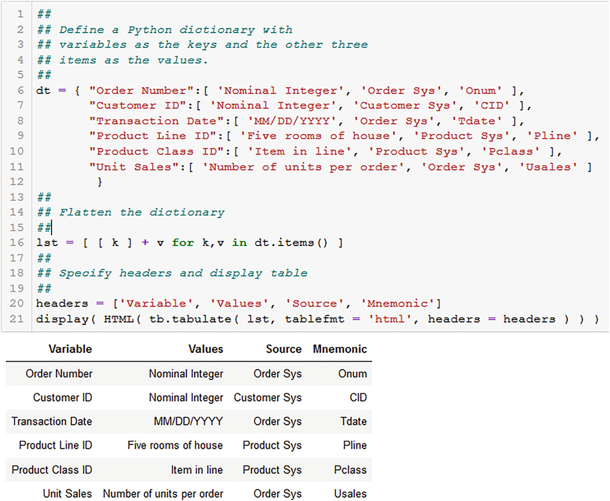

# 数据源、组织和结构
> 沃尔特·R·帕茨科夫斯基[^1]
> 数据分析公司，美国新泽西州普莱恩斯伯勒

我在第一章中说过。 1该信息是隐藏的，是潜在的内部数据，因此显然你需要数据才能获得任何信息。但是，只是说你首先需要数据过于简单和琐碎。在开始工作之前，数据的来源、获取方式、处理方式（即如何操作它们）是很重要的。你需要问四个问题：

1. 我在哪里获取我的数据？
2. 如何组织我的数据？
3. 我的数据结构如何？
4. 如何从我的数据中提取信息？

我将在本章中解决前三个问题，并在本书中解决第四个问题。
第一个问题不好回答，所以我会详细讨论。企业内部和外部的数据来源有很多，这使得第一个问题难以回答。内部数据应该相对容易获得，尽管内部政治问题可能会干扰。特别是，不同的内部组织可能会维护你可能需要的数据集，但会小心翼翼地保护它们以保持权力。这有时被称为创建数据孤岛。请参阅 Wilder-Jame (2016)，了解有关打破孤岛障碍的必要性的讨论。外部数据不会有这个问题，尽管它们可能难以定位。
解决第一个问题只是你问题的一部分。你还必须存储和组织该数据。这意味着将它们放入适合你计划进行的分析类型的格式。随着你的分析进行，该组织可能并且很可能会发生变化。当我发展组织概念时，这将变得清晰。组织数据的一部分是记录它们，所以我也会在本章中讨论这个主题。
一旦你有了你的数据，你就必须开始理解它的结构。在所有形式的数据分析中，结构都是一个被忽视的话题，所以我会花一些时间来研究它。了解结构是"查看"数据的一部分，这是一项历史悠久的建议。然而，这通常与有关绘制数据以可视化分布、关系、趋势、模式和异常的讨论一起说明。有时，你会被告知打印你的数据并亲自查看它，就好像这会揭示你以前不知道的东西一样。这可以帮助你识别大量缺失值模式或编码错误，尽管还有其他更有效的方法来获得这种洞察力，例如使用软件来识别和描绘缺失值模式。如果你的数据集很大，尤其是有数千条记录和数百个变量，那么至少可以说物理"查看"是不切实际的。可视化，无论是通过图表还是物理检查，虽然很重要，但不会揭示我所关注的结构类型的任何信息，例如，案例是较大实体的子集的结构，因此它们嵌套在这些较大的实体下；有等级制度。这种理解只能来自于了解你的数据代表什么以及它们是如何收集的。我在第5章讨论数据可视化。

## 2.1 数据维度：定义数据的分类法

数据有五个方面或维度与如何分析和使用什么工具有关。有一个分类包括：

1. 来源
2. 领域
3. 等级
4. 连续性
5. 测量尺度

这些中的每一个都引入了自己的问题。这些维度共同定义了一个数据分类，我在图 2.1 中进行了说明。我将在以下小节中讨论分类法的组成部分。

图 2.1A 数据分类。资料来源：帕茨科夫斯基（2016 年）。 SAS Press 授予的使用许可

### 2.1.1 分类组件：来源

数据不是凭空产生的。他们来自某个地方。具体来说，它们来自两个来源之一：主要数据收集和辅助数据收集。了解数据的来源很重要，因为控制不善的数据收集会掩盖导致异常值的错误，从而危及任何决策分析。所有数据都存在错误，有时是由于人为和机械测量失败，有时是由于无法解释和令人惊讶的随机冲击。这些是数据异常或异常值。异常值可大可小，无害或有害。造成悲痛的是那些巨大的有害物质。
大多数商界人士立即提到的两个来源是交易和调查。但这是短视的。根据你的业务和问题的性质，实验也应该列在清单上，并且在现代技术时代，必须包括有关流程和操作的传感器数据。
我进一步根据数据源的内生性和外生性对数据源进行分类。内生数据由你的业务生成并与你的业务密切相关。它们是由你的业务本身生成的；也就是说，通过为你的运营和市场存在而制定的流程、职能和决策。这包括销售、价格点、消息和索赔、购买（即投入）、已付或欠税、为债务支付的利息以及生产流程。它们是你过去做出的决定的结果，因为很明显你无法收集有关既未决定也未实施的行动的数据。
外部数据是由你无法控制的决策和力量在你的业务之外生成的。例子不胜枚举：经济增长和商业周期模式；货币和财政政策；联邦和州税收政策；政治事件；国际发展、事件和问题；新技术引进；监管行动；竞争举措和新的市场进入者仅举几例。你当然不能忽视诸如 2020 年 COVID-19 大流行之类的流行病，它对商业、经济、政治和个人造成了毁灭性的影响。
考虑商业周期模式。商业周期有两个阶段：增长和衰退。[^1] 在增长阶段，衡量经济规模的实际 GDP 增加，因此经济扩张；在经济衰退期间，它会缩小。然而，这些阶段过于简单，因为它们也可以通过它们的严重性和长度来区分。例如，一个生长期可以是温和的或强劲的，也可以是长期的。衰退可能是温和的或深度的，也可能是严重的，例如 2007-2009 年的衰退，也可能是短暂的或长期的。[^2] 所有行业都受到这两个阶段的严重性和长度的影响。
外因又分为两类：普遍外因和局部外因。普遍的外生因素影响着各行各业的所有业务，因此影响范围大且包罗万象。然而，普遍因素的影响程度是不同的。商业周期又是一个例子。无论其严重程度或长度如何，任何企业都无法逃脱其影响。 Berman 和 Pfleeger (1997) 发现，家具行业就业与实际 GDP 之间存在非常高的正相关关系；各种塑料制品；人员供应服务；管道和非电加热设备；石头、粘土和各种矿产品；以及电气照明和布线设备仅举几例。正相关性表明，随着实际 GDP 的上升，部门就业率也会上升，而就业率会随着实际 GDP 的下降而下降。[^3] 他们还发现农业生产的负相关性一般；管道，天然气除外；原油、天然气和气液；联邦政府企业，未另分类； [^4] 效果明显不同，但仍然存在。
当地的外生因素影响特定的公司或行业，因此它们的范围很窄。这些因素包括竞争行为，例如定价、消息传递和新产品。它还包括有可能消除整个行业或经济部门的技术进步。马车鞭子行业是一个常用的例子。但是，请参阅 Stross (2010) 了解此示例的有趣观点。
大多数商务人士通过提出诸如"我的竞争对手在做什么？"之类的问题来关注本地外生数据。或"监管机构有什么计划？"许多企业都有负责跟踪和收集数据的组织，例如竞争价格和广告数据。[^5] 普遍外源数据的重要性得到认可，但从数据收集的角度来看，通常不太受关注，尽管取决于行业。 Berman 和 Pfleeger (1997) 发现，家具行业的就业与实际 GDP 的变动高度相关，相关系数为 r = 0.9591。他们还发现，该行业实际 GDP 与最终需求之间的相关性为 r = 0.7713，也很高且为正。因此，家具行业的公司应该跟踪实际 GDP 以及与实际 GDP 相关的其他宏观经济数据（例如失业率、工业生产指数）。另一方面，他们发现教育服务和个人服务，n.e.c.与实际 GDP 的相关性非常低（分别为 r = 0.0343 和 r = 0.0186），与最终需求的相关性同样低（分别为 r = 0.3000 和 r = 0.2572）。这些行业的公司很可能不会像其他行业那样密切跟踪宏观经济数据。
跟踪外源数据意味着必须通过在新数据可用时更新数据元素并使这些数据库在企业内部可用来构建和维护内部数据库。然而，这些数据也可以从承担这些任务的外部来源访问和下载。如果提供者是政府机构，访问和下载可能是免费的。例如，许多美国宏观经济时间序列可以从美联储经济数据库 (FRED) 免费下载。[^6] 世界银行同样是国际经济时间序列和大量其他数据的免费来源。
内生数据呢？有五个来源：交易、实验、调查、传感器和内部。一些基本的统计书籍只列出了四种内生数据源：观察、实验、调查和人口普查。例如，参见 Moore 和 Notz (2017)。
事务可能是最常见的 BDA 来源。这是因为它们是任何企业的核心。没有交易，你的业务将不复存在，因为毕竟交易就是销售。交易数据可能来自公司拥有和维护的网站、传统的实体店面，以及通过专门的销售团队订购的批发商的采购。无论这些数据来自哪里，一个核心特征是它们从外部来源（即客户）流入企业，这种流动超出了你的控制范围，但不受影响。你无法控制客户何时进行购买，或者他们将购买多少，或者即使长期客户仍然是或将继续是客户。一些客户"死"（即停止向你购买）而你没有意识到这一点。参见 Schmittlein 等人。 (1987) 在这个问题上。你可以通过定价策略（包括折扣结构）、消息和索赔来影响交易流。基本上，通过操纵营销组合。
无论来源如何，事务数据库都包含（至少）：

- 订单号（Onum）
- 客户 ID (CID)
- 交易日期
- 产品 ID (PID)
- 单位销售
- 价格（清单和口袋）[^7]
- 折扣
- 订单状态（已完成或未完成）
- 销售代表 ID (SID)（如果适用）

然而，该数据库将链接到具有客户数据（例如，位置、作为客户的寿命、信用历史）、产品（例如，描述）和履行（例如，发货、延期交货、或正在处理中）。链接意味着两个或多个数据库中有一个通用标识符或"键"，允许你合并或加入它们。这就是你如何获得我在第 1 章中提到的相加效应。 1. 我在 Sect 中讨论数据组织。并在Sect中合并。 
与交易数据不同，实验数据来自遵循明确定义和明确协议的受控程序。控制由市场研究人员或工业统计学家指导或确定。可以对新产品管道中的新产品进行市场测试或进行工业实验，以确定制造过程或产品开发的正确设置。后者超出了本书的范围。见 Box 等人。 (1978) 以工业实验为例对实验设计的经典处理。另见 Diamond (1989)。
市场实验产生了业务数据分析师可以使用的数据；他们可能几乎不需要工业实验。市场实验通常是离散选择实验，旨在引起客户或关键利益相关者（例如员工）对各种业务问题的反应。定价、产品设计、竞争定位和信息传递就是四个例子。离散选择实验研究涉及定义或创建一系列选择集，每个选择集都由属性级别的最佳排列组成。最佳安排基于我上面提到的协议的实验设计 (DOE) 程序和原则。选择集中的每个排列都代表一个感兴趣的对象，例如潜在的新产品原型。研究对象（客户、员工或利益相关者）显示了一系列选择集，他们从中选择一个对象。如果对象是新产品的原型，那么每个选择集都由几个原型组成，并且要求潜在客户从每个集合中选择一个。根据选择响应估计的模型用于预测选择概率（也称为采取率）或份额，例如市场份额、钱包份额或偏好份额。有关选择研究设计和产品定价估算的广泛讨论，请参阅 Paczkowski (2018)。另请参阅 Paczkowski (2020)，讨论在新产品开发的测试阶段使用这些模型以及新产品发布的最佳消息传递。
选择实验是在调查的背景下进行的。这是从客户或关键利益相关者那里获得选择响应的唯一方法。然而，调查的使用范围更广。示例很多：客户满意度、购买意图、购买行为识别和态度/意见/兴趣 (AIO) 识别等等。例如，在珠宝客户调查中，通常会收集有关珠宝客户当前购物地点（例如，本地商店、商场、在线）、他们通常购买什么（例如，手表、胸针、吊坠等）、多少他们通常会花钱购买珠宝，通常是为谁（例如，配偶、未婚妻、朋友、亲戚或自己）购买的，以及购买的原因（例如，订婚、婚礼、毕业、出生或个人奖励达到一个里程碑）。此外，还收集了大量人口统计数据，包括性别、年龄、就业、教育等。
所有这些数据都可以并且应该被汇编到一个调查数据库中，用于超出调查最初目的的分析。该数据库现在是数据和结果信息的丰富来源。例如，再次考虑珠宝调查。跨越数年的调查，每一项都包含所购买珠宝类型的数据，可用于识别行业中购买行为的变化，这些变化在公司的交易数据库中可能并不明显。这些数据库包含本地内生数据，而调查数据库包含通用外生数据。本地内生销售数据的下降不能解释为购买行为的普遍转变（例如，转向在线购买），因为客户可能只是对营销组合的变化做出反应。然而，普遍的外生数据表明，可能由于生活方式的改变或年龄分布的变化，整个行业正在发生转变。顺便说一句，随着时间的推移进行的调查分析是一项跟踪研究。有关调查数据分析方法，请参见 Paczkowski (2021b)。
传感器正在成为重要的数据来源。他们无处不在。它们存在于我们的家中、电器中、汽车中、街角、医疗设施和设备中、制造厂中以及更多的地方，并且用于更多的应用，我无法在这里列出。传感器数据是过程或动作的度量。汽车中的传感器测量速度和驾驶行为（例如，刹车频率、刹车距离、转向车道外）。制造装配线上的传感器测量生产过程各个阶段的产品吞吐量和产品组装（例如，将容器填充到正确的高度或数量）。在医疗设备中，它们测量患者的生命体征。有关传感器的讨论，请参见 Paczkowski (2020)。
传感器数据可用于识别其他无法检测到的问题。如果实时收集的数据开始偏离长期趋势，它们当然可以用来预测未来的问题。例如，在制造环境中就是这种情况，其中偏离趋势的传感器读数表明必须立即解决生产问题。传感器数据如此广泛，包含大量信息，现在可能比十年前更多。我们现在才开始开发管理和分析这些数据的方法。有关用于新产品开发的传感器数据的一些讨论，请参阅 Paczkowski (2020)。
内部数据源是前面类别未涵盖的所有其他内容。这包括 HR 员工记录；财务账户；制造供应商数据；生产停机时间数据；等等。
主要数据是你为特定目的收集的数据。它们被收集用于特定研究，而不是用于任何其他用途。收集技术、指定收集内容的标准和数据定义都是为特定的研究目标而设计的。关键是你可以控制数据收集的所有方面。
二手数据是为某人的目的或研究目标而收集的，然后直接用于或改编用于另一项研究。如果你的研究是"其他研究"，那么你几乎无法控制数据生成，除非将其从一个位置复制到另一个位置。你唯一的控制是你使用哪个系列以及如何使用它；不是收藏。总统经济报告中的实际 GDP 就是一个例子。存储在你在 BDA 研究中访问和使用的数据仓库或数据集市中的数据是辅助数据的另一个示例。
由于其他人指定了你次要使用的数据的所有方面，因此你无法控制其质量，这限制了你对数据的发言权。例如，如果不对数据进行详细研究，就无法说出测量误差的存在和大小。有关二级经济数据中测量误差的经典讨论，请参见 Morgenstern (1965)。控制是数据的关键。你可能会问的一些关键问题是：

1. 数据从何而来？
2. 它的优点和缺点是什么？
3. 变量是如何定义的？
4. 使用了哪些工具（例如问卷）来收集数据，它们的效果如何？
5. 谁收集了数据，那个人或组织有多好（即他/她是否认真、受过适当培训）？

### 2.1.2 分类组件：领域
有两个数据域：空间（即横截面）和时间（即时间序列）。横截面数据是在一个时间点测量的不同单位的数据。国家、州、行业和家庭在一年中的销售额测量就是示例。 "空间"这个标签不应被狭义地解释为空间或地理；它是任何没有时间方面的东西。时间序列或时域数据是通过时间跟踪的一个单元上的数据。 5 年期间的月度同店销售额就是一个例子。
时间序列数据具有复杂性，可能会变得非常复杂且技术性很强。我将在下面讨论其中的一些，并在第 7 章中进一步讨论时间序列。

### 2.1.3 分类组件：级别

数据有两个层次：

1. 分解
2. 总计

分解数据是最基本的层次，尽管分解和聚合之间的界限是模糊的。销售点 (POS) 扫描仪收集的消费者购买数据是分类数据的一个示例，而商店和营销区域的销售是聚合数据的示例。分解单位的求和或平均，有时使用权重来说明基础测量单位的不同重要性，产生聚合数据。折叠数据立方体涉及从分解数据到聚合数据。

### 2.1.4 分类组件：连续性
数据的连续性是指它们的平滑性。有两种类型：

1. 连续的
2. 离散的

连续数据具有无限数量的十进制表示的可能值，尽管通常仅使用有限数量的小数位或相关。这些数据是 Python 中的浮点数。一个例子是折扣率（例如，数量折扣）。离散数据只有少量的、有限数量的整数表示的可能值。整数在 Python 中称为整数。它们通常用于分类，因此是分类的。消费者调查中的性别通常用离散数值编码，例如"1 = 男性"和"2 = 女性"，尽管可以使用任何数字。这些值仅用于分类目的，不用于计算，但也有例外。
小数位的概念很重要。计算机和相关的可视化软件对数字的解释与我们人类对数字的解释不同。例如，对于普通人来说，数字 2 在"2 个项目"或"2 本书"的上下文中具有意义；所以 2 就是 2。对于计算机来说，2 可以是 2 作为整数或 2.0 作为浮点数。整数和浮点数是不同的。浮点数表示精度，而整数则不表示，尽管整数被认为是精确的。说两个物体之间的距离是 2.1 英尺比说它是 2 英尺更精确，但是 2 英尺听起来很确定。在 Python 中，整数不限于固定数量的位，其中位是计算机技术中使用的基本单位。位表示为 0 或 1，它们是数字的二进制或基数 2 表示。可以用来表示整数的位数没有限制，当然，计算机内存的大小除外。这意味着一个整数可以精确地以二进制形式表示。但是，对于双精度计算机，浮点数最多使用 53 位。因此，浮点数无法准确表示。这通常会导致令人惊讶的计算结果。例如，如果你手动计算 1.1 + 2.2，则得到 3.3。但是，使用 Python（和许多其他软件语言）可以获得 3.3000000000000003。原因是浮点数的内部表示。有关详细讨论，请参见 Python 文档"浮点算术：问题和限制"。 [^8]
大多数分析师使用并熟悉浮点数。整数也很常见，但需要识别。例如，在调查研究中，询问一个人的性别并不少见。这通常编码为 1 或 2，可能是"1 = Male"和"2 = Female"。这些是整数。它们也是名义上的。它们本质上是离散的，因此可以用于分类；浮点数不能用于分类。可以对浮点数进行分箱或分组以进行分类，但随后这些分箱用整数编码。
在许多软件包中，如果要正确处理整数和浮点数，则必须预先识别或键入它们。这些语言静态类型化所有对象。一个例子是 C++ +。动态类型化所有对象的 Python 并非如此。它在运行时根据对象的上下文确定类型。这对用户来说是一个很大的节省，因为原本花费在指定对象类型上的时间被重新分配给更有用的工作。此外，由于 Python 解释器完成了所有工作，而不是你，因此出错的可能性较小。有关对象类型的讨论，请参见 VanderPlas (2017, pp. 34–35)。

### 2.1.5 分类组件：测量尺度

史蒂文斯（1946）有四个测量尺度。它们是有争议的，但通常大多数实践数据分析师都或多或少地遵守它们。一些讨论见 Velleman 和 Wilkinson (1993)。尺度包括：

1. 名义
2. 序数
3. 间隔
4. 比率

名义尺度是最基本的，因为它由使用离散值的标签的数字编码组成。确切的编码是无关紧要的和任意的。这在以"买/不买"问题为例的市场研究调查中很常见。统计上，只能计算计数、比例和众数。顾名思义，序数数据是顺序很重要且必须保留的数据。这在市场研究中也很常见。用于购买意图的李克特量表（例如，完全不可能、不太可能、中性、有点可能、非常可能）就是一个例子。另一个例子是 HR 数据的三个管理级别（例如，入门级、中级和执行级）。可以计算计数、比例、众数、中位数和百分位数。均值和标准差没有意义。三个管理级别的平均水平是什么意思？有时，会为在李克特量表上收集的有序数据计算均值和标准差，但这是有争议的。有关讨论，请参见 Mangiafico (2016) 和 Brill (2008)。我站在认为李克特量表数据是序数的一方，因此不应该计算平均值。
名义和有序比例数据都是离散的；区间和比率是连续的。区间数据没有固定的零作为原点，这意味着两个值之间的距离是有意义的，但原点是无意义的，因为它可以更改。这意味着比率是没有意义的。温度计刻度是典型的例子。假设你在华氏温度范围内读取两个温度读数：40 ∘F 和 80 ∘F，因此差异有意义（80 ∘F 比 40 ∘F 更热）。但是你有理由说 80∘ 是 40∘ 的两倍吗？也就是说，80∘F / 40∘F = 2吗？考虑通过以下公式将相同的温度转换为摄氏温度：Celsius = (Fahrenheit − 32) × 5 ∕ / 9。因此，40∘F = 4∘C 和 80∘F = 27∘C。显然，在这个尺度上，较高的温度不是较低的两倍（即 ）。改变尺度得到不同的答案，但"辣"的感觉是一样的。在统计上，你可以计算计数、比例、众数、中位数、平均值和标准差。
比例缩放数据是最常见的类型。大多数经济和商业数据都是按比例缩放的。它们以固定零为原点连续，因此值之间的距离是有意义的，但原点也是有意义的。如果你在一个日历季度的销售额为零，那么规模（即原点）的变化不会突然给你带来非零销售额。如果你有国际销售，这同样适用于不同的货币。一个季度的销售额为 50 美元，下一季度的销售额为 100 美元，这意味着无论使用美元、法郎还是日元来衡量销售额，第二季度都是第一季度的两倍：k × $100∕k × $50 = 2 其中 k 是汇率。因此，原点作为进行所有计算和比较的参考点。你可以计算计数、比例、众数、中位数、平均值和标准差。
我在图 2.2 中展示了四个测量尺度，包括它们的复杂度关系和每个尺度的允许统计量。随着规模的扩大，数据的复杂性也会增加。同时，允许的统计数据从简单的计数和比例累积到算术平均值和标准差。

图 2.2 Stevens (1946) 的测量尺度。此图表的来源：Paczkowski (2016)。 SAS Press 授予的使用许可

## 2.2 数据组织
数据组织是一个复杂的话题，但即使在很小程度上也必须解决，因为如果不了解数据的组织方式，你将无法访问和理解它们。事实上，你将不得不依赖其他人来访问你需要的数据，这是低效且无效的。我应该注意，我所指的组织不在你的控制范围内，并且与你在 DataFrame 中组织最终研究数据的方式无关。前者可能由你的 IT 部门决定，而后者则由你根据你的特定目的决定。除了明显添加新数据外，IT 数据结构将保持不变，而你的个人结构将根据问题以及在分析过程中发生变化。
数据组织是双重的。首先，它指的是数据在大型数据库中的组织方式。你的 IT 部门负责维护和组织数据，以便有效地存储和交付给像你这样的最终用户。有一个过程，提取-翻译-加载 (ETL)，在该过程中，从众多数据收集系统中提取数据，翻译成更可用和更易于理解的形式，最后加载到最终用户可访问的数据库中。这是一个外部数据结构：它对于分析师来说是外部的。
其次，最终由你作为最终用户使用的数据具有表示数据概念如何相互关联的内部结构。了解外部结构很重要，因为你最终将不得不与这些外部数据库进行交互以获得特定问题所需的数据。内部结构是指从外部结构化数据库访问和下载数据后，你将实际用于解决问题的结构。数据的内部结构从分析的角度告诉你什么是可能的。你可以通过排列数据来确定这一点。我将在下面回顾内部数据结构。

### 2.2.1 外部数据库结构
这个话题非常复杂。参见 Lemahieu 等人。 （2018 年）进行了出色、深入的教科书处理。通常，数据存储在由数据表组成的关系数据库中，这些数据表是与 DataFrame 相当的矩形数组。不同之处在于它们更加复杂和详细。关系数据库中的每个表都通过键链接到一个或多个其他表：主键和外键。主键与表本身相关联，并唯一标识该表中的每条记录。它们与 DataFrame 索引相当。在订单数据表中，唯一的订单 ID 号 (Onum) 标识每个订单记录。记录本身包含订单日期和时间（即时间戳）、订购的数量、订购的产品以及可能有关订单的其他一些数据。 Onum 及其值形成一个键：值对。 [^9]
另一个表可能包含有关订单状态的数据。它将具有订单号以及有关状态的指示符：履行中、履行完毕、延期交货。因此，Onum 出现在两个表中，你可以将它们链接起来。订单号是两个表中的主键。
外键不是表中记录的唯一标识符，而是允许你链接到其他表以获取补充数据。对于订单数据表，订购的产品由产品 ID 号 (PID) 指示。产品的实际名称和描述通常不会显示或使用，因为它们太长，因此占用太多存储空间，使其效率低下。如果产品出现在多个订单中，这种低效率会更加严重。拥有一个包含 PID 及其描述的单独产品表会更有效。 PID 及其关联的名称/描述在表中只出现一次。 PID 和描述形成一个键：值对。
在我的示例中，PID 同时出现在订单表和产品表中。在订单表中，它是外键，而在产品表中，它是主键。可以通过使用 PID 链接两个表来创建订单报告。这种联系产生了我在第 1 章中讨论的附加效应。 1. 结构化查询语言 (SQL) 是通常用于管理、汇总和链接数据表的编程语言。这是一种类似于人类语言的编程语言，具有简单的语法，当然也可以变得复杂。参与 BDA 的每个人都必须对 SQL 有所了解。
SQL 语句称为查询。最简单的查询由三个语句组成，每个语句都以动词开头：

1. Select 语句，指定要选择的内容
2. From 语句指定要使用的数据表（或表）
3. 指定选择条件的 where 语句

Select 和 From 语句是必需的； Where 语句是可选的。如果未包括 Where，则选择 Select 语句中列出的所有内容。 Select 语句可以包含汇总函数，例如平均或求和。这三个关键词是动词。计算汇总值时使用的另一个动词是 Group by，它控制计算汇总统计的组。请参阅 Celko (2000) 以及 Hernandez 和 Viescas (2000) 以获得良好的背景说明。
例如，假设你有一个小型供应商表，其中显示了你的生产过程的原材料供应商的名称。除了名称之外，该表还包含最后交货量（以吨为单位）和一个指示是否按时交货的指标（例如，1 = 是，0 = 否）。附带说明一下，与字符串"No"和"Yes"或"Late"和"On Time"相比，0/1 整数在计算机中的存储效率更高（即它们占用的硬盘或内存空间更少） ， 分别。在 Python 中，使用图 2.3 中的代码创建一个 DataFrame，在 Python 中选择所有准时供应商的 SQL 查询语句如图 2.4 所示。

图 2.3 这是创建供应商准时 DataFrame 的 Pandas 代码。 显示生成的 DataFrame

图 2.4 这是选择准时供应商的 SQL 代码。 显示生成的 DataFrame。 请注意，此示例中称为"qry"的查询字符串包含我在文本中提到的三个动词
可以扩展查询以包括连接多个表，所有表都链接在适当的键上。 可以从每个表中选择特定变量，也可以以不同方式汇总。 有关编写查询的更多详细信息和示例，请参阅 Hernandez 和 Viescas (2000) 和 Celko (2000)。
Pandas 有一个查询方法，允许你以几乎 SQL 的方式查询 DataFrame。 在后续章节中，我将向你展示如何使用此方法进行可比较的查询。 有关示例，请参阅本章的 Jupyter 笔记本

### 2.2.2 内部数据库结构
一旦你确定了你需要的数据并创建了一个 DataFrame，也许使用 SQL 查询，你仍然需要采取额外的步骤来理解你的数据。你必须了解 DataFrame 的内部结构，并可能对它进行操作以获得优势。了解 DataFrame 的结构使你能够应用正确的工具集来提取潜在信息。结构越复杂，内部信息越多，从所有数据"材料"中提取信息就越困难，提取所需的工具也越复杂。
作为类比，请考虑两本书：Dick & Jane 和 War & Peace。每本书都是单词的集合，这些单词是数据点，与数据集中的内容没有什么不同。单词本身没有意义，就像数据点（即数字）没有意义一样。但是这两本书都有从文字中提炼出来的信息（即信息）；对于数据集也是如此。
显然，Dick & Jane 的结构很简单：一页上只有几个词，几页，以及一两个简单的信息（信息）。另一方面，《战争与和平》具有复杂的结构：一页有数百个单词，数百页，以及贯穿始终的发人深省的信息。你永远不会像阅读迪克和简那样阅读战争与和平：所需的工具集是不同的。如果你只能读到迪克和简的水平，你将永远无法在战争与和平中幸存下来。你永远不会像接近迪克和简那样接近战争与和平。然而，这就是许多人对他们的数据所做的事情：他们处理复杂数据集的方式与处理 Stat 101 数据集的方式相同，这是一个简单的数据集，包含一些用于说明概念的观察结果和变量，并不意味着进行认真的分析。
当你阅读战争与和平、数学书、物理书、历史书或经济学书时，任何复杂的东西，你（应该）做的第一件事就是看它的结构。这是由目录给出的，其中章节标题、小节标题和小节标题都按逻辑顺序排列。书后的索引给出了关于什么是重要的提示。这本书的封面对本书的结构和复杂性，甚至作者写作的动机都有充分的了解。甚至序言也有关于本书内容、主题和主要结论的线索。你不会为迪克和简这样做。参见 Adler 和 Doren (1972) 了解如何阅读一本书。
就像你会（或应该）为一本复杂的书查看上述项目一样，你应该按照这些步骤来理解数据集的结构。数据字典是一个起点；问卷很明显；缺失值模式是必须的；分组，如在多级或分层数据集中，更具挑战性。一旦结构已知，分析就更容易了。这并不是说如果你这样做就会变得微不足道，但你会比不这样做更好。
数据结构不是 DataFrame 中的行数和列数，也不是哪些列在前，哪些列在后。这是一个相对不重要的物理布局，尽管我将在下面讨论物理布局。真正的结构是柱子相对于彼此的组织，以便它们讲述一个故事。例如，考虑一个调查数据集。通常，病例 ID 变量位于开头，人口统计变量位于末尾；这是一种物理结构，与其说是必需品，不如说是一种便利。真实结构由作为其他列条件的列（即变量）组成。因此，如果调查受访者的答案在一个列中为"否"，那么其他列可能依赖于该"否"答案并包含一组特定的回答，但如果答案为"是"则包含不同的一组。当然，响应可能只是缺少值。对于汤偏好研究，如果第一个问题是"你是素食主义者吗？"并且响应是"是"，然后汤中首选肉类类型的后面列有缺失值。这是一种结构依赖。
汤的例子显然是一个简单的结构。在 DataFrame 中，一个简单的结构就是几行几列，没有缺失值，也没有结构依赖。非常整洁干净，而且总是很小。这是 Stat 101 数据集。一个问题所需的所有数据也都在那个数据集中。现实世界的数据集并不整洁、干净、小型和独立。除了将它们描述为"杂乱无章"（即缺失值、结构性等）之外，它们还具有复杂的结构。考虑一个购买交易数据集，该数据集包含购买地点、购买日期和时间（最后两个使其成为面板或纵向数据集）、产品类型、产品类别或类别、客户信息（例如，性别、作为客户的任期、最后购买）、价格、折扣、销售激励、销售代表识别、多层次关系（例如，城市内的商店和销售区域内的城市）等等。这些数据可能分布在多个数据库中，因此必须使用主键和外键以逻辑和一致的方式将它们连接在一起。不要忘记这是千兆字节的大数据！这是一个不同于 Stat 101 结构以及调查结构的复杂结构。
一个简单的数据结构是一个矩形数组或矩阵格式，正如我在第 1 章中提到的那样。 1. 一个简单的结构也只有数字数据，通常是按比例测量的连续变量。有时，包括离散的名义变量，但重点是连续比率变量。名义变量是具有有限数量的值、级别或类别的分类变量。最小值当然是两个；对于一个类别，它只是一个常数。对于这个简单的结构，你可以执行的操作和分析数量有限，因此可以提取的信息量有限。这是不良信息，分析是浅分析。
例如，假设你的企业想要建立新的研究设施。你必须按州研究潜在的就业机会，以确定最佳位置。 State DataFrame 的前五条记录显示在图 2.5.[^10] 中，其中包含关于失业和家庭收入中位数的数据

图 2.5 这是一个简单的状态数据 DataFrame
该结构是一个 50 × 2 矩形阵列，每个状态在一行中，每行只有一个状态。只有两个数字/连续变量。典型的分析很简单：计算各州的失业率和家庭收入的平均值。创建图表（例如条形图）以显示分布。我将在第4章讨论更多增强的数据可视化。
现在考虑一个更复杂的数据结构。它是上述数据集，但有一个额外的变量：高端技术人才的存在分数。高分表明该州技术人才高度集中。该分数基于计算机和信息科学家专家的集中度、工程师的集中度以及生命和物理科学家的集中度的一组综合指标。 [^11] 在本示例中，通过分配得分高于 50 的州归为"技术"组，所有其他州归为"非技术"组。我在图 2.6 中显示了分布。

图 2.6 国家被归类为技术人才或非技术人才。这表明只有 32% 的州具有技术人才
由于此技术索引，此数据结构还有更多内容。这使得它有点复杂，虽然不是很多，因为国家可以分为两组或集群：技术人才国家和非技术人才国家。然后，技术人才可以比较失业和收入数据。这会带来更多可能的分析和潜在有用的丰富信息，因此提取的信息内容更大。一种可能性是通过技术指标使用均值的双样本 t 检验来比较失业率。我在图 2.7 中显示了测试和结果。 p 值表明，对于任何替代假设，拥有技术人才的州与没有技术人才的州的家庭收入之间存在差异。可以对失业率进行类似的测试。

图 2.7 技术与非技术州家庭收入中位数差异的双样本 t 检验表明存在统计差异。注意我对查询语句的使用

添加一个额外的变量会使 DataFrame 的维度增加一，因此结构现在稍微复杂一些。现在有更多的机会来提取丰富的信息。结构很重要，因为它决定了你能做什么。结构越复杂，分析的可能性就越多，可以提取的信息也就越多。 Andrew Gelman 将此称为维度的祝福 [^12]，而不是维度的诅咒。
DataFrame 行中的一些结构是显式的，而另一些是隐式的。基于数据表中的变量，显式结构是显而易见的。技术就是我一直在使用的例子。技术变量在数据表中，因此数据的划分很清楚。这个变量如何实际使用是另一回事，但它可以而且应该用于从整个数据表中提取更多更丰富的信息。但是，该国家的地区隐含在 DataFrame 中。表中没有名为"Region"的变量，但在构成区域的状态存在的意义上，它存在；状态嵌套在区域中。美国人口普查局将各州映射到地区，这种映射很容易获得。 [^13] 使用这种映射，可以添加一个地区变量，从而进一步削减数据，从而进行更详细和更精细的分析。例如，你可以按地区按技术研究失业率。
显式结构变量是明确的：它们是 DataFrame 中的任何内容。隐式结构变量也依赖于 DataFrame 中已有的内容，但必须找到它们的底层组件并将其操纵（即纠缠）到新变量中。这就是我将状态映射到区域时所做的。作为映射候选的变量包括但不限于以下任何一项：

1. 要提取的电话号码：
    1. 国际拨号代码；
    2. 美国国内区号；和
    3. 免费电话号码。
2. 邮政编码和其他邮政编码。
3. 要提取的时间/日期戳：
    1. Day-of week
    2. Work day vs weekend
    3. Day-of-month
    4. Month
    5. Quarter
    6. Year
    7. Time-of-day (e.g., Morning/afternoon/evening/night)
    8. Holidays (and holiday weekends)
    9. Season of the year
4. 网址
5. 出生日期 (DOB)
    1. 年龄
    2. 出生年份
    3. 出生十年(年代)
6. SKU 通常是代码的组合
    1. 产品分类
    2. 类别中的产品线
    3. 具体产品

你还可以对连续变量进行分类或分类以创建新的离散变量以添加进一步的结构。例如，人们的年龄可以从他们的出生日期 (DOB) 计算出来，然后分为青少年、青少年、成年人和老年人。
在每种情况下，都可以使用单个显式变量来标识隐式变量。当可以使用多个显式变量时，问题会更加复杂。哪些以及如何？这就是几种多元统计方法的用武之地。其中两种是聚类分析和主成分分析 (PCA)。前者用于根据许多显式变量对 DataFrame 的行进行分组或聚类。结果是一个新的隐式变量，它可以作为离散变量添加到 DataFrame 中，具有标识集群的级别或值。这个新的离散变量很像我之前讨论的区域和技术变量。我将在第 5 章讨论 PCA，在第 12 章讨论聚类分析。
如果 DataFrame 中有很多变量，那么可以将其中的几个折叠成一个（或几个）新的汇总变量，以捕捉或反映它们的本质。然后可以删除原始变量，只保留汇总变量。这将减少 DataFrame 的维度，并且可能会增加其信息内容，因为汇总变量可能更具启发性。聚类分析可用于此目的，但聚类是通过变量而不是 DataFrame 的行。 PCA 将完成相同的任务，但具有额外的好处，即提取了称为主成分的新汇总变量，并具有它们彼此线性独立的特性。这种独立性对于线性建模很重要，我将在后面讨论。
显式和隐式结构变量的一个特点是它们定义了单个数据表中记录的结构。因此，显式结构变量"技术"告诉你 DataFrame 的行是如何划分的。通过包含技术虚拟变量来捕捉技术影响，可以将这种划分合并到回归模型中。我将在第 5 章讨论虚拟变量及其问题。
可能存在跨列的结构，同样在单个 DataFrame 中。在最简单的层面上，某些列分组是自然的或显式的（以重用该词）。例如，一个调查 DataFrame 可以有一组用于人口统计的列，另一组用于一系列属性的产品性能。 Check-all-that-apply (CATA) 问题是另一个示例，因为对此类问题的回答通常记录在具有标称值（通常为 0/1）的单独列中。至于数据表行的隐含变量，可以从已有的变量中推导出新的变量。
当你使用包含数百个甚至数千个变量的大型 DataFrame 时，组合变量尤其重要，这使得 DataFrame "高维"。高维数据表不仅包含大量变量，而且这个数字远远超过案例或观察的数量。如果 N 是案例数，P 是变量数，那么如果 P >> N，则 DataFrame 是高维的。标准统计方法（例如回归分析）因此而受到威胁。例如，如果 P >> N，则无法估计回归模型。因此，必须采用一些方法来降低维度。有关用于定价分析的高维数据的讨论，请参阅 Paczkowski (2018)。
正如我上面提到的，正如对数据表的行进行聚类分析一样，这是大多数分析师很容易熟悉的方法，因此对变量进行了聚类分析。这种形式的聚类分析和 PCA 都具有相同的目标：降维。 PCA 可能更为人所知，但变量聚类正变得越来越流行，因为正在开发的算法正在处理不同类型的数据，而且它避免了 PCA 的问题。通常在数据表中找到的数据类型是定量的和定性的（也称为分类）。前者只是数字。后者由性别、技术和地区等分类器组成。这些可以用 DataFrame 中的数字或"Male"和"Female"等词来表示。如果使用单词，它们通常用值编码。如果对它们有直观的排序，例如人力资源研究中的"入门级经理"、"中级经理"和"执行"，则序数值也是可能的。从技术上讲，PCA 是为连续定量数据而设计的，因为它试图根据作为定量概念的方差来查找分量，因此从技术上讲应该避免使用 PCA。变量聚类算法没有这个问题。
除了我一直在讨论的几乎显而易见的方面之外，数据结构还有更多的内容。例如，考虑对人口统计变量进行聚类以创建消费者细分。这些细分在人口统计数据中是隐含的（即隐藏的或潜在的）。聚类过程揭示了一直存在的内容。将人口统计数据折叠为一个新的单个变量，即细分，为数据表增加了更多结构。现在可以创建不同的图表以对数据进行额外的可视化分析。而且，事实上，这经常发生——创建一些简单的图表（无处不在的饼图和条形图）来总结细分和一些关键变量，例如按细分的购买意图或按细分的满意度。
除了视觉效果之外，有时还会使用新创建的段作为自变量来估计简单的 OLS 回归模型。实际上，分段变量被虚拟化并使用虚拟变量，因为分段变量本身不是定量的而是分类的，因此不能在回归模型中使用。不幸的是，OLS 模型不合适，因为它违反了有效使用 OLS 所需的关键独立性假设。这个假设是观察的独立性。就细分而言，几乎按照定义，观察结果不是独立的，因为细分的本质表明单个细分中的所有消费者都是同质的。因此，它们都应该"以相同的方式"表现，因此不是独立的。
问题是在用这些数据估计模型时必须考虑到数据的层次结构或多层次结构。有嵌套在宏或第二级单元中的微观或第一级单元。消费者是嵌入在宏观单位的细分市场中的微观单位。估计中使用的观察值是在微单位上的。宏单元为这些微单元提供了一个上下文，而你必须考虑到这个上下文。可能有几层宏单元，所以我的例子有点简单。我在图 2.8，面板 (a) 中说明了一个由消费者的三个宏观层次组成的可能层次结构。诸如收入和年龄之类的消费者特征用于建模，但更高级别的上下文变量也是如此。在细分的情况下，只有一个宏观层面。业务单位也可以具有层次结构。我在图 2.8，面板 (b) 中展示了一种可能性。

图 2.8 这是消费者和企业的层次结构。 (a) 消费者结构。 (b) 业务结构
宏观层面通常具有关键驱动变量，这些变量是较低层面的影响因素。对于消费者而言，利率、全国失业率和实际 GDP 等通用外生数据会影响或推动消费者的行为方式。那个时期的利率对所有消费者都是一样的。在几个时期内，费率会发生变化，但它们对所有消费者的变化方式相同。不知何故，这个因素，以及其他类似的因素，必须被纳入一个模型。传统上，这是通过将微观级别的数据聚合到更高级别或通过将宏观级别的数据分解到较低级别来完成的。
两种数据处理方法都存在聚合和分解问题。
聚合问题：

1. 信息更加隐藏/模糊。回想一下，信息隐藏在数据中，必须提取出来。
2. 从统计上讲，统计测试和程序会失去功效。

分解问题：

1. 数据被"放大"并人为地均匀分布。
2. 统计测试假设分布中存在独立的抽取，但事实并非如此，因为它们具有共同的基础，因此违反了关键假设。
3. 样本量受到影响，因为测量的水平高于抽样设计的水平。

关于样本量的最后一点有一个微妙的问题。样本量太大是因为测量单位（例如消费者）是在错误的水平上测量的，因此标准误差太小。测试统计量太大，因此你经常会拒绝无效的零假设。
嵌套结构的例子比比皆是。讨论嵌套或多级数据时通常提到的经典示例是在学区的学校中的班级学生。层次结构是数据固有的，因为学生在班级中，在学校中在学区中。顺便说一句，如果使用整群抽样来选择大都市区的学校，然后再次用于选择班级，则可能会产生层次结构。无论使用哪种方法，嵌套都是不言而喻的，这就是为什么通常使用它来说明这个概念。 BDA 的示例包括：

- 细分市场；
- 商店；
- 营销区域；
- 状态;
- 社区；
- 组织成员；
- 品牌忠诚度。

消费者嵌套在细分市场中；它们嵌套在商店中；它们嵌套在社区中，依此类推。在建模行为中必须考虑这种嵌套。但是怎么做？
我在第 6 章中回顾的基本 OLS 模型是不合适的。有时分析人员会添加虚拟变量来反映组成员身份（或其他形式的组编码，如效果编码），但这并不能充分反映嵌套，主要是因为可能存在确定更高级别组件的关键驱动因素结构体。例如，考虑在城市和郊区拥有多个地点的杂货连锁店。消费者嵌套在他们附近的商店中。这些商店以及它们所服务的社区都有自己的特点或属性，就像消费者有自己的一样。例如，城市地区的商店可能占地面积较小，因为城市地区的房地产较为紧张，但在房地产更为丰富的郊区则有较大的商店。曼哈顿的商店比位于新泽西州中部的同一连锁店中的同类商店要小。商店规模决定了可以提供给客户的服务类型、库存规模、产品种类，甚至价格点。
需要对基本 OLS 模型进行扩展。这是通过对 OLS 模型的参数进行建模来完成的，其中这些模型反映了结构中的更高层次，并且这些模型可以是更高层次特征的函数。这是一个更复杂、更丰富的模型。微妙地，误差的随机分量是项的组合，而不是像你将在第 6 章中看到的 OLS 模型中的一个项。对层次结构建模的虚拟变量方法不会包括这个组合误差项，这意味着虚拟变量方法不正确；有一个模型错误指定——这是错误的。正确的规范必须反映每个级别的随机变化，当然还有两者之间的任何相关性。此外，复合误差项包含误差与违反 OLS 假设的较低级别预测变量之间的交互作用。虚拟变量 OLS 规范不会这样做。
该模型的许多变体是可能的：

- 空模型：没有解释变量；
- 截距变化，斜率恒定；
- 截距常数，斜率变化；
- 截距变化，斜率变化。

数据结构还有一个方面。这是数据的物理排列。我在第 1 章中说过，数据存储在矩形数组中。数组的形式因分析而异。如果矩形数组有大量变量所以P >> N，则称DataFrame是宽格式的。但是，如果它的观测值多于变量，则它是长格式的。为了更明确地了解长格式排列，请考虑一个 DataFrame，其中包含调查受访者对有关珠宝购买的李克特五点量表问题的回答数据："你最后购买了这六个品牌中的哪个？"每个受访者都被分配到四个营销部门之一。关于品牌的问题可以是一个检查所有应用 (CATA) 问题，记录为每只手表的"否"或"是"。假设"否"/"是"答案分别被虚拟编码为 0 / 1。然后有七列：六列用于品牌，一列用于细分。这是一个宽幅结构。你可以创建一个简单的汇总表，显示每个品牌和细分的 0 / 1 值的总和，例如，细分为行，品牌为列。这仍然是一个宽幅结构。如果你现在将每一行（即每个段）堆叠在一起，以便有三列（段、品牌、响应计数），那么数据具有长格式结构。
你使用哪种结构取决于你将进行的分析。一些统计分析要求数据是长格式的。对应分析就是一个例子。其他人需要广泛的形式。相关分析就是一个例子。在本书中，我将说明这两种形式以及 DataFrame 从一种形式到另一种形式的重塑。

## 2.3 数据字典
鉴于大多数企业中的数据量，IT 部门已将建立和维护数据字典作为最佳实践。数据字典包含有关数据的元数据。根据维基百科，[^14]
元数据是指"关于数据的数据"。虽然"meta"前缀......表示"之后"或"超越"，但它在认识论中用于表示"大约"。元数据被定义为提供有关数据的一个或多个方面的信息的数据；它用于汇总有关数据的基本信息，可以更轻松地跟踪和处理特定数据。
元数据可以是任何可以帮助你理解和记录数据的东西。这可能包括：

- 创作手段；
- 数据的目的；
- 创建时间和日期；
- 数据的创建者或作者；
- 放置在创建数据的网络（电子表格）上；
- 使用了什么标准

等等。[^15] 我将限制本书中使用的数据字典中的元数据只包含

- 变量名称;
- 可能的值；
- 来源;
- 助记符。

变量名只是对变量的简要描述。例如，可以是"税后净收入"、"标价"、"经销商折扣"、"客户 ID (CID)"、"供应商 ID (SID)"，仅举几个可能性。可能的值包括范围和数据类型的简要描述，例如"名义"、"序数"、"MM/DD/YYYY 格式的日期"等。源是数据的来源。在本书中，一些说明性数据将来自营销部门，其他数据来自销售部门，还有一些数据来自财务组织 (CFO)。它有助于了解来源以更好地了解你的数据。最后，助记符（即记忆辅助）是你将在公式或可视化函数调用中使用的变量缩写或首字母缩略词。变量名本身可能（而且通常）太复杂或太长而无法使用，因此助记符代替了它。数据字典提供了一个有用的查找功能来查找助记符的含义。
可以使用 Python 字典和 Python 模块制表来创建数据字典。本章的 Jupyter Notebook 说明了它们的使用。主要的 Python 代码如图 2.9 所示。此数据字典也可以在 Jupyter 笔记本 Markdown 单元中创建。有关示例，请参阅本章的 Jupyter 笔记本。要安装表格，请使用 pip install tabulate 或 conda install -c conda-forge tabulate。

图 2.9 这是生成数据字典的 Python 脚本

## 参考

- 阿德勒，M.J. 和 C.V.多伦。 1972. 如何阅读一本书：智能阅读的经典指南。修订版。试金石。
- Berman, J. 和 J. Pfleeger。 1997. 哪些行业对商业周期敏感？每月劳工评论，120：19-25。
- Box、G.、W. Hunter 和 J. Hunter。 1978. 实验者统计：设计、数据分析和模型构建简介。纽约：威利。
- Brill, J.E. 2008。李克特量表。在调查研究方法百科全书，编辑。 P.J. Lavrakas，428–429。纽约：SAGE Publications Inc.
- Celko, J. 2000。Smarties 的 SQL：高级 SQL 编程。第 2 版。伦敦：学术出版社。
- Diamond, W. 1989。工程师和科学家的实用实验设计。纽约：范诺斯特兰德莱因霍尔德。
- Hernandez、M.J. 和 J.L. Viescas。 2000. 普通人的 SQL 查询：SQL 中数据操作的动手指南。阅读：艾迪生-韦斯利。
- Lemahieu、W.、B. Baesens 和 S. vanden Broucke。 2018. 数据管理原理：存储、管理和分析大小数据的实用指南。第 1 版。剑桥：剑桥大学。
- Mangiafico, S.S. 2016. r 中扩展计划评估的总结和分析。版本 1.9.0。 http:// rcompanion. org/ handbook/ .最后访问时间为 2017 年 10 月 15 日。
- Moore, D.S. 和 W.I. Notz。 2017. 统计：概念和争议。第 9 版。旧金山：W.H.弗里曼公司。
- Morgenstern, O. 1965。关于经济观察的准确性。第 2 次修订版。普林斯顿：普林斯顿大学。
- Paczkowski, W.R. 2016。使用 JMP 进行市场数据分析。班加罗尔：SAS 出版社。
- Paczkowski, W.R.（2018 年。定价分析：产品定价模型和高级定量技术。伦敦：Routledge。
- Paczkowski, W.R. 2020。新产品开发的深度数据分析。伦敦：劳特里奇。
- 帕茨科夫斯基，W.R. 2021b。现代调查分析：使用 Python 获得更深入的见解。柏林：施普林格。
- 施密特林，D.C.，D.G.莫里森和 R. 科伦坡。 1987. 计算你的客户：他们是谁，他们接下来会做什么？管理科学 33（1），1-24。
- Stevens, S.S. 1946。关于测量尺度的理论。科学 103（2684），677–680。
- Stross, R. 2010。像马车鞭子一样失败？最好检查你的比喻。纽约：纽约时报。 2010 年 1 月 10 日，BU 部分，第 4 页。
- Stupak, J.M. 2019。美国经济简介：商业周期和增长。焦点。国会研究服务。
- VanderPlas, J. 2017。Python 数据科学手册：处理数据的基本工具。牛顿：奥莱利媒体。
- 维勒曼，P.F.和 L.威尔金森。 1993. 名义型、有序型、区间型和比率型具有误导性。美国统计学家 47（1），65-72。
- Wilder-Jame, E. 2016。打破数据孤岛。在哈佛商业评论中。 https:// hbr. org/ 2016/ 12/ break-down-data-silos#comment-section
- Zarnowitz, V. 1992。商业周期的规律性。在《商业周期：理论、历史、指标和预测》中，编。 V.扎诺维茨。第 8 章，232–264。芝加哥：芝加哥大学。

## 脚注
[^1]: 有些人定义了四个阶段，包括高峰和低谷，这是两个转折点。例如，参见 Stupak (2019)。对于我的讨论，两个阶段就足够了。另见 Zarnowitz (1992) 对商业周期的历史处理。
[^2]: 参见美国国家经济研究局 (NBER) 2010 年 9 月 20 日关于 2007-2009 年经济衰退结束的公告："商业周期测定委员会，国家经济研究局"，网址为 https://nber.org/cycles/2010年9月.html 最后访问时间为 2020 年 1 月 15 日。另请参阅 NBER 的商业周期高峰和低谷日历 https://nber.org/cycles/cyclesmain.html 2007-2009 年的经济衰退持续了 18 个月，是二战后最长的一次。
[^3]: 回想一下，相关性只是显示关联程度，而不是因果关系。
[^4]: "n.e.c."是"Not Elsewhere Classified"的标准缩写。
[^5]: 在 1990 年代初期，我曾经自己为 AT&T 的计算机系统部门做这件事。
[^6]: 见 https://fred.stlouisfed.org/。 最后访问时间为 2020 年 1 月 23 日。
[^7]: 请参阅 Paczkowski (2018) 的口袋价格。
[^8]: 这适用于 Python 3.8.2。它位于 https://docs.python.org/3/tutorial/floatingpoint.html。 最后访问时间为 2020 年 3 月 12 日。
[^9]: 键：值对中的"值"可以是我的示例中的项目列表或单个项目。如果是单个项目，则列表是单例列表。
[^10]: 仅显示了 50 个州中的 5 个。资料来源：失业率：https://www.bls.gov/web/laus/laumstrk.htm 收入：表 H-8。各州家庭收入中位数 https:// www.census.gov/data/tables/time-series/demo/income-poverty/historical-income-households.html。
[^11]: 请参阅 http://statetechandscience.org/statetech.taf?page=overall-ranking&composite=tswf 获取数据和 http://statetechandscience.org/statetech.taf?page=指数方法大纲。 最后访问时间为 2020 年 2 月 7 日。
[^12]: 见（http://andrewgelman.com/2004/10/27/the_blessing_of/ 。
[^13]: 见 www2.census.gov. 最后访问时间为 2020 年 2 月 3 日。
[^14]: http://en.wikipedia.org/wiki/metadata。 最后访问时间为 2020 年 2 月 3 日。
[^15]: http://en.wikipedia.org/wiki/metadata。 最后访问时间为 2020 年 2 月 3 日。