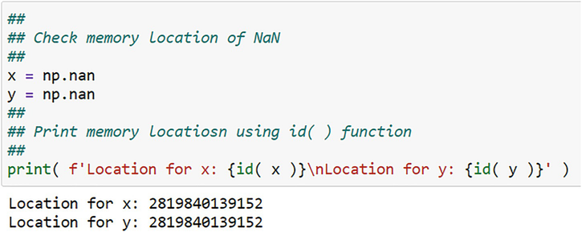

# 基本数据处理
> 沃尔特·R·帕茨科夫斯基[^1]
> 数据分析公司，美国新泽西州普莱恩斯伯勒

小而整齐的数据集用于说明统计和计量经济学的典型教科书处理中的概念和技术。它们总是只有几行或几条记录和几列称为变量或特征。数据整洁、干净且可用，这意味着你永远不会被告知查找数据所涉及的复杂性，更不用说将它们导入统计或编程包。此外，只有一个数据集。没有讨论可能必须合并或连接的几个的使用。因此，学习者必须从其他来源确定如何处理"杂乱"和大量数据。事实上，这些是业务数据分析中的典型操作。在开始任何分析之前，它们需要进行预处理。
预处理包括处理大量数据，远远超过统计学或计量经济学课程中使用的数据。导入数据会变得复杂，因为你的计算机可能无法处理更多数据，特别是如果程序和操作（例如统计、计量经济学和机器学习）主要在计算机的有限内存中执行。
你的数据可能位于平面数据文件中。平面文件只有两个维度：行和列。本质上，它就是我在第 1 章中讨论过的数据立方体，但被展平为一个矩形。如果列数很大，则文件是高维的。这是许多 BDA 数据集的典型特征。
此外，你需要的数据可能分布在多个数据集中。这是你必须处理的另一个复杂程度，不是从获取数据的角度来看，而是从将数据集合并到仅包含分析所需的那些数据元素的角度来看。一旦你拥有所需的数据，其组织形式可能不适用于你要使用的许多程序。你的数据可能是宽格式的——很多变量和很少的行——而统计过程要求你的数据是长格式的——很多行，很少的变量。因此，你的数据必须重新组织或重塑。
最后，你的数据可能存在缺失值、不同的尺度或不适当的尺度。无论最终数据源如何，丢失数据都是一个常见问题。缺失值的影响取决于缺失的程度及其基础。不同的尺度可能会使结果产生偏差，因为在一个尺度上测量的变量可能会仅仅由于它们的尺度而压倒在另一个尺度上测量的其他变量的影响。这表明所有变量都需要一个共同的基础。同时，可能需要对变量进行变换，而不仅仅是改变其基数，以改变变量的分布、使其线性化或稳定其方差。所有这些都属于预处理的标签。
在本章中，我将重点介绍管理或处理数据及其复杂性的四项任务。这包括将数据导入 Pandas，尤其是大量数据；识别你数据的一些初步统计方面；将多个数据集合并为一个；并重塑你的数据集。在下一章中，我将讨论剩余的预处理问题，例如改变比例和降维。

## 3.1 案例研究
在本章和后续章节中使用了两个案例研究。两者都基于业务的不同方面。一个处理客户的订单，因此它是交易数据，另一个处理订单履行的措施。我将在接下来的两个小节中描述这些案例研究。

### 3.1.1 案例研究1：客户交易数据

一家虚构的家用家具制造商向散布在美国各地的本地拥有的精品零售商销售产品，该零售商分为与美国人口普查区域一致的四个营销区域：中西部、东北部、南部和西部。该公司拥有六大产品线的 43 种产品，适用于房屋的主要房间：书房、餐厅、儿童房、厨房、客厅和主卧室。每个产品线都分为产品类别，例如厨房产品线的椅子、桌子和面包架。销售队伍分散在地区，由地区执行副总裁管理。销售代表自行决定向零售商提供四种折扣，以激励他们购买家具进行转售。折扣包括：竞争性折扣、订单大小折扣、经销商折扣和提货折扣（如果零售商提货则提供）。
除了接受订单和提供折扣外，销售人员还会根据与客户开展业务的难易程度对每位客户进行评分。使用三点量表：差/好/优秀。尽管并非所有零售商都是会员，但他们还管理忠诚度计划。最后，销售人员从零售商那里收集客户满意度数据，以判断他们对产品线的满意度。此信息将发送给每个产品线的产品经理。
共有三个数据库：

1. 订单：包含订单号 (ONUM)、客户 ID (CID)、每个订单的时间戳、订购数量、标价、提供的折扣、退货标志、退货金额和材料成本对于产品；
2. 客户：CID，客户所在的位置
3. 营销：CID、忠诚度计划会员资格、买家评级和买家满意度得分。

客厅产品线的产品经理想要了解客厅窗帘销售的主要驱动力，特别是百叶窗。她明确了以下目标：

1. 通过以下方式识别销售模式：
    1. 营销区域
    2. 客户忠诚度
    3. 买家评分
2. 估计客厅百叶窗的价格弹性。
3. 检查四个折扣之间的统计差异。
4. 为客户提供预测销售额的工具。

该公司的数据科学家（即你）负责回答她的问题。

### 3.1.2 案例研究 2：订单履行措施

一家大型全国性面包制品公司向不同类型的店面供应面包、热狗卷和汉堡卷。它有七类客户，分为三组，如表 3.1 所示。我将使用章节中的课程。 8 组，直到那时。其客户分布在与美国四个人口普查区域（即中西部、东北部、南部和西部）相对应的四个营销区域的城市和农村地区。烘焙食品必须每天早上（通常在当地时间早上 6 点之前）新鲜交付给每位顾客。
表 3.1 这是按组和组内类别划分的面包店客户列表

| Group       | Class      | 案例                    |
| ----------- | ---------- | ----------------------- |
| 杂货店      | 大众商品   | 目标，沃尔玛            |
|             | 超市       | 克罗格，Shoprite        |
|             | 俱乐部商店 | BJ、Costco、Sams 俱乐部 |
| Convenience | 便利店     | 7-11                    |
|             | 一元店     | 一元店                  |
|             | 药店       | CVS、沃尔格林、Rite Aid |
| Restaurants | 餐厅       | 晚宴等                  |

该公司与当地面包店签订合同，实际生产和交付面包和面包卷。有 400 家面包店或烘焙设施，每个都由设施 ID (FID) 标识。这 400 家面包店与客户分布在同一城乡，让全国公司每天都能提供新鲜的产品。
每天订单的大小根据客户前一天的销售量而有所不同，因此，前一个订单还剩下多少，这些订单放在"一天旧"的货架上。任何超过 2 天的面包产品都会自动从商店或餐厅的货架上移除并丢弃。客户在每天结束时使用国家面包店公司开发的电子订单下单系统下订单。订单进入订购系统，然后以电子方式转发给适当的当地面包师以完成。该系统允许国家公司监控订单和绩效。
当订单由合同面包师交付时，客户工作人员的专人接货，清点交付的面包和面包卷，检查订单质量（面包产品损坏的袋子，压碎的面包和面包卷，以及不能被水损坏的面包已售出），并验证订单的费用。此验证全部通过专门用于跟踪订单履行情况的平板电脑应用程序通过 Internet 连接完成。使用此应用程序，收货客户会指示订单是否完整、无损坏、准时交付（即当地时间早上 6 点之前）以及发票文件是否正确。响应通过应用程序以电子方式提交给作为数据存储的主要数据收集设施。 ETL 协议处理数据并将数据从数据存储加载到数据仓库或数据集市。
收集的数据量很大。对于每个合同面包师，有几个每日交货订单。对于每个订单，都有一个关于完整性、准时、无损坏和正确文档的衡量标准，所有这些都记录在数据库中，为 1 = "是"或 0 = "否"。此外，每个订单都有烘焙设备 ID (FID) 和交货日期。另一个数据库包含有关每个 FID 的信息：营销区域、当地市场名称以及面包师是在城市还是农村地区。
作为公司的数据科学家，你被要求开发和分析完美订单指数 (POI)，以衡量订单履行情况。 POI 简单地计算为对四个订单履行措施中的每一个的"是"响应百分比的乘积。那是，

$$\displaystyle \begin{aligned} \begin{array}{rcl} POI &amp; =&amp;\displaystyle complete\% \times damage\% \times ontime\% \times document\% \end{array} \end{aligned} $$

$$\displaystyle \begin{aligned} \begin{array}{rcl} &amp; =&amp;\displaystyle \prod_{i = 1}^4 {measure}_i \end{array} \end{aligned} $$

其中度量 i 是以百分比表示的第 i 个度量。 我在表 3.2 中展示了一个示例。 我将在后面的章节中扩展这个案例研究。
表 3.2 这说明了 POI 的计算

| 措施           | Yes (%) |
| -------------- | ------- |
| Order complete | 97.1    |
| 无损伤         | 98.2    |
| 准时交货       | 98.0    |
| 文件正确       | 99.4    |
| POI            | 92.9    |

## 3.2 导入你的数据
除了找到正确的数据外，任何分析过程中显而易见的第一步是将数据导入分析框架。 这实际上比想象的要复杂。 需要解决的一些问题是当前数据格式、要导入的数据集的大小以及导入后数据的性质。 我将在接下来的几个小节中讨论这些问题。

### 3.2.1 数据格式

Python 数据操作包 Pandas 可以轻松读取几种常用的数据格式。 Pandas 提供了一组非常灵活的导入函数。 你应该使用哪一种取决于你的数据格式。 我在表 3.3 中提供了一些典型的格式和相关功能。
表 3.3 Pandas 有丰富多样的读写格式。 这是部分列表。 完整列表包含 18 种格式。 McKinney (2018, pp. 167–168) 提供了此列表的扩展版本。 请注意，没有 SAS 支持的写入功能。 剪贴板和 SQL 扩展名各不相同

| 数据格式  | Extension   | 导入功能       | 写函数       |
| --------- | ----------- | -------------- | ------------ |
| CSV       | .csv        | read_csv       | to_csv       |
| Excel     | .xls, .xlsx | read_excel     | to_excel     |
| Clipboard |             | read_clipboard | to_clipboard |
| JSON      | .json       | read_json      | to_jason     |
| HDF5      | .hdf        | read_hdf       | to_hdf       |
| SAS       | .ss7bdat    | read_sas       | NA           |
| Stata     | .dta        | read_stata     | to_stata     |
| SQL       |             | read_sql       | to_sql       |

逗号分隔值 (CSV) 和 Excel 格式可能是 BDA 中最常用的格式。 CSV 是一种简单格式，记录中的每个值由逗号和文本字符串分隔，通常但不总是用引号表示。由于其简单性，几乎所有软件包都支持这种格式。[^1] Excel 也很受欢迎，因为许多分析人员错误地认为 Excel 或任何电子表格软件包足以进行数据分析工作。这远非事实。尽管如此，他们将数据存储在 Excel 工作簿和工作表中。
Java Script Object Notation (JSON) 是另一种流行的格式，它允许你将数据、软件代码等从一个安装传输到另一个安装。例如，Jupyter 笔记本就是 JSON 文件。[^2]
HDF5（分层数据格式，版本 5）是一种用于非常大的数据集的格式，这是 BDA 的典型大小。它具有三个特征：数据的分组、组的属性和组中项目的度量。这些数据集被分层组织成存储相关项目的组。属性是直接与组一起存储的组的任意元数据。任意性意味着可以在不遵循固定规则的情况下添加元数据，并且可以从一组到另一组有所不同；它是与记录组中的措施相关的任何内容。这些措施只是数据本身。对于 POI 数据，一个逻辑分组是按 FID 的所有数据。属性可以是交货日期和时间。这些措施是订单措施（即，准时、正确的文档、完整和无损坏）。对于交易数据，逻辑分组可以基于销售代表。属性可以是提供的折扣类型和实际折扣值的度量。这种分层结构对于非常大的数据集具有效率优势，实际上将其与 SQL 结构区分开来。有关分层数据结构以及如何将 HDF5 用于此类数据的广泛讨论，请参阅 Collette (2014)。
在我看来，SAS 是最古老、最全面的统计软件包，并且在全球企业和政府机构的定量和数据处理组织中根深蒂固。其广泛的函数库有许多强大的例程，这些例程已经开发、维护和扩展了几十年。这些库称为 PROC，是"过程"的缩写。它们涵盖数据处理和管理、数据可视化、基本统计操作（例如，假设检验、回归、ANOVA）、报告以及时间序列分析和预测等等。如果你在数据分析商店，在财富 1000 强公司等大公司，那么你的公司使用 SAS 的机会很高。 SAS 仅限许可证。
Stata 是一个功能强大的面向计量经济学的软件包，具有一系列最先进的计量经济学例程、数据可视化功能、矩阵运算和编程功能。编程功能允许用户开发自己的方法并通过广泛的用户社区贡献它们，从而扩展了 Stata 的功能。
SQL 是我在第 2 章中提到的最优秀的查询语言。SQL 有许多方言，每一种都有附加的功能，可以将这种方言与其他方言区分开来，从而获得竞争优势。从根本上说，所有方言都具有相同的基本、核心的类人动词集，以实现对数据库或数据集的"轻松"查询。我在表 3.4 中列出了这些动词。
表 3.4 这些是 SQL 查询语句中使用的基本核心动词。只有 Select 和 From 动词是必需的，因为它们指定了返回的内容和数据的来源。每个动词定义一个子句，所有子句都定义一个查询。 Where 子句必须跟在 From 子句之后，Having 子句必须跟在 Group By 子句之后。还有许多其他动词可用

| Verb     | 描述                                                   |
| -------- | ------------------------------------------------------ |
| Select   | Select variable(s); aggregate                          |
| From     | Data source(s)                                         |
| Where    | Selection condition(s); filters row of a table         |
| Group By | Groups table rows for aggregation in the Select clause |
| Having   | Filters groups created by Group By                     |
| Order By | Sort results                                           |

SQL From 谓词的数据源是 SQL 就绪的数据表，而 Select 谓词的结果是满足查询的数据表。 SQL 的一个强大且有用的特性是在 From 子句中使用返回的表，这样实际上你可以将一个查询嵌入到另一个查询中。图 2. 4 说明了 DataFrame 的简单查询。尽管不必了解 BDA 的 SQL 查询语言，但我强烈建议你精通其基础知识。
我在表 3.3 中显示的格式列表实际上是纯格式 (PF) 和关联格式 (AF) 的混合。纯格式独立于任何分析框架或引擎，因此可以与任何分析软件一起使用。它们必须被翻译成软件自己的内部数据格式，但这并不会改变它们与特定软件没有直接关联的事实。 CSV、HDF5 和 JSON 在此组中。相关格式是软件包框架的一部分。 SAS 和 Stata 的格式就是例子。每个 SAS PROC 都会读取和操作其格式。任何导入 SAS 的 PF 都会被转换为 SAS 的数据格式。这也适用于Stata。 SQL 是一种查询语言，也是一种数据库结构。

### 3.2.2 将 CSV 文本文件导入 Pandas

我在图 3.1 中展示了一个将 CSV 文件导入 Pandas 的示例。基本的导入或读取命令由四个部分组成：

1. 函数所在包：Pandas，由其别名pd标识；
    
    图 3.1 导入 CSV 文件。数据的路径以前会被定义为字符串，可能是 path = ‘../Data/’。文件名也是一个字符串，如此处所示。路径和文件名是使用加号连接的字符串
2. 读取函数：read_csv；
3. 数据的位置或路径作为参数：路径；
4. 文件名作为参数：file.

包别名必须"链接"到 read_csv 导入函数，否则 Python 解释器将不知道在哪里找到该函数。路径和文件名都可以单独定义，方便代码更简洁；我认为这是一个最佳实践。你必须始终指定文件路径，以便 Pandas 可以找到该文件，除非数据文件与你的 Jupyter 笔记本位于同一目录中。然后路径是不必要的，因为 Pandas 总是在与笔记本相同的目录中开始搜索。否则，你必须指定它，如图 3.1 所示。这个函数有大量的参数来扩展它的阅读能力和灵活性。我在表 3.5 中列出了几个关键论点。
表 3.5 这只是 Pandas read_csv 函数的部分参数列表。完整列表参见 McKinney (2018, pp. 172–173)

| Argument        | Purpose                           | Default                | Example                   |
| --------------- | --------------------------------- | ---------------------- | ------------------------- |
| sep             | Separates values in a row         | ‘,’                    | sep =  ‘;’                |
| header          | Row to use as header              | ‘infer’                | header =  0               |
| names           | Column names to use               | None (set header =  0) | names =  [ ‘A’, ‘B’ ]     |
| index_col       | Column to use as index            | None                   | index_col =  ‘Year’       |
| skiprows        | Rows to skip reading (0 based)    | None                   | skiprows =  5             |
| skip_blank_rows | Skip blank rows                   | True                   | skip_blank_rows =  True   |
| na_values       | Strings to recognize as missing   | See text explanation   |                           |
| parse_dates     | Parse a string as a date variable | False                  | parse_dates =  [ ‘Date’ ] |
| chucksize       | Read chucks of data               | See text explanation   |                           |

### 3.2.3 分块导入大文件
BDA 问题所需的数据文件通常很大，可能比你一次导入的实际数据要大。特别是，如果你在导入后处理一个大文件，可能是为了创建新变量或选择性地保留特定列，那么将大部分导入的数据作为不需要的数据丢弃是非常低效的。太多的时间和计算机资源被用来证明分析所需的相对较小的最终 DataFrame 是合理的。如果存在处理错误（例如，转换应用不正确、计算不正确或保存了错误的变量），这种低效率会增加，因此必须重做。导入数据块，分别处理每个数据，然后将它们连接成一个最终数据，尽管更小更紧凑，DataFrame 是一种更好的处理方式。例如，可以将一小块数据作为测试块导入，以检查转换和内容是否正确。然后可以读取、处理和连接大量块。
Pandas read_csv 命令有一个参数 chunksize，用于指定一次从主 CSV 文件中读取的行数。这会产生一个可迭代对象，允许你迭代对象，在这种情况下是数据块，连续处理每个卡盘。我在图中提供了示例。图 3.1 中的相同示例 DataFrame 的 3.2、3.3 和 3.4。

图 3.2 读取数据块。块大小为 5 条记录。每个块中每一行的列相加

图 3.3 处理一块数据并对列求和，求和后删除前两列

图 3.4 数据块按图 3.3 处理，然后连接成一个 DataFrame
这个 chunksize 参数可用于 read_csv，但不幸的是，read_excel 没有可比较的参数。读取 excel 文件时处理大卡盘的一种可能方法是为函数使用另一个参数，该参数允许你读取指定的行数。

### 3.2.4 检查你的导入数据

导入数据后，你应该在开始分析工作之前对它们进行五次检查：

- 检查#1 显示 DataFrame 的前几条记录。问："我看到我期望看到的吗？"
- 检查 #2 检查 DataFrame 的形状。问："我看到了我希望看到的一切吗？"
- 检查#3 检查 DataFrame 中的列名。问："我是否有我需要的正确且经过清理的变量名？"
- 检查#4 检查 DataFrame 中是否缺少数据。问："我有完整的数据吗？"
- 检查#5 检查变量的数据类型。问："我有正确的数据类型吗？"

请注意，我的列表中没有数据可视化。你可能会认为它应该是检查 #1：查看你的数据的一部分。你是对的。然而，数据可视化是一个庞大而复杂的主题，我专门介绍了第 1 章。 [^4] 

#### 3.2.4.1 检查 #1：显示前几条记录

始终建议（即教导）学生将他们的数据视为最佳实践。这是一个模糊的建议，因为它的含义永远不清楚。看看他们如何以及为了什么？但这对于大型甚至中等规模的 DataFrame 来说也是不切实际的建议。尽管如此，"查看"数据的一种方法是确定它们是否采用你期望的格式。例如，如果你期望浮点数，但你只看到整数，那么就有问题了。此外，如果你在期望整数时看到字符串（例如，单词"True"和"False"）（例如，1 表示 True，0 表示 False），那么你知道你将不得不进行额外的数据处理。同样，如果你将逗号视为浮点数中的千位分隔符，那么你就会遇到问题，因为这些数字将被视为字符串并存储为字符串，因为逗号是一个字符。 3
你只需查看前几条记录即可进行快速评估。你可以使用 DataFrame 的 head() 方法查看它们。方法是在创建 DataFrame 时附加到或关联到 DataFrame 的函数。它适用于那个DataFrame；它不是一个可以应用于任何对象的独立函数。方法有一个参数，在这种情况下是要显示的记录数。默认值为五。作为一种方法，它需要左括号和右括号。 head() 方法使用"点"表示法链接到 DataFrame 名称。例如，df.head()。我在图 3.5 中展示了一个示例。顺便说一句，你可以使用 tail() 查看最后五个记录，其中五个也是默认值。

图 3.5 显示 DataFrame 的 head( )。默认值为 n = 5 条记录。如果要显示六条记录，请使用 df.head( 6 ) 或 df.head( n = 6 )。用类似的方法显示尾巴。注意"df"和"head()"之间的"点"。这意味着 head() 方法被链接或链接到 DataFrame "df"
Pandas 有一个 style 方法，可以在显示时链接到 DataFrame，使显示更具可读性和文档化。我在本书中使用了几种风格：

- set_caption 用于向 DataFrame 添加标题（实际上是标题）；
- bar 用于将条形图添加到显示的列；
- 格式化显示列的格式；
- hide_index 隐藏 DataFrame 索引。

你还可以定义你可能经常使用的表格样式。例如，你可以为标题定义一个，使其以 18 号字体显示。我在图 3.6 中展示了一种可能的定义。你可以在图 3.7 中看到一个示例，以及本书中的许多其他示例。

图 3.6 这是为 DataFrame 标题设置字体大小的样式定义

图 3.7 这是一个使用 DataFrame 样式的示例

#### 3.2.4.2 检查 #2：检查 DataFrame 的形状

DataFrame 的形状是一个元组（实际上是一个 2 元组），其元素依次是行数和列数。元组是一个不可变的列表，这意味着它不能被修改。形状元组是 DataFrame 的属性，因此它是 DataFrame 的自动特征，你可以随时访问。要显示形状，请使用 df.shape。我在图 3.8 中提供了一个示例。

图 3.8 显示 DataFrame 的形状。请注意，该形状不带任何参数，也不需要括号。形状是一种属性，而不是一种方法。这个 DataFrame 有 730,000 条记录和六列
尽管元组是不可变的，但这并不意味着你不能访问其元素以进行单独处理。要访问一个元素，请使用方括号 [ ]，其中包含元素的索引。例如，要访问行数，请使用 df.shape[0]。请记住，Python 是从零开始的，因此第一个元素的索引从零开始。

#### 3.2.4.3 检查#3：检查列名

在数据分析的第一阶段，检查列（即变量）名称是一个被严重忽视的步骤。名称肯定不会以任何方式影响你的分析，但不检查名称可能会影响你花在查找错误而不是进行分析上的时间。列名（也是 DataFrame 的属性）可能包含杂散字符以及前导和尾随空格。空白尤其有害。假设一个变量的名称被列为"sales"并带有前导空格。当你显示 DataFrame 的头部时，你会看到显示的"销售"没有空白，但空白确实存在。你自然会尝试在未来的命令中使用"sales"（注意没有空格），比如回归命令。 Python 解释器会立即显示一条错误消息，指出"sales"未找到，原因很简单，因为你输入了"sales"（注意缺少空格）而不是"sales"（注意前导空格）。你将不必要地花时间试图找出原因。预先检查列名将在以后节省时间。
你可以使用附加到 DataFrame 的 columns 属性来显示列名。只需使用 df.columns。示例见图 3.9。你可以使用 df.columns = df.columns.str.strip( ) 删除前导或尾随空格，其中 str 是 Pandas 中对字符串进行操作的字符串访问器。 Pandas 中有四个访问器，用户可以编写更多访问器。我在表 3.6 中列出了这四个。在我的示例中，由 df.columns 返回的列名列表被传递或链接到 str 访问器，该访问器链接到 strip() 函数。你可能还希望使用 df.columns = df.columns.str.lower( ) 将所有列名转换为小写，以确保名称之间的一致性并减少键入错误的机会，因为 Python 解释器区分大小写。你可以使用 df.columns = df.columns.str.strip( ).str.lower( ) 同时执行这两项操作。注意在这个表达式中使用了两次 str。

图 3.9 使用 columns 属性显示 DataFrame 的列名
表 3.6 这些是 Pandas 中可用的四种访问器方法。 文本说明了 str 访问器的使用，它具有大量的字符串函数

| Accessor | Operates on           |
| -------- | --------------------- |
| dt       | datetime variables    |
| str      | strings               |
| cat      | categorical variables |
| sparse   | sparse variables      |

#### 3.2.4.4 检查#4：检查缺失值
缺失值是统计学、计量经济学和机器学习中的一个令人头疼的问题。如果缺少用于估计的数据，则无法估计参数。一些估计和分析方法会自动检查 DataFrame 中的缺失值，然后删除至少有一个缺失值的记录。如果DataFrame非常大，这种自动删除也不用担心。如果 DataFrame 很小，则令人担忧，因为假设检验的自由度可能会降低到足以危及检验的有效性。如果你使用时间序列也很麻烦，因为删除会导致序列的连续性中断。许多时间序列函数需要这种连续性。
在完成计算之前，一些 Pandas 方法和函数也会忽略缺失值或将缺失值转换为零。 sum()、count() 和 prod() 方法就是示例。我在图 3.10 中说明了这一点。在某些情况下，不能忽略缺失值。 cumsum( ) 和 cumprod( ) 等累积方法就是示例。我在图 3.11 中说明了这一点。识别 DataFrame 中具有缺失值的列非常重要。如果有，那么你必须决定如何处理它们。

图 3.10 这些是在计算中忽略 NaN 值的一些示例

图 3.11 这些是计算中不忽略 NaN 值的一些示例
在 Pandas（和其他软件）中，缺失值以各种方式表示。 Pandas 使用符号 NaN，代表"Not a Number"。4 这实际上是存储在内存中特定位置的浮点数。我在图 3.12 中说明了这一点。请注意，我在图 3.12 中将"x"和"y"称为符号，而不是变量。这是因为它们引用或指向对象的内存位置，在这种情况下是 NaN 浮点数。它们不等于 NaN 浮点数，而是标识它在内存中的位置。

图 3.12 使用 Numpy 的 nan 函数为两个符号分配一个 NaN 值。 id( ) 函数返回符号的内存位置。两者都存储在相同的内存位置
由于 NaN 是浮点数，因此它仅适用于浮点变量。整数、布尔值和字符串（具有数据类型或 dtype、对象）不是浮点数，因此 NaN 不适用于它们。如果 NaN 出现在对象变量的某个位置，则整个变量将被重铸为浮点数。因此，如果一个变量的所有整数值都带有一个 NaN，那么所有值都将重铸为浮点数。
你也可以用 None 表示缺失值，但这很危险，因为 None 是特殊的。它的字面意思是——没有；不为零、假、空或缺失。
NaN 适用于浮点数的缺失值，而 NaT 适用于缺失的日期时间值。日期时间值是日期和时间的特殊表示，例如美国东部标准时间 2020 年 4 月 1 日下午 1 点。你可能会收到一个带有日期戳的数据集，该日期戳表示下订单的时间。可能是计算机故障中断了数据记录，因此缺少日期戳。这由 NaT 表示。对 NaN 的担忧同样适用于 NaT。
附加到每个 DataFrame 的 Pandas info() 方法是一种检测缺失值的方法。调用 df.info( ) 将返回一个显示，其中包含 DataFrame 中每一列的名称和非空值的数量。计数小于 shape 属性指示的 DataFrame 中的记录总数的列具有缺失值。 info() 方法的问题是它只返回一个显示，所以你不能直接访问这些值。也附加到 DataFrame 的 count() 方法是一种替代方法。它返回每个变量的非空记录数，你可以将其保存在单独的 DataFrame 中以供进一步分析。我在图 3.13 中提供了一个示例。

图 3.13 这说明了按 DataFrame 的列计算缺失值。输出的顶部显示 info() 方法的显示，而底部显示 DataFrame 中 count() 的结果
你可以使用 isna( ) 和 notna( ) Pandas 方法来检查缺失值。对于对象中的每个元素，两者都会根据需要返回 True 或 False。例如，如果你有一个 Pandas 数据系列对象 x，那么 x.isna() 返回一个等长的 True/False 元素系列；此返回的系列具有布尔数据类型。我在表 3.7 中展示了 isna() 和 notna() 之间的关系。使用 is.na( ) 或 notna( ) 的优点是可以计算缺失值的数量。你可以通过将 sum( ) 函数链接到你使用的方法来做到这一点。例如，x.isnull( ).sum( ) 返回变量 x 中缺失值的数量。然后，你可以在其他计算或报告中使用它。
表 3.7 Pandas 的两种缺失值检查方法返回布尔指标，如下所示，用于 Pandas 对象中元素的状态

| Element state | isna() | notna() |
| ------------- | ------ | ------- |
| Missing       | True   | False   |
| Not missing   | False  | True    |

检查缺失的另一种方法是按记录编号创建一组变量的图表，并在每个变量记录组合存在缺失值的地方使用黑色条纹。我在图 3.14 中展示了一个示例。这个特殊的显示称为热图，我将在第 4 章讨论。

图 3.14 这说明了四个 POI 测量的缺失值的可能显示。出于说明目的，整个 DataFrame 被划分为前 1000 条记录。随机插入缺失值。这张地图直观地显示"文档"没有缺失值，而"准时"的缺失值最多
使用 Pandas describe() 方法和特定领域的知识是识别缺失值的最终方法。特定领域的知识是基于经验和数据文档的数据和可能的值范围的先验知识。特定变量可能具有不包括零的值范围，但零可能在某些记录的数据集中。零可能表示丢失。如果 describe() 方法报告最小值为零，那么你就知道至少有一个缺失值。这是如何在原始数据集中对缺失值进行编码的示例。一个数据集可以包含特殊代码来指示缺失值，并且通常不同的代码来表示缺失值的不同情况或原因。例如，业务数据库可能包含"1 = 男性"和"2 = 女性"的客户的性别变量。数字将存储在客户的记录中，而不是"男性"和"女性"这两个词，因为存储整数更有效。但是，假设性别未知。数据库协议可能要求将缺失的性别数字编码为 9，这并不罕见。同样，客户收入区间可以用从 1 到 10 的数字表示，涵盖的价值从每年不到 10,000 美元到每年超过 100 万美元不等。然而，一些客户可能出于隐私考虑没有提供他们的收入，因此可以使用 99 来表示缺失值。值 9、99、999 和 9999 很常见。其他情况当然很明显。
这种编码可能反映了设计和维护数据库的 IT 部门与你作为将使用这些数据的分析师之间的脱节。如果你不知道他们指定的缺失值代码，那么如果包含这些代码（例如 9、99 等），你生成的任何结果都将是荒谬的。你不仅必须知道 IT 缺失值代码列表，还必须让 Pandas 知道它们。 Pandas read_csv 函数有一个参数来指定缺失值代码的列表或字典。默认情况下，Pandas 可以识别许多值，例如"NA"、"< NA> "、"NULL"等，所有这些都被转换为浮点数的通用 Pandas NaN 代码。
如何最大限度地减少 IT 部门与你之间的脱节？向他们索要数据字典。字典的组成和细节因 IT 部门数据库的范围而异，但通常它包含变量名称、作为速记名称的助记符、创建和修改日期、所有权和特殊编码等信息.你可以在特殊编码中找到有关缺失值代码的信息。
浮点数只有一个通用缺失值代码 NaN 存在问题。这是多个代码以其他方式传达的信息的丢失。例如，考虑我上面提到的收入示例。客户可能拒绝提供有关他/她的收入的信息，或者只是忽略了提供信息。在这两种情况下，缺失都是有原因的，但单个 NaN 不会告诉你该原因。 IT 的数据字典应该是这些的来源。
还有两个关于缺失数据的最终问题。失踪的原因是什么？以及你如何处理缺失值？我在第一章中讨论了这些问题。 5 当我讨论预处理数据时。我将它们视为数据预处理的一部分，因为处理缺失是整个预处理步骤之一。

#### 3.2.4.5 检查#5：检查数据类型

Pandas 管理我在表 3.8 中列出的不同类型的数据。在 Python 和 Numpy 中有大多数这些的对应物，但这些是你将在 BDA 中遇到的关键。
表 3.8 这是 Pandas 中可用数据类型的部分列表

| Type                       | Designation (dtype) | Example                    |
| -------------------------- | ------------------- | -------------------------- |
| String or text             | object              | "Satisfied", "$1.99"       |
| Integer number             | int64               | 1, 2, 3                    |
| Floating point number      | float64             | 3.14159                    |
| Boolean                    | bool                | 0 or 1                     |
| Date and time              | datetime64          | 05/06/2020                 |
| Categorical string or text | category            | "Small", "Medium", "Large" |

字符串是用单引号或双引号括起来的文本。如果将数字括在引号中，则可以将它们解释和处理为字符串。例如，3.14159 和"3.14159"是两种不同的数据类型。第一个本身是一个数字，而第二个是一个字符串。没有小数的数字中的整数；它是一个整数，可以是正数或负数。浮点数是一个带小数点的数字，可以根据要表示的值在数字之间"浮动"。整数和浮点数的处理方式不同，对它们的操作可能会产生令人惊讶和意想不到的结果。
布尔变量只是具有值 0 和 1 的名义变量。几乎所有软件和编程语言都将 0 解释为 False，将 1 解释为 True。布尔值从比较操作中返回。我在表 3.9 中列出了其中一些操作。
表 3.9 这些是返回布尔值的标准比较运算符： 1 如果语句为真； 0 否则

| Comparison            | Operator | Example |
| --------------------- | -------- | ------- |
| Equality              | ==       | X == Y  |
| Inequality            | ! =      | X! = Y  |
| Greater than          | >        | X > Y   |
| Less than             | <        | X < Y   |
| Greater than/equal to | >=       | X >= Y  |
| Less than/equal to    | <=       | X <= Y  |

日期和时间，结合起来称为日期时间，是一个复杂的对象，其处理和存储方式与浮点数、整数和字符串不同。它们在计算中用于准确反映日期、时间、时段、时段之间的时间、时区、夏令时/标准节约时间和一般日历本身就是一个复杂的主题。有关日历计算和不同类型日历的详细讨论，请参见 Dershowitz 和 Reingold (2008)。 Pandas 有很多函数可以处理日期时间变量，还有一个访问器 dt，用于从日期时间变量中提取特定时间。例如，你可以使用 dt 访问器从 Pandas DataFrame 中的日期时间变量中提取年份。我将在第 7 章讨论日期时间变量和 dt 访问器。
分类变量是存储和管理具有有限级别的概念变量的便捷方式。一个概念变量，我将在第 1 章中更全面地讨论。 5带有数据编码，是一个非数字变量，将数据集分成几部分，最小值当然是两个。这个概念实际上并不存在，而是人为指定的，有时是任意指定的，以帮助识别群体。所谓人工，我的意思是它们在自然界中不存在。它们是人类出于某种目的而发明的。任意，我的意思是他们的定义可以改变，什么构成的概念可以改变。例如，营销区域是处理不同营销活动的概念。它们旨在通过将整个目标市场划分为具有不同管理结构的子市场来改善组织的低效率。随着营销、经济和政治形势的变化，地区可以而且经常被重新定义。它们只是概念。因此，它们具有相互排斥且完全详尽的离散级别。例如，一家企业可能有四个与美国人口普查区域一致的营销区域：中西部、东北部、南部和西部。这四个完全划分了美国领土，因此它们完全详尽无遗。客户位于这些区域中的一个且仅其中一个，因此它们是相互排斥的。可以将特定区域视为级别或类别。这同样适用于其他概念，例如性别、收入、教育等。
分类概念的级别通常由字符串指定。有时，对于计算机存储和处理以及其他操作（例如排序）来说，以不同的方式处理级别指定（不是字符串而是数字）会更有效。类别数据类型就是这样做的。例如，对于管理研究，概念变量"经理"可能有三个级别："入门级"、"中级"和"高管"。显然，这些是任意标签。这些标签是字符串。此管理器变量可以指定为分类变量并按其三个级别存储，而不是通过三个字符串的不断重复来存储。以这种方式存储 manager 变量时，也可以存储纯人为的级别顺序：入门级 < 中级 < 执行。如果将级别维护为字符串，则无法做到这一点。我将在第 5 章回到类别数据类型。
可以使用 dtype 方法找到任何变量的数据类型。它链接到 DataFrame 名称并返回由每个变量名称及其相应数据类型索引的系列。你可以使用 Pandas astype( ) 方法从一种数据类型更改为另一种数据类型。例如，如果 DataFrame df 中的 X 是整数，则使用 df.X.astype(float) 将 X 转换为浮点变量。

## 3.3 合并或加入 DataFrame
你通常会在两个（或更多）DataFrame 中拥有数据，因此你需要合并或加入 [^5] 个它们以获得一个完整的 DataFrame。例如，烘焙设施的第二个 DataFrame 包含有关每个设施的信息：设施所在的营销区域（中西部、东北部、南部和西部）、该区域的州、两个字符的州代码、客户该设施服务的位置（城市或农村），以及服务的商店类型（便利店、杂货店或餐厅）。此 DataFrame 必须与 POI DataFrame 合并，才能获得烘焙设施的完整图片。合并是在设施 ID (FID) 上完成的，它是两个 DataFrame 中的主键。这些 DataFrame 之一在合并命令的左侧，另一个在右侧。左边的那个有时被称为主 DataFrame。 POI DataFrame 是此示例中的主要数据帧。
连接的类型有很多种，但我只描述一种：内连接，这是 Pandas 中的默认方法，因为它是最常见的。我在图 3.15 中说明了其他的。内连接通过使用左侧DataFrame中的主键的每个值来在右侧的主键中找到匹配的值。如果找到匹配项，则将来自该匹配键的左右 DataFrame 的数据放入输出 DataFrame。如果未找到匹配项，则删除左主键，不将任何内容放入输出 DataFrame，并使用下一个左主键。对左侧的每个主键重复此操作。

图 3.15 这说明了使用维恩图的几种不同类型的连接。资料来源：帕茨科夫斯基（2016 年）。经 SAS 许可使用
如图 3.15 所示，你可能会将内连接识别为维恩图中两个圆圈或气泡的交集。我在图 3.16 中展示了一个合并两个 DataFrame 的示例。这说明了一个名为"key"的公共主键上的内部连接。合并 DataFrames 是一个复杂的话题。我在整本书中都说明了合并。

图 3.16 这说明了在一个共同的主键上合并两个 DataFrame：变量"key"。请注意，输出 DataFrame 只有两条记录，因为左右 DataFrame 中只有两个匹配的键：键"A"和键"C"。不匹配的被丢弃

## 3.4 重塑数据帧

我之前将 DataFrame 描述为一个矩形数组。此描述是正确的，但过于简单，因为它没有指定该矩形的形状。它可以是宽而浅的，也可以是窄而深的。宽度是列数，深度是行数。宽而浅的 DataFrame 是宽格式的；一个狭窄而深刻的人是长形的。
DataFrame 的 shape 属性提供有关行数和列数的信息。有时这种形状不适合特定的分析形式，因此必须对其进行更改，必须重新调整 DataFrame 的形状以使其形状更合适。将 DataFrame 从宽格式更改为长格式涉及将行垂直堆叠（基本上将每一行转置）到新 DataFrame 中的新列中，并将原始 DataFrame 的列名用作另一个新列中的值转置的行。这些列名将针对每个转置的行重复。例如，一个 DataFrame 可能有 5 年的月度销售数据，其中一列是一年，一列是每个月。然后有 13 列（一年一列，月一列）和 5 年五行。形状是元组 (5, 13)。这是一个广泛的形式。对销售额作为年月效应函数的简单回归分析需要不同的数据排列方式：一列表示销售额，一列表示年，一列表示月。这是一个长格式。因此，必须通过堆叠将宽幅重塑为长幅。
有两种 Pandas 方法可以将 DataFrame 从宽格式转换为长格式：堆栈和熔化。它们基本上做同样的事情，但 melt 方法在为转置行的新列提供名称方面更加通用。 stack 方法更适合在 MultiIndexed DataFrames 上进行操作。从长格式到宽格式的反向整形操作是unstacking。[^6] 我展示了一个融合图 3.17 中的 DataFrame 的示例，该示例使用了图 3.16 中的合并 DataFrame。我展示了拆开这个融化的 DataFrame 图 3.18 的反向操作。我在整本书中都说明了重塑。

图 3.17 这说明了使用图 3.16 中最终合并的 DataFrame 将 DataFrame 从宽格式融合到长格式。对融化的 DataFrame 的行进行排序，以更好地显示与图 3.16 中 DataFrame 的对应关系

图 3.18 这说明了图 3.17 中的 DataFrame 从长格式到宽格式的解栈
我使用图 3.18 中的 pivot_table 函数将 DataFrame 从长格式转换为宽格式。此功能非常强大且用途广泛，因为它不仅可以让你重塑 DataFrame，还可以对其进行汇总。它有一个参数 aggfunc，它接受用于聚合透视表中的条目的函数列表。默认函数是平均值，因此透视表中的条目将是相应行和列的平均值。当必须聚合和重塑数据时，我经常在后续章节中使用此功能。我在第8章讨论了数据透视表。

## 3.5 对数据帧进行排序

排序是 DataFrame 上下一个最常见和最常用的操作。这涉及根据一个或多个变量中的值以降序或升序将值放入 DataFrame 中。烘焙设施可以根据 POI 度量按升序排序（即，从最低值开始到最高值）。这会将 POI 最低的设施放置在 DataFrame 的开头，以便可以轻松识别性能最差的设施。交易 DataFrame 中的客户可以按最后购买日期排序，以识别最近购买的客户，也可以按购买的大小对客户进行排序，以识别最大的客户。我在图 3.17 中说明了我之前通过融合或重塑宽格式 DataFrame 创建的 DataFrame 的简单排序。
在某些情况下，可能不需要对 DataFrame 进行排序以识别购买量最大的客户或最近购买的客户，或者识别性能最差的设施。在这些情况下，可能只需要对 DataFrame 进行查询。我将在下一节讨论查询。你也可以使用 nlargest 或 nsmallest 方法。每个参数都需要返回的记录数和要搜索的列列表。例如，df.nlargest(10, ‘X’) 返回 DataFrame df 中 X 列的 10 个最大值。

## 3.6 查询数据帧
正如我之前所讨论的，无论大小，DataFrame 都包含大量潜在信息。你可以从中获取一些信息的一种方法是逐字询问它一个问题。即查询DataFrame。你可以使用布尔运算符和查询语句来执行此操作。我将在接下来的小节中介绍布尔运算符和查询语句。

### 3.6.1 布尔运算符和指示函数

在日常算术中，等号有一个我们都接受的含义：左边的项或值与右边的相同，只是表达方式不同。如果两边相同，则表达式为真；否则为假。因此，表达式 2 + 2 = 4 为真，而 2 + 2 = 5 为假。在 Python 和许多其他编程语言中，等号有不同的解释。它将符号分配给对象，可以是数字或字符串；它不像日常算术那样表示平等。赋值命名对象并被称为绑定到对象。对象在右侧，名称在左侧。因此，表达式 x = 2 并不是说 x 与 2 相同，而是说 x 是值 2 的名称，并且绑定到值 2。正如 Sedgewick 等人所指出的。 （2016 年，第 17 页），"简而言之，程序中 = 的含义与数学方程式中的含义明显不同。"[^7]
这个任务比看起来更深。一个对象，无论是数字、字符串、函数还是 Python 认为是对象的任何东西，都存储在内存中的某个位置。语句 x = 2 命名 2 的内存位置，以便可以检索该对象。在某些语言中，x 被称为指向内存中对象 2 的指针。
对象（在本例中为 2）在内存中存储一次，但可能有多个名称绑定到该内存位置。所以 x = 2 和 y = 2 有符号 x 和 y 命名（或指向）同一内存位置中的同一对象。该内存位置只有一个 2 ，但有两个名称或指向它的指针。这对更改名称有影响。见 Sedgewick 等人。 (2016) 对 Python 中的赋值、名称和指针进行编程级别的讨论。另请参阅 VanderPlas (2017, pp. 35–36)，了解有关数据如何存储在计算机内存中的一些见解。
如果等号不表示数学上的相等而是命名一个对象，那么什么表示相等？答案是布尔运算符。布尔运算符返回真或假结果，其中"真"也由整数 1 表示，"假"由整数 0 表示。布尔运算符相等的符号是一个双等号："=="。因此，算术语句 2 + 2 = 4 写成布尔语句 2 + 2 == 4 并返回"True"。布尔语句 2 + 2 == 5 返回"False"。因此，布尔语句是一个真或假的测试。我在表 3.9 中展示了一组布尔运算符。
可以使用逻辑与连接器（"&"）和逻辑或连接器（"∣"）连接多个布尔语句。例如，你可以使用"(x > 4) & (x < 8)"来测试 x 是否大于 4 且小于 8。你也可以使用 (4 < x < 8)。你可以使用"(x > 4)∣(x < 8)"来测试 x 是大于 4 还是小于 8。 & 符号表示逻辑"与"，而 ∣ 符号（称为"管道"）表示逻辑"或"。你可以分别用"and"和"or"来代替"&"和"∣"。来自基本逻辑的真值表总结了各种可能性。见表 3.10。有关真值表的广泛讨论，请参见 Blumberg (1976, 第 5 章)。
表 3.10 这是两个布尔比较的真值表：逻辑"与"和逻辑"或"。见 Sedgewick 等人。 (2016) 获取更广泛的 Python 布尔比较表

| A    | B    | A & B | A ∣ B |
| ---- | ---- | ----- | ----- |
| T    | T    | T     | T     |
| T    | F    | F     | T     |
| F    | T    | F     | T     |
| F    | F    | F     | F     |

布尔语句可以使用指示函数以数学符号紧凑地编写。指示函数为布尔语句返回 0 或 1，通常用于数据或数据的子集。假设你有一个变量 X 的六个值的列表：[ 1, 2, 3, 4, 5, 6 ] 和布尔语句"x > 3"。这用数学符号写成

$$
\displaystyle \begin{aligned} \begin{array}{rcl} \mathbb{I} = \begin{cases} 1 &amp; \quad  \text{if } x &gt; 3 \\ 0 &amp; \quad  \text{otherwise} \end{cases} \end{array} \end{aligned}
$$
或更简单的 $\mathbb {I}(x > 3)$ 。是指标函数。对于此示例，它返回列表 [0, 0, 0, 1, 1, 1]。如果你考虑 X 的一个子集，比如前三个条目，A = [1, 2, 3]，那么指标函数写成 $$\mathbb {I}_A( x > 3 )$$，它返回 [0, 0, 0]。本书将使用指标函数。有关指标函数的讨论，请参见 Paczkowski (2021a)。

### 3.6.2 Pandas 查询方法
Pandas 有一个 DataFrame 的查询方法，该方法接受一个布尔表达式并返回一个布尔表达式为 True 的 DataFrame 子集。这使得查询 DataFrame 以创建数据子集以进行更具体的分析变得非常容易。我在图 3.19 中展示了两个例子。你将在后面的章节中看到这种查询方法的应用。查询方法链接到 DataFrame。参数是带有单引号或双引号的字符串（它们必须匹配）。如果布尔表达式中使用了变量，则必须将其括在引号中。例如，你可以写成"x > 'sales'"。注意单引号和双引号。你还可以在查询之前定义一个具有值的变量，然后在查询中使用该变量。在这种情况下，你必须在变量前使用@，以便 Python 解释器知道该变量不在 DataFrame 中。例如，你可以定义 Z = 3，然后使用"x > @Z"。

图 3.19 这是 POI DataFrame 的两个示例查询。第一个显示了对 FID 等于 100 的所有记录的简单查询。其中有 1825 个。第二个显示了对 FID 介于 100 和 102 之间但不包括 102 的所有记录的更复杂查询。有 3650 条记录

## 参考

- Blumberg, A.E. 1976。逻辑：第一门课程。纽约：Alfred A. Knopf。
- Collette, A. 2014。Python 和 HDF5：解锁科学数据。牛顿：O'Reilly Media Inc.
- Dershowitz, N. 和 E.M. Reingold。 2008. 历法计算。第三版。剑桥：剑桥大学。
- McKinney, W. 2018。用于数据分析的 Python：与 Pandas、Numpy 和 ipython 的数据争论。第 2 版。牛顿：奥莱利。
- Paczkowski, W.R. 2016。使用 JMP 进行市场数据分析。班加罗尔：SAS 出版社。
- 帕茨科夫斯基，W.R. 2021a。商业分析：商业问题的数据科学。柏林：施普林格。
- Sedgewick, R., K. Wayne 和 R. Dondero。 2016. Python 编程简介：一种跨学科方法。伦敦：皮尔逊。
- VanderPlas, J. 2017。Python 数据科学手册：处理数据的基本工具。牛顿：奥莱利媒体。

## 脚注

[^1]: 我没有对所有软件包进行详尽的搜索，所以这个说法只是基于我的经验。
[^2]: 有关 JSON 的信息，请参阅 https://en.wikipedia.org/wiki/JSON
[^3]: 在欧洲国家，点用作分隔符。
[^4]: 它与 Numpy NaN 值相同，因为 Pandas 使用 Numpy 作为基础。
[^5]: 这两个术语可以互换使用。
[^6]: 请参阅 https://pandas.pydata.org/pandas-docs/stable/user_guide/reshaping.html 上的 Pandas 用户指南
[^7]: 强调原文。