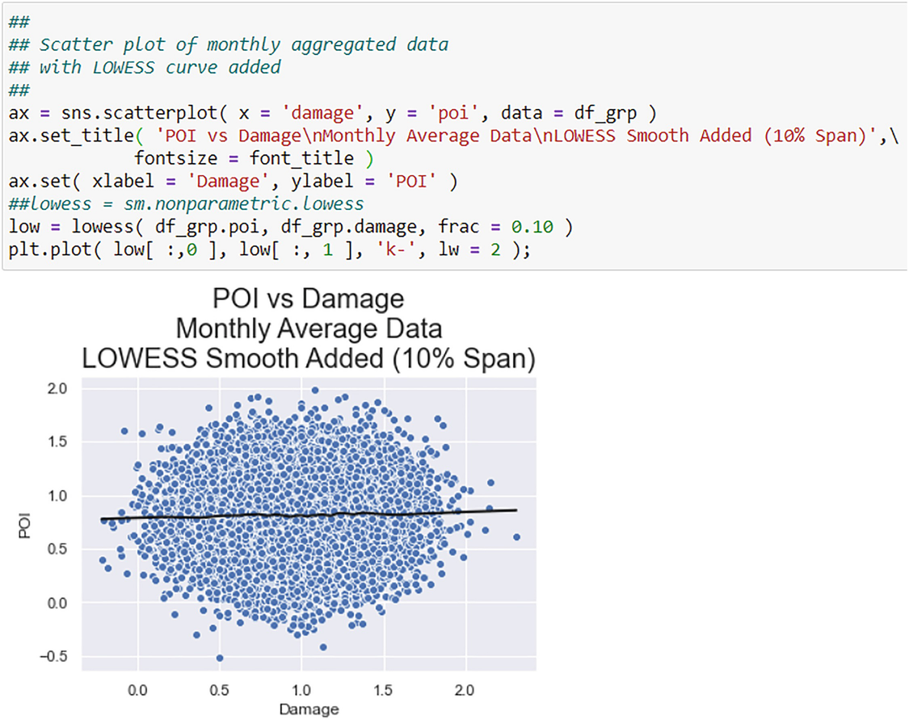
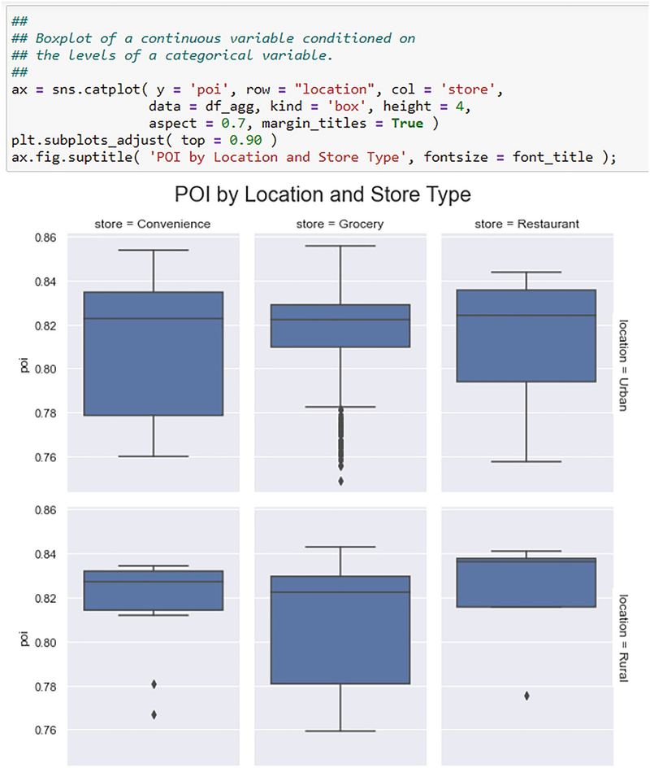

# 数据可视化：基础
> 沃尔特·R·帕茨科夫斯基1
> (1)
> 数据分析公司，美国新泽西州普莱恩斯伯勒

许多书籍都讨论了与演示文稿中使用的图形相关的数据可视化问题，而不是在开发导致演示文稿的材料的分析阶段。在本章中，我从实际分析的角度关注数据可视化，而不是它们的介绍。然而，这并不意味着它们不能在演示中使用；它们当然可以使用。我描述的图表旨在帮助和增强从数据中提取潜在丰富信息的能力。

## 4.1 数据可视化的背景

业务数据分析是先进和复杂的统计、计量经济学和机器学习工具和方法的组合，用于从数据中提取丰富的信息。你可能将这些视为回归模型、聚类算法、对应图、决策树等等。你花费大量时间学习它们的复杂性以及如何应用它们。然而，一个同样有价值和强大的工具是数据可视化，它先于并支持这些其他工具。统计学家仍然告诉他们的学生和客户的一条老建议是：看看你的数据！这是数据可视化。
查看你的数据是可靠的建议，但对于小型且易于管理的数据库；也就是小数据。对于现代数据库，这个明智的建议很难实施。它们现在以 TB 甚至更多来衡量，所以我们现在有了大数据。 Paczkowski (2018) 和 Paczkowski (2016) 讨论了大数据及其处理方法。你可能想要“查看”的任何一个大数据数据库都可能太大而无法处理。那么，如何可视化这些数据呢？
在本章中，我将讨论如何“查看”数据作为深度数据分析中重要的第一步，以揭开隐藏重要但潜在的丰富信息的数据面纱。数据可视化本身通常不是目的，但它可能是从数据中学习所需的全部内容。或者，它可以先于并支持复杂的统计和计量经济学方法，这些方法经常立即应用于任何数据集，无论大小。简而言之，它在对任何规模和种类的数据进行深度分析的任何阶段都发挥着重要而强大的作用。
可视化当然是一个广泛的领域，在感知、显示、三维、渲染、动态渲染、色彩协调和眼球运动等各个方面都有积极的研究。我不可能提供所有这些领域的例子或讨论任何一个业务问题的特定问题。本章的重点是狭隘的——商业数据——但这种狭隘并没有削弱它的重要性，因为它的重点领域对于日常商业、政策、一般研究以及经济的运作和生计都非常重要。

## 4.2 视觉设计的格式塔原则
已经提出了几个用于创建有效图形的原则。什么是“有效图”？它允许查看者、你或你的客户快速查看和消化关键信息。由于糟糕的设计或“chartjunk”的使用（或滥用），无效的图表隐藏了关键信息。 Chartjunk 是图形元素，它们要么与图表的中心信息无关，要么使该信息云化，添加另一个隐藏它的面纱。请记住，数据分析的主要重点是穿透数据本身施加的面纱，即隐藏在数据中的丰富信息的面纱。 Chartjunk 和糟糕的设计只会加剧一个已经存在的问题：由于数据而穿透面纱。参见关于图表垃圾的 Tufte (1983)。
有几个视觉设计的格式塔原则已经成为有效图表的指南。我将在本章中特别提到四个。这些是：

1. 接近原则；
2. 相似性原则；
3. 连通性原则；
4. 共同命运原则。

还有其他几个，例如延续、闭包和对称与秩序。确切的数字似乎不清楚。我见过提到五个，有时提到七个。我列出的四个是最常提到的，也是我将在本章中提到的。格式塔原则是关于人类如何根据其部分感知整体的概念。如果部分是杂乱无章的和不相似的，那么整体将难以感知和理解。但是，如果各部分组织良好且相似，那么整体将被很好地感知。关于图，如果图元素杂乱无章且不相似，那么图试图传达的信息，即丰富的信息，将保持隐藏状态。
格式塔接近原则说，图上彼此接近的对象被解释为一个组。目标应该是对类似的项目进行分组，以便你和你的客户更容易形成比较判断。如果相似的项目不是很接近，那么这是一个挑战，如果不是不可能形成判断的话。
格式塔相似性原则说，组成组的对象在性质上应该是相似的。不仅相似的物品应该彼此靠近（即接近）放置，而且彼此靠近放置的物品也应该相似。颜色和形状有助于识别图形中的相似性。例如，如果散点图中的所有绘图点都是黑点，那么除了显而易见的点之外，不可能在这些点中看到任何模式。但是，如果有些是黑色的，有些是红色的，那么你可以更容易地看到图案。这同样适用于条形图中的条形图或饼图中的切片。
格式塔连通性原则是指连接相似单元的线（相似性原则）并帮助你查看相关信息的块。块不仅可以用线连接，而且线也可以有不同的颜色和形式（例如，虚线、点线、实线）。
共同命运的格式塔原则与对象一起移动或趋向的趋势有关。对于要显示随时间变化的趋势的时间序列图表，这可能是一个更常见的原则。如果你在同一轴上绘制了多个时间序列，那么你希望能够显示或突出它们的共性（“共同命运”），以便进行比较。
关于格式塔原理，有丰富的心理学和数据可视化文献。参见 Vanderplas 等人。 （2020）关于这些原则及其在平面设计中的应用的一些讨论。另请参阅 Kosslyn (2006)、Pinker (1990) 和 Peebles 和 Ali (2015)，了解更多讨论和对这些原则的深入了解。

## 4.3 使数据可视化复杂化的问题
数据可视化有两个问题：

1. 人类视觉系统可以处理什么或多少；
2. 数据可视化的工具。

我将在下面的小节中讨论这两个部分，为本章的其余部分奠定基础。

### 4.3.1 人类视觉限制

当我们讨论数据可视化时，我们指的是人眼可以处理并传输到大脑以进一步处理成智能和理解的东西。所以门控项目是人眼的局限。 Wegman (2003) 认为人眼可以处理的最大像素数是：106-107 个点。像素是“图片元素”的缩写，是构成图形、图片、视频等图像的点或图形元素。 1 人眼最初通过眼睛视网膜区域的视锥细胞处理这些像素.视锥细胞对光敏感，尤其是对强光。参见 Healey 和 Sawant (2012)。与锥体相邻的还有对低水平光敏感的杆。眼睛里大约有 107 个视锥细胞，因此你最多应该能够处理我上面提到的 106-107 个观察结果。对于小型数据库，这不是问题，因为大多数数据库的大小都小于 107。例如，可以肯定地说，大多数统计学家、计量经济学家和一般数据分析师在他们的正常分析工作中使用少于 10,000 个观察值，其中这个数字是他们数据集中数据点的总数。 10,000 是 103，远小于最大数量。你可以肯定地说，最常用的数据集是“小数据”。上面提到的数量级“大数据”是一种较新的现象，其数据量远远超过最大眼量。我在基于 Wegman (2003) 和 Huber (1994) 的表 4.1 中提供了数据集大小的分类。
表 4.1 当前定义或使用的数据集大小。资料来源：韦格曼 (2003) 和帕茨科夫斯基 (2018)

| 描述符     | 数据集大小（字节） | 存储方式 |
| ---------- | ------------------ | -------- |
| Tiny       | 10 ^2^             | 一张纸   |
| Small      | 10^4^              | 几张纸   |
| Medium     | 10^6^              | 一张软盘 |
| Large      | 10^8^              | 硬盘     |
| Huge       | 10^10^             | 多个硬盘 |
| Ridiculous | 10^12^             | 磁带     |

表 4.1 中“可笑”的 10^12^ 字节大小（称为 TB）现在在笔记本电脑硬盘驱动器中非常常见。我们已经超越了 TB，现在处于 PB（10^15^ 字节）、Exabytes（10^18^ 字节）、Zettabytes（10^21^ 字节）和 Yottabytes（10^24^ 字节）的领域。形容词“可笑”有了新的含义。有关讨论，请参见 Paczkowski (2018)。
传统的可视化工具不能应用于这些大小的数据，至少在没有修改的情况下是这样。可视化工具必须分为两类：适用于小数据和适用于大数据。在这两个类别中，我们还必须区分可以可视化的两种类型的数据：分类数据和连续数据，当然还有两者的混合。我在表 4.2 中按数据大小总结了一些可视化工具。在接下来的部分中，我将描述这两种数据大小类别的可用可视化工具。对于特定数据集大小可以做什么，这些并不是硬性规定；它们只是指导原则。
表 4.2 按数据类型和数据大小划分的可视化工具

| 数据类型 | 数据大小                |                                               |
| -------- | ----------------------- | --------------------------------------------- |
|          | Small                   | Big                                           |
| 离散的   | Boxplot, Bar chart,     | Same as small                                 |
|          | Pie chart, Mosaic graph |                                               |
|          | Heatmap                 |                                               |
| 连续的   | Histogram, Scatterplot, | Parallel Plot, Contour plot, Hex Bin plot     |
|          | Scatterplot matrix      | Time Series plots, Contour plot, Hex Bin Plot |

### 4.3.2 数据可视化工具
Python 有几个可视化包：Pandas 本身和 Seaborn 仅举两个。稍后我将介绍第三个地理地图。回想一下，Pandas 是一个以 DataFrame 作为主要数据存储库的数据管理包。 DataFrame 的一个方便特性是它在创建时附加了一个绘图方法。这意味着你只需将此方法链接到 DataFrame 即可轻松创建数据图。例如，如果 DataFrame 包含一个分类变量 X，那么你可以通过首先将 value_counts 方法链接到它来创建它的饼图以计算值的分布，然后将 plot 方法与饼图的参数链接。整个命令是 df.X.value_counts().plot(kind = ‘pie’)。只需将 kind 参数从 pie 更改为 bar，即可将饼图更改为条形图。关键字 kind 指定了绘图的类型。我在表 4.3 中列出了“种类”的选项。
表 4.3 这是 Pandas 绘图方法的 kind 参数选项列表

| 制作情节的种类：种类 | 图形                |
| -------------------- | ------------------- |
| line                 | Line plot (default) |
| bar                  | 垂直条形图          |
| barh                 | 水平条形图          |
| hist                 | 直方图              |
| box                  | 箱形图              |
| kde                  | 核密度估计图        |
| density              | 与“kde”相同         |
| area                 | 面积图              |
| pie                  | 饼图                |
| scatter              | 散点图              |
| hexbin               | 六边形图            |

Seaborn 是一个数据可视化包，具有广泛的功能。 Seaborn 的一个不错的特性是它可以读取 Pandas DataFrames。 一个通用的 Seaborn 函数调用是 sns.plotClass( x = Xvar, y = Yvar, data = data, kind = kind, options ) 其中 sns 是传统的 Seaborn 别名。 plotClass 是我在表 4.4 中列出的图类或图族。 Xvar 和 Yvar 参数分别是 x 变量和 y 变量，它们因绘图类而异； 选项有色相、大小和样式。2 种类选项与表 4.3 中的相同。
表 4.4 这是 Seaborn 的绘图系列、它们的绘图类别和种类选项的分类。 有关详细信息，请参阅 https://seaborn.pydata.org/ 上的 Seaborn 文档

| Plot family | plotClass | 种类                                  |
| ----------- | --------- | ------------------------------------- |
| 关系型      | 关系图    | 散点，线                              |
| 分类的      | 类图      | 箱线图、条形图、计数                  |
| 分布        | 分布图    | 联合图、对图、分布图、kdeplot、地毯图 |
| 线          | 线图      | 时间序列                              |

Pandas 和 Seaborn 的图形功能基于 Matplotlib 构建，这是一个图形包，可让你控制创建图形的所有方面。正如 Paczkowski (2021b) 中所述，尽管 Pandas 和 Seaborn 是该库的接口，但你仍然需要了解一些 Matplotlib 功能，才能有效地创建图表来探索和理解你的数据。这些是广泛的能力。请参阅 Matplotlib 在线文档、VanderPlas（2017 年，第 4 章）和 Hunt（2019 年，第 5 章和第 6 章）。另请参阅 Paczkowski (2021b)，从中得出我的一些评论。
Matplotlib 的绘图能力也是它的缺点，因为它的复杂性。一个重要的子模块 pyplot 充当此功能的网关，以保护你免受某些复杂性的影响。 Pandas 和 Seaborn 与 pyplot 接口。因此，你需要导入 pyplot 子模块，尽管你不需要这样做来使用它们本身的图形功能。导入子模块允许你向图表添加功能，例如标题和标签，以及操作图表元素，例如刻度线。你使用 import Matplotlib.pyplot as plt 导入子模块，其中别名是常规的。
无论你使用何种软件，所有图表都是在画布上创建或“绘制”的。在 Matplotlib 术语中，画布是一个图形。实际图形是在作为图形区域的轴内创建的。如果只有一个图形，那么轴占据整个图形区域；否则，图形区域被划分为子区域或网格排列，每个子区域都包含一个图形。你可以控制图形区域的创建和大小以及指定图形内轴的数量和排列。你可以使用 fig = plt.figure( ) 创建一个图形区域。默认情况下，创建一个轴。你可以在创建图形时（最常见）或在创建图形后定义所需的轴。在创建图形时，使用 fig, ax = plt.subplots( nrows = 1, ncols = 1 ) 创建一个简单的网格，它是 1 × 1 个轴，这是默认值。要添加轴，请使用 fig.add_subplot( 2, 2, 1 ) 作为 2 × 2 网格（基于前两位数），每个子轴根据最后一位数放置：1：左上； 2：右上角； 3：左下； 4：右下。
每个轴都被命名。在我的示例中，名称是 ax，这是传统的。摘自 Paczkowski (2021b) 的一些示例包括：

 $$\displaystyle \begin{gathered} \text{fig, ax = plt.subplots( ) for one axis in the figure (the default)} \\ \hspace{-2.4pc}\text{fig, axs = plt.subplots( 2, 2 ) for 4 axes in a {$2 \times 2$} grid} \\ \,\,\text{fig, (ax1, ax2 ) = plt.subplots( 1, 2 ) for 2 axes in a {$1 \times 2$} grid.} \end{gathered} $$ 

我在图 4.1 中说明了一些图形结构。

图 4.1 这是 Matplotlib 术语中两个图形的结构。面板 (a) 是在图形空间中具有一个轴 (ax) 的基本结构。这是使用 fig, ax = plt.subplots() 创建的。面板 (b) 是 (1 × 2) 网格中的 2 个轴（ax1 和 ax2）的结构。这是使用 fig, ax = plt.subplots( 1, 2 ) 创建的。资料来源：帕茨科夫斯基（2021b）。施普林格授予的许可
正如 Paczkowski (2021b) 所指出的，轴名称允许你访问图形的某些部分，例如标题、X 和 Y 轴（即脊椎）标签和刻度线等。你可以使用图形名称访问图形标题。我在表 4.5 中列出了选项。
表 4.5 这些是一些有用的 Matplotlib 注释命令

| 图形组件     | 命令       | 例子                                                   |
| ------------ | ---------- | ------------------------------------------------------ |
| Figure title | suptitle   | fig.suptitle( figureTitle )                            |
| Axis title   | set_title  | ax.set_title( axisTitle ); ax1.set_title( axis1Title ) |
| X-axis label | set_xlabel | ax.set_xlabel( X-label ); ax1.set_xlabel( X1-label )   |
| Y-axis label | set_ylabel | ax.set_ylabel( Y-label ); ax1.set_xlabel( Y1-label )   |

### 4.3.3 视觉类型

当你想到可视化时，你很可能会想到图表，但这种想法过于简单化，因为图表的类型很多，并且针对不同类型的数据。一个简短的列表包括大多数分析师熟悉的那些：条形图、饼图、直方图和散点图。该列表实际上要长得多。并非所有这些都可以应用于任何和所有类型的数据。它们有各自的用途和局限性，可以揭示潜在信息的不同方面。
我在表 4.6 中强调了一些可能性。不同类型的图适用于不同类型的数据，因此图必须匹配数据特征。我在这里展示了两个特征：连续性和要绘制的系列或变量的数量。
表 4.6 可视化工具与数据的匹配

| 连续性      | 系列数        | 图表类型                      |
| ----------- | ------------- | ----------------------------- |
| Continuous  | One           | Pie, Boxplot, Histogram, Line |
| Continuous  | Two           | Scatter, Contour              |
| Continuous  | More than two | Parallel                      |
| Discrete    | One           | Bar, Pie                      |
| Discrete    | Two           | Mosaic, Heatmap               |
| Combination | Two or more   | Boxplots, Facets, Contour     |

在接下来的部分中，我将根据数据的连续性以及它们是空间的还是时间的来划分数据。

### 4.3.4 在图中寻找什么

大多数人只是“看”一张图表，然后就他们所看到的内容发表一些意见——任何事情。然而，“寻找”需要培训和经验。 “旁观者”可以分为新手或专家。新手要么没有在图表中寻找什么方面没有受过培训，要么只是刚刚开始培训。他们倾向于错过图表所传达的重要信息，从而导致丰富的信息保持隐藏状态。专家通过培训和经验，知道要寻找什么并更快地寻找它，不仅可以剔除重要信息，即丰富的信息，还可以将它们转化为可操作的建议。这被称为图形化。参见 Peebles 和 Ali (2015)。
训练阅读和解释图形的原因是图形具有不同于文本的符号系统。我们都从小就接受过阅读和解释书面文本的培训。文本的符号系统由字母数字字符和标点符号组成，不要忽略非符号系统，如段落、缩进、从左到右向下的顺序、大写、名词和动词的一致等.3 参见 Pinker (2014) 对写作问题的精彩讨论。图表具有不同的符号系统，由线、条、颜色、点和其他标记组成，它们讲述故事、传达信息，与文本没有什么不同。你必须接受培训以“阅读”和解释图形符号系统，就像你接受培训以阅读文本符号系统一样。如果你愿意，有一些功能和线索可以帮助你从文本中提取关键隐藏的潜在信息；图表也是如此。我提倡你应该寻找的五个指导特征：

1. 分布；
2. 关系；
3. 图案；
4. 趋势；
5. 异常。

#### 4.3.4.1 特性#1：分布

数据的分布是它们在图形轴上的排列或形状。分布可以是对称的、倾斜的（左或右）或单/多模态。我在图 4.2 中展示了四种可能的分布形状。

图 4.2 此处展示了四种典型分布。左上角是左斜，右上是右斜。底部的两个是对称的。右下角几乎是均匀的，而左下角几乎是正常的。左下的那个是最想要的
对称意味着中心点左右分布的形状，通常是平均值或中值，是相同的。正态分布是连续随机变量的典型对称分布，但肯定不是唯一的。正态分布随机变量的概率密度函数 (pdf) 是
$$
\displaystyle \begin{aligned} \begin{array}{rcl} f(y) = \frac{1}{\sqrt{2\pi\sigma^2}}e^{-\frac{(Y - \mu)^2}{2\sigma^2}} \end{array} \end{aligned} 
$$
其中 μ 和 σ 2 分别是均值和方差的总体参数。为了显示均值的对称性，在随机变量的均值中添加少量，比如 δ，使得随机变量的新值是 Y = μ + δ。 pdf变成

$$
\displaystyle \begin{aligned} \begin{array}{rcl} f(\mu + y) &amp; =&amp;\displaystyle \dfrac{1}{\sqrt{2\pi\sigma^2}}e^{-\dfrac{([\mu + \delta] - \mu)^2}{2\sigma^2}} \\ &amp; =&amp;\displaystyle \dfrac{1}{\sqrt{2\pi\sigma^2}}e^{-\dfrac{\delta^2}{2\sigma^2}}. \end{array} \end{aligned}
$$
现在从平均值中减去那少量得到

$$
 \displaystyle \begin{aligned} \begin{array}{rcl} f(\mu - y) &amp; =&amp;\displaystyle \dfrac{1}{\sqrt{2\pi\sigma^2}}e^{-\dfrac{([\mu - \delta] - \mu)^2}{2\sigma^2}} \\ &amp; =&amp;\displaystyle \dfrac{1}{\sqrt{2\pi\sigma^2}}e^{-\dfrac{(-\delta)^2}{2\sigma^2}} \\ &amp; =&amp;\displaystyle \dfrac{1}{\sqrt{2\pi\sigma^2}}e^{-\dfrac{\delta^2}{2\sigma^2}} \end{array} \end{aligned}
$$
这两个 pdf 是相同的，因此正态密度曲线关于均值 μ 是对称的。4 这种对称性是可取的，因为集中趋势的三个关键度量——均值、中值和众数——在对称下是相等的。它们在不对称下有所不同。
偏度定义为 pdf 尾部的伸长，向左或向右但不能同时向左或向右。特别是，当分布偏斜时，平均值会偏离中位数。如果分布是右偏的，则平均值大于中位数并给出不准确的集中趋势指示。左偏分布则相反。我在图 4.2 中展示了两种可能性
正态 pdf 的偏度用作确定其他分布偏度的基准。由于法线 pdf 是对称的，因此它的偏度为零；尾部的面积相等。可以使用 Z 检验来完成偏度测试，以将分布的偏度度量与正态分布的零进行比较。这个偏度度量是偏度的 Fisher-Pearson 系数：^5^
$$
\displaystyle \begin{aligned} \begin{array}{rcl} g_1 = \dfrac{m_3}{m_2^{{3}/{2}}} \end{array} \end{aligned}
$$
其中 $$m_i = {1}/{n} \sum _{j = 1}^n (x_{j} - \bar {x})^i$$。这是一个有偏差的样本中心矩。一个无偏版本是调整后的 Fisher-Pearson 标准化矩系数：

$$
\displaystyle \begin{aligned} \begin{array}{rcl} G_1 = \dfrac{\sqrt{n \times (n - 1})}{n - 2} \times g_1 \end{array} \end{aligned}
$$
偏度检验的零假设是正态分布的偏度与测试分布的偏度没有差异。该测试返回 Z 分数和相关的 p 值。如果 Z 分数为负且显着，则测试分布偏斜；否则，它是右偏的。如果 Z 分数不显着，则分布不偏斜。参见 Joanes 和 Gill (1998) 以及 Doane 和 Seward (2011)。偏度测试基于 D'Agostino 等人。 （1990），我在图 4.3 中进行了说明。

图 4.3 这是一个偏度测试的例子。这是 Z 检验。 Z 值小于零表示左偏；大于零表示右偏。 p 值用于检验偏度为零的零假设偏度。由于 p 值大于 0.05，因此不拒绝无偏度的 Null Hypothesis
我提到正态分布有两个原因。首先，由于它是典型的对称分布，因此任何其他分布描述的对称性都是通过这个 Z 检验相对于正态分布来判断的。另一种描述是经验分布，例如从数据中得出的直方图。其次，正态分布通常覆盖在经验分布之上，以显示与正态分布的一致或偏离程度，以帮助可视化偏度。这在图 4.2 的四个面板中很明显。

#### 4.3.4.2 特征#2：关系

关系不仅仅是关联（即相关性），而是两个或多个变量之间或之间的更多因果行为。购买的产品和分销渠道就是一个例子。客户满意度和未来的购买意图是另一回事。这些关系可以是空间的、时间的或两者兼而有之。

#### 4.3.4.3 特性#3：模式

模式将是数据点的分组，例如集群或段。

#### 4.3.4.4 特征#4：趋势

趋势是随时间的发展或变化（例如，同店销售跟踪研究或人力资源研究中研发人员的流失率）。这些将主要是暂时的。
我将趋势与模式分开，即使它是一种模式，因为趋势通常与时间序列相关联。一个时间序列，我在第 1 章讨论。 7、由一个对象在不同时间点的测量组成，这些点以有序的方式进行。这些措施通常按时间绘制，并由线连接。线条实际上传达了意义：系列将被解释为一个单一的实体，线条将绘制的点连接在一起。因此，趋势是该单一实体随时间的运动。模式是一个更具包容性的概念。它代表分组和组织。趋势是一种模式，但模式不一定是趋势。这反映了格式塔连通性原则。

#### 4.3.4.5 特征#5：异常

异常或异常值是与大量数据有很大差异的点。但并非所有异常值都是平等的：有些是无害的，而另一些则是有害的，必须检查它们的来源和影响。无害的对分析结果没有影响，而有害的有。例如，在图 4.4 中，我展示了异常值对回归线的影响，然后是当异常值被移除后对回归线的影响。很明显，这条线被大异常值拉动了。如果目标是提供丰富的信息，那么具有有害异常值的数据将无法实现该目标。

图 4.4 这说明了异常值对回归线的影响。左侧面板显示异常值如何将线拉离数据中的趋势。右侧面板显示了去除异常值的线上的效果
识别异常值是一项艰巨的任务，尤其是在处理多变量 DataFrame 时。 Python 包 PyOD 有一套全面的数据可视化工具，用于检查潜在异常值的数据。你可以使用 pip install pyodbc 或 conda install -c conda-forge pyod 安装 PyOD。

## 4.4 可视化空间数据

在本节中，我将考虑连续数或浮点数。它们可以与离散或整数组合，后者用于分类目的。我将使用完美订单指数 (POI) 数据作为案例研究。

### 4.4.1 数据准备

POI DataFrame 采用面板格式，这意味着它具有空间和时间数据的组合。空间方面是烘焙设施和/或其地理位置，无论是州还是营销区域。时间维度是交货日期。因此，数据立方体在空间维度上比在时间维度上稍微复杂一些。由于我关心数据的空间属性，因此必须折叠 Cube 的时间方面。首先，我汇总了每个 FID 的数据。对于每个聚合的 FID，POI 是通过乘法计算的。我在图 4.5 中展示了如何做到这一点。稍后我将讨论其他聚合。

图 4.5 该代码显示了 POI 数据的空间分析数据是如何聚合的。对于每个 FID，此聚合随时间推移而发生。聚合是使用 groupby 函数和 mean 函数完成的。计算平均值是因为它们对这些数据很敏感。 DataFrame 称为 df_agg
这个聚合的 DataFrame 可以与包含特定于每个 FID 的数据的 DataFrame 合并：营销区域、州（和州代码）、位置（农村、郊区或城市）和商店类型（便利店、杂货店或餐馆）。我在图 4.6 中展示了这种合并。

图 4.6 这段代码显示了数据是如何合并的。新的 DataFrame 被称为 df_agg

### 4.4.2 可视化连续空间数据

检查连续空间数据的分布是很常见的。箱线图，有时也称为盒须图，是用于连续数据的强大工具。它是由 John Tukey 在 1970 年代开发的。参见 Tukey (1977) 以及 Frigge 等人。 （1989 年）。我在图 4.7 中展示了箱线图的各个部分。箱线图反映了一个统计事实，即基于矩（例如，平均值或平均值）的简单描述性统计数据对异常值不稳健或抵抗力差。然而，基于百分位数的描述性统计数据是稳健的，因此它们通常是首选，或者至少是强烈推荐的。在所有可能的百分位数中，五个是最常见的，如表 4.7 所示。这些包括数据的五位数摘要。

图 4.7 箱线图各部分的定义。资料来源：帕茨科夫斯基（2021b）。施普林格授予的许可
表 4.7 五数摘要的组成部分。有时会添加第六种度量：算术平均值或平均值。这在框中显示为另一个符号

| 百分位数     | 定义                         | 箱线图位置         |
| ------------ | ---------------------------- | ------------------ |
| Minimum      | Minimum value                | Lowest point       |
| Q1           | First or lower quartile      | Bottom of box      |
| Q2 or median | Second quartile/middle value | Middle line in box |
| Q3           | Third or upper quartile      | Top of box         |
| Maximum      | Maximum value                | Highest point      |

可以从图 4.7 中的箱线图组件计算（或推断）分布度量。范围（= Maximum − Minimum）和四分位距或IQR（= Q3 − Q1）可以快速确定。偏度也由 Q3 − Median 和 Median − Q1 之间的关系决定。如果 Q3 − Median > Median − Q1，则分布向右偏；如果Q3 − Median < Median − Q1，则向左倾斜；否则，它是对称的。从盒子的顶部和底部延伸的晶须达到 1.5 × IQR 或大于/小于 1.5 × IQR 的最小值/最大值。因此，1.5 × IQR 定义了晶须无法通过的栅栏。超出围栏的任何点都是异常值。几乎每个软件包都使用 1.5。有些允许你指定乘数，但默认值为 1.5。6 IQR 可用于估计标准差，因为 s ≈ IQR∕1.35。见万等人。 (2014) 对这个近似值的一些评论和限制。
我在图 4.8 中显示了聚合 POI 数据的箱线图。分布由盒子的伸长率（即，它是长的还是下垂的，取决于它的方向）和从盒子两端延伸的胡须或尾巴的长度来表示。通常，在箱线图中查找以下内容：

- 箱体伸长率
    - 小盒子：小方差/价差
    
    - 伊格。 4.8 单个连续变量的箱线图
    - 大框：大方差/价差
- 偏度
- 异常值
  - 晶须外的点

对于图 4.8 中的箱线图，箱线的伸长率很窄，这意味着 50% 的数据几乎没有变化。分布中也存在一些左偏斜，因为代表 25% 数据的框底部比也是 25% 数据的顶部拉长。因此，底层 25% 的数据分布大于前 25% 的数据。此外，下尾长于上尾，也暗示左偏。这可以使用我上面描述的 skewtest 进行测试。零假设是没有偏度的。 Z 值为 - 6.654，p 值为 0.0000，因此在任何显着性水平上都拒绝零假设。最后，在分布的左下方有一些异常值或极值。
另一种更经典的可视化分布的方法是使用直方图。具体来说，直方图是一种用于估计随机变量 X 的值的概率密度函数的工具。设 f(x) 为密度函数。正如 Silverman (1986) 所指出的，知道这个概率密度函数可以让你计算概率，因为
$$
\displaystyle \begin{aligned} \begin{array}{rcl} Pr(a &lt; X &lt; b) = \int_a^b f(d)dX. \end{array} \end{aligned} 
$$
假设一个连续随机变量 X 上的 n 个观测值的随机样本：x~1~, x~2~, ..., x~n~。观察值被分配到箱或组以离散化连续数据。设 h 为在 X 尺度上定义 bin 宽度的单位数。例如，如果 X 标度为数千人，则你可能有 h = 10, 000 人。你可以指定不同的宽度，这样你就可以为第 i 个 bin 设置 hi。然而，典型的 bin 宽度是恒定的，因此 h i = h, ∀i。
直方图由 h 定义；一个原点 x~0~，用于你要开始对数据进行分箱的位置；和箱数，M。原点不一定是数据的第一个有序值，尽管它通常是第一个值。数据集中 x 0 之前的任何值都将被忽略。 Scipy stats histogram 函数具有直方图范围的下限值和上限值的参数。这被指定为一个元组。如果未给出元组，则“使用比值范围稍大的范围......”。该范围由 (x.min() − s, x.max() + s) 给出，其中 s = 1∕2 × (x.max() − x.min())∕(#bins − 1)。
箱定义为 B~i~ = [x~0~ + (i − 1)h, x~0~ + ih) 其中 i = 1, 2, ..., M 是一系列正整数，用于标识箱本身。例如，对于第一个 bin，区间为 [x~0~, x~0~ + h)；第二个 bin 是 [x~0~ + h, x~0~ + 2h) ；等等。这些区间通常在右边是半开的：左边的值被包括在内，右边的值被排除在外。所以整数区间 [1, 4) 包含值 1, 2, 3。
定义一个指示函数，使得
$$
\displaystyle \begin{aligned} \begin{array}{rcl} \mathbb{I} = \begin{cases} 1 &amp; \quad  \text{if } x_j \in B_i \\ 0 &amp; \quad  \text{otherwise} \end{cases} \end{array} \end{aligned}
$$
对于 j = 1, 2, ..., n, i = 1, 2, ..., M 并且其中 B~i~ 是第i^th^个 bin。 B~i~ 中的数据点计数为 $$\sum _{j = 1}^n \mathbb {I}(x_j \in B_i)$$ ，总样本为 $$n = \sum _{i = i}^M \sum _{j = 1}^n \mathbb {I}(x_j \in B_i)$$。一个 bin 的计数称为 B~i~ 中的频率或计数。 B~i~ 的归一化面积是

$$
\displaystyle \begin{aligned} \begin{array}{rcl}{} f_i h = \dfrac{1}{n} \sum_{j = 1}^n \mathbb{I}(x_j \in B_i) \end{array} \end{aligned}
$$
其中 f i h 是 B i 中总样本的比例， f i 是表示 bin“高度”的计数。 f i h 的数量被解释为每单位 X 尺度的总样本的比例乘以 bin 中 X 的单位数。如果 h = 1，则 f i 只是样本在 B i 中的比例。这有时被称为 B i 中的相对频率。
你现在可以写
$$
\displaystyle \begin{aligned} \begin{array}{rcl} \sum_{i = i}^M f_i h &amp; =&amp;\displaystyle \dfrac{1}{n} \sum_{i = i}^M \sum_{j = 1}^n \mathbb{I}(x_j \in B_i) \end{array} \end{aligned}
$$

$$
\displaystyle \begin{aligned} \begin{array}{rcl} &amp; =&amp;\displaystyle 1. \end{array} \end{aligned}
$$

B~i~ 的密度为
$$
\displaystyle \begin{aligned} \begin{array}{rcl}{} f_i = \dfrac{1}{n \times h} \sum_{j = 1}^n \mathbb{I}(x_j \in B_i) \end{array} \end{aligned}
$$
如西尔弗曼 (1986)。这个密度由两部分组成：
1. 样本中的比例B~i~ $$= {1}/{n} \sum _{j = 1}^n \mathbb {I}(x_j \in B_i)$$
2. X 刻度的单位。

它是“密度”，因为它是每单位 X 中样本的比例。这类似于人口密度：每平方英里人口的 10%。有关直方图及其问题的经典讨论，请参见 Silverman (1986)。另见 Weglarczyk (2018) 的论文。最后，参见 Freedman 等人。 (1978) 对密度和直方图的直观讨论。
我在图 4.9 中展示了聚合 POI 数据的示例直方图。可以使用平滑的密度曲线增强直方图，以更有效地突出分布模式。这条平滑曲线是高斯核密度估计或 KDE，是 (4.4.6) 中 f i 的估计。更具体地说，它是正态 pdf 的非参数估计，广泛用于显示一个数据系列的分布与正态分布的比较。图 4.9 中的直方图表明，对于正态分布的随机变量，分布具有双峰而不是单一峰。这两个分布可以解释图 4.8 中的左偏度。通常，多峰分布表示基础分布的混合，但并非总是如此。你可以混合使用两种单峰分布，也可以混合使用一种本质上为双峰的分布。我将在第 12 章讨论混合模型。

图 4.9 单个连续变量的直方图
可以将两个连续变量绘制在一起是散点图。我在图 4.10 中展示了一个示例。你可能熟悉一个相对容易解释的简单散点图。你应该寻找接近的数据块（格式塔接近原则）。如果三个变量绘制在相同的轴上，则每个变量都被赋予图例中指示的不同颜色或色调。格式塔相似性原则用于记录相似色调的块。

图 4.10 两个连续变量的散点图
当数据点的数量变得非常大时，就会出现问题。这有时被称为大 N 问题。见 Carr 等人。 （1987 年）。当 n 非常大时，散点图将显示为一个大黑球（或用于点的任何颜色）。这对分析毫无用处，因为很难辨别两个变量之间的任何关系。因此，接近和相似的两个格式塔原则崩溃了。这显然是图 4.10 中的情况，它基于每个 FID 每年每周每周汇总的 POI 数据。聚合的 DataFrame 有 104,800 条记录。 POI 与伤害的散点图并没有揭示。
有四种方法可以处理这种情况。你可以使用：

1. 数据的随机样本；
2. 核密度估计器或等高线图；
3. 六边形分箱图；
4. Lowess 曲线，可能省略了绘图点。

随机抽样（无替换）对于减少大 N 问题很有用，它允许你进行交叉验证。交叉验证意味着你可以抽取多个样本，使用每个样本作为对其他样本的检查。你应该看到相同的关系，或多或少，但不是显着的差异。由于你正在抽样，因此你可能不会仅仅因为样本的“抽签运气”而对任何一次抽签的数据都没有最佳视图。例如，异常值和众数可能会被样本隐藏，或者你实际上可能会引入不存在的异常值和众数，而只是通过抽取样本才出现。这些都是任何抽样的问题，无论是我们关注的图表，还是调查，或临床试验等等。见 Carr 等人。 (1987) 进行一些讨论。
核密度图 (KDE) 用于显示数据的轮廓。基本上，你可以想象你的数据绘制在 3D 空间中：X − Y 二维 (2D) 平面，这是你的散点图平面加上垂直于该平面的第三维，即绘图点的密度。第三维是从二维平面上升的表面，可以在无限数量的点处水平切片（即平行于 X − Y 平面）以显示轮廓。然后将它们向下投影到 2D 平面。数据的密度由投影轮廓的密度揭示。靠近、紧密或密集的点显示为暗区，而远离密集区的点显示为较亮的区域。这些黑暗和明亮的区域反映了接近和相似的格式塔原则。我在图 4.10 的数据中显示了图 4.11 中的示例。两个集群是明显的两个黑点，而其他点则具有不同程度的灰色。请注意，在图 4.11 中，KDE 直方图位于图的边缘以强调各个分布。

图 4.11 图 4.10 中使用的相同数据的等高线图
等高线图的替代方法是六边形分箱图。这有时会更好，因为它涉及绘制小的六边形形状，形状的颜色或阴影表示六边形内的数据点数量。颜色或阴影越深，数据越密集。为什么是六边形？它们具有比正方形更好的视觉特性，并且更好地跨越绘图空间。六边形覆盖 X-Y 平面的效率提高了 13%。有关 R 中的广泛讨论和实现，请参见 Lewin-Koh (2020)。我在图 4.12 中为图 4.10 中的 POI 数据提供了一个示例 hex bin 图。注意图形平面边缘的直方图。

图 4.12 图 4.10 中使用的相同数据的 hex bin 图
最后一种方法是在数据点云中画一条线，以显示数据的总体趋势，否则无法识别。这反映了格式塔共同命运原则。可以省略散点以强调线条。这条线基本上平滑了数据以揭示两个变量之间关系的趋势。这条线有时简称为平滑线。在一个极端情况下，平滑只是我在第 1 章中回顾的 OLS 直线。 6；在另一个极端，它连接尽可能多的数据点。两个极端之间的平滑是最好的。由于在一个极端情况下，平滑是一条 OLS 线，称为最小二乘回归线，因此确定平滑的方法应类似于 OLS 中使用的方法。 OLS 线是通过最小化损失函数来确定的，该损失函数指定为内生变量的值与基于外生变量的该变量的预测值之间的平方差之和。所有数据都用于开发这种平滑度，并且在确定平滑度时它们都具有相同的权重。
这种方法在两个重要方面进行了修改，以便更灵活地确定不一定是直线但允许直线作为特殊情况的平滑线。简而言之，该方法的修改产生了用于确定线的更一般的情况。修改使用以外生变量值（例如 x 0）为中心的小数据窗口，而不是使用所有可用数据。窗口的大小有时称为窗口的跨度，并且是对称的，使得一半的窗口位于 x 0 的每一侧。每侧一半的跨度称为半宽度。此外，窗口内的外生变量的值被加权，使得接近 x 0 的值具有更高的权重，而那些更远的具有更低的权重。要最小化的损失函数是基于窗口内数据的平方损失的加权和。该估计方法在点 x 0 处产生内生变量的预测值，该点以 x 0 作为一条线上的一个点进行绘制。然后将窗口移动一个数据点以获取一组新数据，并估计新的加权损失函数以产生新的预测值。确定一条线的第二个点。这一直持续到所有数据都已被使用。从根本上说，最小二乘回归线适合数据的子集（即窗口中的数据）。子集被认为是围绕一个点 x 0 的局部，因此回归是局部回归。确定一系列局部回归，每个回归导致一条线的一个点，这条线被最佳确定。这条线称为局部加权散点图平滑或 LOWESS.^7^
LOWESS 线的平滑度由窗口的大小决定，因此局部性的大小在 x 0 附近。局部性越大，线越平滑；局部性越大，线越平滑。局部性越小，线的曲率就越大，因为它反映了较小局部性数据的性质。一个数据集有可能进行大量局部回归，这意味着该过程是计算密集型的。这是对大 N 数据使用这种方法的成本。可以通过增加局部使用的数据的比例来降低计算成本，但这只会使线更直，或者通过增加从一个数据点到下一个数据点的步长。与其将位置窗口移动到一个点上，不如将其移动 10 或 100 个点。这将大大减少计算时间，但可能会影响来自生产线的洞察力。绘图值基于数据点之间的线性插值。
除了位置之外，权重的大小也会影响线条的平滑度。权重有时基于定义为的三角权重函数
$$
\displaystyle \begin{aligned} \begin{array}{rcl} w(x) = \begin{cases} (1 - \lvert d \rvert^3)^3 &amp; \quad  \text{for } \lvert d \rvert &lt; 1 \\ 0 &amp; \quad  \text{for } \lvert d \rvert \ge 1 \end{cases} \end{array} \end{aligned}
$$
其中 d 是窗口中的点 x i 到点 x 0 的距离。该距离通过除以半宽缩放到 0 到 1 的范围。即d = (x i − x 0)∕h 0。区间[x i − h 0, x i + h 0]等于跨度。参见 Fox (2019).8 参见 Cleveland (1979) 和 Cleveland (1981) 了解 LOWESS 方法的发展。9
我在图 4.13 中重现了图 4.10，但添加了一个 LOWESS 平滑，以揭示数据的总体趋势和模式，排除了点分散所表现出的所有噪声。图 4.14 显示了相同数据但没有散点和跨度不同值的 LOWESS 平滑。

图 4.13 图 4.10 中使用的相同数据的散点图，但叠加了 LOWESS 平滑

图 4.14 此处使用图 4.10 中使用的相同数据来比较 LOWESS 跨度设置的不同极端设置。为清楚起见，省略了散点
显示多个变量的另一种方法是绘制一系列线，一条线对应数据表的每一行。线上的点是变量的值。这称为平行图，反映了格式塔的共同命运、相似性和连通性原则。^10^ 参见 Wegman (1990) 对此类图的讨论。在图 4.15 中，比较了四个营销区域的 POI 组件。这种类型的图通常用于大数据中最常见的高维数据。

图 4.15 四个营销区域的 POI 分量的平行图。南部地区脱颖而出
如果你有地理区域的空间数据，则可以有效地使用地理地图来显示你的数据。在这种情况下，不同级别的连续数据将由从最小值到最大值连续变化的温度计指示。该量规利用反映格式塔相似性原则的颜色变化或图案差异。也可以使用离散数据。这种类型的地理地图称为等值线地图。可以为城市、县、州、地区、国家或大陆等任何区域单位开发地图。^11^参见 Peterson (2008) 和 Buckingham (2010)。
用于为地图着色的数据类型存在问题。它们对于定性的离散数据不太重要，因为可以使用一个阴影来明确表示整个类别。例如，如果各州按其美国人口普查区域名称（即中西部、东北部、南部和西部）分类，这是一种离散的分类名称，那么一种颜色将明确地代表每个地区。然而，诸如人口规模、人口密度、失业百分比等连续变量将具有精细的渐变，并且可能难以辨别从一个州到另一个州的水平，尤其是邻近州。如果这些变量是在更精细的区域级别（例如县）进行测量的，那么问题就会变得更加复杂。参见彼得森 (2008)。
Choropleth maps 可以用于分类，但这种使用也存在问题。参见 Andrienko 等人。 (2001) 用于这些地图的使用和分类问题。
我在图 4.16 中提供了一个示例等值线图。该地图基于州级数据的 POI DataFrame。以前，数据是按营销区域汇总的。现在它们按状态汇总。

图 4.16 美国各州平均 POI 数据的等值线图

### 4.4.3 可视化分类空间数据

离散数据具有确定的值或水平。它们可以是数字的或分类的。作为数字，它们是没有十进制值的整数。计数就是一个很好的例子。作为分类，它们可以是任意分配给概念级别的数值。例如，在一项调查中，包括人口统计问题以帮助对受访者进行分类。性别就是这样一个问题。尽管可以使用任何数字，但响应用数字编码，例如“1 = Male”和“2 = Female”。这些值仅用于分类目的，不用于计算。这是标签编码。使用此示例，即使将性别编码为 1 和 2，这些值也不应该在模型中使用，例如回归模型。在建模上下文中，变量被编码为虚拟（在机器学习中也称为 one-hot 编码）或效果编码。参见 Paczkowski (2018) 对建模中的虚拟和效果编码的广泛讨论。我将在第 5 章讨论这种编码以及标签编码。
有几种类型的图表可以用于离散数据。也许最流行的，尤其是在商业环境中，是饼图和条形图。你可以使用两者来显示相同的数据，但条形图是首选。 Tufte (1983) 曾经说过：“唯一比饼图更糟糕的是其中的几个。”
不推荐饼图有几个视觉问题。 饼图的有效性取决于我们辨别角度差异的能力，这些差异是由饼图的切片产生的。 有时，差异很小，以至于我们无法区分两个切片，但它们可能对业务决策至关重要。 例如，考虑图 4.17，它显示了两个饼图。 两者都显示了产品在三个市场中的市场份额，仅标记为 A、B 和 C。面板 A 未显示份额大小。 哪个市场的份额较小？ 面板 B 显示份额。 显然市场 C 更小，减少了 5%。 问题是切片之间的角度。 有关类似分析，请参见 Paczkowski (2016)。

图 4.17 我们无法轻松解读角度，因此很难确定饼图 A 中哪个切片最大
现在考虑在图 4.18 中显示为条形图的相同数据。你应该清楚市场 B 的份额较小。我们在视觉上更善于辨别长度的差异，因此依赖于条形长度的条形图在传达所需的市场份额信息方面比依赖于角度的饼图要好得多。由于数据相同，条形图是展开的饼图。

图 4.18 图 4.17 的饼图 A 的条形图视图。这更容易阅读和理解。市场 B 明显脱颖而出
饼图和条形图适用于单一变量，例如市场份额。如果有两个变量，则需要进行比较，但饼图不足以满足此要求。可以修改条形图以显示多个变量。图 4.19 显示了在上述三个市场销售的两种产品的一种可能性。

图 4.19 堆叠条形图
马赛克图是另一种可能的图。这是一个越来越受欢迎的创新图表，因为它显示了两个分类变量的分布。根据两个变量的交叉所占的数据比例，分布显示为不同大小的区域。从某种意义上说，马赛克图是一种交叉表的显示。考虑 POI 警告和商店类型的图 4.20 中的交叉表。现在考虑图 4.21 中相同数据的镶嵌图，实际上是同一张表。马赛克图更加引人注目，清楚地表明High/Grocery占主导地位。图 4.20 实际上是一个小表格。它只有 2 × 3，所以应该很容易发现一个模式。显然，更大的桌子将是一个挑战。马赛克图清楚地帮助你识别模式。对应分析更好，但超出了本章的范围。见章。 8 用于我对交叉表和对应分析的讨论。

图 4.20 POI 警告和存储类型的交叉选项卡

图 4.21 POI拼接图
热图在两个离散变量的可视交叉表中显示离散值的强度或浓度。你可以在图 4.22 中看到一个示例。

图 4.22 热图示例

### 4.4.4 可视化连续和分类空间数据

数据并不总是严格分类或连续的。你可以两者兼而有之。在这种情况下，可以组合图形类型以突出显示一个以另一个为条件的变量。例如，你可能有一个连续变量，并且你想根据分类变量的水平比较该变量的分布。图 4.23 显示了 POI 按位置（农村和城市）的分布。以位置为条件，图 4.23 清楚地表明，农村地区的 POI 比城市地区的变化更大。城市地区也有更多的异常值，并且在这两个地区都存在偏态。

图 4.23 以分类变量的水平为条件的连续变量的箱线图。条件变量是位置：农村和城市
可以添加第二个分类变量以形成小平面、格子、格子或面板（所有可互换术语）图。我在图 4.24 中展示了一个示例，其中 POI 相对于位置和商店类型显示。农村地区杂货店的 POI 差异之大令人震惊。

图 4.24 以两个分类变量为条件的连续变量的分面面板图
可以构建一个复杂的散点图，通过另一个数字变量来调整绘制点的大小，并可能通过分类变量对点进行着色。因为点的大小可以改变，它们往往类似于气泡，因此该图被称为气泡图。我在图 4.25 中说明了一个。分组形式的模式非常清晰。这反映了格式塔接近和相似原则。

图 4.25按营销区域大小按 Ontime delivery 的 POI 气泡图

## 4.5 可视化时间（时间序列）数据
在本节中，我将考虑时间或时间序列数据的可视化显示。我之前讨论过的一些显示，例如箱线图，可以与时间数据一起使用。否则，时间数据有其自身的问题，需要在某些显示上进行更改。

### 4.5.1 时间（时间序列）数据的属性

我在上一节中讨论了空间数据的可视化。数据也可以是时间的，也称为时间序列数据。时间序列数据是一种特殊的数据类型，存在许多使可视化更具挑战性的问题。然而，复杂的不仅仅是可视化；它是对时间序列的全面分析：数据可视化、数据处理和建模变得势不可挡。由于这些复杂性，我将第 7 章用于时间序列，尽管水平很高。
时间序列 Y t 可以写成（即分解）成组成部分：
$$
\displaystyle \begin{aligned} Y_t = T_t + C_t + S_t + \epsilon_t \end{aligned}
$$
t = 1, 2, ..., T，反映趋势（T ~t~）、周期性（C~t~）、季节性（S ~t~）和随机噪声（𝜖 ~t~）。这是一个加法模型。有时使用乘法版本：Y t = T~t~ × C~t~ × S~t~ × 𝜖~t~。然而，这可以重写，因为它是一个加法模型。减去或去除趋势成分是去趋势；减去或去除周期性成分就是去循环；减去或去除季节性成分是去季节性的。不幸的是，$$\ln {Y_t} = \ln {T_t} + \ln {C_t} + \ln {S_t} + \ln {\epsilon _t}$$随机噪声无法去除；它总是存在的。
时间序列是根据频率来衡量的，通常以一年为基数（十年是可能的，但不太常见）。一个极端的年度数据的频率最低，为每年一次（根据定义），而另一个极端的每小时数据的频率最高，为每年 8760（= 24 × 365）次。以低于年度频率测量的几个时间序列并不总是处于相同的频率或所需的频率，因此可能必须进行从一个级别到另一个级别的转换，以使所有系列都处于相同的基础上。平均或求和是转换频率的常用操作。例如，你知道销售额是实际 GDP 的函数。实际 GDP 每季度（按年率）和每年报告一次。你希望对每月拥有的销售数据进行建模。你可以将每三个月的销售额汇总到一个季度，以使销售额与季度实际 GDP 的频率相同。有关指南，请参见图 4.26。我将在第 7 章全面讨论聚合时间序列。

图 4.26 时间序列分类
频率低于一年的数据可能会表现出季节性模式，而且通常会如此。季节性是每年或多或少相同点的模式重复。例如学校假期、假日购物季，当然还有季节本身。年度数据的出现频率最低，没有季节性模式。有关季节性和季节性模式的一些原因的有趣讨论，请参见 Granger (1979)。
虽然季节性是间隔不到一年的重复模式，但周期性是间隔超过一年的重复模式。商业周期就是最好的例子。这个周期以不同的方式影响着所有的消费者、企业和金融市场，但正如我在第 2 章中讨论的那样，它仍然影响着他们所有人。
所有时间序列都显示出趋势模式，即序列在很长一段时间内平均上升（或下降或保持不变）的趋势。这反映了格式塔共同命运原则。当序列长时间上升或下降时，该序列被称为“非平稳”。如果级数在某个水平上是恒定的，则称它是“平稳的”。我们通常更喜欢平稳序列，因此必须转换非平稳序列以产生平稳序列。一个典型的转换是一阶差分。我将很快讨论这些问题。
最后，所有时间序列，就像任何其他现实世界的数据一样，由于未知和不可知的原因而表现出随机变化。这些随机变化是我们必须识别并忍受的噪声元素。这种噪声有时被称为白噪声。在统计上，白噪声被指定为一个正态随机变量，在任意两个周期之间具有零均值、恒定方差和零协方差：$$\epsilon _t \sim \mathcal {N}(0, \sigma ^2), cov(\epsilon _t, \epsilon _{t'}) = 0, \forall t$$ 并且 t ≠ t'。

### 4.5.2 可视化时间序列数据

折线图可能是大多数分析师熟悉的最简单的时间序列图。这只是针对时间绘制的系列。你可以在图 4.27 中看到一个示例。你还可以在一组轴上绘制多个系列来比较和对比它们。这反映了格式塔共同命运原则。

图 4.27 单一、连续时间序列的年度数据
可以将时间序列分解为组成周期，以揭示被更聚合的表示隐藏的潜在模式。例如，美国从 1960 年到 2016 年的年实际 GDP 增长率可以划分为六个十年，以呈现周期性模式。然后可以创建每个十年的箱线图，所有六个箱线图可以彼此相邻绘制，这样十年就可以起到分类变量的作用。我在图 4.28 中展示了这样一个图表。这反映了格式塔相似性原则。

图 4.28 可以将一个单一的、连续的年度数据时间序列拆分为子时段，并为每个子时段创建一个箱线图

### 4.5.3 时间序列并发症

时间序列数据具有独特的复杂性，这解释了为什么在这一领域有如此活跃的学术研究。时间序列的可视化反映了这项工作。一些独特的问题是：

1. 随时间改变斜率。
    1. 这称为均值的非平稳性。
        解决方案：取系列中的差异（通常第一个差异就足够了）。
2. 变化的方差——通常是增加的。
    解决方案：绘制系列的自然对数。
    1. 拉直曲线。
        附加好处：斜率是平均增长率。
    2. 稳定方差。
3. 自相关（与自身相关的系列）。
    解决方案：检查与滞后系列的相关性。

许多时间序列表现出非零斜率，这意味着变化的平均值。换句话说，这个系列要么随着时间的推移而上升或下降。如果你获取一小部分数据（即一个小“窗口”），计算该窗口内的平均值，然后将窗口向左或向右滑动一个周期并计算新的平均值，则变化的平均值是显而易见的数据部分。这两种方式会有所不同。对于窗口中的一两个小班次，均值可能相差不大，但对于许多班次，会有明显的显着差异。这种均值变化的特性称为非平稳性，它不是时间序列的理想特性，因为它极大地复杂化了任何分析。我们想要一个平稳的时间序列：无论窗口放在哪里，均值是恒定的。这是对复杂问题的过度简化，但重点应该很清楚。
更正式地说，平稳性要求时间序列生成过程处于特定的“统计均衡”状态。时间序列是一个随机过程，如果其性质不受时间原点变化的影响，则称其为严格平稳的。换句话说，在任何一组时间 t~1~, t~2~, ..., t~m~ 的联合概率分布必须与时间 t~1~ + k, t~2~ + k, ..., t~m~ + k 的联合概率分布相同，其中k 是沿时间轴的任意偏移。基本上，k 代表被移动的“窗口”的大小。有“弱”和“强”的平稳性条件。这些概念超出了我们在这里所关心的范围。
你可以通过将数据与时间作图来识别非平稳时间序列，就像我在图 4.29 中所做的那样。这个序列显然是非平稳的，因为平均值不断增加。图 4.30 显示了第一次差分后的相同数据。第一个差异是一个时期的系列值减去前一时期的值：X~t~ − X~t−1~。

图 4.29 2019-2020 子期间的 Ontime POI 测量图。这显然是非平稳的

图 4.30 图 4.29 中每月数据的第一次差分图。这显然有一个恒定的平均值，因此它是平均平稳的，而不是图 4.29 中的系列
自然对数是时间序列分析中使用的一种非常常见的转换。自然对数是以 e 为底的对数，写为 。在经验工作中始终使用自然对数。在不涉及任何数学细节的情况下，这种对数变换对时间序列做了两件事：拉直曲线并稳定方差。假设 Y = A × e^β×X^。这会产生一个指数曲线。取 Y 的自然对数得到 $$\ln {(Y)} = \ln {(A)} + \beta \times X$$，这是一条直线。比较图 4.31 中的两条曲线。

图 4.31 这显示了一些数据的未记录和记录版本的模拟数据
你可能仍然会发现对数转换并没有完全修复一些非平稳性。 这可以通过采用一阶差分来解决，但始终先进行对数变换，然后再进行一阶差分，而不是相反。 原因是对数的差异是数据的相对变化，而差异的对数只是差异的对数。 也就是说，$$\ln {(X_t)} - \ln {(X_{t - 1})} = \ln {({X_t}/{X_{t - 1}})}$$  只是差异的对数。 对数的差异是增长率。 原因见本章附录。
最后一个常见的图表是针对自身绘制但滞后一个时期的系列。也就是说，绘制 X~t~ 对 X~t−1~。该图将显示从一个时期到下一个时期的动态。描述这一点的另一种方式是，从一个时期到下一个时期的相关性是显而易见的。我在图 4.32 中说明了这一点。

图 4.32 POI 度量的文档部分的月度数据与自身绘制的数据滞后一个时期
季节性是时间序列分析的主要问题。有关讨论，请参见 Granger (1979)。箱线图在季节性可视化中非常有效。例如，可以为一年中的每个月创建不同的盒子，其中盒子构造背后的数据点会延伸数年。我在图 4.33 中说明了每月 POI 损坏数据。

图 4.33 月平均损害 POI 数据按月绘制以显示季节性

## 4.6 分面图

有时，特别是对于高维数据，每对变量的散点图有助于揭示关系。与其单独创建每一对，不如按方阵排列创建它们。整个图形称为散点图矩阵。我在图 4.34 中展示了四个 POI 度量的示例。

图 4.34 四个连续变量的散点图矩阵。请注意，有 16(= 4 × 4) 个面板，每个面板显示一对变量的图
有四个变量，矩阵中有 16 个单元格，每个面板包含一对变量的图。有四个变量，有n × (n − 1)∕2 = 4 × 3∕2 = 6对。主对角线上的四个单元格应该包含一个变量相对于自身的图，当然，它是没有信息的。因此，这些对角线单元格有时会填充可变标签；其他时候，有变量标签和单个变量分布图，例如该变量的直方图。单个对角单元格中的标签分别标识该列和行中其他单元格的 X 轴和 Y 轴。 Y 轴标签在一行中都相同，而 X 轴标签在一列中都相同。例如，第一行（底部）中的所有单元格都具有相同的 Y 标签：“准时”，如该行的第一个单元格所示，而第一列中的所有单元格都具有 X 轴的标签。请注意，在图 4.34 中，主对角线上方的六个单元中的每一个都是主对角线下方相应单元的镜像。矩阵围绕该对角线对称。另请注意，主对角线上方的六个单元形成一个三角形；下面的六个单元格也是如此。上六格称为上三角，下六格称为下三角。两个三角形都传达相同的信息，所以一个是多余的。这意味着只需要一个三角形，而另一个可以丢弃。哪个被丢弃是任意的。图 4.35 重复了图 4.34，但只显示了下三角形。这更容易阅读。

## 4.7 附录
在本附录中，我将描述如何使用泰勒级数展开式推导出增长率。

### 4.7.1 增长率的泰勒级数展开

函数 f(x) 的泰勒级数展开是
$$
\displaystyle \begin{aligned} \begin{array}{rcl} f(x) = \sum_{i = 0}^\infty f^i(a) \times \dfrac{(x - a)^i}{i!} \end{array} \end{aligned}
$$
其中 a 是 x 附近的一个点，f i(a) 是在品脱 a 处计算的 f(x) 的第 i 个导数，并且 i!是 0 的阶乘函数！ ≡ 1. 令 x = X t 和 a = X t−1 并使用自然对数函数。然后

$$
\displaystyle \begin{aligned} \begin{array}{rcl} \ln{(X_t)} = \ln{(X_{t - 1})} + \dfrac{X_t - X_{t - 1}}{X_{t - 1}} + R \end{array} \end{aligned}
$$
其中 R 是所有剩余项作为无限和。可以假设 R = 0。因此，

$$
\displaystyle \begin{aligned} \begin{array}{rcl} \ln{(X_t)} \approx \ln{(X_{t - 1})} + \dfrac{X_t - X_{t - 1}}{X_{t - 1}} \end{array} \end{aligned}
$$
近似值“足够接近”。右侧的第二项是从时期 t − 1 到时期 t 的增长。让他成为g。然后显然是 1111，因此增长率是 X 在两个连续时期的自然对数的差异。

## 参考
Andrienko、G.、N. Andrienko 和 A. Savinov。 2001. Choropleth 地图：重新审视分类。第 20 届国际制图会议论文集 (ICA 2001)，1209-1219。https://www.researchgate.net/publication/228959242_Choropleth_maps_Classification_revisited。
Buckingham, W. 2010。地理百科全书。章 Choropleth 地图，407-408。 SAGE 出版公司
卡尔，D.B.，R.J.利特菲尔德，W.L.尼科尔森和 J.S.利特菲尔德。 1987. 大 n 的散点图矩阵技术。美国统计协会杂志 82（398），424–436。
克利夫兰，W.S. 1979. 稳健的局部加权回归和平滑散点图。美国统计协会杂志 74（368），829–836。
克利夫兰，W.S. 1981. Lowess：通过稳健的局部加权回归平滑散点图的程序。美国统计学家 35(1), 54。
D'Agostino、R.B.、A. Belanger 和 J. Ralph B. D'Agostino。 1990. 使用强大且信息丰富的正态性测试的建议。美国统计学家 44(4), 316–321。
多恩，D.P.和 L.E.苏厄德。 2011. 测量偏度：一个被遗忘的统计数据？统计教育杂志 19（2），1-18。
Fox, J. 2019。回归诊断：简介。第 2 版。社会科学书中的定量应用。卷。 79. 纽约：SAGE Publications Inc.
Freedman, D.、R. Pisani 和 R. Purves。 1978. 统计。纽约：WW诺顿公司。
Frigge, M.、D.C. Hoaglin 和 B. Iglewicz。 1989. 箱线图的一些实现。美国统计学家 43（1），50-54。
格兰杰，C.W.J. 1979. 季节性：因果关系、解释和影响。技术报告，NBER。 http://www.nber.org/chapters/c3896。此 PDF 选自美国国家经济研究局的绝版卷。
希利，C.G.和 A.P. 萨旺特。 2012. 关于可视化中分辨率和视角的限制。 ACM 应用感知交易 9(4), 1-21。
Huber, P.J. 1994。巨大的数据集。在 Compstat，编辑。 R. Dutter 和 W. Grossmann。海德堡：物理学。
Hunt, J. 2019。Python 3 编程高级指南。柏林：施普林格。
Joanes, D.N. 和 C.A.鳃。 1998. 比较样本偏度和峰度的测量。皇家统计学会杂志。 D 系列 47（1），183–189。
科斯林，S.M. 2006. 眼睛和心灵的图形设计。牛津：牛津大学。
Lewin-Koh，N. 2020，三月。六边形分箱：概述。技术报告。 http://cran.r-project.org/web/packages/.
Paczkowski, W.R. 2016。使用 JMP 进行市场数据分析。班加罗尔：SAS 出版社。
Paczkowski, W.R.（2018 年。定价分析：产品定价模型和高级定量技术。伦敦：Routledge。
帕茨科夫斯基，W.R. 2021b。现代调查分析：使用 Python 获得更深入的见解。柏林：施普林格。
Peebles, D. 和 N. Ali。 2015. 条形图和折线图的专家解释：图形在减少图形格式影响中的作用。心理学前沿 6，第 1673 条。
彼得森，M.P. 2008. 地理信息科学百科全书。章 Choropleth 地图，38-39。纽约：SAGE Publications, Inc.
Pinker, S. 1990。人工智能和测试的未来。第 A 章图理解理论，73-126。霍夫：心理学出版社。
Pinker, S. 2014。风格感：21 世纪有思想的人写作指南。巴尔的摩：企鹅图书。
Silverman, B. 1986。用于统计和数据分析的密度估计。伦敦：查普曼和霍尔。
Tufte, E.R. 1983。定量信息的视觉显示。柴郡：图形出版社。
图基，J.W. 1977. 探索性数据分析。伦敦：皮尔逊。
VanderPlas, J. 2017。Python 数据科学手册：处理数据的基本工具。牛顿：奥莱利媒体。
Vanderplas, S.、D. Cook 和 H. Hofmann。 2020. 测试统计图表：什么是好的图表？统计及其应用年度回顾 7, 61–88。
Wan, X., W. Wang, J. Liu 和 T. Tong。 2014. 从样本量、中位数、范围和/或四分位数范围估计样本均值和标准差。 BMC医学研究方法14（1），1-13。
Weglarczyk, S. 2018。核密度估计及其应用。在 ITM Web of Conferences 中。卷。 23、37。
韦格曼，E.J. 1990. 使用平行坐标的超维数据分析。美国统计协会杂志 85（411），664–675。
韦格曼，E.J. 2003. 可视化数据挖掘。医学统计 22, 1383–1397。

## 脚注
1. Georges Seurat 和 Paul Signac 开发了一个名为 Pointillism 的印象派绘画分支，它使用小点来创建图像。如果你站在他们的一幅画的远处，这些点会融合在一起，使图像变得清晰。
2. 有关详细信息，请参阅 https://seaborn.pydata.org/ 上的 Seaborn 文档。
3. 请参阅 https://en.wikipedia.org/wiki/Graphicacy 最后访问时间为 2021 年 1 月 13 日。
4. 有关类似演示，请参见 https://online.stat.psu.edu/stat414/node/149/ 。最后访问时间为 2010 年 3 月 8 日。另请参阅 https://math.stackexchange.com/questions/1506875/proof-that-the-gaussian-distribution-is-symmetric。最后访问时间为 2010 年 3 月 8 日。
5. 有关文档，请参阅 https://docs.scipy.org/doc/scipy/reference/generated/scipy.stats.skew.html。最后访问时间为 2020 年 3 月 26 日。
6. 有关 a讨论 1.5 的值https://math.stackexchange.com/questions/2140168/statistics-calculating-quartiles-or-box-and-whisker-plots-where-did-the-1-5-co。
7. 局部回归的另一个名称是 LOESS。
8. 参见 https://en.wikipedia.org/wiki/Local_regression 关于权重函数的回归。上次访问时间为 2020 年 3 月 18 日。另请参阅 https://www.itl.nist.gov/div898/handbook/pmd/section1/pmd144.htm。 htm 上次访问时间为 2020 年 3 月 19 日。
9. 另请参阅 Xavier Bourret Sicotte 于 2018 年 5 月 24 日在 https://xavierbourretsicotte.github.io/loess.html发表的博客文章。最后访问时间为 2020 年 3 月 18 日。
10. 这也称为意大利面条图。
11. “区域”是指物理区域。