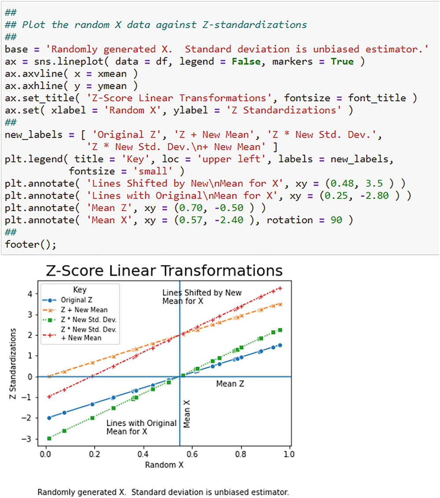
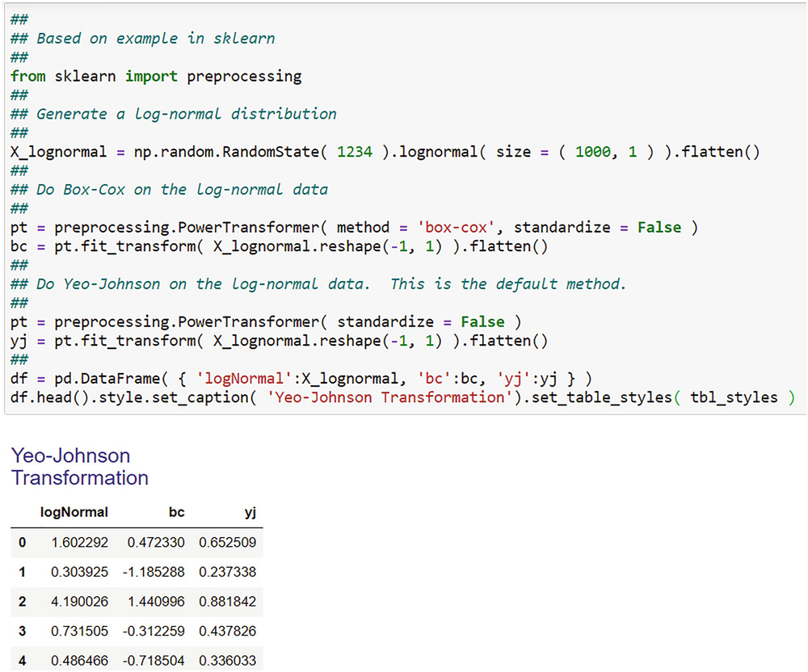

# 高级数据处理：预处理方法
沃尔特·R·帕茨科夫斯基1
(1)
数据分析公司，美国新泽西州普莱恩斯伯勒

数据科学新手面临的一个问题是超越他们所知道的唯一数据范式：教科书数据总是干净有序，没有问题或很少有问题，正如我在第 3 章开始时指出的那样。 不幸的是，现实世界的数据不符合这种范式。至少可以说，它们很混乱。它们有缺失值，相对于你需要做的事情来说是杂乱无章的，而且只是，嗯，一团糟。在完成任何有意义的工作之前，你必须处理或者更好的是预处理你的杂乱数据。我将讨论四个预处理任务：

1. 转型;
2. 编码；
3. 降维；
4. 缺失数据的识别和处理。

请注意，我列出了四个任务。作为提醒，并非所有都是必要的。你做哪一个取决于你的数据。预处理不应从字面上理解，因为即使在数据分析的中途，你也可能决定需要进行新的转换或需要进行新的编码。因此，你可能需要重新启动。业务数据分析是一个迭代过程，而不是线性过程。
转换和编码在将变量转换为其他东西的意义上是相同的。转换通过一个公式、一个方案或规则进行编码来做到这一点。转型产生新的尺度；编码是一种需要密钥才能理解并在必要时解开的代码。转换主要针对区间和比率数据并生成比率数据，而编码用于分类数据并为类别生成名义或有序代码。最后一点并不总是正确的，因为你可以将区间和比率数据编码到类别中，这个过程称为分箱。例如，你可以将年龄分类为年龄类别。这意味着编码也会将连续数据更改为分类数据，但这意味着对连续变量进行编码会隐藏原始值。这同样适用于编码分类数据。我将讨论的分类变量编码的一种形式是虚拟编码，它将变量的类别更改为一组新变量，但如果没有编码的键，你无法分辨原始变量的值。
降维将许多变量折叠成一个或几个新变量，这些变量捕捉或反映了原始变量的某些方面。这允许你用新的替换原始的。通常关注的方面是原始变量的方差，以便新的但较小的集合捕获大部分方差。这对于高维数据变得很重要，我将在下面讨论。当你估计（我稍后将称之为“训练”）线性模型时，高维数据会引入潜在问题。
缺失值始终是任何形式的实证研究的问题。至少可以说，关于这个主题的文献非常丰富。如此庞大的原因是缺失值可能会破坏我在第 4 章中讨论的模式和关系。它们可能会阻止你估计（即训练）模型，尤其是时间序列模型。对时间序列分析的影响尤其重要，因为时间序列必须是完整的。如果系列中有“漏洞”，那么你无法分辨出图案是什么。如果有小洞，这可能不会太繁琐，但是如果你有大量缺失值，那么你根本无法确定所有模式。而且，正如你将在第 7 章中看到的，模式，主要是滞后模式，对于时间序列分析很重要。

## 5.1 转换
数据转换是统计学及其子学科（如计量经济学）中一个古老的、发展良好的主题。参见，作为文献的部分列表：Tukey (1957), Tukey (1977), Morgenthaler (1997), Emerson and Stoto (1983), Mosteller and Tukey (1977), Carroll and Ruppert (1988), and Box and Cox （1964 年）。关于计量经济学中的变换应用，参见 Zarembka (1974)。 Box and Cox (1964) 参考文献特别重要，因为它介绍了广泛使用的 Box-Cox 变换。我将在下面讨论这种转变。
转换数据的三个原因。这些是为了消除或减少：
1. 数据分布的偏度；
2. 异常值及其影响；
3. 预测变量或解释变量之间的尺度差异。

变换分为两类：线性和非线性。线性变换保留了数据的分布特性，例如正态性。非线性变换不保留分布特性。

### 5.1.1 线性变换

我将讨论的第一个线性变换是你从基础统计学课程中知道的：标准化数据的 Z 变换。这是与标准正态分布一起教授的。基本上，你被教导将正态分布的随机变量 $$X \sim \mathcal {N}(\mu , \sigma ^2)$$ 标准化为 $$\mathcal {N}(0, 1)$$ 随机变量来解决简单的概率问题。标准化使用公式：
$$
\displaystyle \begin{aligned} \begin{array}{rcl}{} Z_i = \dfrac{X_i - \bar{X}}{SD_X} \end{array} \end{aligned}
$$
其中 Z~i~ 是观测 X~i~ 的标准化分数，i = 1, 2, ..., n, $$\bar {X}$$ 是 X 的样本均值，SD~X~ 是 X 的样本标准差。减去均值使数据居中，这样所有数据值已删除平均值。转换后的数据的平均值为零。这称为居中。很容易验证 。$$\bar {Z} = 0$$除以 SD~X~ 缩放数据，使得 Z~i~ 的方差调整为 1.0。这称为缩放。有关每种方法的简单演示，请参见附录。
(5.1.1) 中的标准差是随机变量方差 X 的平方根。方差是随机变量值与其算术平均值 $$\bar {X}$$ 的平方差之和的平均值。平方偏差为 $$\sum {(X_i - \bar {X})^2}$$。平均值的除数可以是 n 或 n − 1。后者通常用于基础统计学课程，因为它会产生真实总体方差 σ^2^ 的无偏估计，尽管通常没有提及。随着样本量变大，n 和 n − 1 之间没有区别。请参阅附录中的演示。
(5.1.1) 中的 Z 变换是一种线性变换，它保留了 X 的分布（均值和方差除外）和关系。将 (5.1.1) 重写为线性度如下
$$
\displaystyle \begin{aligned} \begin{array}{rcl}{} Z_i =\displaystyle \dfrac{1}{SD_X} \times X_i - \dfrac{\bar{X}}{SD_X} \end{array} \end{aligned}
$$

$$
\displaystyle \begin{aligned} \begin{array}{rcl} =\displaystyle \beta_0 + \beta_1 \times X_i \end{array} \end{aligned}
$$

其中 $$\beta _0 = - \dfrac {\bar {X}}{SD_X}$$ 和 $$\beta _1 = \dfrac {1}{SD_X}$$。由于 $$X \sim \mathcal {N}(\mu , \sigma ^2)$$，然后 $$Z \sim \mathcal {N}$$ 由法线的生殖属性。参见 Paczkowski (2018) 和 Dudewicz 和 Mishra (1988)。
在基本统计课程中很少讨论概率问题之外的标准化分数的使用，如果有的话。标准化超越了通常用一个随机变量表示的简单概率问题。它将多个变量放在相同的基础上，因此可以进行比较。因此，标准化用于两种类型的问题：一个变量的概率问题和涉及多个变量的比较问题。概率问题的优点是它们更容易用标准化变量解决。比较问题的优势在于，数据集中的所有变量都在相同的尺度上，一个变量不会压倒另一个变量，从而扭曲结果。如果这样做不是为了让所有变量都有平等的机会解释某事，那么一个变量的尺度与其他变量不一致可能仅仅因为尺度而占主导地位。事实上，如果你看 (5.1.1)，你会发现测量单位抵消了，所以 Z 是无单位的。例如，如果 X 以美元衡量，那么美元在 (5.1.1) 中取消，因为分子和分母都以美元衡量。
尽管 Z-Score 标准化以均值 0 和方差 1 为中心的数据，但你可能需要均值为 100 的值，因为它们可以被解释为以 100 为基数的索引值。许多人发现解释这些数据更容易。你可以更改均值和方差，但仅更改均值更为常见。随机变量 X 各值的一般变换语句为：
$$
\displaystyle \begin{aligned} \begin{array}{rcl} Z_i = \dfrac{X_i - \bar{X}}{SD_X} \times SD_X^{New} + \bar{X}^{New}{} \end{array} \end{aligned}
$$
其中 $$SD_X^{New}$$ 是新的标准差，$$\bar {X}^{New}$$ 是新的均值。例如，在 (5.1.4) 中设置 $$SD_X^{New} = 2$$ 和 $$\bar {X}^{New} = 100$$  将标准差设置为 2 并将数据中心设置为 100：

$$
\displaystyle \begin{aligned} \begin{array}{rcl} Z_i = \dfrac{X_i - \bar{X}}{SD_X} \times 2 + 100 \end{array} \end{aligned}
$$
(5.1.4) 是保持关系的线性变换。保留X的原始分布，使原始数据中的信息不变。但是，它并不能减少异常值的影响。
以同一基础分析中所有变量的标准化分数与主成分分析、支持向量机和聚类分析一起作为三个示例。决策树不需要它。我将在后面的章节中讨论这些方法，并在适当的时候使用标准化分数。
我在图 5.1 和图 5.2 中展示了随机变量 X 标准化的几种可能性。请注意，我使用 Numpy mean() 和 std() 函数计算 X 的平均值和标准差，每个函数都使用 X 作为参数。特别注意 std( ) 函数有一个额外的参数，ddof = 1。ddof 代表 delta 自由度，它确定样本方差计算的除数。然后自由度为 dof = n − ddof，其中 n 是样本大小。默认为 ddof = 0，因此除数为 n。正如我在附录中所展示的，这会导致总体方差的估计有偏差，尽管对于较大的 n，偏差会消失。对于小样本中的无偏估计，使用 ddof = 1 将除数设置为 n − 1。为什么 Numpy 使用 n？使用它是因为这会导致正态分布随机变量的总体方差的最大似然估计量。事实证明，作为估计方差的平方根的标准差，即使 ddof = 1，也是总体标准差的有偏估计量。只是方差是无偏的；不是标准差。

图 5.1 使用 (5.1.1) 和 (5.1.4) 对随机生成的数据集进行标准化。使用 Numpy 函数计算均值和标准差

图 5.2 此图表说明了图 5.1 中的 Z 变换。注意 X 和 Z 之间的线性关系
我在图 5.1 中“手动”（即以编程方式）计算了 Z 分数。我可以在 sklearn 的预处理包中使用缩放器。有两个，scale 和 StandardScaler，它们从根本上执行相同的操作，但也有区别。第一个，scale，接受一维数组或多维数组；即一个DataFrame。然后，它使用有偏的标准差作为除数返回标准化值。第二个，StandardScaler，只接受一个多维数组，即 DataFrame。它还使用有偏的标准差。 scale 函数不允许你重用缩放操作，而 StandardScaler 可以。这很重要，因为正如你将在第 9 章中学习的那样，你的数据集应该分为两个互斥且完全详尽的数据集，称为训练数据集和测试数据集。前者用于模型估计（更正式地说，它用于训练模型），而后者用于测试训练模型的预测能力。 StandardScaler 根据每个变量的均值和标准差独立地对训练数据集进行标准化，然后存储它们并使用它们来标准化测试数据。在操作上，你可以使用 StandardScaler 拟合或计算平均值和标准差，然后转换或标准化数据或同时执行这两种操作。你还可以使用简单结果 $$X_i = Z_i \times SD_X + \bar {X}$$ 反向标准化以返回原始数据。方法是 inverse_transform。我在图 5.3 中说明了预处理包的两个缩放器的使用。

图 5.3 使用 sklearn 预处理包 StandardScaler 对随机生成的数据集进行标准化。注意包是如何导入的以及标准化的步骤。在这个例子中，数据首先被拟合（即，首先计算平均值和标准差），然后使用带有参数 df 的单一方法 fit_transform 由 (5.1.1) 转换，DataFrame
另一种标准化形式 MinMax 标准化将数据重新编码为均匀分布在 [0, 1] 范围内。在这种情况下，新值可以乘以 100，因此它们也可以解释为从 0 到 100 的索引号。公式为：
$$
\displaystyle \begin{aligned} \begin{array}{rcl} X_i^{New}  = \displaystyle \dfrac{X_i - min(X)}{max(X) - min(X)} \end{array} \end{aligned} 
$$

$$
\displaystyle \begin{aligned} \begin{array}{rcl} = \displaystyle \dfrac{X_i - min(X)}{range(X)}{} \end{array} \end{aligned}
$$

其中 range(X) 是 X 值的范围。
这也是一种保留关系的线性变换，尤其是原始分布和异常值的形状。一个概括是：

$$
\displaystyle \begin{aligned} \begin{array}{rcl}{} X_i^{New} = \dfrac{X_i - X_{Min}}{X_{Max} - X_{Min}} \times (X_{Max}^{New} - X_{Min}^{New}) + X_{Min}^{New} \end{array} \end{aligned} 
$$
将 (5.1.7) 重写为线性度如下

$$
\displaystyle \begin{aligned} \begin{array}{rcl} X_i^{New} = \displaystyle \dfrac{X_i}{range(X)} - \dfrac{min(X)}{range(X)} \end{array} \end{aligned}
$$

$$
\displaystyle \begin{aligned} \begin{array}{rcl} = \displaystyle \beta_0 + \beta_1 \times X_i{} \end{array} \end{aligned} 
$$

β~0~ = −Min∕Range 和 β~1~ = 1∕Range。 (5.1.8) 中的概括允许你将新变量的最小值和最大值设置为任意数字。你可能希望在联合研究中使用它来重新调整估计的效用（称为部分价值），使其更具可解释性。有关联合研究和部分价值实用程序的背景信息，请参阅 Paczkowski (2018) 和 Paczkowski (2020)。我在图 5.4 中展示了如何使用 (5.1.7) 和 (5.1.8) 进行缩放。我还展示了标准化图 5.5。

图 5.4 使用 (5.1.7) 和 (5.1.8) 对随机生成的数据集进行标准化

图 5.5 此图说明图 5.4 中的 MinMax 标准化
与 sklearn Z-transformation 类似，还有一个 sklearn MinMaxScaler 预处理功能。它通过为新的最小值和最大值指定一个元组来处理（5.1.8）中的一般转换。默认值为 (0, 1)，即 (5.1.7)。它还将以与上述 StandardScaler 相同的方式同时进行拟合和转换以及数据反转。我在图 5.6 中说明了这一点。

这两种标准化方法存在一个共同问题：异常值的影响。 StandardScaler 依赖于被异常值扭曲的样本均值和标准偏差，扭曲的程度取决于它们的程度和大小。这种效果是众所周知的。异常值使分布偏斜：右偏分布将均值拉到标尺的高端；左偏分布则相反。因此，独立应用于数据集中每个变量的 Z 变换可能会产生失真的数据，这与你的预期相反。有关有趣的讨论，请参阅 sklearn 文档“比较不同缩放器对具有异常值的数据的影响”。该文档的结论是“StandardScaler …不能保证在存在异常值的情况下平衡特征缩放。”^1^ MinMaxScaler 也是如此。
StandardScaler 有一个替代方案，称为 RobustScaler。此缩放器背后的原理与 StandardScaler 相同，只是使用了稳健的百分位度量。中位数代替平均值，四分位距 (IQR) 代替标准差。这与 StandardScaler 和 MinMaxScaler 具有相同的拟合、变换和反转功能。方程是

$$
\displaystyle \begin{aligned} \begin{array}{rcl} Z_i^{Robust} = \displaystyle \dfrac{X_i - Median(X)}{IQR(X)} \end{array} \end{aligned}
$$
Median(X) 是 X 的中位数，IQR(X) 是 X 的四分位数范围。四分位数范围是第三个四分位数和第一个四分位数之间的差，涵盖 50% 的数据。
一个数据集可能有异常值并且不是倾斜的，而是对称的。分布的两个尾部都有异常值。而且，分布可能在一个尾部有异常值，这会使分布偏向另一侧。这意味着异常值和偏度之间的关系是复杂的。在多变量环境中，这是典型的 BDA 问题，一些可用的异常值检测方法是基于对称分布的数据。对于这种情况，多元高斯分布是最流行的分析工作。参见 Hubert 和 der Veeken (2008)。偏度对于低维而不是高维数据集也是一个问题，这是考虑我将在下面讨论的降维技术的另一个原因。有关此问题的评论，请参见 Hubert 和 der Veeken (2008)。

### 5.1.2 非线性变换

变换可能是非线性的。一种可能性是重新调整变量，使其值位于 [0, 1] 范围内，但总和为 1.0，使用：
$$
\displaystyle \begin{aligned} \begin{array}{rcl} X_i^{New} = \displaystyle \dfrac{e^{X_i}}{\sum_{j = 1}^n e^{X_j} }, i = 1, \ldots, n \end{array} \end{aligned} 
$$

$$
\displaystyle \begin{aligned} \begin{array}{rcl}{} \sum_i X_i^{New} = \displaystyle 1 \end{array} \end{aligned} 
$$

这是非线性的。 新值 可以解释为市场、偏好或钱包（即人们将花费多少）的概率或份额（即比例）。 在 MaxDiff 选择研究中，重新调整后的估计效用在使用此转换进行转换后更具可解释性。 有关 MaxDiff 选择研究的详细讨论，请参见 Paczkowski (2018)。 我在图 5.7 中提供了这种非线性变换的示例。

图 5.7 这是使用 (5.1.13) 进行非线性变换的示例
其他非线性变换是可用的。 例如，你可以将连续变量转换为（自然）对数刻度。 这是线性回归模型的一个优势，因为（自然）对数变量的估计系数被解释为弹性。
你可以通过将比例（解释为事件发生的概率）除以一减去该比例来转换比例。 这被解释为事件发生的几率。 几率是
$$
\displaystyle \begin{aligned} \begin{array}{rcl} O = \displaystyle \dfrac{p}{1 - p}{} \end{array} \end{aligned} 
$$
其中 p = Pr(Event) 是事件发生的概率。由于赔率是概率的函数，因此可以反转等式以根据事件发生的赔率来表达概率：

$$
\displaystyle \begin{aligned} \begin{array}{rcl} p = \displaystyle \dfrac{O}{1 + O} \end{array} \end{aligned}
$$
我在表 5.1 中展示了赔率和概率之间的关系，在图 5.8 中展示了非线性。几率的自然对数，称为对数几率或 logit，在我将在第 11 章讨论的逻辑回归模型中用作因变量。

图 5.8 这是一个使用 (5.1.14) 的非线性赔率变换的例子
表 5.1 当事件发生的概率为 0.5 时，事件发生的几率为 1.0。这通常表示为“1:1 的赔率”

| 事件概率 | 赛事赔率 |
| -------- | -------- |
| 0.0–0.5  | 0.0–0.5  |
| 0.5–1.0  | 1.0–∞    |

有时你有一个需要重新编码的李克特量表变量。例如，在客户满意度研究中，满意度通常采用 5 点李克特量表来衡量，1 = 非常不满意，5 = 非常满意。转换这些变量的一种方法是将它们转换为前两个框 (T2B) 或前三个框 (T3B)，如果分别使用 5 点或 10 点量表。 T2B 是量表上最低的两个点；这些被称为盒子。对于满意度研究，它们代表某人感到满意；其余的框，底部三个框（B3B），共同代表不满。同样，T3B是最高的三分。我将在后面的章节中演示这种转换。
### 5.1.3 一系列转换
Box 和 Cox (1964) 引入了一系列变换，称为变换的幂族，或简称为 Box-Cox 变换，适用于正数据。它被定义为

$$
\displaystyle \begin{aligned} \begin{array}{rcl} Y^{(\lambda)} = \begin{cases} \dfrac{Y^\lambda - 1}{\lambda} \quad  \lambda \neq 0 \\ \ln{Y} \quad  \lambda = 0 {} \end{cases} \end{array} \end{aligned}
$$
λ 是必须估计的变换功率。有关使用最大似然法估计 λ 的一些讨论，请参见 Zarembka (1974)。 (5.1.16) 的自然对数部分来自

$$
\displaystyle \begin{aligned} \begin{array}{rcl} \lim_{\lambda \rightarrow 0} {(Y^\lambda - 1)}/{\lambda} =\displaystyle \lim_{\lambda \rightarrow 0} {(e^{\lambda \times \ln{Y}} - 1)}/{\lambda}. \end{array} \end{aligned}
$$
取分子关于 λ 的一阶导数和分母关于 λ 的一阶导数，并应用 L'Hopital 规则：$$\lim _{\lambda \rightarrow 0} \ln {Y} \times e^{\lambda \times \ln {Y}} = \ln {Y}$$。使用模拟数据的示例见图 5.9，前后对比图 5.10改造对比。此转换用于将任何分布转换为更正态的分布，从而允许你使用依赖正态性的传统假设检验程序。这就解释了为什么在需求分析中经常使用自然对数转换。参见 Coad (2009) 和 Paczkowski (2018)。

图 5.9 这说明了随机模拟对数正态数据的 Box-Cox 变换

图 5.10 比较了数据的对数正态分布和 Box-Cox 变换的直方图
使用 Box-Cox 变换的一个限制是 Y 值必须全部大于零。在涉及销售、价格、生产、发货等的必须 BDA 研究中，这种情况不是问题。但是，在某些情况下，这可能是一种限制。例如，你可能会被要求分析销售额减去退货后的净销售额，即销售额减去退货单位。退回产品的原因包括：制造缺陷；不符合客户的期望（例如，质量、尺寸、颜色、形状）；运送的产品不正确；交货太晚，无法满足客户的需求；或者客户改变了他/她的想法来提几个。如果回报足够高，那么净销售额可能为负数。另一个例子是收入，通常用作关键绩效指标 (KPI)。总收入或总收入只是价格乘以销售量：TR = P × Q。这是一个正数。然而，这一总收入并不是唯一的收入。有总收入、开票收入（已开票但尚未入账的收入，因此处于待处理状态）、入账收入（即已收到并入账的收入）、未入账收入（即已收到但尚未入账）和净收入的回报。不要忘记税前和税后收入！这些都可能属于营业收入的总称：销售收入。还有非营业收入：非销售活动产生的收入（例如，特许权使用费、利息收入、物业租金）。 Box-Cox 变换不适用于净收入，因为它可能是负数。
Yeo 和 Johnson (2000) 提出了在 sklearn 预处理模块中实现的修改。此转换处理要转换的变量的负值。它被定义为
$$
\displaystyle \begin{aligned} \begin{array}{rcl} \Psi(Y, \lambda) = \begin{cases} \dfrac{(Y + 1)^\lambda - 1}{\lambda} \quad  \lambda \neq 0, Y \geq 0 \\ \ln{(Y + 1)} \quad  \lambda = 0, Y \geq 0 \\ \dfrac{-\left[(-Y + 1)^{2 - \lambda} -1 )\right]}{2 - \lambda} \quad  \lambda \neq 2, Y < 0 \\ - \ln{(-Y + 1)} \quad  \lambda = 2, Y < 0 \end{cases} \end{array} \end{aligned}
$$
对于 Box-Cox 情况，使用最大似然法从数据中估计 λ。参见 Yeo 和 Johnson (2000)。我在图 5.11 中说明了这种转换。这是 sklearn 中的默认设置。另请参见图 5.12。

图 5.11 这说明了 Box-Cox 变换的 Yeo-Johnson 变换替代方案。这里使用与图 5.9 相同的对数正态分布数据

图 5.12 比较该数据的对数正态分布、Box-Cox 变换和 Yeo-Johnson 变换的直方图

## 5.2 编码

根据变量的性质，有几种变量编码方案。如果它是分类记录为文本的类别，则在使用之前必须将文本转换为数值。统计、计量经济学和机器学习方法不是对文本本身进行操作，而是对数字进行操作。将文本类别转换为数字的一种方法是通过虚拟编码，在机器学习中也称为单热编码。你还可以对类别进行标签编码，这意味着你只需将序数值分配给按字母数字排序的类别标签。即使分配的值是序数，但这并不意味着它们代表类别的序数性质。它只是类别到数字的方便映射。这些类别可能有也可能没有序数解释。
如果变量不是分类变量而是数字变量，你可能仍希望对其进行分类以便于分析，因为这些类别可能比原始连续值提供更多信息和有用。年龄和收入就是例子：按青少年、年轻人、中年和老年人对人进行分类比仅以年龄为单位提供更多信息；按照低收入、中等收入和高收入对人进行分类也是如此。

### 5.2.1 虚拟或 One-Hot 编码

你可能熟悉统计学课程中的虚拟变量，或者你可能在计量经济学建模方面做过的一些工作。虚拟变量是一种编码形式：将数值分配给分类变量的级别。分类变量是一个概念，它不是用数字衡量的，而是经常用以下词语来描述的：

- 性别;
- 买/不买；
- 赞成/反对；
- 地区（例如，美国人口普查、市场营销、世界）；
- 营销细分。

形式上，分类变量具有作为分类概念的离散类别的类别。这些是相互排斥的，而且是完全详尽的。例如，一家公司的营销部门会将国家划分为多个区域，并且概念变量“区域”将具有与每个区域相对应的级别（完全详尽），并且任何客户将仅位于这些区域中的一个（互斥）。我在表 5.2 中列出了一些分类变量及其水平。请注意，这些具有离散的、互斥的级别，并且级别的集合是完全详尽的。
表 5.2 这些是在业务分析问题中可能遇到的一些分类变量

| 变量/概念                      | 级别或类别           | #级别 |
| ------------------------------ | -------------------- | ----- |
| Gender                         | Male/Female          | 2     |
| Purchase                       | Yes/No               | 2     |
| Opinion                        | Favor/Oppose         | 2     |
| Product returned               | Yes/No               | 2     |
| Credit classification          | Good/Medium/Rejected | 3     |
| Customer classification        | Excellent/Good/Poor  | 3     |
| Marketing regions: U.S. Census | MW, NE, S, W         | 4     |
| Marketing regions: world       | Continents           | 7     |

由于分类变量代表概念，因此它们本质上是非数字的。所有统计、计量经济学和机器学习方法都需要数字数据。分类变量必须编码为数值变量。这本身不是转换，而是创建了一组全新的变量。编码可以通过多种方式完成。最常见的被称为：

- one-of-K;
- one-hot;
- dummy encoding.

“虚拟编码”是计量经济学中的一个流行标签，而“单热编码”在机器学习中对于相同的编码很流行。^2^ 我可以互换使用这两个术语。作为此编码的一个示例，假设美国的四个人口普查区域——中西部 (MW)、东北 (NE)、南部 (S) 和西部 (W)——对应于你的营销区域。 “营销区域”概念的 one-hot 编码是
$$
\displaystyle \begin{aligned} \begin{array}{rcl} D_{i1}  = \displaystyle \begin{cases} 1, \displaystyle \text{if {$i \in $} MW} \\ 0, \text{otherwise}{} \end{cases} \end{array} \end{aligned}
$$
使用指示函数，这些更紧凑地写为：$$\mathbb {I}(MW)$$, $$\mathbb {I}(NE)$$,  $$\mathbb {I}(S)$$, $$\mathbb {I}(W)$$。回想一下，指示函数根据其参数的评估返回二进制结果（0 或 1）。它被定义为：

$$
\displaystyle \begin{aligned} \begin{array}{rcl} D_{i2} = \displaystyle \begin{cases} 1, \displaystyle \text{if {$i \in $} NE} \\ 0,  \text{otherwise}{} \end{cases} \end{array} \end{aligned}
$$
例如，如果该地区是中西部，则指示符函数 $$\mathbb {I}(MW)$$ 返回 1，否则返回 0。这是我经常使用的紧凑符号。
正如 Paczkowski (2021b) 所指出的，指标函数可以使用集合符号来编写：
$$
\displaystyle \begin{aligned} \begin{array}{rcl} \mathbb{I}_A(x) = \begin{cases} 1   \quad  \text{if {$x \in A$}} \\ 0  \quad  \text{if {$x \notin A$}} \end{cases} \end{array} \end{aligned}
$$
其中 A 是一组元素。然后：

$$
\displaystyle \begin{aligned} \begin{array}{rcl} \mathbb{I}_{A \cap B}(x) = \displaystyle min(\mathbb{I}_A(x), \mathbb{I}_B(x)) \end{array} \end{aligned}
$$

$$
\displaystyle \begin{aligned} \begin{array}{rcl} = \displaystyle \mathbb{I}_A(x) \cdot \mathbb{I}_B(x) \end{array} \end{aligned} 
$$

和
$$
\displaystyle \begin{aligned} \begin{array}{rcl} \mathbb{I}_{A \cup B}(x) = \displaystyle max( \mathbb{I}_A(x), \mathbb{I}_B(x)) \end{array} \end{aligned}
$$

$$
\displaystyle \begin{aligned} \begin{array}{rcl} = \displaystyle \mathbb{I}_A(x) \cdot \mathbb{I}_B(x) - \mathbb{I}_A(x) \cdot \mathbb{I}_B(x) \end{array} \end{aligned}
$$

基于集合论中交集和并集的定义。
此外，正如 Paczkowski (2021b) 所指出的，列表推导可以模拟指标函数。例如，$$\mathbb {I} = [~1 \text{ if } x > 3 \text{ else } 0 \text{ for x in range( 5 ) }]$$  个匹配项

顺便说一句，范围函数返回值 0、1、2、3、4，因为 Python 是从零开始的。
请注意，(5.2.1)-(5.2.4) 中定义了四个虚拟变量。并非所有这些都是必需的或可以用于线性模型，原因有两个。首先，这是不切实际的，因为所有假人中包含的信息与子集中的信息相同。如果有 J 个级别，因此创建了 J 个虚拟变量，则子集是 J − 1 个虚拟变量。所有假人所传达的内容都存在冗余。使用上面的虚拟编码，如果观测值位于中西部，则中西部地区的虚拟值 D ~i1~ 为 1，而其他三个区域的值为 0。因此，知道 D~i1~ = 1 立即告诉你其他三个为 0。同样，如果观察是针对南部地区，则 D ~i3~ = 1 并且你立即知道其他三个都是 0。知道一个虚拟变量的值可以告诉你其他三个的值。然后，你可以安全地放下一个假人，并获得与你保留所有假人完全相同的信息。因此，J − 1 个虚拟变量的子集。包括所有虚拟变量可能会导致你进入虚拟变量陷阱。见古吉拉特语（2003 年）。
第二个原因更重要。通过使用线性模型中的所有假人，一个包含截距的模型，3 然后所有假人的线性组合恰好等于截距变量的值。对于每个观察，截距变量等于 1.0，并乘以截距参数。虚拟变量的线性组合，每个虚拟变量乘以等于 1 的系数，正好等于这个截距变量。结果，你将拥有完美的多重共线性，这种情况会阻止你估计线性模型的参数。简而言之，你还有另一种冗余情况，这次是在所有虚拟变量和截距变量之间；它们都具有相同的值：1.0。
解决这两个问题的方法是选择一个假人来丢弃。这称为基准或参考假人。消除了假人和截距变量之间的冗余。对于区域示例，中西部按字母数字顺序排在第一位，因此它可能是基地。这是我将在第 6 章中演示的 Statsmodels 自动做出的选择。其他软件自动使用字母数字顺序中的最后一个。你可以选择任何假人作为基础，但这是特定于问题的。多重共线性是一个重要的话题，尤其是在使用大型、高维数据集的 BDA 中。当数据集具有大量变量或特征时，它是高维的。因此，其中一些特征相关的可能性很高。我将在第10章讨论这个问题。 有关多重共线性的讨论，请参见 Gujarati (2003) 和 Greene (2003)。另见贝尔斯利等人。 (1980) 用于多重共线性的技术讨论和诊断检查。
根据你的数据在 Pandas DataFrames 或 Numpy 数组中的存储方式以及你将如何使用它们，使用不同的方法对变量进行 one-hot 编码。我建议你始终使用 Pandas 来管理你的数据，因此我将专注于使用带有 Pandas 函数和 sklearn 函数的 DataFrame 对分类变量进行编码。

#### 5.2.1.1 Pandas 虚拟编码

对于 Pandas 中的分类变量，你可以使用 Pandas 函数 get_dummies。这是最方便的方法。它需要几个参数，但最重要的是：

- DataFrame 名称（必需的第一个位置参数）；
- 列，作为一个列表，编码（默认是编码具有对象或类别数据类型的所有列）；
- 基数（指示是否按字母数字顺序删除第一级；默认为 False）；和
- 如何处理缺失的 (NaN) 值（也对它们进行编码；默认值：不编码）

有关更多参数，请参阅 Pandas get_dummies 文档。

#### 5.2.1.2 sklearn 虚拟编码

sklearn 预处理模块具有 OneHotEncoder 函数，该函数对变量或一组变量进行虚拟化。使用此编码器有一个两步过程，这与 Pandas 的 get_dummies 函数不同，后者仅将 DataFrame 名称作为参数。 OneHotEncoder 首先需要实例化。这意味着你必须创建该函数的实例。该函数是一类仅位于计算机内存中的代码。你必须先激活它才能使用它；这个激活就是实例化。这涉及调用函数并为其分配名称。对于 OneHotEncoder，一个典型的名称是 ohe。在调用它的过程中，你可以为其参数分配值或仅使用默认值（如果有）。一旦函数被实例化，你可以通过将方法链接到分配的名称来使用它。对于 OneHotEncoder，最常用的方法是

- fit;
- transform;
- fit_transform;
- inverse_transform.

fit 方法计算转换所需的任何统计数据或值并存储它们，但它不执行转换。 transform 方法使用存储的值并进行转换。 fit_transform 方法在一次调用中同时执行这两种方法，并且通常使用而不是其他两种方法。我之前介绍过这三个。 inverse_transform 方法反转转换并恢复原始数据。 OneHotEncoder 的输入是一个类似数组的对象，通常是一个 Numpy 数组，由整数或字符串组成，例如区域名称（图 5.12）。

### 5.2.2 Patsy 编码

Patsy 是一个统计公式系统，允许你将建模公式（例如 OLS 线性模型）指定为文本字符串。然后可以在 statsmodels 建模函数中使用该字符串。 Patsy 系统的一个重要组成部分是 C(·) 函数，该函数将分类变量作为参数并适当地对其进行虚拟化。我将向你展示它在第 6 章中的使用示例。

### 5.2.3 标签编码

你可能只需要为分类变量的级别分配名义或有序值。当虚拟变量不合适时，可能会发生这种情况。例如，美国人口普查区域名义上可以按字母数字顺序编码为：中西部 = 1，东北部 = 2，南部 = 3，西部 = 4。管理级别可以按顺序编码：入门级 = 1，中级 = 2，执行= 3。这称为标签编码。当我在第 11 章讨论决策树时，你会看到这个应用。 

### 5.2.4 数据二值化

你可能有要根据阈值转换为虚拟值的数字数据（即浮点数或整数）。任何小于阈值的值都被编码为 0；否则， 1. 例如，你可能有员工服务年限的数据。任何小于5年的都被编码为0；否则，它们被编码为 1。sklearn Binarizer 函数执行此操作。它的参数是一个类似数组的对象和一个阈值。默认阈值为 0.0。这个函数也有 fit、transform 和 fit_transform 方法，但是 fit 方法真的什么都不做。没有 inverse_transform 方法。我在图 5.13 中展示了一个示例。

图 5.13 几个连续或浮点数变量或特征可以名义上基于阈值进行编码。大于阈值的值被编码为 1；否则为 0。在此示例中，阈值为 5
这种类型的编码有时用于更容易解释连续变量。但这样做是有代价的：信息丢失。从数据中提取信息，尤其是丰富信息，是 BDA 的目标，但这种编码可能会适得其反。丢失的信息是连续数据的分布，包括偏度、位置和分布的任何指示，以及趋势、模式、关系和异常。这些可能很重要且有见地，但被此编码器隐藏。
使用 sklearn 的 KBinDiscretizer 的另一种 bin 编码形式允许你通过将每个特征的值分配到 b > 2 互斥且完全穷举的 bin 中的一个来进行编码。默认值为 b = 5 个 bin。编码基于三个参数：

1. 箱数（默认为 5）；
2. 编码类型（默认：onehot）；
3. 编码策略（默认值：分位数）。

使用的编码类型是 one-hot（默认）、one-hot dense 和 ordinal。 one-hot 和 one-hot 密集编码的区别在于前者返回稀疏数组，后者返回密集数组。稀疏数组有许多零，如果有效利用或处理这些零，可以提高计算效率。这种处理涉及不存储零并且不在计算中使用它们。密集数组有零，但没有一个与非零值不同。稀疏数组在 BDA 中很常见，例如在文本处理中，创建了一个称为文档术语矩阵 (DTM) 的数组，其中包含文档中单词或标记的出现频率，但并非所有单词都出现在每个文档中。这些不出现的情况用零表示。有关备用和密集矩阵的详细讨论，请参阅 Duff 等人。 （2017）。
KBinDiscretizer 也有四种方法：fit、transform、fit-transform 和 inverse_transform。
序数编码是一组以零为基数的有序整数。这意味着它们的值是 0, 1, 2, ...。策略是如何开发编码。它可以是统一的、分位数的或 kmeans。 uniform 策略返回等宽的 bin；分位数返回具有相同数量数据点的箱；和 kmeans 返回具有相同最近中心的 bin。后一种策略基于我在第 12 章中讨论的 K-Means 聚类。
这种编码形式与我上面描述的信息问题相同。我在图 5.14 中说明了这种类型的编码。有一种方法可以反转这种编码。请参阅 sklearn 文档。

图 5.14 几个连续或浮点数变量或特征按顺序编码。请注意，使用了 fit_transform 方法
最后两个创建 bin 的函数是 Pandas cut 和 qcut 函数。 cut 函数“将变量的值分配给你定义的 bin 或相同数量的 bin。”此外，“如果你将 bin 指定为列表 [18, 40, 60, 110]，则 Pandas 会将这些 bin 解释为 (18, 40]、(40, 60] 和 (40, 100])。注意大括号符号. 这是半开区间的标准数学符号，在这种情况下在左侧开。这意味着不包括左侧值但包括右侧值；包括右侧值是默认值。因此，区间 (18, 40] 被解释为 18 < age ≤ 40。你可以在 cut 函数中使用参数 right = False 和使用 include_lowest = True 更改包含的右值。函数 qcut 与 cut 执行相同的操作，但使用基于分位数的分箱。分位数可以是分位数的数量（例如，10 个用于十分位数，4 个用于四分位数）或一组分位数（例如 [0, 0.25, 0.50, 0.75, 1.0]）。”来自 Paczkowski (2021b) . 另见 McKinney (2018) 的讨论和示例。

## 5.3 降维
另一个常见问题，尤其是我之前提到的高维数据集，是包含几乎相同信息的变量太多。这就是我上面讨论的多重共线性问题。从技术上讲，这种高度线性关系的含义是，当共线性完美时，无法估计线性模型的参数。一种解决方案是折叠数据的维度，这意味着将变量折叠为一些最重要的新变量。重要性的衡量标准是数据的方差。具体来说，创建新变量使得第一个（称为第一主成分）占方差的大部分。创建的下一个变量，称为第二主成分，占第一个主成分未捕获的方差的下一个最大量，并且独立于该第一个成分。独立性很重要，因为回想一下，问题是高维数据中原始变量之间的多重共线性或线性关系。你想删除此限制所做的依赖关系。每个后续的新变量都说明了下一个方差量，并且独立于前面的新变量。
如果有 p 个原始变量，那么最多有 p 个新变量。通常，只保留前几个（可能是两个）主成分，因为它们占原始数据的大部分方差。这些新的、相互正交的主成分可用于线性模型，通常称为主成分回归。
使用称为奇异值分解 (SVD) 的矩阵分解方法提取主成分.^4^ 这是在许多数据分析过程中使用的非常重要的方法，你将在本书的其他地方看到。从根本上说，SVD 将一个 n × p 矩阵分解为三个部分，它们本身就是矩阵。我将这三个矩阵称为左矩阵、中心矩阵和右矩阵。如果 X 是 n × p 数据矩阵，那么 X 的 SVD 是
$$
\displaystyle \begin{aligned} \begin{array}{rcl} \mathbf{X} = \mathbf{U \Sigma V}^{\top} \end{array} \end{aligned}
$$
其中 U 是一个 n × n 正交矩阵，使得 U ^⊤^ U = UU ^⊤^ = I ~n~ 其中 I ~n~ 是 n × n 单位矩阵； Σ 是一个 n × r 对角矩阵； V ^⊤^ 是一个 r × p 正交矩阵，使得 V ^⊤^ V = VV ^⊤^ = I ~p~ 其中 I ~p~ 是 p × p。
正如 Paczkowski (2020) 所指出的，“如果两个向量的内积或点积为零，则它们是正交的。两个向量a和b的内积为$$\mathbf {a} \cdot \mathbf {b} = \sum _{i = 1}^n a_i \times b_i$$，如果a ⋅b = 0，则这两个向量正交。这相当于说它们相互垂直，或者两个向量夹角的余弦为零。”有关矩阵和 SVD，请参见 Lay (2012)、Strang (2006) 和 Jobson (1992)。另请参阅 Paczkowski (2020) 讨论在文本分析和新产品开发中使用 SVD。

## 5.4 处理缺失数据

丢失数据始终是一个问题，而且是一个大问题。你必须确定：

1. 哪些特征有缺失值；
2. 缺失的程度；
3. 失踪原因；
4. 如何处理它们。

第一个和第二个是使用 Pandas 的 info() 方法处理的。这是通过将 info() 链接到 DataFrame 名称来调用的。返回的报告列出了 DataFrame 中的每个特征、特征的数据类型（int64、object、float64 和 datetime64[ns]）、5 非空计数（即没有缺失值的记录数）以及信息关于索引和内存使用情况。
另一种方法是创建具有一个参数的缺失值报告函数：DataFrame 名称。我创建了这样一个函数，如图 5.15 所示。此函数依赖于为 DataFrame 提供访问器 stb 的包 sidetable。访问器有一个名为 missing 的函数，它计算一些缺失值信息。这些被放入 DataFrame 并显示。我在图 5.16 中展示了这个函数的典型显示。使用 pip install sidetable 或 conda install -c conda-forge sidetable 安装包 sidetable。

图 5.15A 使用包侧表的缺失值报告功能。此函数还依赖另一个函数 get_df_name 来检索 DataFrame 名称。示例报告如图 5.16 所示

图 5.16 使用图 5.15 中功能的缺失值报告功能
第三个问题很难。数据缺失的原因有很多。对于非常大的高维数据集，原因可能会变得不堪重负。然而，更重要的是，通常用于 BDA 问题的数据是次要的，这表明你可能永远不知道缺失的原因。数据收集不在你的掌控之中；你无法控制。你可以向 IT 部门询问丢失的原因，并希望这些原因会记录在数据字典中。不幸的是，情况往往并非如此。参见 Enders (2010) 对缺失数据的很好处理。
最后一个问题也是一个挑战。有两种选择：

1. 删除有缺失值的记录；
2. 估算缺失值。

Pandas 有一个简单的方法 dropna，它可以删除任何缺失值的行（axis = 0，默认值）或列（axis = 1）。缺失值记录为 NaN。由于这是一个方法，它被链接到 DataFrame 名称。这可以在特定列上进行子集化。
使用这种方法存在问题。如果你的数据是时间序列，则删除记录会导致时间序列中断。时间序列的一个核心特征是没有中断，尽管在许多实际情况下，它们是不可避免的。例如，天气事件、罢工、生产故障、流行病、内乱等导致市场、生产、交付和其他活动停止。因此，不会收集受影响时间段的数据。但这些是自然事件（当然不是全部），它们与你因缺失值而丢弃记录不同。此外，如果你有一个小数据集，那么除了引入的中断之外，删除记录会进一步减少你的数据集。如果删除了太多记录，那么估计（即“训练”）就会受到威胁。
删除记录的替代方法是估算或填充缺失值。 Pandas 有一个 fillna 方法，允许你指定估算缺失值的方式：使用标量（例如 0）、使用值字典、Series 或其他 DataFrame。你可以明确指定该值，也可以从 DataFrame 中的其他值计算它，无论是在具有缺失值的特征中还是在特征组合中。例如，你可以计算特征的样本均值并将该均值用作标量。为此，你可以使用 x_mean = df.X.mean( ) 后跟 df.X.fillna( x_mean, inplace = True ) 或 df.X.fillna( df.X.mean( ), inplace = True ) 其中“X”是 df 中具有缺失值的特征。你还可以指定要填充的轴（对于行，轴 = 0，对于列，轴 = 1）。另一种可能性是 interpolate 方法，默认情况下，对缺失值进行线性插值。
sklearn 包在其 impute 模块中有一个名为 SimpleImputer 的函数，用于替换缺失值。此函数不对 DataFrame 进行操作，而是对 Numpy 数组进行操作。此函数是使用 from sklearn.impute import SimpleImputer 导入的。至于编码器，你首先实例化插补器，在这种情况下，使用参数来指定插补策略（即插补方式）和识别缺失值的缺失值代码。代码指定为 int、float、str、np.nan 或 None，默认等于 np.nan。该策略是一个字符串，例如“mean”、“median”、“most_frequent”（用于字符串或数字数据）或“constant”。如果使用“常量”，则需要指定另一个参数，fill_value 为字符串或数值；默认值为None，等于0。实例化后，你可以使用我在其他上下文中提到的四种方法中的任何一种：fit、transform、fit_transform 和 inverse_transform。它们的参数是要估算的数组。

## 5.5 附录

在本附录中，我总结并演示了我在本章中提到的一些统计概念。

### 5.5.1 标准化变量的均值和方差

为了证明 (5.1.1) 中标准化变量的平均值为零，让
$$
\displaystyle \begin{aligned} \begin{array}{rcl} Z_i = \dfrac{X_i - \bar{X}}{SD_X} \end{array} \end{aligned}
$$
对于随机变量 X~i~, i = 1, 2, ..., n。那么，均值是

$$
\displaystyle \begin{aligned} \begin{array}{rcl} \bar{Z} = \displaystyle \dfrac{1}{n \times SD_X} \times \sum_{i = 1}^n (X_i - \bar{X}) \\ = \displaystyle 0 \end{array} \end{aligned} 
$$
从$$\sum _{i = 1}^n (X_i - \bar {X}) = 0$$开始。
为了证明 (5.1.1) 中标准化变量的方差为 1，请注意
$$
\displaystyle \begin{aligned} \begin{array}{rcl} V(Z) = \displaystyle \dfrac{\sum_{i = 1}^n (Z_i - \bar{Z})^2}{n - 1} \\ =\displaystyle \dfrac{1}{n - 1} \times \sum_{i = 1}^n Z_i^2 \\ =\displaystyle \dfrac{1}{n - 1} \times \sum_{i = 1}^n \dfrac{(X_i - \bar{X})^2}{SD_X^2} \\= \displaystyle \dfrac{n - 1}{(n - 1) \times SD_X^2} \times \dfrac{\sum_{i = 1}^n (X_i - \bar{X})^2}{n - 1} \\ = \displaystyle 1 \end{array} \end{aligned}
$$

### 5.5.2 调整后标准化变量的均值和方差

(5.1.4) 的平均值是使用
$$
\displaystyle \begin{aligned} \begin{array}{rcl} \bar{Z}=\displaystyle \dfrac{1}{n} \times \sum_{i = 1}^n Z_i \\=\displaystyle \dfrac{1}{n} \times \sum_{i = 1}^n \left(\dfrac{X_i - \bar{X}}{SD_X} \times SD_X^{New} + \bar{X}^{New}\right) \\=\displaystyle \dfrac{SD_X^{New}}{n \times SD_X} \times \sum_{i = 1}^n (X_i - \bar{X}) + \dfrac{1}{n} \sum_{i = 1}^n \bar{X}^{New} \\=\displaystyle \bar{X}^{New} \end{array} \end{aligned} 
$$
(5.1.4) 的方差是使用

$$
\displaystyle \begin{aligned} \begin{array}{rcl} V(Z)=\displaystyle \dfrac{1}{n - 1} \times \sum_{i = 1}^n (Z_i - \bar{Z})^2 \\=\displaystyle \dfrac{1}{n - 1} \times \sum_{i = 1}^n \left(\dfrac{X_i - \bar{X}}{SD_X} \times SD_X^{New} + \bar{X}^{New} - \bar{X}^{New}\right)^2 \\=\displaystyle \dfrac{\left(SD_X^{New}\right)^2}{SD_X^2} \times \dfrac{\sum_{i = 1}^n (X_i - \bar{X})^2}{n - 1} \\=\displaystyle \left(SD_X^{New}\right)^2. \end{array} \end{aligned}
$$

### 5.5.3 μ和σ^2^的无偏估计量

总体参数 θ 的估计量在以下情况下是无偏的
$$
\displaystyle \begin{aligned} \begin{array}{rcl} E\left(\widehat{\theta}\right) = \theta \end{array} \end{aligned} 
$$
也就是说，如果一个估计量等于“从长远来看，平均而言”的参数的真实值，它就是无偏的。从本质上讲，你高估和低估参数真实值的数量只是平衡，因此估计值平均是正确的。当 $$E\left (\widehat {\theta }\right ) \neq \theta $$ 时，你有一个有偏见的衡量标准。
如果 X~i~, i = 1, 2, ..., n 是独立同分布随机变量 (iid)，均值为 E(X) = μ，方差为 E(X − μ)^2^ = σ^2^，则.这很容易显示：
$$
\displaystyle \begin{aligned} \begin{array}{rcl} E(\bar{X})=\displaystyle \dfrac{1}{n} \times E(\sum_{i = 1}^n X_i) \\=\displaystyle \dfrac{1}{n} \times \sum_{i = 1}^n E(X_i) \\=\displaystyle \dfrac{1}{n} \times n \times \mu \\=\displaystyle \mu \end{array} \end{aligned}
$$

现在考虑总体方差 σ^2^ 的样本估计量 s^2^。你想要 E(s^26) = σ^26 以便 s^2^ 是 σ^2^ 的无偏估计量。在表现出不偏不倚之前，请注意：
$$
\displaystyle \begin{aligned} \begin{array}{rcl} X_i=\displaystyle X_i + 0 + 0 \\ =\displaystyle X_i - \bar{X} + \bar{X} - \mu + \mu \\ X_i - \mu=\displaystyle X_i - \bar{X} + \bar{X} - \mu \\=\displaystyle (X_i - \bar{X}) + (\bar{X} - \mu). \end{array} \end{aligned}
$$
两边平方，你得到：
$$
\displaystyle \begin{aligned} \begin{array}{rcl} (X_i - \mu)^2=\displaystyle (X_i - \bar{X})^2 + (\bar{X} - \mu)^2 + 2 \times (X_i - \bar{X})(\bar{X} - \mu) \end{array} \end{aligned}
$$

总结和重新排列，你得到

$$
\displaystyle \begin{aligned} \begin{array}{rcl} \sum{(X_i - \bar{X})}^2=\displaystyle \sum{(X_i - \mu)}^2 - \sum{(\bar{X} - \mu)}^2 \end{array} \end{aligned}
$$
留作练习以证明叉积之和为零。
现在定义另一个估计器 $$\tilde {s}^2 = \dfrac {\sum (X - \bar {X})^2}{n}$$。注意除数是 n，即样本大小。然后
$$
\displaystyle \begin{aligned} \begin{array}{rcl} E(\tilde{s}^2)=\displaystyle E\left[\dfrac{\sum(X - \bar{X})^2}{n}\right] \\=\displaystyle E\left[\dfrac{\sum(X - \mu)^2}{n}\right] - E\left[\dfrac{\sum(\bar{X} - \mu)^2}{n}\right] \\=\displaystyle \dfrac{n \sigma^2}{n} - \dfrac{n \dfrac{\sigma^2}{n}}{n} \\=\displaystyle \sigma^2 - \dfrac{\sigma^2}{n} \\=\displaystyle \sigma^2\left(\dfrac{n - 1}{n}\right) &lt; \sigma^2 \end{array} \end{aligned} 
$$
因此，$$\tilde {s}^2$$ 是一个有偏的估计量。对于无偏估计量，将 s^2^ 定义为

$$
\displaystyle \begin{aligned} \begin{array}{rcl} s^2=\displaystyle \left(\dfrac{n}{n - 1}\right) \tilde{s^2} \\=\displaystyle \dfrac{\sum(X - \bar{X})^2}{n - 1} \end{array} \end{aligned} 
$$
这是在基础统计学课程中教授的估算器。请注意，$$\lim  \limits _{n \to \infty } \left ( \dfrac {n}{n - 1} \right ) = 1$$ 因此对于大 n，s^2^ 和 $$\tilde {s^2}$$ 之间没有区别。对样本方差使用除数 n − 1 会产生总体方差的无偏估计量。

## 参考
- Belsley、D.A.、E. Kuh 和 R.E.威尔士。 1980. 回归诊断：识别有影响的数据和共线性的来源。纽约：威利。
- Box、G. 和 D. Cox。 1964. 转型分析。皇家统计学会杂志，26：211-252。 B系列。
- 卡罗尔，R.J.和 D. 鲁珀特。 1988. 回归中的转换和加权。伦敦：查普曼和霍尔。
- Coad, A. 2009。关于产品价格和质量的分布。进化经济学杂志 19, 589–604。
- Dudewicz, E.J.和 S.N.米什拉。 1988. 现代数理统计。纽约：威利。
- Duff、I.S.、A. Erisman 和 J.K.里德。 2017. 稀疏矩阵的直接方法。第 2 版。数值数学和科学计算。牛津：牛津大学。
- Emerson, J.D. 和 M.A. Stoto。 1983. 了解稳健和探索性数据分析，转换数据一章，97-128。纽约：威利。
- 恩德斯，C.K. 2010. 应用缺失数据分析。纽约：吉尔福德出版社。
- 格林，W.H. 2003. 计量经济分析。第 5 版。恩格尔伍德：普伦蒂斯霍尔。
- Gujarati, D. 2003。基础计量经济学。第 4 版。纽约：麦格劳-希尔/欧文。
- Hubert, M. 和 S.V.德维肯。 2008. 偏斜数据的异常值检测。化学计量学杂志 22（3），235–246。
- Jobson, J. 1992。应用多元数据分析。分类和多变量方法。卷。二、柏林：施普林格。
- Lay, D.C. 2012。线性代数及其应用。第 4 版。伦敦：培生教育。
- McKinney, W. 2018。用于数据分析的 Python：与 Pandas、Numpy 和 ipython 的数据争论。第 2 版。牛顿：奥莱利。
- Morgenthaler, S. 1997。数据分析实践：纪念 John W. Tukey 的论文，高斯化变换和估计章，247-259。普林斯顿：普林斯顿大学。
- Mosteller, F. 和 J.W.图基。 1977. 数据分析和回归：统计学的第二门课程。阅读：Addison-Wesley Publishing Company。
- Paczkowski, W.R.（2018 年。定价分析：产品定价模型和高级定量技术。伦敦：Routledge。
- Paczkowski, W.R. 2020。新产品开发的深度数据分析。伦敦：劳特里奇。
- 帕茨科夫斯基，W.R. 2021b。现代调查分析：使用 Python 获得更深入的见解。柏林：施普林格。
- Strang, G. 2006。线性代数及其应用。第 4 版。波士顿：汤姆森布鲁克斯/科尔。
- 图基，J.W. 1957.关于转换的比较解剖。数理统计年鉴 28（3），602–632。
- 图基，J.W. 1977. 探索性数据分析。伦敦：皮尔逊。
- Yeo，I.-K。和 R.A.约翰逊。 2000. 一个新的权力转换家族，以改善常态或对称性。 Biometrika 87（4），954-959。
- Zarembka, P. 1974。计量经济学前沿。计量经济学中的变量转换一章，81-104。纽约：学术出版社。

## 脚注

1. 可在 https://scikit-learn.org/stable/auto_examples/preprocessing/plot_all_scaling.html#sphx-glr-auto-examples-preprocessing-plot-all-scaling-py。最后访问时间：2020 年 4 月 23 日。
2. 第四种编码，效果编码，在市场研究和统计 DOE 工作中很流行。它是减去一列的虚拟编码。请参阅 Paczkowski (2018) 讨论效果编码及其与虚拟编码的关系。
3. 你的线性模型应始终包含截距。
4. 本部分基于 Paczkowski (2020)。
5. 还有每种数据类型的计数。