# OLS 回归：基础知识
> 沃尔特·R·帕茨科夫斯基[^1]
> 数据分析公司，美国新泽西州普莱恩斯伯勒

业务数据分析的主要部分侧重于理解关系，然后使用它们来预测业务决策的最可能结果。前者的一个例子是用于重新定价现有产品或为新产品设定初始价格的价格弹性。无论哪种情况，弹性都是根据价格和数量之间的关系计算的，考虑到收入水平、一年中的季节、地理位置等其他因素。价格和数量之间的确切关系，除了否定所有经济理论和经验之外，只能通过检查大量数据来确定。对于后一种关系的使用，预测，几乎总是需要了解关键绩效指标 (KPM) 的决策结果，例如收入、销售额、出货量等。预测非常重要且制作起来很复杂，但它们仍然像关键度量一样，基于数据集中变量或特征之间的关系。
在本章中，我将通过将讨论限制在线性关系上来确定变量之间的关系。我将在后续章节中介绍其他关系。确定线性关系的主要工具是普通最小二乘回归分析（OLS）。这是一个发达的统计和计量经济学主题，有许多优秀的书籍涵盖了它的基本要素。我只会强调其中的一些。有关更详细的介绍，请参阅 Goldberger (1964) 了解经典方法，(Greene, 2003; Gujarati, 2003) 了解高级理论发展，以及 (Draper 和 Smith, 1966; Neter 等人, 1989) 了解更多应用开发。我将假设你对基本的 OLS 有一定的了解，尽管我将回顾基本概念以介绍我的符号和术语。

## 6.1 基本OLS概念

回归分析的一个基本概念是存在一条与至少两个变量相关的总体线，简称为 X 和 Y 。 X 是自变量或外生变量或特征，Y 是因变量或目标变量。如果 p 是特征数，则 p = 1。假设 X 和 Y 都是浮点数，尽管更高级的框架考虑了其他可能性。有关这些，请参见第 11 章。两个变量之间的总体关系由表示为线性关系的总体回归线 (PRL) 给出
$$
\displaystyle \begin{aligned} \begin{array}{rcl} E(Y)=\displaystyle \beta_0 + \beta_1 \times X \end{array} \end{aligned} 
$$
其中 β~0~ 和 β~1~ 是必须从数据中估计的未知总体参数，E(Y ) 是 Y 的期望值。期望值是对总体中所有可能值加权的总体平均值，权重是看到这些值的概率。期望值的原因是观测值存在随机变化，导致观测数据偏离总体线或受到干扰。除了纯随机噪声外，没有特别的干扰原因。这意味着实际观察偏离 PRL，因此任何观察都写为
$$
\displaystyle \begin{aligned} \begin{array}{rcl} Y_i=\displaystyle E(Y) + \epsilon_i \end{array} \end{aligned}
$$

$$
\displaystyle \begin{aligned} \begin{array}{rcl}=\displaystyle \beta_0 + \beta_1 \times X_i + \epsilon_i \end{array} \end{aligned}
$$

对于 i = 1, 2, ..., n 其中 n 是样本观测的数量，𝜖 i 是干扰项。
### 6.1.1 扰动项和残差
𝜖 i 是与第 i 个观察相关的随机噪声。假设该术语来自均值 0 和方差 σ^2^: $$\epsilon _i \sim \mathcal {N}(0, \sigma ^2)$$ 的正态分布。还假设 cov(𝜖~i~, 𝜖~j~) = 0, ∀i, j, i ≠ j.这些是 OLS 的经典假设：

- $$\epsilon _i \sim \mathcal {N}(0, \sigma ^2)$$
- cov(𝜖~i~, 𝜖~j~) = 0, ∀i, j, i ≠ j。

具有常数 σ^2^ 的情况称为同方差；具有非常量 σ^2^ 的情况称为异方差。
PRL 的一个核心特征是它是未知的，因此你必须使用数据来估计它。特别是，你必须估计这两个参数。参数是总体的常数、未知数字特征。未知特征是估计的原因。让 111 和 111 成为这两个参数的估计量。一旦知道这些，你就可以计算估计的样本回归线 (SRL) 为
$$
\displaystyle \begin{aligned} \begin{array}{rcl} \hat{Y}_i=\displaystyle \hat{\beta_0} + \hat{\beta_1} \times X_i. \end{array} \end{aligned}
$$
请注意，SRL 没有干扰项，因为与 PRL 不同，这条线是已知的。 然而，有一个与扰动项相当的值，称为残差，它是实际观测值 Y~i~ 与 SRL 估计值 $$\hat {Y_i}$$ 之间的差值。残差是实际观测值与实际观测值之间的垂直差值。 估计线：$$e_i = Y_i - \hat {Y_i}$$，其中 ei 是残差。 残差被解释为错误，因为它是实际观测值和预测观测值之间的差异。 很容易注意到
$$
\displaystyle \begin{aligned} \begin{array}{rcl} e_i =\displaystyle Y_i - \hat{Y_i} \end{array} \end{aligned}
$$

$$
\displaystyle \begin{aligned} \begin{array}{rcl}=\displaystyle \beta_0 + \beta_1 \times X_i + \epsilon_i - \hat{\beta_0} - \hat{\beta_1} \times X_i \end{array} \end{aligned} 
$$

$$
\displaystyle \begin{aligned} \begin{array}{rcl}=\displaystyle (\beta_0 - \hat{\beta_0}) + (\beta_1 - \hat{\beta_1}) \times X_i + \epsilon_i. \end{array} \end{aligned} 
$$

如果 $$\hat {\beta _0}$$ 是 β~0~ 的一个很好的估计量，那么它们的差应该接近于零。 对于 $$\hat {\beta _1}$$ 也是如此。这意味着 e~i~ ≈ 𝜖~i~。 残差 e~i~ 是可观察和可测量的，而扰动不是，但残差接近扰动。 这意味着残差应该具有与干扰项相同的属性：零均值、恒定方差、零协方差，并且是正态分布的。 如果残差的均值为零，则为 $$\sum _{i = 1}^n e_i = 0$$。

### 6.1.2 OLS 估计
一个目标是最小化残差，实际上是残差的一个函数，因为有这么多的残差，一个用于 n 个观察中的每一个。 最小化的原因是将残差解释为损失或成本：直观地说，你应该希望最小化损失。 由于残差近似于扰动，并且扰动是实际观察与 PRL 的偏差，因此最小化残差的函数将同时最小化扰动的相同函数。 这应该会使 SRL 接近 PRL，而 PRL 仍然对你隐藏。
有两种定义损失的方法：平方损失或绝对值损失：
$$
\displaystyle \begin{aligned} \begin{array}{rcl} L(e)=\displaystyle (Y - \hat{Y})^2 ~~~\text{Squared Loss} \end{array} \end{aligned} 
$$

$$
\displaystyle \begin{aligned} \begin{array}{rcl} L(e)=\displaystyle \mid Y - \hat{Y}\mid ~~~\text{Absolute Value Loss} \end{array} \end{aligned}
$$

均方损失函数是均方损失的均值，或

$$
\displaystyle \begin{aligned} \begin{array}{rcl}{} MSE=\displaystyle \dfrac{1}{n} \times \sum_{i = 1}^n (Y_i - \hat{Y_i})^2 \end{array} \end{aligned}
$$
并且被称为均方误差（MSE）。绝对值损失函数是绝对损失的平均值，或

$$
\displaystyle \begin{aligned} \begin{array}{rcl} MAE=\displaystyle \dfrac{1}{n} \times \sum_{i = 1}^n \mid Y_i - \hat{Y_i} \mid. \end{array} \end{aligned}
$$
MAE，称为 L1 Loss 或 L1-norm Loss，在 e~i~ = 0 处不可微，因此在数学上不易使用。 MSE（称为 L2 损失或 L2 范数损失）的问题在于它会受到异常值的影响，但它在数学上易于处理，因此它是最常用的一种。它是普通最小二乘法的基础。由于 (6.1.10) 中的 1∕n 因子是一个常数，因此重点是分子，它是残差平方和 (SSE)。这是

$$
\displaystyle \begin{aligned} \begin{array}{rcl} SSE=\displaystyle \sum_{i = 1}^n e_i^2 \end{array} \end{aligned} 
$$

$$
\displaystyle \begin{aligned} \begin{array}{rcl}=\displaystyle \sum_{i = 1}^n (Y_i - \hat{Y_i})^2 \end{array} \end{aligned}
$$

$$
\displaystyle \begin{aligned} \begin{array}{rcl}=\displaystyle \sum_{i = 1}^n (Y_i - \hat{\beta_0} - \hat{\beta_1} \times X_i)^2. {} \end{array} \end{aligned}
$$

我在图 6.1 中提供了平方残差和绝对值残差之间的图形比较。请注意，残差在负数和正数之间变化，这意味着存在低估和高估平均值的情况。另请注意，对于绝对值，有一点导数未定义，因为该点的斜率是无限的。

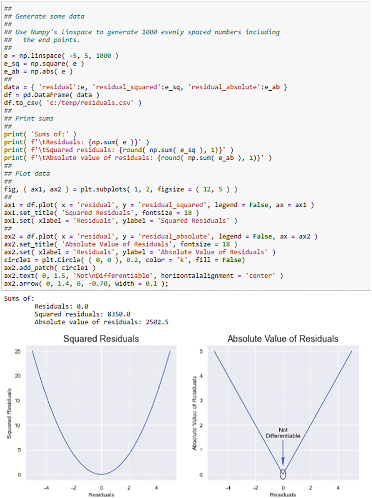

图 6.1 这是模拟的残差的平方和绝对值的比较。 我使用 Numpy linspace 函数在 - 5 和 + 5 之间生成 1000 个均匀间隔的点，包括端点。 请注意，残差之和为 0.0
对残差进行平方的原因是未平方残差的总和始终为零（只要模型具有常数，它总是应该如此）。 然后最小化 $$\sum _{i = 1}^n e_i$$ 没有意义。 另请注意，平方残差定义了边为 e~i~ 的几何正方形的面积。 因此，SSE 是所有这些几何正方形的总面积。
关于未知参数 $$\hat {\beta _0}$$ 和 $$\hat {\beta _1}$$ 的估计量，(6.1.14) 的最小化是基本的微积分练习。 由于有两个未知数，因此使用代数同时求解两个方程，称为正规方程。 解决方案是截距和斜率估计器：
$$
\displaystyle \begin{aligned} \begin{array}{rcl}{} \hat{\beta_0}=\displaystyle \bar{Y} - \hat{\beta_1} \times \bar{X} \end{array} \end{aligned}
$$
和
$$
\displaystyle \begin{aligned} \begin{array}{rcl}{} \hat{\beta_1}=\displaystyle \dfrac{\sum\left(X_i - \bar{X}\right) \times \left(Y_i - \bar{Y}\right)}{\sum\left(X_i - \bar{X}\right)^2}. \end{array} \end{aligned}
$$
请注意（6.1.15），如果你根本没有 X，只有一批 Y 数据，然后是 $$\hat {\beta _0} = \bar {Y} $$。
任何估计的东西都有差异。这适用于回归线。回归的估计方差 s^2^ 为
$$
\displaystyle \begin{aligned} \begin{array}{rcl} s^2=\displaystyle \dfrac{SSE}{n - 2} \end{array} \end{aligned} 
$$
有标准差

$$
\displaystyle \begin{aligned} \begin{array}{rcl} s=\displaystyle \sqrt{s^2}. \end{array} \end{aligned} 
$$
$$\hat {\beta _1}$$的标准差是：

$$
\displaystyle \begin{aligned} \begin{array}{rcl} s_{\hat{\beta_1}}=\displaystyle \sqrt{\dfrac{s^2}{SXX}} \end{array} \end{aligned}
$$

$$
\displaystyle \begin{aligned} \begin{array}{rcl}=\displaystyle \dfrac{s}{\sqrt{SXX}} \end{array} \end{aligned} 
$$

其中 $$SXX = \sum \left (X_i - \bar {X}\right )^2$$. 截距估计值 $$\hat {\beta _0}$$ 的标准误差估计值为：
$$
\displaystyle \begin{aligned} \begin{array}{rcl}{} s_{\hat{\beta_0}}=\displaystyle s \times \sqrt{ \dfrac{1}{n} + \dfrac{(\bar{X})^2}{SXX} }. \end{array} \end{aligned}
$$
从 (6.1.21) 注意到，如果你的模型没有 X，所以你只有一批 Y 的数据，那么根式中的第二项不存在（它不是 0∕0；它只是不存在那里）。那么标准差是 $${s}/{\sqrt {n}}$$，这是基本统计数据平均值的标准差。
这些标准误差用于计算用于各个参数的假设检验的 t 统计量。 $$\hat {\beta _1}$$ 的 t 统计量定义为
$$
\displaystyle \begin{aligned} \begin{array}{rcl} t_{C, \hat{\beta_1}}=\displaystyle \frac{\widehat{\beta_1} - \beta_1}{s_{\widehat{\beta_1}}}=\displaystyle \frac{\widehat{\beta_1}}{s_{\widehat{\beta_1}}} \end{array} \end{aligned}
$$
在零假设下。下标中的"C"表示这是一个计算值。零假设和替代假设是

$$
\displaystyle \begin{aligned} \begin{array}{rcl} H_0: \beta_1 = 0 \\ H_A: \beta_1 \neq 0 \end{array} \end{aligned} 
$$
尽管替代假设也可以是 β 1 > 0 或 β 1 < 0，具体取决于问题。 p 值与 t 统计量相关联，并将该值与预设的显着性水平或 α 值进行比较；通常α = 0.05。如果 p 值 < 0.05，则拒绝零假设，否则不拒绝。的 t 统计量的定义类似。

### 6.1.3 高斯-马尔可夫定理

仅仅因为你可以推导出使用数据计算参数的公式，并不意味着这些公式（估计量）是对应用程序有用的好公式。为了被接受，它们必须满足一些标准。一些已经提出并在统计领域被广泛接受。这些是估计器必须是：

- 线性的；
- 不偏不倚；
- 在线性无偏估计量类中具有最小的方差；
- 始终如一。

线性意味着它们可以写成变量的线性函数；不偏不倚意味着他们平均给出了正确的答案；最小方差意味着它们具有最小的方差；一致性意味着随着样本量变大，估计量将等于真实参数。一个非常重要的定理，称为高斯-马尔可夫定理，表明 OLS 估计量满足这些标准。正是因为这个定理，我们才有信心使用它们。见希尔等人。 (2008) 和 Greene (2003) 的高斯-马尔可夫定理。有关显示 OLS 估计量满足这些标准的推导，请参见 Kmenta (1971)。

## 6.2 方差分析
回归模型分析中一个有用的步骤是将因变量的方差分解为两部分。这种分解称为方差分析 (ANOVA)，通常是统计中一个重要的、发展良好的部分。参见 Draper 和 Smith (1966)，Neter 等人。 (1989) 和 Hocking (1996) 讨论了方差分析及其在回归分析中的应用。
为了激发 ANOVA，请注意，你可以简单地写 Y~i~ = Y~i~，然后你可以将其重写为 $$Y_i = Y_i + \hat {Y_i} - \hat {Y_i} + \bar {Y} - \bar {Y}$$，因此没有任何变化。现在重新排列术语，将两边平方，并对所有观察值求和以获得
$$
\displaystyle \begin{aligned} \sum(Y_i - \bar{Y})^2 = \sum(\hat{Y_i} - \bar{Y})^2 + \sum(Y_i - \hat{Y_i})^2 + 2 \sum(\hat{Y_i} - \bar{Y}) \times (Y_i - \hat{Y_i}). \end{aligned}
$$
最后一个叉积项为零，因此你得到：

$$
\displaystyle \begin{aligned} \begin{array}{rcl}{} \underbrace{\sum (Y_i - \bar{Y})^2}_{SST}=\displaystyle \underbrace{\sum (\hat{Y_i} - \bar{Y})^2}_{SSR} + \underbrace{\sum (Y_i - \hat{Y_i})^2}_{SSE}. \end{array} \end{aligned}
$$
从基本统计中回想一下，一批数据的样本方差公式 Y 是

$$
\displaystyle \begin{aligned} \begin{array}{rcl}{} s_Y^2=\displaystyle \dfrac{\sum_{i = 1}^n(Y_i - \bar{Y})^2}{n - 1}. \end{array} \end{aligned}
$$
(6.2.3) 中的分子实际上是方差；分母只是缩放它。这个分子是总平方和（SST）：$$SST = \sum _{i = 1}^n(Y_i - \bar {Y})^2$$。让 SSR 是回归平方和：$$SSR = \sum _{i = 1}^n(\hat {Y_i} - \bar {Y})^2$$。然后你可以写：

$$
\displaystyle \begin{aligned} \begin{array}{rcl}{} SST=\displaystyle SSR + SSE. \end{array} \end{aligned}
$$
这是用于方差分析的统计学中的基本恒等式。它的每个组件都有相关的自由度。 SST 有 n − 1 个来自基本统计的自由度。 SSE 有 n − 2：每个参数损失 1 个自由度，因此为 2。SSR 有 1 个自由度，反映了一个特征。我在表 6.1 中总结了组成部分及其自由度的常规表，称为 ANOVA 表。
表 6.1 这是一般的 ANOVA 表结构。均方只是平方的平均值或缩放和。统计量 F C 是计算的 F 统计量，用于根据子集模型测试拟合模型。最简单的子集模型只有一个截距。我将此称为受限模型。注意自由度的总和。它们的总和等价于 (6.2.4) 的平方和

| 变异来源 | DOF   | 平方和 | 均方                          | F~C~    |
| -------- | ----- | ------ | ----------------------------- | ------- |
| 回归     | 1     | SRR    | MSR = SSR∕1                   | MSR∕MSE |
| Error    | n-2   | SSE    | $$MSE = s\frac {SSE}{n - 2}$$ |         |
| Total    | n - 1 | SST    | MST = SST∕n − 1               |         |

表 6.1 中的 F 统计量 F C 用于检验线性模型优于子集模型的假设。最简单的子集是只有一个常数项的子集。我将此称为受限模型。参见韦斯伯格 (1980)。估计的模型称为无限制模型。假设是

$$
\displaystyle \begin{aligned} \begin{array}{rcl} H_0: \displaystyle \text{Restricted Model is Better; i.e., } \beta_1 = 0 \end{array} \end{aligned}
$$

$$
\displaystyle \begin{aligned} \begin{array}{rcl} H_A: \displaystyle \text{Unrestricted Model is Better; i.e., } \beta_1 \neq 0. \end{array} \end{aligned}
$$

请注意，H A 不关心参数是 > 0 还是 < 0，而只关心它不是 0。这与可以具有 > 0、< 0 或≠ 0 的 t 检验不同。
F 统计量具有 p 值，因为它是根据数据计算得出的统计量。决策规则如前：

- 如果 p 值 < 0.05，则拒绝 H~0~
- 否则不要拒绝。

过度劳累和滥用的基本统计量是定义为 R^2^
$$
\displaystyle \begin{aligned} \begin{array}{rcl}{} R^2=\displaystyle \dfrac{\sum_{i = 1}^n(\hat{Y_i} - \bar{Y})^2}{\sum_{i = 1}^n(Y_i - \bar{Y})^2} \end{array} \end{aligned}
$$

$$
\displaystyle \begin{aligned} \begin{array}{rcl}=\displaystyle \dfrac{SSR}{SST}. \end{array} \end{aligned}
$$

这显示了模型解释或解释的因变量的变化比例。作为一个比例，0 ≤ R 2 ≤ 1。这个值有一个问题，我稍后会解释。注意你也可以写
$$
\displaystyle \begin{aligned} \begin{array}{rcl} R^2=\displaystyle \dfrac{SSR}{SST} \end{array} \end{aligned}
$$

$$
\displaystyle \begin{aligned} \begin{array}{rcl}=\displaystyle \dfrac{SST - SSE}{SST} \end{array} \end{aligned} 
$$

$$
\displaystyle \begin{aligned} \begin{array}{rcl}=\displaystyle 1 - \dfrac{SSE}{SST}. \end{array} \end{aligned} 
$$

由于 R^2^ 是 SSR 的函数，因此你应该怀疑 R^2^ 和 F 统计量是相关的，因为它们都有一个共同的因素。事实上，从（6.2.12）可以看出它们是相关的。
$$
\displaystyle \begin{aligned} \begin{array}{rcl}{} F=\displaystyle \dfrac{(n - 2) \times SSR}{SSE} \end{array} \end{aligned}
$$

$$
\displaystyle \begin{aligned} \begin{array}{rcl}=\displaystyle \dfrac{(n - 2) \times {SSR}/{SST}}{{SSE}/{SST}} \end{array} \end{aligned}
$$

$$
\displaystyle \begin{aligned} \begin{array}{rcl}=\displaystyle \dfrac{(n - 2) \times R^2}{1 - R^2}. \end{array} \end{aligned}
$$

与 OLS 相关的其他统计数据包括 AIC、BIC、Durbin-Watson、Jarque-Bera 和许多其他可用于评估回归模型拟合并帮助你解释结果的统计数据。有关这些的背景信息，请参阅我上面引用的任何参考资料。我将在下面讨论 AIC 和 BIC，并在第 7 章讨论 Durbin-Watson 统计量。

## 6.3 案例研究
家具交易数据将用于说明简单的 OLS 回归。这些交易是向当地精品零售商销售客厅百叶窗。制造商的销售人员自行决定是否向这些零售商提供折扣或根本不提供折扣：经销商折扣（即，对与公司先前业务的奖励）、竞争性折扣（以满足当地市场竞争）、订单量折扣（即批量折扣）和提货折扣（即避免发货的激励措施）。折扣将百叶窗的标价降低到口袋价格，即制造商实际销售的每个百叶窗的金额。目标是估计口袋价格对单位销售额的影响的价格弹性。参见 Paczkowski (2018) 对价格弹性及其估计的深入讨论。

### 6.3.1 基本OLS回归

第一步是检查单位销售额的分布。我在图 6.2 的面板 (a) 中显示了一个直方图。请注意，分布严重向右偏斜，因此极右尾部存在异常值。这些异常值会影响估计，因此必须对其进行校正。为此目的使用（自然）对数变换。然而，我使用的对数转换有一点点扭曲：它是 1 加上单位销售额：$$\ln {(1 + USales)}$$  的对数。相加的原因很简单。如果任何销售额为零，则此时未定义日志。也就是说，$$\ln {(0)} = \infty $$ 。每个观察值加 1 可以避免这个问题，因为 $$\ln {(1)} = 0$$。我在图 6.2 的面板 (b) 中显示了对数转换的单位销售额的分布。对数变换清楚地标准化了偏斜分布。我对口袋价格使用相同的转换。

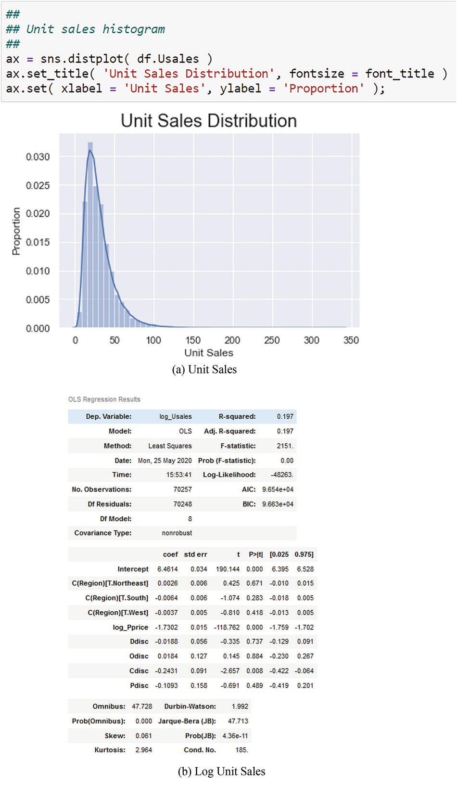

图 6.2 面板 (a) 显示了客厅百叶窗的单位销售额的原始数据，而面板 (b) 显示了对数转换的单位销售额。对数转换为 log(1 + Usales) 以避免零销售额的任何问题。我使用 Numpy 日志功能：log1p。该函数默认为自然对数
所有统计软件包都要求你按照四个步骤来估计模型。你如何做到这一点各不相同，但是，尽管如此，你被要求做所有四个。这些步骤是:

1. 指定型号；
2. 指定或实例化估算程序和你将使用的数据；
3. 拟合模型；
4. 打印汇总结果。

### 6.3.2 对数-对数模型

由于我在案例研究中对 Y 和 X 都应用了对数转换，因此生成的模型称为对数对数模型。这写成：
$$
\displaystyle \begin{aligned} \begin{array}{rcl} \ln{(Y)} = \beta_0 + \beta_1 \times \ln{(X)}. {} \end{array} \end{aligned}
$$
反转这个模型给出

$$
\displaystyle \begin{aligned} \begin{array}{rcl} Y = e^{\beta_0} \times X^{\beta_1}. {} \end{array} \end{aligned}
$$
注意，如果你取 (6.3.1) 的总微分，你会得到

$$
\displaystyle \begin{aligned} \begin{array}{rcl} \dfrac{1}{Y} \times dY=\displaystyle \beta_1 \times \dfrac{1}{Y} \times dY \end{array} \end{aligned}
$$
所以，

$$
\displaystyle \begin{aligned} \begin{array}{rcl} \beta_1 = \dfrac{X}{Y} \times \dfrac{dY}{dX} \end{array} \end{aligned}
$$
这是Y 相对于X的弹性，$$\eta _X^Y$$.[^1]

### 6.3.3 模型设置

我在图 6.3 面板 (a) 中提供了具有这四个步骤的回归设置，因此你可以看到进行回归估计的一般结构。第 4 步的回归总结在图 6.3 面板（b）中。第一步，指定模型，使用 Patsy 公式字符串完成。 Patsy 公式是编写用于各种建模情况的公式的简洁有效的方法。该公式使用"~"将模型的左侧与右侧分开，并使用"+ "将特征添加到右侧。 "-"符号用于从右侧删除列（例如，删除或省略默认情况下始终包含的常数项）。 Patsy 公式很简洁，因为它省略了模型语句的明显部分。例如，可以理解未知参数（即 β~0~ 和 β~1~）是模型的一部分，实际上是估计的目标，因此不必指定它们。只需要因变量和自变量。要省略常数，请使用 Y ∼−1 + X；要默认包含它，只需使用 Y ∼ X。Patsy 表示法是有效的，因为变量的复杂组合（即交互作用）被简单地表达了。我不会包含交互，所以只会使用最简单的 Patsy 语句。

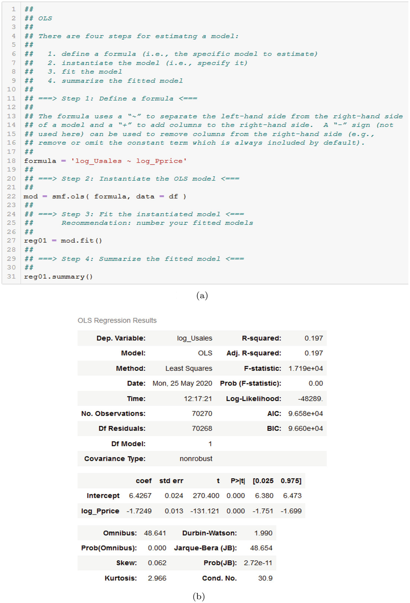

图 6.3 此处显示了单变量回归。 (a) 回归设置。 (b) 回归结果
模型实例化意味着你必须指定估计过程、公式和 DataFrame 来创建模型的实例。在此示例中，估计过程是 OLS，因此 Statsmodels 包中的 ols 函数使用点表示法访问。 Patsy 公式和 DataFrame 名称是函数的参数。完全实例化的模型存储在一个变量对象中，我在图 6.3，面板 (a) 中将其称为 mod。该对象仅保存模型规范；它不做任何事情。使用与 mod 对象关联的 fit 方法估计或拟合模型。估计结果存储在图 6.3 面板 (a) 中的变量对象 reg01 中。我推荐的命名约定是使用过程名称（例如，"reg"）后跟一个序列号，该序列号为新模型递增：reg01、reg02 等。我可以通过链接使用一个语句组合模型实例化和拟合：smf.ols( formula, data = df ).fit().

### 6.3.4 估计总结

估计结果显示在图 6.3 中的常规回归模型布局中，面板 (b) 使用 reg01 对象的 summary() 方法。此布局分为三个部分：

1. 左上角的客房部，有估价日期和时间、估价类型等；
2. 右上角的诊断部分，底部的其他支持信息；和
3. 中间部分的参数估计。

请注意，诊断部分的 R 2 为 0.197，因此只有大约 20% 的原木销售变化可以由原木口袋价格解释；这不是很好。必须有其他变量来解释销售，也许是当地零售商的折扣和营销区域。我将在下一节中探讨这一点。有关详细信息，请参阅 Paczkowski (2021b)。
我在上面提到了 F-Statistic 的 R 2 版本。见（6.2.12）。我总结了图 6.5 中的计算来验证这种关系。请注意，这些值是应有的。

### 6.3.5 基本回归的方差分析

本节中的 F 统计量的值为 17192.714，如回归摘要图 6.3 面板 (b) 和 ANOVA 表图 6.4 所示。这将测试估计的无限制模型与没有解释变量的受限模型，即 Y~i~ = β~0~ + 𝜖~i~。零假设断言受限模型更好。此 F 统计量的 p 值为 0.0，这表明零假设被拒绝。参见 Weisberg (1980) 使用 F 检验比较这两个模型。我在图 6.4 中显示了 ANOVA 表。

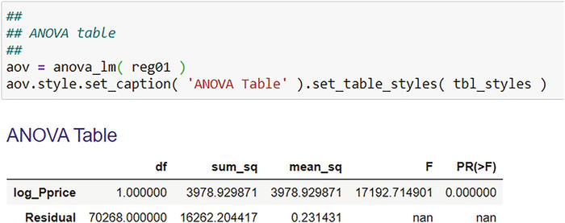

图 6.4 单位销售额回归的 ANOVA 表

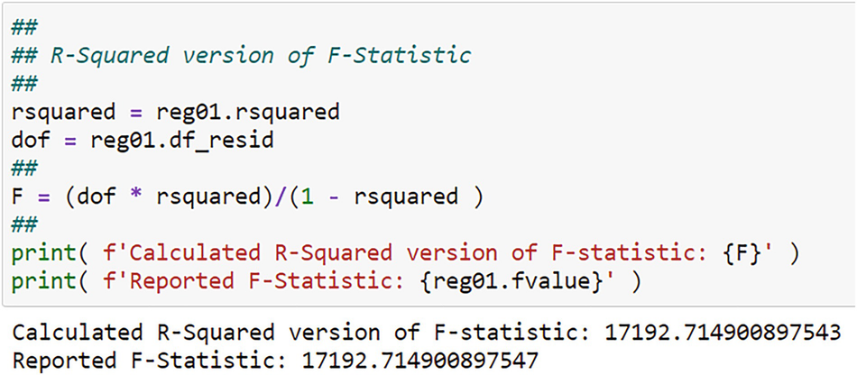

图 6.5 计算验证了 R 2 和 F-Statistic 之间的关系。我从为图 6.3 中的回归创建的 reg01 对象中检索了所需的值

### 6.3.6 弹性

从参数估计部分，你可以看到对数口袋价格的系数为 - 1.7249，这表明（对数）销售具有高弹性，p 值等于 0.0。估计系数是需求的价格弹性，表明客厅百叶窗的销售具有高度的价格弹性：价格下降 1% 会导致销售额增加 1.7%。这应该是意料之中的，因为该产品有许多很好的替代品，例如其他制造商的客厅百叶窗以及窗帘，窗帘，当然，窗户根本没有。
你可能想知道价格变化对 KPM 的影响，尤其是收入。如 Paczkowski (2018) 所示，如果 $$\eta _P^Q$$ 是单位销售的价格弹性，那么收入的价格弹性是 $$\eta _P^{TR} = 1 + \eta _P^Q$$。对于这个问题，$$\eta _P^Q = -1.7$$，所以 $$\eta _P^{TR} = -0.7$$。如果价格下降 1%，收入将增加 0.7%。有关价格和收入弹性的讨论以及使用对数模型来估计和解释它们，请参见 Paczkowski (2018)。

## 6.4 基本多元回归
基本的 OLS 模型可以扩展为包括多个自变量 (p > 1) 和专门的自变量。专门的自变量是滞后变量（滞后相关和/或独立），用于捕捉动态时间模式；捕捉潜在时间动态的时间趋势；和虚拟或单热编码概念变量。我在第 5 章介绍了虚拟编码。
使用 p > 1 自变量需要修改估计的表达方式。使用矩阵代数表示法，尽管结果是相同的，但与表达形式无关。有关矩阵代数的评论，请参见 Lay (2012) 和 Strang (2006)。关于它在多元回归中的使用，请参阅任何计量经济学教科书，例如 Goldberger (1964) 或 Greene (2003)。使用矩阵表示法，因变量表示为 n × 1 向量。对于扰动项 𝜖 也是如此。 p 个自变量加上常数被收集到一个 n × (p + 1) 矩阵 X 中。线性模型现在用矩阵表示法写成
$$
\displaystyle \begin{aligned} \begin{array}{rcl} \mathbf{Y} = \mathbf{X} \boldsymbol{\beta} + \boldsymbol{\epsilon}. \end{array} \end{aligned}
$$
尽管符号发生了变化，但问题与以前完全相同：你最小化损失函数 SSE，并求解得到的 p + 1 正规方程得到（以矩阵符号表示）：

$$
\displaystyle \begin{aligned} \begin{array}{rcl} \hat{\boldsymbol{\beta}} = \left({\mathbf{X}}^{\top} \mathbf{X}\right)^{-1}{\mathbf{X}}^{\top} \mathbf{Y}. {} \end{array} \end{aligned}
$$
向量$$\hat {\boldsymbol {\beta }}$$是(p + 1) × 1并且包括常数项。项 $$\left ({\mathbf {X}}^{\top } \mathbf {X}\right )^{-1}$$ 是由 X 矩阵形成的平方和和叉积矩阵的倒数。 Y 的预测值为

$$
\displaystyle \begin{aligned} \begin{array}{rcl} \hat{\boldsymbol{Y}}=\displaystyle \mathbf{X} \hat{\boldsymbol{\beta}}. \end{array} \end{aligned}
$$
这是 SRL，但作为超曲面而不是直线。假设检验所需的 $$ \hat {\boldsymbol {\beta }}$$ 的方差是 $$\sigma _{\hat {\boldsymbol {\beta }}}^2 = \sigma ^2 \left ({\mathbf {X}}^{\top } \mathbf {X}\right )^{-1}$$。由于多元回归只是我之前介绍的内容的概括，因此高斯-马尔可夫定理仍然成立。

### 6.4.1 多元回归的方差分析

修改了 ANOVA 表以处理多个自变量，但解释是相同的。我在表 6.2 中提供了一个修改后的表格。可以看到结构没有变化。
表 6.2 这是当有 p > 1 个自变量时修改后的 ANOVA 表结构。注意自由度的变化，但因变量的自由度没有改变。回归源的 p 自由度解释了 p 个自变量，这些变量也反映在误差源中

| Source of Variation | DOF       | Sum of Squares | Mean Squares                      | F~C~      |
| ------------------- | --------- | -------------- | --------------------------------- | --------- |
| Regression          | p         | SSR            | MSR = SSR / p                     | MSR / MSE |
| Error               | n - p - 1 | SSE            | $$MSE = s\frac {SSE}{n - p - 1}$$ |           |
| Total               | n - 1     | SST            | MST = SST / n − 1                 |           |

F 检验仍然测试受限模型与非受限模型，但非受限模型具有 p > 1 个解释变量，与之前的 p = 1 不同。假设现在是

$$
\displaystyle \begin{aligned} \begin{array}{rcl} H_{0}: \beta_1 = \beta_2 = \ldots = \beta_p = 0 \end{array} \end{aligned}
$$

$$
\displaystyle \begin{aligned} \begin{array}{rcl} H_{A}: \text{At Least 1}~\beta_i~\text{Not Zero}. \end{array} \end{aligned}
$$

我在表 6.3 中比较了简单回归和多元回归案例的 F 检验。请注意，在简单模型中，F 检验的零假设与 t 检验的相同。参见 Neter 等人。 (1989, p. 97) 和 Draper and Smith (1966, p. 25)。
表 6.3 多元回归案例的 F 检验比较简单回归案例和多元回归案例

| 模型                 | 零假设                  | 替代假设           |
| -------------------- | ----------------------- | ------------------ |
| Simple OLS (p = 1)   | β 1 = 0                 | β 1 ≠ 0            |
| Multiple OLS (p > 1) | β 1 = β 2 = … = β p = 0 | At least 1 β i ≠ 0 |

多元回归案例中的 F 统计量定义为

$$
\displaystyle \begin{aligned} \begin{array}{rcl} F_C = \dfrac{\left(SSR_U - SSR_R\right)/p'}{SSE_U/(n - p - 1)} \sim F_{p', n - p - 1} \end{array} \end{aligned}
$$
其中 SSR U 和 SSE U 来自非受限模型，SSR R 来自受限模型。分子的自由度是无限制模型和有限制模型的自由度之差。因此，如果 p~U~ + 1 是无限制模型中的变量数加上一个常数，而 p~R~ + 1 是受限模型中的变量数加上一个常数，那么差值就是 p′ = p~U ~ − p~R~ > 0。请注意，如果 p~U~ + 1 = 2 用于简单的单变量模型，p~R~ = 1 用于仅常数模型，则差异为 p′ = 1是表 6.1 中 SSR 的自由度。
R^2^ 的定义没有改变，但你必须进行调整。当你向模型中添加更多解释变量时，SSR 会自动增加，即使添加的变量几乎没有或没有解释力。参见 Neter 等人。 （1989 年）。因此，当你添加更多变量时，R^2^6 将自动增加。作为对这种膨胀的惩罚，在多元回归环境中使用了调整后的 R^2^（符号为 $$\bar {R^2}$$）。这被定义为
$$
\displaystyle \begin{aligned} \begin{array}{rcl} \bar{R^2}=\displaystyle 1 - \left[\dfrac{n - 1}{n - p -1}\right] \times \left(1 - R^2\right) \end{array} \end{aligned}
$$

$$
\displaystyle \begin{aligned} \begin{array}{rcl}=\displaystyle 1 - \left[\dfrac{n - 1}{n - p -1}\right] \times \left(\dfrac{SSE}{SST}\right) \end{array} \end{aligned}
$$

$$
\displaystyle \begin{aligned} \begin{array}{rcl}=\displaystyle 1 - \dfrac{{SSE}/{n - p - 1}}{{SST}/{n - 1}} \end{array} \end{aligned}
$$

$$
\displaystyle \begin{aligned} \begin{array}{rcl}=\displaystyle 1 - \dfrac{s^2}{s^2_Y} \end{array} \end{aligned}
$$

调整后的-R^2^ 具有某些属性：
1. $$\bar {R^2} \leq R^2$$
2. 不像R^2^只会随着更多变量的添加而增加，如果添加的自变量没有或几乎没有解释力，111会下降。原因是 p 的增加减少了 n − p − 1，因此 SSE / n − p − 1 增加。

6.4.2 替代拟合度量：AIC 和 BIC
建模目标通常非常适合数据的线性模型。这转化为具有大的 $$\bar {R^2}$$ （或 1 变量模型的 R^2^）。 $$\bar {R^2}$$  的一个问题是它只适用于比较嵌套模型。嵌套模型是较大线性模型的子集模型，其中因变量相同，子集中的所有自变量也在较大模型中。所以，模型Y = β~0~ + β~1~ × X~1~ + 𝜖嵌套在Y = β~0~ + β~1~ × X~1~ + β~2~ × X~2下~ + 𝜖。你可以使用调整后的 R^2^ 来比较这两个模型。但是，你不能比较 Y = β~0~ + β~1~ × X~1~ + 𝜖 和 111，因为第一个没有嵌套在第二个之下；因变量不同。因此，SST 不同，因此无法进行比较。有关 R^2^ 的讨论，请参见 Kennedy (2003, p. 73 and p.74)。你可以使用定义为的 Akaike 信息标准 (AIC) 在你的投资组合中选择"最佳"模型
$$
\displaystyle \begin{aligned} \begin{array}{rcl} AIC = 2 \times (p + 1) - 2 \times \ln{(L)} \end{array} \end{aligned}
$$
对于具有常数项的模型，其中 $$\ln {(L)}$$ 是对数似然值。对于没有常数的模型，第一项是 2 × p。
AIC 衡量模型的"拟合差"，而不是通过调整后的 R^2^ 衡量的"拟合优度"。这意味着它测量了模型无法解释的因变量的变化量；它衡量变量未解释的信息量。调整后的 R^2^ 衡量他们所考虑的变化量。使用 AIC 的目标是选择具有最小 AIC 的模型。 AIC 的替代方法是贝叶斯信息准则 (BIC)，它也是对数似然的函数。这被定义为
$$
\displaystyle \begin{aligned} \begin{array}{rcl} f(X_i; \theta)=\displaystyle \dfrac{1}{\sqrt{2\pi\sigma^2}}e^{-\dfrac{(X_i - \mu)^2}{2\sigma^2}} \end{array} \end{aligned}
$$
对于具有常数的模型。对于没有常数的模型，第一项是 $$\ln {(n)} \times p$$。
可能性 L 有时被松散地解释为事件发生的概率。这是不正确的。概率密度函数 f(X;θ) 是具有固定参数 θ 的随机变量 X 的函数，例如
$$
\displaystyle \begin{aligned} \begin{array}{rcl} f(X_i; \theta)=\displaystyle \dfrac{1}{\sqrt{2\pi\sigma^2}}e^{-\dfrac{(X_i - \mu)^2}{2\sigma^2}} \end{array} \end{aligned}
$$
其中 μ 和 σ^2^ 是给定的参数。因此，θ = [μ, σ^2^]。在这个例子中，X i 是一个随机变量。对于离散分布，这称为概率质量函数，因为对于 X 的固定值，曲线下存在质量（即面积）。密度函数不是概率，因为它在固定值的曲线下没有质量X. X 在 a 到 b 范围内的曲线下面积（即 a < X < b）是概率。但是，随着这个范围变窄，最终 a = b，则相关区域变为零，因此概率变为零。我们通常将密度称为概率，但事实并非如此。如果分布的质量集中在一个狭窄的范围内，这些密度可能大于 1.0。
在给定数据 X~i~ 的情况下，似然函数给出参数为 θ 的可能性，而不是概率。参数现在是随机的，X~i~ 是固定的或非随机的。 "给定"实际上并不正确，但足够了。观测值 i 的似然函数是 L i(θ;X~i~)，它在数学上等于 f(X~i~;θ)。因此，由于只有一条曲线，因此功能相同，但解释不同。这是关键部分：相同的功能，不同的解释。关于概率密度函数和似然函数之间的区别，请参见 Shao (2003)。
形式上，n 个独立观察的随机样本的似然函数是 n 个密度而不是概率的乘积，由基本概率论中独立随机变量的乘积规则得出。对数似然是各个密度对数的总和：
$$
\displaystyle \begin{aligned} \begin{array}{rcl} \ln{(L(\theta; X))}=\displaystyle \sum_{i = 1}^n \ln{(L_i(\theta; X_i))}. \end{array} \end{aligned}
$$
最好使用自然对数，因为最大化似然函数需要对 n 个乘积求导，而对于自然对数，它需要对 n 个求和项求导。这更容易处理并给出相同的结果，因为日志是其参数的单调递增转换。如果对于 X 和 Y 的所有值满足 X ≤ Y ，则函数 f 单调递增，则 f(X) ≤ f(Y )。同样，对于单调递减。这种单调性适用于对数函数。这就是使你能够使用对数转换并获得相同答案的原因。
由于AIC = 2 × (p + 1) − 2 × ln(L)，如果ln(L) > p + 1，则AIC < 0。这需要ln(L) > 1。如果L = e (= 2.71828)，那么 ln(L) = 1. 我们可以走得更远。假设使用正态密度，平均值为 0，标准差为 1。然后你会得到表 6.4 的面板 (a)。假设使用平均值为 0 且标准差为 1∕100 的正态密度。然后得到表 6.4 中的面板 (b)。基本上，较小的标准差会压缩密度函数，因为标准差是从均值到曲线拐点的距离（均值两侧等距）。标准差越小，距离越小，密度曲线越压缩。如果标准差为零，则密度曲线在均值处退化。如果所有值都相同，就会出现这种情况。由于密度曲线被压缩，曲线下方的面积（必须始终等于 1.0）必须到达某个地方，并且它唯一可以到达的地方就是向上。这意味着曲线可以在大于 1.0 的值处达到峰值。如果标准差很大，则密度曲线在均值附近更平坦，高度小于 1.0。当使用（自然）对数时，前者的对数密度为正，后者为负。这在表 6.4 中显而易见。
表 6.4 平均值为 0 和标准差为 1 的正态密度的密度与对数密度值与标准差 1 / 100控制板

| (a) 标准差 1.0 |           |             | (b) 标准差 1∕100 |          |             |
| -------------- | --------- | ----------- | ---------------- | -------- | ----------- |
| X              | Density   | log-Density | X                | Density  | log-Density |
| − 0.03         | 0.3987628 | − 0.9193885 | − 0.03           | 0.443184 | − 0.813768  |
| − 0.01         | 0.3989223 | − 0.9189886 | − 0.01           | 24.19707 | 3.186232    |
| 0.00           | 0.3989423 | − 0.9189385 | 0.00             | 39.89423 | 3.686232    |
| + 0.01         | 0.3989223 | − 0.9189886 | + 0.01           | 24.19707 | 3.186232    |
| + 0.03         | 0.3987628 | − 0.9193885 | + 0.03           | 0.443184 | − 0.813768  |

这些正负对数密度可能性的含义是 AIC 可以是正的也可以是负的。不保证为正，如 R 2。符号取决于数据的标准偏差；也就是说，它取决于似然函数的峰值或平坦度。 BIC 也是如此。进一步的暗示是，负 AIC 没有说明模型的拟合差，因为它与模型的拟合无关。一个模型的一个 AIC 值的唯一重要方面是它相对于其他模型的其他 AIC 值的大小。值越小表示模型越好。 BIC 也是如此。
## 6.5 案例研究：扩展分析
让我扩展客厅百叶窗案例研究以包括几个解释变量。现在让模型包括每个零售商的折扣和营销区域。营销区域变量是一个离散的分类概念，具有四个类别：中西部、东北部、南部和西部。我必须使用 C(⋅) 函数对这个变量进行虚拟化。这将分类变量作为参数，对其进行扫描，并为级别创建虚拟变量。这些被称为处理并由 T 表示。还有其他方法可以创建指标变量，其中处理是默认值。另一种称为效果编码，在市场研究和实验的统计设计中很流行。这在 C(⋅) 中称为 Sum。有关虚拟编码和效果编码的讨论和比较，请参见 Paczkowski (2018)。
请记住，选择一个级别作为基础，并且不会为基础创建虚拟变量以避免虚拟变量陷阱。[^2] 当 C(⋅) 函数扫描级别时，它会将唯一级别按字母数字顺序排列并删除首先作为基础。中西部是第一位的，所以它没有虚拟变量。虚拟变量由 C(Region) 表示，后跟级别处理指定和虚拟变量适用的级别。因此，Northeast 虚拟变量是 C(Region)[T.Northeast]。
我在图 6.6 中显示了回归设置，在图 6.7 中显示了面板 (a) 和方差分析。由于口袋价格是折扣的函数，因此可能会担心口袋价格和折扣之间的关系。通过检查口袋价格和四个折扣的相关矩阵来检查这种关系。我使用 Pandas corr 方法创建了一个相关矩阵，并将其显示在图 6.8 中。你可以看到相关性都很小。

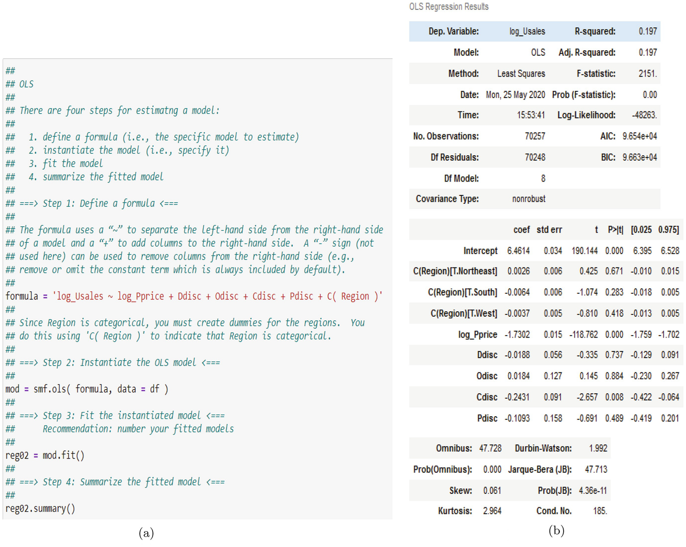

图 6.6A 多变量回归在这里显示。 (a) 回归设置。 (b) 回归结果

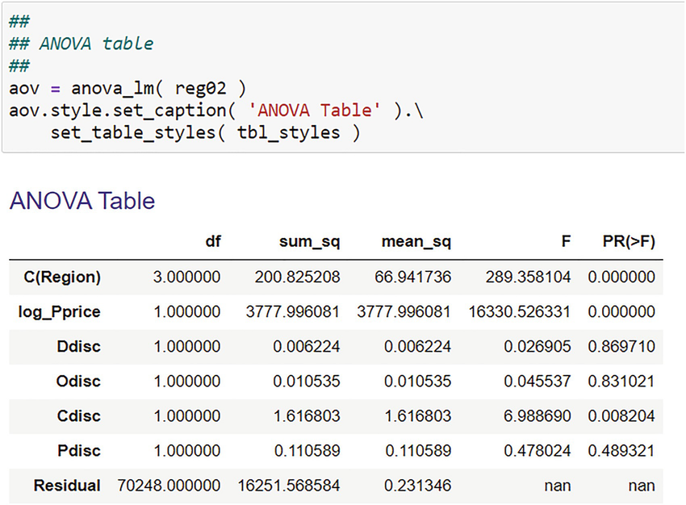

图 6.7 单位销售额多元回归模型的方差分析表

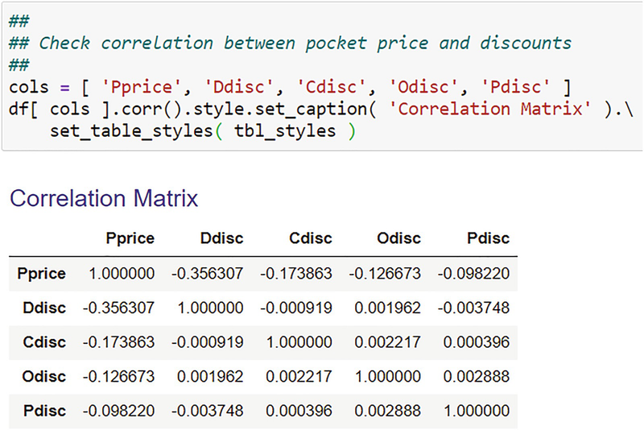

图 6.8 相关性矩阵显示非常小的相关性
参考图 6.6，面板 (b)，请注意 R 2 与图 6.3 面板 (b) 中的几乎没有变化，并且调整后的 R 2 与小数点后三位相同。因此，和以前一样，在这个扩展模型中只考虑了（对数）销售额变化的 20%。 F 统计量也非常显着，因此该扩展模型优于仅具有常数项的受限模型。接下来，请注意（对数）价格的估计系数与以前一样非常重要，因此关于价格（和弹性）的结论没有改变。最后请注意，尽管竞争折扣 (Cdisc) 微不足道，但折扣都微不足道。
现在看看营销区域。区域系数如何解释？每个都显示与基地的偏差，在这种情况下是中西部。中西部系数是截距。东北系数显示了从中西部向东北移动的影响，因此东北的总影响是截距加上东北系数。由于截距为 6.4614，东北为 0.0026，则东北为 6.4640。其他两个地区也是如此。由于包含该虚拟变量，估计的虚拟系数被解释为截距的影响或偏移。因此，如果你查看东北地区，则 6.4640 是截距。
虚拟系数均不显着，表明对销售没有区域影响。这很难理解。尽管如此，我还是会做一个 F 检验来检验区域的显着性，尽管回归结果表明区域作为一个概念是不显着的。我在图 6.9 中显示了结果。假设陈述被指定为字符串。注意这是怎么写的。回归输出中的变量名称完全按照它们在那里出现的方式使用，因为这是存储在回归输出中的内容。这三个表达式指的是估计的系数，并且共同假设每个都等于零。因此，表达式为 NE 系数（即效果）为零且南系数（即效果）为零且西系数（即效果）为零。中西部系数（即效果）暗示为零。然后使用作为假设字符串的参数调用与回归模型关联的 f_test 方法。结果证实，区域概念对（对数）销售没有影响，因为 p 值 > 0.05。

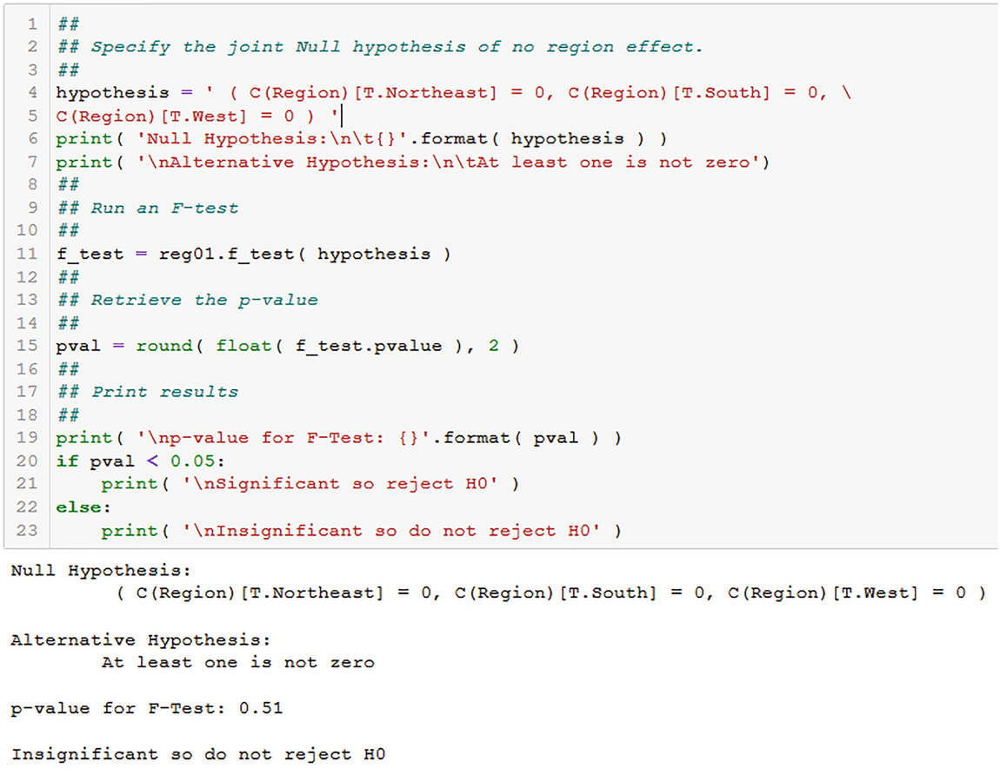

图 6.9F-test 显示没有区域效应
为什么这些结果如此糟糕？一种可能性是数据本身。这些是时间序列和横截面数据的组合，或者所谓的面板数据集。回想一下我在第一章中对数据立方体的讨论。 1. 这种类型的数据很难分析，因为同时存在两种动态：时间和空间。我将在第三部分讨论如何处理这个数据结构。另一种可能性是使用未记录的折扣。我没有分析他们的分布，但如果记录了销售和价格，那么也许折扣也应该记录。关于区域，它们可能必须与价格和折扣条款进行交互，以捕捉变量之间更丰富的相互作用。显然，这现在变得复杂了。顺便说一句，这些地区也可能通过我没有考虑的其他因素产生影响。零售买家位于或嵌套在区域内，每个区域都有自己的特点。这些特征可能会影响零售商的客户购买和购买客厅百叶窗的方式，从而影响零售商的购买。多级模型可能会更好。参见 Gelman 和 Hill (2007)、Kreft 和 de Leeuw (1998)、Luke (2004)、Ray 和 Ray (2008) 以及 Snijders 和 Bosker (2012)。

## 6.6 模型组合
总结几个模型的一种方便方法是创建一个模型组合。这是许多学术出版物中使用的有点标准的表格。你必须从 statsmodels.iolib.summary^2^ import summary_col 导入 statsmodels 包，并定义要在表中显示的汇总度量。你可以使用我在图 6.10 中显示的定义。在你的最佳实践部分中定义两者。然后为本章的两个回归模型生成如图 6.11 所示的投资组合。

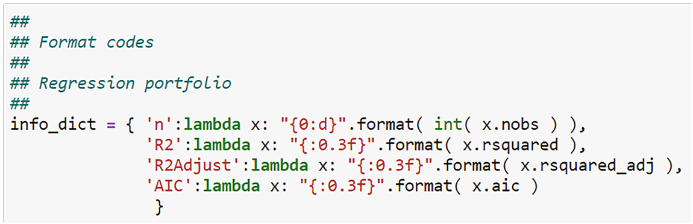

图 6.10 你可以使用这样的设置定义要在投资组合中显示的统计信息

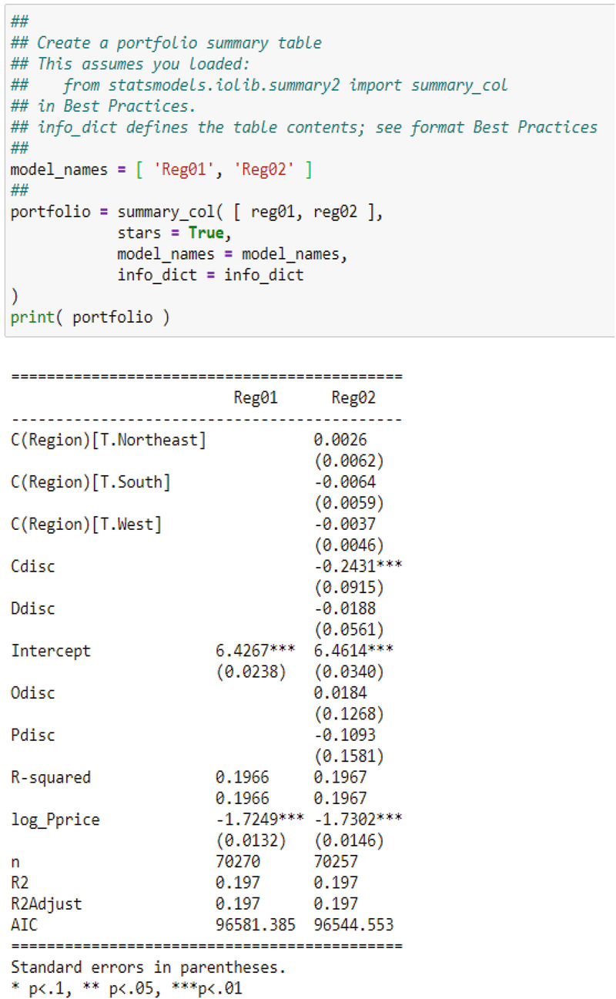

图 6.11 这是本章中两个回归模型的投资组合总结
## 6.7 预测分析：简介
回想一下第 1 章，估计一个动作的结果是有代价的。随着你收集和处理更多丰富的信息，此成本会下降。这些信息不是关于发生了什么，而是关于在不同情况下会发生什么，其中一些是你可以控制的，而另一些是你无法控制的。无论你控制的性质如何，你都必须根据你的丰富信息来预测你的决策结果。事实上，用于决策的丰富信息的一部分是预测本身，因为你永远不会只有一个预测，而是一系列预测，每个预测都基于你对其他丰富信息的不同视角。但是这个预测行动可能结果的问题引出了三个问题：
1. 什么是预测？
2. 你如何开发一个？
3. 你如何评估预测的质量？

我将为本章的前两个问题打下基础，以便回答。我对第一个问题的回答将消除大多数人在预测和预测之间的混淆。这两个通常被认为是相同的，因此被视为同义词；但它们在某些方面是不同的。第二个问题不容易回答，如果要正确完成，实际上需要比我在本章中分配的更多的背景和空间。这超出了本章的范围，本章只是为 BDA 中的基本线性建模奠定基础。一个详细的答案涉及将数据集分成两部分：训练数据集和测试数据集。在第 9 章对这两个数据集进行深入了解之后，我将在第 10 章更全面地讨论它。最后，第三个问题也需要更多背景知识，这也超出了本章的范围。答案也将在第 10 章中展开。
### 6.7.1 预测与预测
让我比较和对比预测和预测。两者之间的混淆集中在它们用于为未知案例或情况生成数字的类似用途上。我有时将其称为填补我们知识的空白。问题是坑。它可以不分时间地指代未知病例，也可以指未来时间段内的未知病例。区别很关键。预测涉及为未来时间段内的事件或度量生成一个数字。预测涉及为未知情况生成一个数字，而不考虑时间。你根据历史数据预测 2022 年的销售额，但如果你在保持其他销售关键驱动因素不变的情况下降低或提高价格，你会预测对销售的影响。预测包括预测，但反之则不然。这就好比说所有的拇指都是手指，但不是所有的手指都是拇指。所有预测都是预测，但并非所有预测都是预测。
BDA 通常与预测有关，尽管预测肯定已经完成。然而，由于使用时间序列数据的复杂性，预测的技能组合是不同的。这有时意味着通过在空间维度上折叠数据立方体来构建时间序列本身。我将在第 7 章回顾时间序列数据的问题，包括折叠数据立方体。

### 6.7.2 进行预测
我将讨论基于本章开发的 OLS 模型的预测。估计 OLS 模型后，有两种方法可以进行预测。一种是指定一个场景，该场景由一组自变量的特定值组成，然后使用估计的模型为其计算结果。这种场景方法通常用于 BDA 和业务决策制定，以开发最有可能的视图以降低近似成本。
作为一个场景的示例，考虑一个客厅百叶窗销售的预测模型，它是价格的函数，对营销区域和折扣值有影响。一个场景可能是：

- 价格：2.50 美元
- 经销商折扣：3%
- 订单大小折扣：3%
- 有竞争力的折扣：3%
- 取件折扣：3%
- 地区：西部

这将检验西部地区将价格设置为 2.50 美元和所有折扣为 3% 的效果。可以尝试诸如此类的许多不同方案，并将其中一种方案选为定价开发的"最佳"方案。
开发几个场景并同时预测每个场景的情况并不少见。很多时候，一种情况被视为最可能的情况（并标记为 ML），而其他情况则是乐观或悲观的情况（分别标记为 SO 和 SP）。 ML 案例可以由客户或执行管理层指定为他们认为可能发生的情况。事实上，当他们的想法和观点发生变化时，他们可能有几个最可能的案例（标记为 ML01、ML02 等）。当不确定性成为问题时，请参阅 Georgantzas 和 Acar (1995)，了解政策决策中的情景分析。
第二种预测方法涉及使用估计模型和自变量的一系列值，以便模型将为每个输入值预测一个单独的值。这实际上与情景分析不同，因为它允许你在多种条件下测试模型的性能，目标是评估模型的质量。预测误差分析 (PEA) 是这种方法的重要组成部分。这涉及设定标准并确定它们是否得到满足。如果符合标准，则可以在我上面描述的情景分析中使用该模型；否则将重新估计。
这两种方法不是独立的，而是协同工作以"填补空白"。事实上，第二个，使用一系列值来测试估计模型，在第一个，情景分析之前。我在图 6.12 中描述了这种协同作用。如果基于估计模型检验的 PEA 显示模型不充分，则必须重新估计或丢弃该模型；否则，在情景分析中使用。

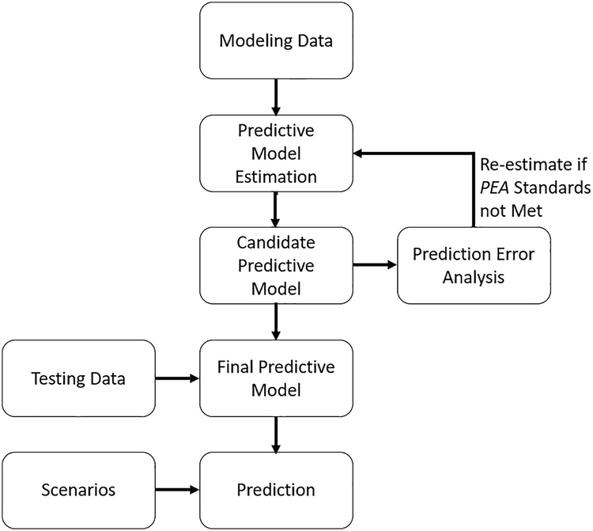

图 6.12 这说明了使用模拟工具进行预测的框架

### 6.7.3 预测应用仿真工具
用单一场景产生预测是一回事，通过改变大量假设来产生多个预测是另一回事，无论是单一的还是一次。对于后一种情况，你需要一个允许用户（无论你是分析师还是你的管理层/客户）为关键输入指定不同设置并生成描述预测的输出的程序。这样的工具就是模拟工具。模拟工具允许你根据可变输入产生不同的预测。
Python 是模拟工具的理想框架，尤其是与 Jupyter notebook 范例结合使用时。笔记本可以在 Markdown 单元中包含简单的指令，然后在代码单元中编写代码，执行这些代码以请求用户输入和显示预测。通过编写 Python 脚本，使用 Jupyter 魔法将这些脚本加载到 Jupyter 笔记本中，应该对用户隐藏模拟工具的编程细节。魔术是执行各种日常任务的简短宏命令。他们通过使重复的例程对用户更透明来简化一些编码。导入脚本文件的魔法是 %load script.py 和 %run script.py（魔法命令以 % 开头）。加载魔法只是加载一个脚本文件，而运行魔法加载并执行脚本文件。模拟工具的加载魔法的问题是脚本文件中的 Python 代码在代码单元中变得可见。如果目标是对用户隐藏代码，那么这种魔法可能不适合使用。 run 魔术执行脚本文件代码，这可能使其成为更好的选择。

## 参考

- Draper, N. 和 H. Smith。 1966. 应用回归分析。纽约：威利。
- Gelman, A. 和 J. Hill。 2007. 使用回归和多级/分层模型进行数据分析。剑桥：剑桥大学。
- Georgantzas, N.C. 和 W. Acar。 1995. 情景驱动的规划：学习管理战略不确定性。韦斯特波特：法定人数书籍。
- 戈德伯格，A.S。 1964. 计量经济学理论。纽约：威利。
- 格林，W.H. 2003. 计量经济分析。第 5 版。恩格尔伍德：普伦蒂斯霍尔。
- Gujarati, D. 2003。基础计量经济学。第 4 版。纽约：麦格劳-希尔/欧文。
- 希尔，R.C.，W.E.格里菲斯和 G.C.林。 2008. 计量经济学原理。第 4 版。纽约：威利。
- Hocking, R.R. 1996。线性模型的方法和应用：回归和方差分析。纽约：威利。
- Kennedy, P. 2003。计量经济学指南。第 5 版。剑桥：麻省理工学院出版社。
- Kmenta, J. 1971。计量经济学要素。纽约：麦克米伦公司。
- 克雷夫特，I.G.和 J. de Leeuw。 1998. 引入多级建模。第 1 版。纽约：SAGE Publications Ltd.
- Lay, D.C. 2012。线性代数及其应用。第 4 版。伦敦：培生教育。
- 卢克，D.A. 2004. 多层次建模。社会科学中的定量应用。纽约：SAGE 出版物。系列/编号 07-143。
- Neter、J.、W. Wasserman 和 M.H.库特纳。 1989. 应用线性回归模型。第 2 版。霍姆伍德：Richard D. Irwin, Inc.
- Paczkowski, W.R.（2018 年。定价分析：产品定价模型和高级定量技术。伦敦：Routledge。
- 帕茨科夫斯基，W.R. 2021b。现代调查分析：使用 Python 获得更深入的见解。柏林：施普林格。
- 雷，J.-C。和 D. 雷。 2008. 营销的多层次建模：入门。 Recherche et Applications en Marketing 23(1), 55–77。
- Shao, J. 2003。数理统计。第 2 版。柏林：施普林格。
- Snijders, T.A.和 R.J.博斯克。 2012. 多级分析：基本和高级多级建模简介。第 2 版。纽约：圣人。
- Strang, G. 2006。线性代数及其应用。第 4 版。波士顿：汤姆森布鲁克斯/科尔。
- Weisberg, S. 1980。应用线性回归。纽约：威利。

## 脚注

[^1]: 如果不使用对数模型，则以 $$\eta _X^Y = {\bar {X}}/{\bar {Y}} \times \beta _1$$ 的平均值评估弹性。有关详细讨论，请参阅 Paczko
[^2]: 在具有常数项的模型的情况下。