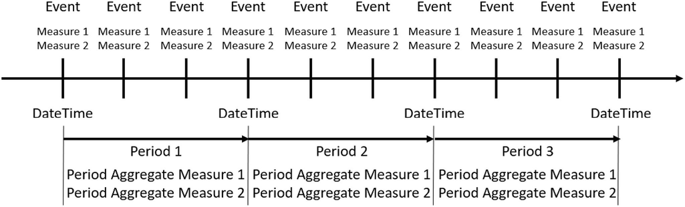
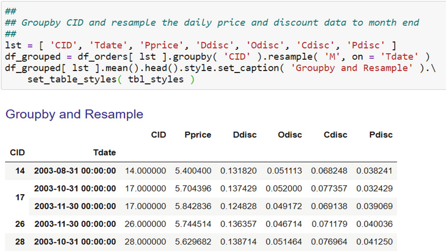
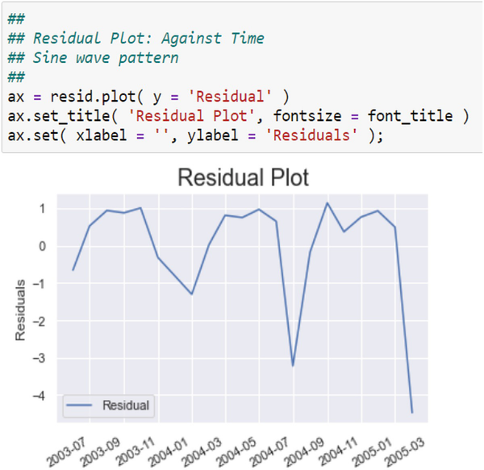
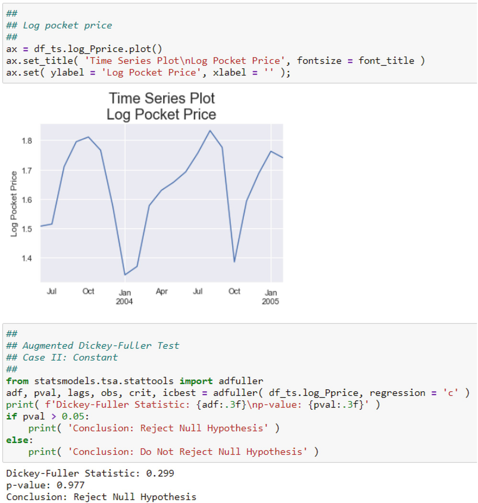

# 时间序列分析
> 沃尔特·R·帕茨科夫斯基[^1]
> 数据分析公司，美国新泽西州普莱恩斯伯勒

数据立方体的时间维度是你在分析业务数据时最终将面临的主要复杂因素，因为时间是大多数业务数据集的一部分。数据，一个时间序列，可能是因为传感器读数每秒，生产过程的每分钟，会计记录的每日，销售和收入处理和报告的每月，法律和监管机构的财务报告每季度，或每年用于股东大会。更复杂的是，时间序列可能与横截面元素混合在一起。横截面数据是在一个时间点为多个单元或对象收集的数据。例如，你可以通过公司拥有或租赁的仓库收集数据，每个仓库都位于不同的州或州的部分。仓库是横截面单元。
横截面数据有其自身的问题，通常每个单元的方差不同。这称为异方差。异方差的含义是我在第 6 章中概述的 OLS 估计器效率不高。如果你测量的任何内容因这些横截面单位和时间而异，那么你就有一个面板数据集，该数据集反映了由于时间和横截面造成的复杂性。与客厅百叶窗数据集一样，交易数据是一个面板数据集：订单由位于不同位置（例如，城市、州、营销区域）和不同时间（例如，每天）的客户收集。事实上，所有的交易数据都是面板数据。这是第 1 章中的数据立方体。我将在第 10 章讨论异方差性和面板数据。这里我的重点完全是时间序列。

## 7.1 时间序列基础

定义时间序列并不像看起来那么简单。事实上，从实践和哲学的角度来看，时间的整个概念是相当复杂的。从实际的角度来看，你需要了解一个时间点的越来越精细的划分。 Python 将一个时间点分为九个组件，其具体值被收集到一个不可变的时间元组中：

1. 年（四位数表示，如 2020）
2. 月（1-12）
3. 天（1-31）
4. 小时（军事小时：0-23）
5. 分钟 （0–59）
6. 秒（0-60）
7. 星期几（0-6；0 是星期一）
8. 一年中的某一天（1 到 366）
9. 夏令时指示器。

如果夏令时有效，则夏令时指示符为 1；如果标准时间有效，则为 0；如果不知道夏令时是否有效，则为 - 1。
当你引入时区、闰年、工作日、工作日、财政年度和日历类型时，计时更加复杂。日历类型是指儒略历和公历；公历今天普遍使用。还有一个日期如何表示的问题。在美国，日期采用 MM/DD/YYYY 格式；在欧洲是 DD/MM/YYYY； ISO 常规格式的 YYYY/MM/DD。 Python，尤其是 Pandas，可以处理任何日期和时间格式。

### 7.1.1 时间序列定义
时间序列基于进行测量的一组时间点 S。在许多应用中，S 是一组离散的等距时间点，S = {0, 1, 2, ..., T}，其中 T 是时间观察次数，解释为最后一个时间点。如果 S 是实时轴上的一个区间，则 S = {0 ≤ t ≤ T} 其中 t 是一个特定的时间点。时间点 t = 0 是时间的开始，称为纪元。在时间 t 进行的事件的观察或测量，称为实现，表示为 Y~t~。观察集合 {Y~t~, t ∈ S} 称为时间序列。[^1]
关于时间序列的一些要点是：
实现，即你观察和记录的数据，是对真实时间序列进行采样的结果，这是一个连续过程。该过程不会断断续续地运行。该系列是实时连续生成的，但你无法观察到这一点。因此，你采样或测量。结果是你的实现，你的样本，将偏离真正的连续序列。这是描述时间序列数据时经常被忽视的一个微妙点。稍后，我将描述从一种时间序列频率转换为另一种时间序列频率的重采样。
时间序列 {Y~t~, t ∈ S} 是一组随机变量，而不是单个随机变量，每个变量都有一个单独的分布。集合中的随机变量之间存在联合分布。这意味着从某个时间点 t 开始，随机变量之间（即不同滞后和超前的 Y 之间）之间存在方差、协方差和相关性。滞后是过去的一段时间；领先是下一个时期。大部分重点是使用滞后数据来指导预测。简单来说：在某个时间点（例如销售额）的任何观察值都与以前的值相关；没有数据点独立于其他数据点。观察值越远，先验值的影响就越小。
单变量时间序列被建模为一系列随机变量的实现，称为时间序列过程。在现代时间序列文献中，术语"时间序列"既指数据，也指生成数据实现的过程。
序列 {Y~t~, t ∈ S} 可以看作是所谓的双重无限集合的子序列：{Y~t~ : t = …, − 2, − 1, 0, 1, 2 , ...} 与今天一样 t = 0。负索引是用于构建模型的历史记录。正指数是预测的未来，有时写为 Y T(h), h = 1, 2, ...。上下文告诉你如何解释 {Y~t~, t ∈ S}。参见 Parzen (1962)。
时间序列由公认的日历约定的连续时间标签组成。这意味着如果你有每月数据，那么每个月的标签在逻辑上都遵循前一个标签。因此，二月在一月之后，三月在二月之后，依此类推。同样，对于年度数据，2020 年在 2019 年之后，2021 年在 2020 年之后。有时间连续性。

### 7.1.2 时间序列概念
要在 Python 中有效地分析时间序列数据，你需要了解两个术语。 Pandas 具有相同的概念，但功能更多。我的大部分讨论都是关于 Pandas 的概念，因为你的数据将位于 Pandas DataFrame 中。
第一个概念是日期时间。这是事件发生时的日期和时间戳，其中两个部分与其名称一致：

1. 日期：事件发生的日期；
2. time：事件发生的时间。

这是一个时间点；时间元组，或者更好的是时间戳。根据事件及其重要性以及测量的潜在用途，标记可以是分、秒甚至更精细的细节。查看日期时间的最佳方式是将时间视为冻结的时刻：表示事件的点。与该事件同时发生的是一个度量，它可以简单地并且至少是一个指示事件发生的标志。通常，有更复杂的度量，要么是分类的，要么是定量的。例如，在线购买被记录（即，时间戳）为特定日期和时间，时间可能精确到分钟。在那一刻记录的度量可以是订购的产品（分类）、价格点（定量）以及任何折扣或特殊促销（分类或定量）。
第二个概念是周期。这是日期和时间的间隔，是一种逻辑分组，尽管与日期或时间区分开来的间隔并不总是很清楚。首先，一周是一个间隔：它由7天组成，所以一周是一个周期；一个月是一个时期；一个季度和一年也是如此。一天可以是一个时期，但日期不是，因为日期是一个单一的实体。该时期涉及以逻辑方式汇总日期时间度量。如果日期时间度量只是一个产品被购买的指标，那么逻辑聚合就是一天中的订单数；日子是期间。如果日期时间订单事件的衡量标准是扣除特殊促销的价格，那么逻辑聚合是一天中订单的平均价格。
本次讨论涉及四个概念：

1. 一个事件;
2. 作为该事件的时间点的日期时间值；
3. 在该时间点为该事件采取或观察到的措施；
4. 一个时期作为日期时间值的跨度。

正如我刚才提到的，这些措施可以在每个时期汇总，并将在下面进一步讨论。我在图 7.1 中说明了这四个概念之间的关系。前三个由数据收集系统记录，在大多数情况下，由你的 IT 部门维护。周期当然可以由你的 IT 部门提供，但通常你必须创建分析所需的周期。你将以 CSV 或其他格式导入包含日期、度量和其他数据的数据文件，然后将 IT 提供的日期解析为 Pandas 日期时间值。从那时起，你可以将日期时间分组为逻辑周期（例如，月份），并根据你的需要聚合度量。我将在下面解释和说明如何解析日期时间、对日期时间值进行分组以及聚合度量。



图 7.1 四个概念之间的关系如下图

## 7.2 导入日期/时间变量

如果你导入一个 CSV 文件，其中包含一个应该被解释为日期和时间的字符串变量，你可以将 parse_dates 参数与该变量一起使用。 Pandas 会自动将字符串解释为日期和时间，并创建适当的日期时间变量。

## 7.3 数据立方体和时间序列数据

我在第 1 章中描述了 Data Cube，并在图 1 中进行了说明。 5.它具有三个维度：度量、空间和时间。正如我在第 1 章中提到的，如果你折叠空间维度，你就会为度量生成一个时间序列。我在图 7.2 中说明了一种折叠数据立方体的方法。分为三个步骤：

1. 如果不存在，则创建一个日期时间变量。
    
    图 7.2 可以通过聚合使用访问器 dt 从日期时间值中提取的时期的度量来折叠数据立方体。聚合是使用 groupby 和聚合函数完成的
2. 使用访问器 dt 和适当的期间选项（例如，月份）访问 datetime 变量中的期间。
3. 聚合数据。

为了聚合日期时间度量，你可能必须访问逻辑日期或时间来进行聚合。你可以使用 Pandas 访问器 dt 和适当的部分访问或提取日期时间值的重要部分，例如月、年、星期几等。你只需将日期时间值、访问器和你想要的部分链接起来。例如，要从日期时间值 x 中获取月份，请使用 x.dt.month。我在表 7.1 中列出了一些访问器的可能性。基本上，访问器会为你提供诸如周、月、季度和年之类的周期。稍后我将描述访问器 dt。
表 7.1 这些是日期时间访问器命令 dt 的示例。符号 x 是日期时间，例如 x = pd.to_datetime(pd.Series([‘06/15/2020’]))。访问器应用于从系列创建的日期时间变量。注意：月份为一月 = 1，十二月 = 12；第 1 天、第 2 天、...、第 31 天

| 提取时间     | 提取命令           |
| ------------ | ------------------ |
| Day          | x.dt.day           |
| Day name     | x.dt.day_name( )   |
| Week number  | x.dt.week          |
| Week-of-year | x.dt.weekofyear    |
| Month        | x.dt.month         |
| Month name   | x.dt.month_name( ) |
| Quarter      | x.dt.quarter       |
| Year         | x.dt.year          |

## 7.4 在 Python 和 Pandas 中处理日期和时间
Python 和 Pandas，尤其是 Pandas，具有丰富的日期和时间功能。基本单位是日期时间，它是特定时刻的时间戳。该时刻由日期（例如，2020 年 6 月 17 日）、一小时、一分钟和一秒来标识。格式为字符串：YYYY-MM-DD 00:00:00。小时为 24 小时制或"军用时间"格式。例如，"2020-06-17 01:23:05"是 2020 年 6 月 17 日午夜 1 点 23 分 5 秒。该字符串实际上表示自基准时间（纪元）以来的秒数。 Pandas 时代，1970 年 1 月 1 日，可以使用函数来转换日期时间值。[^2] 我在图 7.3 中提供了一个示例。


图 7.3 此示例中的此函数将日期作为日期时间整数返回。这个整数是自 1970 年 1 月 1 日 Pandas 纪元以来的秒数。Unix 纪元是 1960 年 1 月 1 日
使用 datetime 值允许你进行各种日历计算。例如，你可以在给定任何日期时间值的情况下计算星期几、月份中的某天、月份、年份等。有关历法计算，请参见 Dershowitz 和 Reingold (2008)。
你可以用多种格式编写日期。 Pandas 足够聪明，可以将它们全部解释为日期。例如，你可以使用以下任何一种：

- 2020 年 6 月 15 日
- 2020 年 6 月 16 日
- 2020-06-17
- 2020 年 6 月 18 日
- 2020 年 6 月 19 日

并获得正确的连续日期时间值。我在图 7.4 中展示了这一点。写为 2020 年 6 月的日期被解释为 2020 年 6 月 1 日，即当月的第一天。


图 7.4 这些是连续的日期，每个日期都以不同的格式书写。每种格式都是表示日期的典型方式。 Pandas 以相同的方式解释每种格式并生成日期时间值，即自纪元以来的秒数。标有"时间增量"的列是日常变化。请注意，它始终是 86,400，这是一天中的秒数

### 7.4.1 日期时间与期间

如上所述，日期时间是一个特定的时间点。它发生在诸如订单或交付或制造机器人故障之类的事件发生时。形成连贯的、逻辑的整体或实体的一系列日期时间是一个时期。一个时期跨越一系列日期时间。然后可以按时间段对事件进行逻辑分组。例如，你可以在 7 天内每天发出一系列产品订单。它们可以在一周内进行逻辑分组和分析。周是期间。你可以有一个月的订单，所以一个月是一个时期。你还可以为生产机器人每秒读取一次传感器读数，但将传感器读数汇总为 5 分钟间隔，即周期。你可以将期间视为一组日期时间的容器。
Pandas 能够处理句点和日期时间。事实上，日期时间和周期是 Pandas 中的两个基本时间概念。[^3]

### 7.4.2 聚合日期时间度量

一旦从日期时间值访问了逻辑分组，你就可以聚合日期时间度量。有一个名为 groupby 的非常有用的函数，正如它的名字所说的那样：它按某些东西对数据进行分组。这个函数实际上是通过 DataFrame 中的一个或多个变量对 DataFrame 的行进行分组。它返回一个分组变量，其中包含有关分组的所有信息，但它本身不返回分组的 DataFrame。

### 7.4.3 在 Pandas 中转换时间段

除了访问期间，你还可以从一个期间指定转换为另一个。如果一个是按月频率，另一个是按季度频率，你可能必须在合并两个 DataFrame 之前执行此操作。你可以在同一日期拥有大量交易记录，只是交易时间有所不同。由于数据量巨大，这可能不切实际，不要忘记与数据的精细时间粒度有关的统计问题。你可能希望将交易汇总到较低的频率级别，例如每月一次。你可以通过使用 resample 方法或 groupby 方法来完成此操作。这些是不同的方法，但可以一起使用。 resample 方法根据日期时间变量对 DataFrame 的行进行分组。我在表 7.2 中总结了一些可用的选项。例如，如果你的订单数据是每日的，它将把同一个月的所有每日记录组合在一起。 groupby 方法也对记录进行分组，但它根据 DataFrame 中的变量对它们进行分组，这些变量不一定是日期时间变量。你可以将两者与 groupby 之后的 resample 一起使用。按此顺序，你对空间数据进行分组，然后将时间度量折叠到更方便的级别。我在图 7.5 中说明了这种方法。



图 7.5 groupby 方法和 resampling 方法可以这样组合：首先通过 groupby 方法对 DataFrame 的行进行分组，然后通过 resample 方法转换每组的时间频率
表 7.2 这是与 date_range 函数的"freq"参数一起使用的可用频率和别名的简短列表。 完整列表可在 McKinney (2018, p. 331) 中找到

| 频率别名 | 描述         |
| -------- | ------------ |
| B        | Business day |
| D        | Calendar day |
| W        | Weekly       |
| M        | Month end    |
| Q        | Quarter end  |
| A or Y   | Year end     |

在空间和时间上对数据进行分组的一种更有效的方法是使用 Pandas Grouper 函数对时间维度进行分组。它将一个键作为参数，该键是一个日期时间变量和一个频率指示器。我在图 7.6 中说明了这种方法。此 Grouper 方法不限于对日期时间变量进行分组。它可以方便地对任何类型的数据进行分组。我在图 7.7 中说明了这一点。


图 7.6 调用 groupby 方法，并为要分组的变量添加一个附加参数。附加参数是按日期时间变量分组的 Grouper。这个方法有两个参数：一个标识日期时间变量的键和一个要转换的频率。为方便起见，可以将 Grouper 放置在单独的变量中，正如我在这里展示的那样


图 7.7 groupby 方法仅在 Grouper 规范中调用
resample 方法的参数是转换数据的规则和转换应该基于的对象。你要转换的期间是新期间的符号表示的规则："M"代表月份，"Q"代表季度，"A"代表年度，等等。如果你将每日数据转换为每月数据，则数据应转换到月份中的哪个点是不明确的。你有选择。 "M"代表日历月结束，但你可以使用日历月开始（"MS"）。季度和年度也是如此。请参阅 McKinney (2018, p. 331) 获取部分但全面的列表。我在表 7.2 中列出了一些。转换的对象可以是 DataFrame 中的索引或变量，但在任何一种情况下，它都必须是 datetime 对象，否则没有可用于转换的日期。
resample 方法生成一个类型为 DatetimeIndexResampler 的新对象，其中包含有关重新采样的信息，但它不显示重新采样的数据。你必须对对象进行操作，可能是通过应用 sum 或 mean 函数，并将聚合数据保存在新的 DataFrame 中。我在图 7.8 中对此进行了说明。


图 7.8 家具日交易数据被重新采样为月数据，然后对月进行平均。月末规则为"M"，对象为 Tdate，聚合为均值

### 7.4.4 日期时间迷你语言

Pandas 和 Python 都有一种迷你语言，可让你读取（即解析）或编写任何专门的数据和时间格式。例如，你的日期格式可能为 2021M01 或 2021Q01，它们分别代表 2021 年的第三个月（三月）和同年的第一季度。要读取其中一个，请使用 Python 函数 strptime 或将其中一个写入文件使用 strftime。每个都有两个参数：作为字符串的日期和作为迷你语言字符串的格式。例如，strptime('2021M01','%YM%m') 将解析月字符串，strptime('2021Q01','%YQ%q') 将解析季度字符串。注意百分号的使用；这表示迷你语言元素。有关迷你语言元素的列表，请参阅 McKinney (2018)。总结参见表 7.3。
表 7.3 这是 Python/Pandas 日期时间迷你语言的缩写列表。有关更大的列表，请参阅 McKinney (2018)

| Code | Meaning                                              | Example       |
| ---- | ---------------------------------------------------- | ------------- |
| %a   | Weekday as locale’s abbreviated name                 | Mon, Tue      |
| %A   | Weekday as locale’s full name                        | Monday        |
| %d   | Day of the month as a zero-padded decimal number     | 30            |
| %b   | Month as locale’s abbreviated name                   | Sep           |
| %B   | Month as locale’s full name                          | September     |
| %m   | Month as a zero-padded decimal number                | 09            |
| %-m  | Month as a decimal number (Platform specific)        | 9             |
| %q   | Quarter as a decimal number                          | 01 …04        |
| %y   | Year without century as a zero-padded decimal number | 21            |
| %Y   | Year with century as a decimal number                | 2021          |
| %H   | Hour (24-h clock) as a zero-padded decimal number    | 00, 01, …, 23 |
| %I   | Hour (12-h clock) as a zero-padded decimal number    | 01, 02, …, 12 |
| %M   | Minute as a zero-padded decimal number               | 00, 01, …, 59 |
| %S   | Second as a zero-padded decimal number               | 00, 01, …, 59 |

你可以创建一个自定义解析器（或编写器）为 custom_date_parser = lambda x: datetime.strptime(x, "%YM%m") 然后在 Pandas 读取语句中使用它： pd.read_csv(path + file, parse_dates = [ '日期']，date_parser = custom_date_parser)。
## 7.5 一些历法计算
你可以并且将使用 datetime 变量进行一些常规日历计算。这些是：
移动或滞后时间序列；

- 区分时间序列；
- 计算期间-期间百分比变化。

滞后意味着整个系列按你指定的周期数移动，从而创建一个新系列；默认滞后是一个周期。当你滞后一个系列时，第一个观察结果将成为新系列的第二个观察结果；第二个观测值成为新系列中的第三个观测值；等等。新系列中的第一个观察值填充了 NaN 值。你使用带有滞后数参数的 shift 方法滞后系列。例如，```df['lag_X_1'] = df.X.shift(periods = 1)``` 将 DataFrame df 中的变量 X 滞后一个周期，并将新的滞后序列放在 DataFrame 中，名称为"lag_X_1"。 shift 方法是矢量化的，这意味着它可以一次对原始序列进行操作，而无需 for 循环。许多 Pandas 函数被矢量化，这是一个非常方便的特性。
差分涉及找到同一变量的观察与先前观察之间的差异：X~t~ - X~t~-1。差异成为新变量中的第二个观察值，依此类推。一个 NaN 填充了新系列的第一个观察结果。默认差异是一个期间。一个周期差称为一阶差；两个周期的差异是第二个差异，依此类推。
百分比变化只是第一个差异除以第一个值。你可以使用 pct_change 方法。默认值为一个周期百分比的变化。
滞后和差异是时间序列模型的关键部分，尤其是我将在本章后面简要讨论的随机模型。

## 7.6 时间序列生成过程：AR(1) 模型
这当然不是讨论，甚至开始讨论时间概念的地方。有许多与看似简单的日常现象相关的深刻哲学问题。但我可以讨论的是时间事件是如何相关的。考虑一个物理系统，例如乐器，比如吉他。[^4] 最初，在某个基本时间，吉他处于静止状态；一个稳定的状态。在此状态下，吉他不会发出声音。将分贝 (db) 计放在吉他旁边，然后拨动吉他上的一根弦。由琴弦振动产生的声音在仪表上记录为 db 0。琴弦从静止的初始状态受到干扰。设 0 为这种扰动，它是一种随机冲击。那么db~0~ = a~0~。假设 $$a_0 \sim \mathcal {N}(0, \sigma _a^2)$$。
拨弦的时间是 t~0~，即纪元或时间的开始。等待 1 秒到时间 t~1~，然后再次拨弦。在 t~1~ 时在仪表上记录为 db~1~ 的声音是由于新的声音加上在 t~0~ 的前一个声音留下的。剩余的声音是由于空气摩擦减慢了振动而导致琴弦振动衰减的结果。令剩余的前一个声音的比例为 ρ，并假设它是一个常数，与时间段无关。显然，0 ≤ ρ < 1。总声音为 db 1 = ρ × db~0~ + a~1~ 其中 a~1~ 是在 t~1~ 处创建的新声音的仪表读数。这是拨动琴弦所带来的对整体声音的随机冲击。如果第二根弦没有被触动，那么 t 1 处的总声音就是 db 1 = ρ × db~0~ = ρ × a~0~。
如果 ρ = 0，则没有前一周期的衰减或残留声音；任何声音都是全新的。如果 ρ = 1，则没有阻尼，因此有前一时期的完整剩余物。请注意，由于摩擦，ρ > 1 是不可能的；否则，声音会越来越大，变得无限震耳欲聋，危及生命。
假设你在 t~2~ 时再次拨弦。总声音是 t~0~ 的余数，加上 t~1~ 的余数，再加上 t~2~ 的新声音或干扰。即 t~2~ 时的总和为
$$
\displaystyle \begin{aligned} \begin{array}{rcl} db_2=\displaystyle \rho \times db_1 + a_2 \end{array} \end{aligned}
$$

$$
\displaystyle \begin{aligned} \begin{array}{rcl}=\displaystyle \rho \times (\rho \times db_0 + a_1) + a_2 \end{array} \end{aligned}
$$

$$
\displaystyle \begin{aligned} \begin{array}{rcl}=\displaystyle \rho^2 \times db_0 + \rho \times a_1 + a_2 \end{array} \end{aligned}
$$

$$
\displaystyle \begin{aligned} \begin{array}{rcl}=\displaystyle \rho^2 \times a_0 + \rho \times a_1 + a_2. \end{array} \end{aligned}
$$

这可以推广到任何时间 t，如
$$
\displaystyle \begin{aligned} \begin{array}{rcl} db_t=\displaystyle \rho \times db_{t - 1} + a_t \end{array} \end{aligned}
$$

$$
\displaystyle \begin{aligned} \begin{array}{rcl} {}=\displaystyle \sum_{i = 0}^t \rho^i \times a_{t - i}. {} \end{array} \end{aligned}
$$

时间 t 处的总声音是一直到 epoch 的加权扰动。权重，提高到越来越高的幂，保证了早期的声音几乎没有影响。此处遵循的过程称为反向替换。请注意，我从未提到 ρ < 0 的情况。如果 ρ < 0，那么显然声音会根据 (7.6.6) 在变大和变软之间振荡，这是我们在现实中看不到的。
现在将符号重新定义为任何时间序列度量，例如每月销售额或每周原材料交付。让 Y~t~ 成为这个度量。然后
$$
\displaystyle \begin{aligned} \begin{array}{rcl} Y_t=\displaystyle \rho \times Y_{t - 1} + a_t \end{array} \end{aligned}
$$

$$
\displaystyle \begin{aligned} \begin{array}{rcl}=\displaystyle \sum_{i = 0}^t \rho^i \times a_{t - i}. \end{array} \end{aligned}
$$

基本模型为 Y~t~ = ρ × Y~t−1~ + a~t~。这是一个没有截距的回归模型，它涉及对随机变量 Y t 自身进行回归（尽管有滞后）。因此，这被称为自回归模型。右侧一个周期的滞后是模型的阶数。因此，该模型是一阶模型或 AR(1) 的自回归模型。正如我上面所展示的，这可以写成回溯到时代的干扰的总和，t = 0。
AR(1) 模型可以应用于回归模型中的干扰项，以便回归模型的完整规范（为简单起见，使用单个变量）为

$$
\displaystyle \begin{aligned} \begin{array}{rcl} Y_t=\displaystyle \beta_0 + \beta_1 \times X_t + \epsilon_t \end{array} \end{aligned}
$$

$$
\displaystyle \begin{aligned} \begin{array}{rcl} {} \epsilon_t=\displaystyle \rho \times \epsilon_{t - 1} + a_t {} \end{array} \end{aligned}
$$

与 ρ < ∣1∣ 和 $$a_t \sim \mathcal {N}(0, \sigma _a^2)$$。如果 ρ = 0，则 𝜖 t = a t 和来自第 6 章的 OLS 模型的结果。 ρ称为自相关系数。对于大多数（如果不是全部）业务数据，0 ≤ ρ < 1 表示正自相关。
由于 (7.6.10) 是一个回归模型，ρ 的估计量是根据残差并使用第 6 章的结果来写的。你可以立即写
$$
\displaystyle \begin{aligned} \begin{array}{rcl} \hat{\rho}=\displaystyle \dfrac{\sum_{t = 2}^T e_{t} \times e_{t - 1}}{\sum_{t = 1}^T e_t^2}. {} \end{array} \end{aligned}
$$
这个扰动项的 AR(1) 模型对 OLS 估计有影响。特别是，可以证明 OLS 估计量 和 是线性且无偏的，但它们在线性无偏估计量类中不再具有最小方差。违反了高斯-马尔可夫定理。这意味着假设检验会导致你得出错误的结论，这意味着你将获得较差的信息，而不是丰富的信息。参见 Greene (2003)、Gujarati (2003)、Hill 等人。 (2008) 和 Goldberger (1964) 进行讨论。
由于 OLS 估计器在 AR(1) 干扰项下不再有效，你需要检查你的时间序列模型是否实际上具有 ρ > 0。有两个检查：图形检验和正式统计检验。我将在以下部分中进行回顾。

## 7.7 AR(1) 检测的可视化
(7.6.10) 的问题是扰动项的 AR(1) 规范。干扰的代表是残差，$$e_t = Y_t - \hat {Y_t}$$。回想第 6 章中的 e~i~ ≈ 𝜖~i~。因此，最简单的视觉效果是残差与时间的关系图。有两种签名模式可供寻找：正弦波和锯齿状锯齿状外观。
正弦波特征表示正自相关（即 ρ > 0），因为正残差倾向于跟随正残差，而负残差倾向于跟随负残差，因此呈现正弦波外观。如果残差一直在增加，则它们的趋势是继续增加。然而，回想一下，扰动项（7.6.10）的部分 AR(1) 模型是一个单独的扰动项，a~t~。如果该术语在任何时间点都很大，它可能会压倒正面（或负面）模式并扭转系列。只要这些额外的干扰很小，那么整个系列就会呈上升或下降趋势。
但是，如果存在负自相关（即 ρ < 0），则残差的时间模式是不稳定的，具有锯齿状的锯齿模式，没有潜在的正弦波。负 ρ 意味着正残差后面跟着负残差，而负残差后面跟着正残差，依此类推。这与 ρ > 0 的情况不同。（7.6.10）中添加的干扰项仍然会产生影响，可能会增加更多的锯齿状图案。
我在图 7.9 中说明了原木单位销售对原木口袋价格的回归模型的残差提取，但对于时间序列数据。我在第 6 章中用横截面数据估计了同样的模型。接下来我在图 7.10 中绘制了时间序列残差。请注意正弦波模式表明干扰项存在正自相关。这反映了格式塔共同命运和联系原则。


图 7.9 原木单位销售时间序列模型对原木口袋价格的残差检索



图 7.10 图 7.9 中的残差随时间绘制。明显的正弦波外观
第二种类型的图表使用残差（Y 轴）与它们的一个周期滞后值（X轴）。由于残差的平均值为零（因为第 6 章中残差之和为零），你可以在零处绘制垂直和水平线，将绘图区域划分为四个象限。左上象限中的图点表示负自相关（即 ρ < 0），因为负滞后残差与正未滞后残差相关。其他三个象限有明显的解释。我在表 7.4 中列出了四种可能性，然后在图 7.11 中提供了图 7.9 中残差的图。这反映了格式塔接近和相似原则。


图 7.11 图 7.9 中的残差与它们的滞后值作图。大多数点落在右上象限，表明基于表 7.4 的正自相关。该图也可以使用 Pandas 函数 pd.plotting.lag_plot( series ) 生成，其中"series"是残差系列
表 7.4 残差（Y 轴）与一个周期滞后残差（X 轴）的图表可分为四个象限。自相关由签名标识：大多数点落入的象限。当然，四个象限之间会有随机变化，但大多数点所在的位置有助于识别自相关

| Quadrant | Location    | Autocorrelation  |
| -------- | ----------- | ---------------- |
| I        | Upper left  | Negative (ρ < 0) |
| II       | Upper right | Positive (ρ > 0) |
| III      | Lower left  | Positive (ρ > 0) |
| IV       | Lower right | Negative (ρ < 0) |

## 7.8 Durbin-Watson 检验统计量
图表很容易生成，它们可以根据我刚刚讨论的签名来暗示模式。然而，它们并非万无一失。两个人可以查看完全相同的图表并看到不同的东西。这并不新鲜。之前已经多次观察和讨论过。例如，萨缪尔森（Samuelson，1973 年，第 11 页，强调原文）通过呈现人们解释不同的两个图像来论证"任何科学中不可简化的主观因素"。 Samuelson (1973, p. 11) 评论说，实际上"客观上可重现"的形状会"根据其出现的上下文而在主观上有所不同"。因此，即使是一个人也可能根据他们的上下文有不同的解释。另请参阅 Peebles 和 Ali (2015) 以及 Stewart (2019, p. 196)，了解有关这一现象的其他一些讨论。就我们的目的而言，这意味着，尽管图表易于创建、有用且可以提供信息，但它们只是识别模式的第一步，而这正是我在第 1 章中所强调的。 4. 可能仍需要正式测试。
最古老的干扰项自相关测试之一是 Durbin-Watson 测试。参见任何计量经济学文本，例如 Gujarati (2003)、Hill 等人。 （2008 年）和格林（2003 年）。有许多这样的测试可用，但它们都以 Durbin-Watson 测试为基础。更重要的是，几乎所有的统计软件都会自动计算并呈现这个测试统计量。例如，你可以在图 2-3 中看到它。 6. 3 和 6. 6.
Durbin-Watson 检验统计量定义为

$$
\displaystyle \begin{aligned} \begin{array}{rcl} d=\displaystyle \dfrac{\sum_{t = 2}^T \left(e_t - e_{t - 1}\right)^2}{\sum_{t = 1}^T e^2_t} \end{array} \end{aligned} 
$$
其中 T 是时间序列观测的总数。原假设为 H 0: ρ = 0，备择假设为 H A: ρ ≠ 0。共有三个假设：
1. 扰动是由 AR(1) 过程产生的；
2. 模型不包含滞后因变量；
3. 模型有一个常数项。

要评估 Durbin-Watson d 统计量，请注意你可以将其写为

$$
\displaystyle \begin{aligned} \begin{array}{rcl} d=\displaystyle \dfrac{\sum_{t = 2}^T e^2_t + \sum_{t = 2}^T e^2_{t - 1} - 2 \times \sum_{t = 2}^T e_t \times e_{t - 1}}{\sum_{t = 1}^T e^2_t}. \end{array} \end{aligned}
$$
在大样本中，$$\sum _{t = 2}^T e^2_t \approx \sum _{t = 2}^T e^2_{t - 1}$$ 所以

$$
\displaystyle \begin{aligned} \begin{array}{rcl} d=\displaystyle \dfrac{2 \times \sum_{t = 2}^T e^2_t - 2 \times \sum_{t = 2}^T e_t \times e_{t - 1}}{\sum_{t = 1}^T e^2_t} \end{array} \end{aligned} 
$$

$$
\displaystyle \begin{aligned} \begin{array}{rcl}=\displaystyle 2 \times \left(1 - \dfrac{\sum_{t = 2}^T e_t \times e_{t - 1}}{\sum_{t = 1}^T e^2_t}\right) \end{array} \end{aligned}
$$

$$
\displaystyle \begin{aligned} \begin{array}{rcl}=\displaystyle 2 \times (1 - \hat{\rho}). \end{array} \end{aligned}
$$

$$\hat {\rho }$$ 来自 (7.6.11)。作为经验法则，d 统计量的值"接近"2 表示没有自相关。我在表 7.5 中提供了 Durbin-Watson d 统计量及其隐含自相关的范围。有一些正式的表格可帮助你确定自相关，但"接近"2 的经验法则通常足以满足实证研究的需要。
表 7.5 这些是 Durbin-Watson 检验统计量的一些指南或经验法则。 d 的理想值显然是 2

| Durbin-Watson value | ρ                         | Autocorrelation  |
| ------------------- | ------------------------- | ---------------- |
| d = 2               | $$\hat {\rho } = 0$$      | None (Desirable) |
| d = 4               | $$\hat {\rho } = -1$$     | Negative         |
| 2 < d < 4           | $$-1 < \hat {\rho } < 0$$ | Negative         |
| d = 0               | $$\hat {\rho } = +1$$     | Positive         |
| 0 < d < 2           | $$0 < \hat {\rho } < 1$$  | Positive         |

然而，Durbin-Watson d 统计量存在四个问题：

1. 它仅适用于 AR(1)。 AR(2) 或其他更复杂的过程可能会产生一些干扰。
2. 周围有一个不确定的区域——这是"关闭"的基础。
3. 模型不能包含滞后因变量。许多模型都有这个变量来捕捉动态。在这种情况下，d 统计量偏向于 2。可以使用 Durbin-Watson 的变体，称为 Durbin 的 h 统计量。 Durbin 的 h 统计量定义为
    $$
    \displaystyle \begin{aligned} \begin{array}{rcl} h = \left(1 - \dfrac{d}{2}\right) \times \sqrt{\dfrac{T}{1 - T \times s_{\hat{\beta_1}}^2}} \end{array} \end{aligned}
    $$
    其中 d 是 Durbin-Watson d 统计量，$$\hat {\beta _1}$$ 是方差 $$s_{\hat {\beta _1}}^2$$ 的滞后因变量的系数。注意 $$h \sim \mathcal {N}(0, 1)$$。
4. 它假设没有遗漏观察。

最后一个问题实际上是一个限制，而且是一个阴险的限制。如果你有一个较长的时间序列，那么你可能会丢失任何时间段的值。正如我在第 1 章中讨论的那样，它们必须被"填充"。 6. 我在图 7.12 中说明了这一点，首先将单位销售额和零用价数据重新采样为月度序列，然后通过求和聚合销售额并通过平均聚合价格。如果特定月份的原始订单数据中有任何缺失值，则该月的销售额总和应为零，平均价格应为 NaN。然后我使用图 7.13 中的 info( ) 方法检查缺失值，其中 2003 年 12 月有一个。我使用 Pandas interpolate( ) 方法填充 NaN 值，如图 7.14 所示.


图 7.12 单位销售额和零用价数据按月重新采样，然后汇总。如果该月没有销售，则该月的销售总和为零。那个零值被替换为 NaN


图 7.13 检查重新采样和聚合的订单数据是否存在缺失值。请注意，有 21 条记录，但 20 条有非空数据


图 7.14 使用 Pandas Interpolate( ) 方法填充缺失值
一旦准备好时间序列 DataFrame，就可以估计回归模型并重新检查 Durbin-Watson d 统计量。我在图 7.15 中展示了一个回归估计。请注意，Durbin-Watson 统计量为 1.387，表示正自相关。这种自相关问题可以使用 Cochrane-Orcutt 程序进行校正，该程序是可用的几种校正方法之一。这个特定的涉及使用 (7.6.11) 估计自相关系数 ρ。然后在以下步骤中使用它。一、滞后模型一个时期得到
$$
\displaystyle \begin{aligned} \begin{array}{rcl} Y_{t - 1}=\displaystyle \beta_0 + \beta_1 \times X_{t - 1} + \epsilon_{t - 1}. \end{array} \end{aligned}
$$


图 7.15 Durbin-Watson 统计量较低，1.387
现在乘以 ρ 使得

$$
\displaystyle \begin{aligned} \begin{array}{rcl} \rho \times Y_{t - 1} =\displaystyle \rho \times \beta_0 + \beta_1 \times \rho \times X_{t -1} + \rho \times \epsilon_{t - 1}. \end{array} \end{aligned}
$$
从原始模型中减去滞后模型得到

$$
\displaystyle \begin{aligned} Y_{t} - \rho \times Y_{t - 1}=\beta_0 \times (1 - \rho) + \beta_1 \left(X_{t} - \rho \times X_{t - 1}\right) + \left(\epsilon_{t} - \rho \times \epsilon_{t - 1}\right). \end{aligned}
$$
或者

$$
\displaystyle \begin{aligned} \begin{array}{rcl} Y_{t}^* =\displaystyle \beta_0^* + \beta_1 \times X_{t}^* + u_{t}. \end{array} \end{aligned}
$$
你现在可以将 OLS 应用于此转换后的模型以估计未知参数。这是 Cochrane-Orcutt 程序。大多数实现此过程的软件都会对其进行多次迭代以获得最佳估计解决方案。该估计器属于更广泛的估计器家族，称为广义最小二乘 (GLS) 估计器家族。我在图 7.16 中展示了一个示例，它是图 7.15 中结果的延续。


图 7.16 经过 GLS 校正后，Durbin-Watson 统计量仅略有改善至 1.399

## 7.9 滞后因变量和自变量

我考虑的模型有一个与因变量同时存在的自变量。这是一个静态模型：自变量的影响是即时的，没有任何结转或长期影响。你当然可以包括更多同时期的自变量，但含义是相同的。你仍然有一个静态模型。你可以引入一个动态模型，但包括滞后的因变量和自变量。你可以将因变量最多滞后 p 个周期，并将自变量最多滞后 q 个周期。整个模型称为 p 和 q 阶的自回归分布式滞后模型 (ARDL(p, q))。静态模型是 ARDL(0, 0)。我将简要提及几个变体。

### 7.9.1 滞后自变量：ARDL(0, 1)

对静态模型最简单的扩展是添加滞后一个时期的自变量。你使用 Pandas shift 方法及其默认值来创建一个周期的滞后。那么模型将是：

$$
\displaystyle \begin{aligned} \begin{array}{rcl} Y_t=\displaystyle \beta_0 + \beta_1 \times X_t + \beta_2 \times X_{t - 1} + \epsilon_t. \end{array} \end{aligned}
$$
这是通过在获得平衡值时检查其行为来分析的。这些值是通过对模型双方的期望值得出的长期值。令 $$\tilde {Y}$$ 和 $$\tilde {X}$$ 为长期均衡值。该模型，在收集了类似的术语之后，是：

$$
\displaystyle \begin{aligned} \begin{array}{rcl} \tilde{Y}=\displaystyle \beta_0 + \beta_1 \times \tilde{X} + \beta_2 \times \tilde{X} \end{array} \end{aligned} 
$$

$$
\displaystyle \begin{aligned} \begin{array}{rcl}=\displaystyle \beta_0 + (\beta_1 + \beta_2) \times \tilde{X}. \end{array} \end{aligned}
$$

### 7.9.2 滞后因变量：ARDL(1, 0)

你只能包含滞后因变量，以便模型为：

$$
\displaystyle \begin{aligned} \begin{array}{rcl} Y_t=\displaystyle \beta_0 + \beta_1 \times X_t + \beta_2 \times Y_{t - 1} + \epsilon_t. \end{array} \end{aligned}
$$

### 7.9.3 滞后因变量和自变量：ARDL(1, 1)

你可以包括滞后因变量和滞后自变量，以便模型为：

$$
\displaystyle \begin{aligned} \begin{array}{rcl} Y_t=\displaystyle \beta_0 + \beta_1 \times X_t + \beta_2 \times X_{t - 1} + \beta_3 \times Y_{t - 1} + \epsilon_t. \end{array} \end{aligned} 
$$
应该清楚的是，扩展很快变得更加复杂。有关详细的技术讨论，请参阅 Dhrymes (1971)，有关这些模型的更多基本讨论，包括估计问题，请参阅 (Dougherty, 2016, 第 11 章)。

## 7.10 时间序列分析的进一步探索
由于因变量、自变量和干扰项的滞后结构，时间序列建模会变得非常复杂。对时间序列建模的问题和方法的讨论超出了本书的范围。有关详细介绍，请参阅 Box 等人。 (1994)。有关以管理为重点的高级介绍，请参见 Nelson (1973)。有关在具有一定方法背景的新产品开发中使用时间序列分析的信息，请参阅 Paczkowski (2020)。
尽管时间序列建模是一个极其复杂的主题，但我仍然可以突出一些特征。我将考虑一个非常广泛的通用模型，有时称为随机时间序列模型、时间序列模型或 Box-Jenkins 模型，它以普及该方法的 Box 和 Jenkins 命名。见 Box 等人。 （1994）进行了完整的讨论和发展。在这类模型中，随机元素 𝜖 起主导作用，而不仅仅是计量经济学中严格确定性模型的附加误差（即干扰）。此外，此类模型不包含自变量。时间序列的完整解释基于序列本身的滞后结构和扰动项。
我将按照程序

1. 开发模型：AR(p)、MA(q)、ARMA(p, q) 或 ARIMA(p, d, q)；
2. 计算时间序列的平均值；
3. 计算时间序列的方差和协方差；
4. 计算时间序列相关性：自相关函数（ACF）和偏自相关函数（PACF）。

最后两个有助于确定时间序列模型的类型，这是上面第一点中列出的四个模型之一：p 阶的自回归模型 (AP(p))、q 阶的移动平均值 (MA(q))、 p, q 阶的自回归移动平均值 (ARMA(p, q)) 和 p, d, q 阶的自回归积分移动平均值 (ARIMA(p, d, q))。 p 和 q 阶分别用于变量和干扰的滞后。 d 是系列差分的次数。我还将讨论构建模型的过程，该过程涉及多个步骤。
自相关是识别一个模型或一组候选模型的关键。它们基于时间序列的自协方差 γ~k~。如果时间序列 Y t 来自均值为 μ 的分布，则

$$
\displaystyle \begin{aligned} \begin{array}{rcl} \gamma_k=\displaystyle COV(Y_t, Y_{t - k}) \end{array} \end{aligned} 
$$

$$
\displaystyle \begin{aligned} \begin{array}{rcl}=\displaystyle E[(Y_t - \mu) \times (Y_{t - k} - \mu)] \end{array} \end{aligned}
$$

其中 γ~0~ 是 Y~t~ 的方差 σ~2~。方差是一个常数，所以 V (Y~t~) = V (Y~t~-k) = γ~0~，与 k 无关。自相关是

$$
\displaystyle \begin{aligned} \begin{array}{rcl} \rho_k=\displaystyle \dfrac{COV(Y_t, Y_{t - k})}{[V(Y_t) \times V(Y_{t - k})]^{\frac{1}{2}}} \end{array} \end{aligned}
$$

$$
\displaystyle \begin{aligned} \begin{array}{rcl}=\displaystyle \dfrac{\gamma_k}{\gamma_0}. \end{array} \end{aligned}
$$

显然，ρ~0~ = 1。自相关仅取决于滞后（或时间差）k。因此，自相关被称为自相关函数 (ACF)，或者有时称为相关图，因为它们是 k 的函数。 ACF 是用不同的 k 值和 95% 的置信界限绘制的。请注意，由于
$$
\displaystyle \begin{aligned} \begin{array}{rcl} \gamma_k=\displaystyle COV(Y_t, Y_{t - k}) = COV(Y_{t - k}, Y_t) \end{array} \end{aligned}
$$

$$
\displaystyle \begin{aligned} \begin{array}{rcl} = \displaystyle \gamma_{-k}, \end{array} \end{aligned}
$$

因此ρ~k~ = ρ~-k~，所以通常只使用ACF的正半部分。
参数 μ、γ~0~ 和 ρ~k~ 是未知的。你可以按预期估计它们：
$$
\displaystyle \begin{aligned} \begin{array}{rcl} \mu: ~~~ \bar{Y}=\displaystyle n^{-1} \times \sum_{t = 1}^n Y_t \end{array} \end{aligned}
$$

$$
\displaystyle \begin{aligned} \begin{array}{rcl} \gamma_0: ~~~ s^2=\displaystyle n^{-1} \times \sum_{t = 1}^n (Y_t - \bar{Y})^2 \end{array} \end{aligned} 
$$

滞后 k 自相关 ρ~k~ 估计使用
$$
\displaystyle \begin{aligned} \begin{array}{rcl} r_k=\displaystyle \dfrac{\sum_{t = k + 1}^n (Y_t - \bar{Y}) \times (Y_{t - k} - \bar{Y})}{\sum_{t = 1}^n (Y_t - \bar{Y})^2} \end{array} \end{aligned}
$$

$$
\displaystyle \begin{aligned} \begin{array}{rcl} k=\displaystyle 1, 2, \ldots. \end{array} \end{aligned}
$$

偏自相关函数 (PACF) 调整或控制时间序列滞后结构中其他时期的影响。这就是偏相关在 Stat 101 描述性统计中所做的：它们衡量两个随机变量之间的关联程度，以及一组其他变量被移除或"部分排除"的影响。偏自相关是。一些统计软件包估计了部分相关性，但大多数数据分析师忽略了它们。在时间序列分析中，由 φ~kk~ 表示的偏自相关函数 (PACF) 是这些偏函数与滞后的关系图，因此不能忽略。这在识别自回归过程中的滞后（AR(p) 中的 p）中起着重要作用。 PACF 通常也以 95% 的置信区间绘制。我在图 7.17 中说明了这两个图表。


图 7.17 这说明了有助于识别时间序列模型的两个时间序列图。面板 (a) 是 10 个滞后的自相关图； (b) 是相同滞后的偏自相关图。阴影区域为 95% 置信区间
这两个函数有助于识别时间序列模型。由于 Box 和 Jenkins 使用它们，我将概述一个建模过程。见 Box 等人。 (1994) 和 Wei (2006) 了解详情。这个过程有四个步骤：

- 第1步：模型识别。
- 第2步：模型的估计。
- 第3步：模型的验证。
- 第4步：使用模型进行预测。

模型识别处理识别将用于第二步中的模型估计的初始模型或一组初始模型。重要的是要知道，这些是暂定的候选模型，一旦估计，就必须在第三步中根据数据进行验证。这是一个识别⇒估计⇒验证的迭代过程。一旦确定了最终模型，就可以使用该模型进行预测。

### 7.10.1 第一步：模型识别

有不同的图签名可以帮助识别一个候选模型，或者可能是几个模型。我在接下来的几个小节中总结了这些。

#### 7.10.1.1 AR(p) 模型

你已经了解 OLS 模型中干扰项的自回归模型。这被定义为
$$
\displaystyle \begin{aligned} \begin{array}{rcl} \epsilon_t=\displaystyle \rho \epsilon_{t - 1} + u_t. \end{array} \end{aligned} 
$$
这是一个 AR(1) 模型。现在，对于时间序列模型，干扰项 u~t~ 被称为白噪声，并用 t 表示，以将其与回归模型的干扰区分开来。白噪声过程是具有 {a~t~ : t = 1, 2, ...}, E(a t) = 0, ∀t 和

$$
\displaystyle \begin{aligned} \begin{array}{rcl} \gamma_k = COV(a_t, a_{t + k}) = \left\{ \begin{array}{l l} \sigma^2 \quad  \text{if {$k = 0$}} \\ 0\quad  \text{otherwise}. \\ \end{array} \right. \end{array} \end{aligned} 
$$
白噪声过程的一个重要示例是具有共同均值 0 和方差 σ^2^ 的独立正态随机变量序列。
考虑 AR(1) 模型
$$
\displaystyle \begin{aligned} \begin{array}{rcl} Y_t = \phi Y_{t - 1} + a_t \end{array} \end{aligned}
$$
其中 a~t~ 是白噪声。通过向后替换，你得到

$$
\displaystyle \begin{aligned} \begin{array}{rcl} Y_t=\displaystyle a_t + \phi a_{t - 1} + \ldots + \phi^t Y_0 \end{array} \end{aligned}
$$
所以 Y~t~ 是过去白噪声项的加权和和 Y 在 epoch 的初始值。这种只有 p 滞后的实用价值模型的一般形式是

$$
\displaystyle \begin{aligned} \begin{array}{rcl} Y_t=\displaystyle \phi_1 Y_{t - 1} + \ldots + \phi_p Y_{t - p} + a_t. \end{array} \end{aligned}
$$
这是一个 AR(p) 模型。问题是："什么是顺序或滞后 p？"通过查看 ACF 和 PACF 图来回答这个问题，这些图提供了滞后结构的签名，以及该过程是否是自回归的。签名的推导很复杂，超出了本书的范围，但基本上 ACF 呈指数衰减，而 PACF 在滞后 1 到 p 处出现峰值。如果 PACF 在滞后 1 处达到峰值，则建议使用 AR(1) 模型。见 Box 等人。 (1994) 和 Wei (2006) 了解详情。我总结了表 7.6 中的签名。使用这些结果和图 7.17 中的图表，建议将 AR(2) 作为模型识别的第一次迭代。
表 7.6 这些是基于 ACF 和 PACF 的 AR(p) 模型的签名

| Process | ACF        | PACF                               |
| ------- | ---------- | ---------------------------------- |
| AR(p)   | 呈指数衰减 | 在滞后 1 到 p 处出现尖峰，然后切断 |

#### 7.10.1.2 MA(q) 模型

假设你现在写
$$
\displaystyle \begin{aligned} \begin{array}{rcl} Y_t=\displaystyle a_t + \theta_1 a_{t - 1} + \ldots + \theta_q a_{t - q} \end{array} \end{aligned}
$$
(7.10.16)
这是一个 MA(q) 模型。 "MA"这个名称具有误导性，因为权重的总和不一定为 1.0。因此，不要将此与通常应用于时间序列数据的移动平均平滑过程相混淆，以消除不规则性以揭示序列中的总体趋势或模式。
AR(p) 和 MA(q) 模型之间存在对偶性。一个 MA(q) 等价于 AR(∞)，一个无限阶的 AR 过程。相反，AR(p) 过程等价于 MA(∞)。因此，如果一种类型的低阶模型解释了时间序列，那么另一种类型的高阶模型也应该解释该序列。这导致了简约原则（即奥卡姆剃刀）的应用：使用最简单的模型，即具有最低阶的模型。这包括具有最少参数和最少、最简单假设的模型。此外，当冲击（即以 a 衡量的信息或创新）是暂时的（即一个时期）时，MA 模型是好的，而当存在结转或持续影响（例如，消费支出）时，AR 模型是好的。
可以看出，对于 MA(q) 模型，ACF 在滞后 1 之后截止，而 PACF 没有；相反，它以指数方式衰减到零。这导致我在表 7.7 中总结的 MA(q) 的签名。根据图 7.17 中的图表，除了 AR(2) 之外，还建议使用 MA(2) 作为模型识别的第一次迭代。
表 7.7 这些是 AR(p) 和 MA(q) 模型的特征。该表是表 7.6 的扩展

| Process | ACF                                | PACF                               |
| ------- | ---------------------------------- | ---------------------------------- |
| AR(p)   | 呈指数衰减                         | 在滞后 1 到 p 处出现尖峰，然后切断 |
| MA(q)   | 在滞后 1 到 q 处出现尖峰，然后切断 | 呈指数衰减                         |

#### 7.10.1.3 ARMA(p, q) 模型
你可以扩展你的模型以包括 AR 和 MA 组件，以分别捕获挥之不去的影响和临时冲击。这个增强的模型写成
$$
\displaystyle \begin{aligned} \begin{array}{rcl} Y_t=\displaystyle \phi_1 Y_{t - 1} + \ldots + \phi_p Y_{t - p} + a_t + \theta_1 a_{t - 1} + \ldots + \theta_q a_{t - q} \end{array} \end{aligned}
$$
这称为 ARMA(p, q) 模型。你可以将其视为 AR(p) 和 MA(q) 过程的组合，表明 ACF 将像 AR(1) 过程一样从滞后 1 开始呈几何衰减，但 PACF 的幅度将从初始值 φ~11~ = ρ~1~。就像 MA(q) 过程一样。我扩展了表 7.8 中的签名汇总表以包含这些观察结果。
表 7.8 这些是三个模型的签名：ARMA(p, q)、AR(p) 和 MA(q) 模型。该表是表 7.7 的扩展

| Process    | ACF                                | PACF                               |
| ---------- | ---------------------------------- | ---------------------------------- |
| AR(p)      | 呈指数衰减                         | 在滞后 1 到 p 处出现尖峰，然后切断 |
| MA(q)      | 在滞后 1 到 q 处出现尖峰，然后切断 | 呈指数衰减                         |
| ARMA(p, q) | 呈指数衰减； 可能会振荡            | 呈指数衰减； 可能会振荡            |

在实践中，很多时间序列可能性是 ARMA(p, q) 模型的特例，p + q ≤ 2。例如，ARMA(1, 0) → AR(1), ARMA(2, 0) → AR(2 )、ARMA(0, 1) → MA(1)、ARMA(0, 2) → MA(2) 和 ARMA(1, 1) 是可能的。显然，AR(p) 和 MA(q) 模型是更一般的 ARMA(p, q) 的特例。

#### 7.10.1.4 ARIMA(p, d, q) 模型

我们的基础模型的最终扩展是 ARIMA(p, d, q) 模型，它代表自回归、集成、移动平均。 "综合"成分源于观察到许多时间序列具有上升（下降）趋势，这意味着平均值随时间增加（减少）。此外，随着时间的推移，方差通常会增加，这意味着来自更复杂的潜在生成过程的波动性更大。到目前为止，我考虑的模型假设均值和方差不变；据说模型是静止的。当这些条件不成立时，则称该系列是非平稳的。使用一阶差分转换时间序列通常足以使其平稳。使用自然对数变换使其方差平稳。有关方差变换的证明和关于平稳性的讨论，请参见 Wei (2006)。另见 Box 等人。 (1994)。
差异本身有时不足以实现平稳性，尤其是对于跨越很长时间的系列。对数的变化可能是适当的，因为对数差异是百分比变化。通常，经济时间序列表现出非平稳性，一阶或二阶差分仍然是平稳的。样本自相关可以很大并且即使在很长的滞后下也可以保持很大。如果怀疑存在非平稳性，则应检查一阶差异的样本自相关。只有偶尔在经济时间序列数据中，一阶差分的自相关样本不会衰减，在这种情况下，要检查二阶差分。
当一个时间序列首次差分时，该差分表示为 d = 1。尽管序列可能首先差分以诱导平稳性以用于统计目的和预测，但你关心的是原始的未差分序列，因此差分序列具有一旦预测完成，将转换回原来的值。这称为"积分"，表示为"我"。差分量，因此，积分用"d"表示。 ARIMA(p, d, q) 模型具有 ARMA(p, q) 模型的特征，但在完成统计工作之前对数据进行了 d 差分。

#### 7.10.1.5 题外话：时间序列平稳性——概述

任何时间序列的一个主要特征是它的平稳性。如果时间序列的均值不随时间变化，则时间序列是平稳的。也就是说，无论你查看哪个时间段，均值都是相同的。在这种情况下，平均值是随机变量 Y t 的期望值。这个定义扩展到了方差和协方差，它们也是时间不变的。
例如，考虑简单的 AR(1) 模型：Y~t~ = β~0~ + ρ × Y~t−1~ + a~t~ 其中 a~t~ 是均值为零且方差为 σ^2^ 的白噪声。可以表示均值是 E(Y~t~) = β~0~ / 1 − ρ，方差是 V (Y~t~) = σ^2^ / 1 − ρ~2~。在这两种情况下，这些都是关于时间的常数.我在本章的附录中得出了这些结果。
请注意，只要 ∣ρ∣ < 1，方差也是有限的。如果 ∣ρ∣ = 1，则方差是未定义的。在这种情况下，该级数被称为具有单位根。平稳性的条件是 ∣ρ∣ < 1。参见 Hill 等人。 （2008 年）了解详情。
平稳性有两种检验：

1. 迪基-富勒检验
2. Kwiatkowski-Phillips-Schmidt-Shin 检验

在接下来的两个小节中，我将概述它们在 Python 中的应用。
Dickey-Fuller检验AR(1)过程Y~t~ = ρ × Y~t−1~ + a~t~ 当∣ρ∣ < 1时是平稳的。当ρ = 1时它变成一个非平稳随机游走过程：Y~t~ = Y~t−1~ + a~t~。因此，你应该测试 ρ 是等于 1 还是显着小于 1。这些测试称为平稳性单位根测试。最受欢迎的是迪基-富勒测试。对于简单的 AR(1) 模型，原假设为 ρ = 1，备择假设为 ∣ρ∣ < 1。原假设表明你具有非平稳性。
你可以证明
$$
\displaystyle \begin{aligned} \begin{array}{rcl} Y_t - Y_{t - 1}=\displaystyle \rho \times Y_{t - 1} - Y_{t - 1} + a_t \end{array} \end{aligned}
$$
或者
$$
\displaystyle \begin{aligned} \begin{array}{rcl} \Delta Y_t=\displaystyle (\rho - 1) \times Y_{t - 1} + a_t \end{array} \end{aligned}
$$

$$
\displaystyle \begin{aligned} \begin{array}{rcl}=\displaystyle \gamma \times Y_{t - 1} + a_t \end{array} \end{aligned}
$$

其中 γ = ρ − 1。零假设，即 ρ = 1，则等价于 γ = 0，备择假设等价于 γ < 1。这是 Dickey-Fuller 检验的最简单版本，或案例 I . 第二种情况，即情况 II，包括一个常数，因此 ΔY~t~ = β~0~ + γ × Y~t−1~ + a~t~，但零假设和备择假设保持不变。第三种情况，情况 III，包括一个常数和一个确定性趋势：ΔY~t~ = β~0~ + γ × Y~t−1~ + λ × t + a~t~ 与零假设和备择假设相同。这三种情况是使用 OLS 估计的，但有一处修改。 t 分布不能用于检验关于 γ 系数的假设，因为它不适用于这个问题。取而代之的是，使用了一种称为 τ-statistic 的统计量，该统计量具有表中的值。如果 τ~c~ 是临界值，那么如果 τ ≤ τ~c~ 则拒绝非平稳性的零假设，否则不拒绝。
通过考虑自相关干扰项的可能性，Dickey-Fuller 检验进一步扩展。在这种情况下，该测试称为增强的 Dickey-Fuller 测试。正如希尔等人所指出的。 （2008），这几乎总是在实践中使用。
希尔等人。 (2008) 推荐以下步骤：

1. 根据时间序列绘制感兴趣的变量。
    1. 如果系列在零样本平均值附近波动，请使用案例 I 模型。
    2. 如果序列围绕非零样本平均值波动，请使用案例 II 模型。
    3. 如果序列围绕线性趋势波动，请使用案例 III 模型。
2. 还有第四种可能性：常数加线性和二次趋势。

Dickey-Fuller 测试在 statsmodels 的 tsa 包中实现。有一个子模块 adfuller 来执行它们，尽管它有一个参数允许你执行我上面引用的三个。参数是"回归"，我在表 7.9 中列出了四种可能的设置。我在图 7.18 中说明了这个函数的使用。



图 7.18 这说明了增广迪基-富勒检验在口袋价格时间序列中的应用。请注意，时间序列图显示该序列在对数刻度上变化在 1.6 左右。这表明案例 II 包括恒定但没有趋势。该检验表明存在平稳性，因为零假设是该系列是非平稳的
表 7.9 这些是 Augmented Dickey-Fuller 检验的可能参数设置。参数名称是"回归"。因此，regression = ‘nc’ 进行了没有常数的 Dickey-Fuller 检验

| Case                                        | 参数设置      |
| ------------------------------------------- | ------------- |
| I: No constant                              | ‘nc’          |
| II: Constant only                           | ‘c’ (default) |
| III: Constant and linear trend              | ‘ct’          |
| IV: Constant and linear and quadratic trend | ‘ctt’         |

KPSS 检验另一个平稳性检验是 Kwiatkowski-Phillips-Schmidt-Shin 检验 (KPSS)。参见 Kwiatkowski 等人。 (1992) 了解详情。此检验的零假设是该系列是恒定的或趋势平稳的，因此有两种情况。 statsmodels 子模块 kpss 有一个参数"regression"，它有两个选项，如表 7.10 所示。我在图 7.19 中展示了恒定平稳情况的应用。


图 7.19 这说明了 KPSS 测试在口袋价格时间序列中的应用。图 7.18 中的时间序列图表明了恒定或水平平稳性。测试表明存在水平平稳性
表 7.10 这些是 KPSS 测试的可能参数设置。参数名称是"回归"

| Case             | 参数设置 |
| ---------------- | -------- |
| I: Constant      | ‘c’      |
| II: Linear Trend | ‘ct’     |

### 7.10.2 步骤 2：模型估计

时间序列模型估计通常涉及最大似然方法，而不是 OLS 方法，其中残差平方和相对于线性模型的未知参数被最小化。在 OLS 框架中，估计量与我所说的经典假设下的最大似然估计量相同。这些假设是线性模型中的干扰项是不相关的，具有恒定的方差（即同方差性，并且均值为零（即期望值为零）。这是高斯-马尔可夫定理的基础。参见 Hill 等人。 (2008) 和 Greene (2003) 进行讨论。在经典假设下，最大似然程序将给出相同的结果。对于时间序列模型估计，几乎完全使用最大似然程序。
AR(1) 模型是使用 tsa 子模块包中的 statsmodels 的 AutoReg 函数估计的。我在图 7.20 中说明了如何为口袋价格时间序列做到这一点。该模型首先被实例化，然后使用 fit() 函数进行拟合。结果被存储，并且可以像以前一样检索。


图 7.20 口袋价格时间序列的 AR(1) 模型

### 7.10.3 步骤 3：模型验证

验证模型意味着检查其预测能力。仅仅因为模型具有良好的估计结果并不意味着它会很好地预测。事实上，它可能是一个非常糟糕的预测指标。原因是该模型是在特定数据集上训练的，因此它"知道"该数据。然而，预测要求模型冒险进入未知领域。可能存在模型"知道"的过去数据集中没有的趋势或模式。验证是一个复杂的问题，我将在第 10 章讨论。因此，最好将这个重要主题的讨论推迟到那时。

### 7.10.4 第 4 步：使用模型进行预测

一旦将时间序列转换为平稳序列（如有必要）并识别和估计模型，则必须完成最后一项任务：然后必须使用模型来生成预测。估计模型的主要用途是预测。你预测的期间有时称为步骤。如果你预测一个时期，那么它是一个 1 步头预测；两个周期提前 2 步； h 个周期提前 h 步。你使用估计模型提前预测 h 步。制定预测的过程取决于你估计的模型：一般 ARIMA(p, d, q) 模型中的一个成员。在上一节中我只探讨了简单的 AR(1) 模型。该模型可用于使用与估计模型相关的预测方法进行预测。我在图 7.21 中展示了这将如何在时间序列中最后记录的日期之前 4 步完成。结果如图 7.22 所示。有关预测的更多详细信息，请参见 Box 等人。 (1994)、魏 (2006) 和纳尔逊 (1973)。


图 7.21 AR(1) 模型用于预测口袋价格时间序列。在这种情况下，我预测未来 4 步，或未来 4 个时期


图 7.22 这些是口袋价格的 4 步提前预测。 (a) 预测值。 (b) 预测图
## 7.11 附录
我将在本附录中展示关键的时间序列平稳性结果。但首先，我将介绍一个运算符，称为 backshift 运算符，它将使推导更容易。

### 7.11.1 后移运算符

考虑一个时间序列 Y t。该系列的一个周期滞后仅为 Y~t−1~。你可以定义一个称为 backshift 运算符的运算符 B，当应用于原始时间序列时，它会生成滞后序列。即，BY~t~ = Y~t−1~。这有一个有用的性质：B^2^Y~t~ = B(BY~t~) = BY~t−1~ = Y~t−2~。 "幂" 2 并不意味着"正方形"；这意味着应用运算符两次。因此，B^n^ Y~t~ = Y~t−n~。此外，如果 c 是常数，则 Bc = c。
现在考虑 AR(1) 模型：Y~t~ = β~0~ + ρ × Y~t−1~ + a~t~。使用 backshift 运算符，这可以写成
$$
\displaystyle \begin{aligned} \begin{array}{rcl} Y_t=\displaystyle \beta_0 + \rho \times Y_{t - 1} + a_t \end{array} \end{aligned}
$$

$$
\displaystyle \begin{aligned} \begin{array}{rcl}=\displaystyle \beta_0 + \rho \times BY_t + a_t \end{array} \end{aligned}
$$

$$
\displaystyle \begin{aligned} \begin{array}{rcl}=\displaystyle \dfrac{\beta_0}{1 - \rho} + \dfrac{a_t}{1 - \rho} {} \end{array} \end{aligned}
$$

其中 Y t 项仅被收集。有关从数学角度看回移运算符的更多信息，请参阅 Dhrymes（1971 年，第 2 章）。
7.11.2 有用的代数结果
两个有用的代数结果是：

1. $$\dfrac {1}{1 - \rho } = \sum _{i = 0}^\infty \rho ^i$$
2. $$\dfrac {1}{1 - \rho ^2} = \sum _{i = 0}^\infty \rho ^{2 \times i}$$

每个都可以通过长除法来显示。
### 7.11.3 Y~t~的均值和方差
使用 (7.11.3) 中的结果，很容易找到 AR(1) 模型的均值和方差。均值，即期望值，是

$$
\displaystyle \begin{aligned} \begin{array}{rcl} E(Y_t)=\displaystyle \dfrac{\beta_0}{1 - \rho} + \dfrac{E(a_t)}{1 - \rho} \end{array} \end{aligned}
$$

$$
\displaystyle \begin{aligned} \begin{array}{rcl}=\displaystyle \dfrac{\beta_0}{1 - \rho} \end{array} \end{aligned}
$$

因为 t 是白噪声。因此，$$\mu = \dfrac {\beta _0}{1 - \rho }$$ 或 β~0~ = μ × (1 − ρ) 对于时间是不变的。
Y~t~ 的方差为
$$
\displaystyle \begin{aligned} \begin{array}{rcl} V(Y_t)=\displaystyle V\left(\dfrac{\beta_0}{1 - \rho}\right) + V\left(\dfrac{a_t}{1 - \rho}\right) \end{array} \end{aligned}
$$

$$
\displaystyle \begin{aligned} \begin{array}{rcl}=\displaystyle \dfrac{\sigma^2}{1 - \rho^2}{} \end{array} \end{aligned}
$$

其中第一项为零，因为它是一个常数。第二项简化为 $$V(a_t) \times \sum _{i = 0}^\infty \rho ^{2 \times i}$$ 。 2 的幂来自于在找到方差时必须对每个系数进行平方。我使用了我在上面陈述的结果，它给出了我在文本中陈述的结果。你还可以通过注意 V (β~0~) = 0, V (Y~t~) = V (Y~t−1~) = σ^2^ 并应用后移运算符来得到 (7.11.7)到常量返回常量。简化 give (7.11.7)。

### 7.11.4 贬低数据
考虑 AR(1) 模型。假设你从知道 μ = β~0~ / 1 − ρ 的两边减去均值 μ。这给你

$$
\displaystyle \begin{aligned} \begin{array}{rcl} Y_t - \mu=\displaystyle \beta_0 + \rho \times Y_{t - 1} + a_t - \mu \end{array} \end{aligned}
$$

$$
\displaystyle \begin{aligned} \begin{array}{rcl}=\displaystyle \mu \times (1 - \rho) + \rho \times Y_{t - 1} + a_t - \mu \end{array} \end{aligned}
$$

$$
\displaystyle \begin{aligned} \begin{array}{rcl}=\displaystyle \rho \times (Y_{t - 1} - \mu) + a_t. \end{array} \end{aligned}
$$

这是时间序列的"贬低"版本：从序列的每个值中减去平均值。很容易证明 E(Y~t~ − μ) = 0。因此，贬低版本是平稳的。这意味着你可以使用原始系列或贬低系列。大多数时间序列分析师都使用贬低的序列。
### 7.11.5 时间趋势加法
你可以将线性时间趋势添加到 AR(1) 模型中，即 Y~t~ = β~0~ + ρ × Y~t−1~ + a~t~ + δ × t，其中 δ 是常数。正如你贬低时间序列一样，你也可以通过在均值之外减去趋势项来消除序列的趋势。去趋势序列的期望值为零，因此具有线性趋势的序列被称为确定性趋势平稳，因为趋势是确定性的。见希尔等人。 （2008 年）。

## 参考

- Box、G.、G. Jenkins 和 G. Reinsel。 1994. 时间序列分析、预测和控制。第 2 版。恩格尔伍德：普伦蒂斯霍尔。
- Dershowitz, N. 和 E.M. Reingold。 2008. 历法计算。第三版。剑桥：剑桥大学。
- Dhrymes, P.J. 1971。分布式滞后：估计和公式化问题。数理经济学教材。旧金山：Holden-Day, Inc.
- Dougherty, C. 2016。计量经济学导论。第 5 版。牛津：牛津大学。
- 戈德伯格，A.S。 1964. 计量经济学理论。纽约：威利。
- 格林，W.H. 2003. 计量经济分析。第 5 版。恩格尔伍德：普伦蒂斯霍尔。
- Gujarati, D. 2003。基础计量经济学。第 4 版。纽约：麦格劳-希尔/欧文。
- 希尔，R.C.，W.E.格里菲斯和 G.C.林。 2008. 计量经济学原理。第 4 版。纽约：威利。
- Kmenta, J. 1971。计量经济学要素。纽约：麦克米伦公司。
- Kwiatkowski, D., P.C.菲利普斯、P. 施密特和 Y. Shin。 1992. 检验平稳性的零假设反对单位根的替代。计量经济学杂志 54, 159–178。
- McKinney, W. 2018。用于数据分析的 Python：与 Pandas、Numpy 和 ipython 的数据争论。第 2 版。牛顿：奥莱利。
- Nelson, C.R. 1973 年。用于管理预测的应用时间序列分析。旧金山：Holden-Day, Inc.
- Paczkowski, W.R. 2020。新产品开发的深度数据分析。伦敦：劳特里奇。
- Parzen, E. 1962。随机过程。旧金山：Holden-Day, Inc.
- Peebles, D. 和 N. Ali。 2015. 条形图和折线图的专家解释：图形在减少图形格式影响中的作用。心理学前沿 6，第 1673 条。
- 萨缪尔森，宾夕法尼亚州1973. 经济学第 9 版。纽约：麦格劳-希尔。
- Stewart, I. 2019。骰子扮演上帝吗？不确定性的数学。伦敦：简介书籍有限公司。
- 魏，W.W. 2006. 时间序列分析：单变量和多变量方法。第 2 版。伦敦：皮尔逊。

## 脚注

[^1]: 参见 Parzen (1962, p. 5)。
[^2]: 函数来源：StackOverFlow：https://stackoverflow.com/questions/15203623/convert-pandas-datetimeindex-to-unix-time
[^3]: 另外两个概念是时间增量和日期偏移。时间增量是绝对持续时间，而日期偏移相对持续时间。
[^4]: 这个例子的灵感来自 Kmenta (1971, p. 270)。