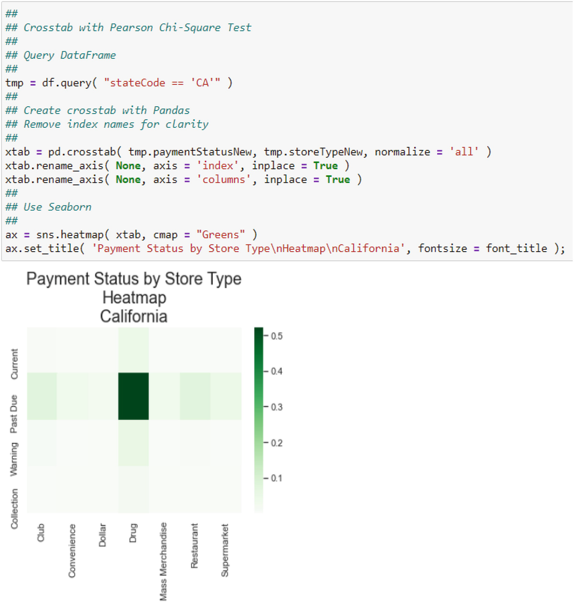

# 统计表
> 沃尔特·R·帕茨科夫斯基[^1]
> 数据分析公司，美国新泽西州普莱恩斯伯勒

统计表补充了分类数据分析的科学数据可视化。这种类型的数据以但不限于调查数据为例。任何分类数据都可以通过表格进行分析。我将继续使用面包烘焙公司的案例研究数据。我将在表 3. 1 中定义类的类级别使用客户，为了方便起见，我在此重复表 8.1。
表 8.1 这是我之前在第 3 章中定义的组中按组和类别列出的面包店客户列表

| Group       | Class              | Example                 |
| ----------- | ------------------ | ----------------------- |
| Grocery     | Mass merchandise   | Target, Walmart         |
|             | Supermarkets       | Krogers, Shoprite       |
|             | Club stores        | BJs, Costco, Sams Club  |
| Convenience | Convenience stores | 7-Eleven                |
|             | Dollar stores      | Dollar store            |
|             | Drug stores        | CVS, Walgreen, Rite Aid |
| Restaurants | Restaurants        | Dinners, etc.           |

## 8.1 数据预处理

作为烘焙公司的数据科学家，你将案例研究的数据从两个 CSV 文件导入到两个单独的 DataFrame 中。一个具有帐户数据，另一个具有客户特定数据。你使用我在第 1 章中讨论的方法将它们合并为一个。[^3] 不幸的是，数据合并后，你发现了一个大问题。 IT 部门发现许多客户的类别和付款状态被错误地分类。这并不罕见，反映了现实世界的数据通常非常混乱的事实。 IT 人员通知你，他们需要数周时间来纠正错误，但现在需要你的分析。因此，你必须根据他们提供的映射重新编码你拥有的内容。我在表 8.2 中展示了映射以及如何在图 8.1 中完成这种重新映射。为此，我选择首先创建我的 DataFrame 的副本，将其命名为 tmp，然后使用一系列列表推导进行重新编码。本章将使用重新映射的数据。

图 8.1 这说明了在 DataFrame 中重新映射值的代码
表 8.2 这些是纠正错误标签的新映射。你可以在图 8.1 中看到实现这些映射的代码

| Old classification | New classification |
| ------------------ | ------------------ |
| SuperCenter        | Restaurant         |
| Mass merchandise   | Convenience store  |
| Convenience store  | Mass merchandise   |
| Past due           | Current            |

## 8.2 分类数据
并非 BDA 中的所有数据分析都涉及价格、折扣、售出单位、订单延迟时间、信用评分等比率数据。在某些情况下，分析需要分类数据，即名义数据或有序数据。例如，面包烘焙公司有一个会计数据库，将其 400 名客户的应收账款分类为"当前"（即按时支付）、"逾期 1-30 天"、"逾期 31-60 天"、"需要收藏。"这是明确规定的。
例如，客户位于营销和销售区域，每个区域都由副总裁管理。分析问题可能是确定与逾期分类相关的应收账款表现最差的区域副总裁。变体侧重于逾期状态的分布，以确定它是否独立于任何特定的区域副总裁，以便应收账款问题对企业而言是系统性的，而不是特定区域。区域是客户的名义分类，逾期付款状态是有序分类。
分析序数数据应遵循的第一步是创建分类数据类型。为此，你首先使用 from pandas.api.types import CategoricalDtype 导入 Pandas CategoricalDtype 模块。使用此模块，你可以将变量声明为分类数据类型以及指定级别的顺序。没有必要指定顺序，因为顺序不会影响任何计算或结果，但你应该为序数变量执行此操作，因为根据这种类型的变量的定义，顺序很重要。此外，打印输出将清晰且合乎逻辑。
从技术上讲，可以分析具有对象数据类型的变量，而无需考虑其分类性质。将其指定为分类可以节省内部存储和数据处理，因为分类数据类型的存储和处理方式与仅作为对象数据类型的不同。对象变量的每个级别都"按原样"重复，这是低效的。例如，考虑一个具有四个级别的对象变量 Region：Midwest、Northeast、South 和 West。这些在你的 DataFrame 中作为字符串，每个都可能重复多次，具体取决于你的 DataFrame 的深度。但是，如果级别被分配整数值，例如 1 代表中西部，2 代表东北等，那么只有这些整数必须与包含转换的简单查找表一起存储。使用此方案可节省大量存储和处理。这是 Pandas CategoricalDtype 模块允许你使用对象变量的本质。顺便说一句，你可以通过使用我在第 1 章中讨论的 LabelEncoder 对区域类别进行标签编码来获得相同的结果。 5.使用CategoricalDtype更高效。
你可以通过将 CategoricalDtype 类的实例创建为变量，然后将其用作应用于要分类的对象变量的 astype( ) 方法的参数来创建分类数据类型。我在图 8.2 中说明了这一点。

图 8.2A 分类数据类型是使用 CategoricalDtype 方法创建的。在此示例中，提供了 paymentStatus 变量的有序级别列表。使用 astype() 方法应用分类规范
## 8.3 创建频率表
一个简单的第一个汇总表是一个频率表，可以与你在基础统计课上学习的第一个表相媲美。我在图 8.3 中展示了这样一个表格，在图 8.4 中展示了另一个在中西部地区划分的表格。在这两种情况下，我都在 DataFrame 显示中添加了条形图样式以突出显示模式，以符合我在第 4 章中讨论的模式标识。图 8.3 中的 stb 命令是访问 DataFrame 中数据的访问器方法。这个访问器有一个名为 freq 的函数，它产生我展示的表格。你可以使用 pip install sidetable 或 conda install -c conda-forge sidetable 安装 stb。

图 8.3 声明了分类数据类型的变量用于创建重新编码的支付状态的简单频率分布。请注意级别如何以正确的顺序排列，以便累积数据具有逻辑意义

图 8.4 声明了分类数据类型的变量用于创建简单的频率分布，但这次在另一个变量 region 上进行了子集化
你应该立即注意到两个表中的付款类别都按照我在图 8.2 中指定的顺序。这个顺序是合乎逻辑的。但更重要的是，此顺序允许你理解累积计数和累积百分比列；没有顺序，这些列就没有意义。这两列显示，全国和中西部地区 88% 的客户是当前或过期的，但两个级别之间存在很大差距。特别是，叠加条形图突出显示 81% 的客户已逾期。这应该引起警惕。
## 8.4 假设检验：第一步
了解频率分布是很有见地的，但你还可以做更多的事情。特别是，你可以检验频率分布等于已知分布的假设。例如，假设你知道加利福尼亚州药店的行业付款状态。你的客户的付款状态在统计上是否与该细分市场和地区的行业不同？你可以使用卡方检验将你的分布与已知的行业分布进行比较。假设是

$$
\displaystyle \begin{aligned} \begin{array}{rcl} H_O:\displaystyle \text{Equality with the Industry Distribution} \end{array} \end{aligned} 
$$

$$
\displaystyle \begin{aligned} \begin{array}{rcl} H_A:\displaystyle \text{Inequality with the Industry Distribution}. \end{array} \end{aligned}
$$

卡方检验统计量为
$$
\displaystyle \begin{aligned} \begin{array}{rcl}{} \chi^2=\displaystyle \sum_{i = 1}^k \dfrac{(O_i - E_i)^2}{E_i} \end{array} \end{aligned}
$$
其中 O~i~ 是水平 i 的观察频率，k 是水平数，E~i~ 是水平 i 的预期频率。 (8.4.3) 中的统计量称为 Pearson Ch-Square 统计量。我在本章的附录中讨论了这个统计数据的分布。
假设行业分布是我在表 8.3 中显示的那个。观察到的频率来自频率表，如图 8.5 所示。假设零假设为真，计算预期频率。计算很简单：将总频率乘以相应的零假设分布的相对频率（例如，表 8.3 中的比例列）。

图 8.5 这是加州药店的频率表。请注意，加州 81.2% 的药店已逾期
表 8.3 这是加州药店行业的（假设的）分布。这对应于图 8.6 中名为行业的字典中的分布

| Payment status            | Industry proportion |
| ------------------------- | ------------------- |
| Current                   | 0.07                |
| 1–30 days late (pass due) | 0.80                |
| 31–60 days late (warning) | 0.10                |
| Collection                | 0.03                |
| Total                     | 1.00                |

我首先在图 8.5 中展示了相关数据子集（即加利福尼亚的药店）的频率分布。卡方计算如图 8.6 所示。卡方函数有两部分：观察频率和预期频率。使用 Pandas value_counts 方法计算观察到的频率。预期频率是每个像元中观察次数乘以预期比例。由于独立性，它们本身就是各自边际比例的产物。卡方函数返回一个 2 元组：卡方统计量及其 p 值。如图 8.6 所示，这个 2 元组是"解包的"（即分成两个单独的变量）。 p 值与常规显着性水平进行比较，α = 0.05。然而，这个级别并没有什么可怕的。在工业环境中，可能会使用 α = 0.01（或更小），因为大多数制造环境都需要精度。在市场营销中，通常使用 α = 0.05。

图 8.6 这说明了比较观察到的频率分布和行业标准分布的卡方检验。行业分布见表 8.3。零假设在两个分布中没有区别。 Null 在 α = 0.05 显着性水平上被拒绝

## 8.5 交叉表和假设检验

在上一节中，我使用一个分类变量进行了分析。如果你有两个呢？还是两个是分类的，第三个是定量的？我在本节中解决第一个问题，在下一节中解决第二个问题。
你可以使用 Pandas 交叉表方法创建一个简单的交叉表（也称为交叉表或选项卡）。你必须将行和列变量分别指定为 Pandas 系列或 Numpy 数组。我推荐 Pandas 系列，因为你很可能会将数据存储在 Pandas DataFrame 中。该方法返回一个新的 DataFrame。为交叉表的行指定的系列定义了返回的 DataFrame 的索引。选项卡的单元格值是索引和列交叉处的频率。这是默认聚合，但你可以更改它，我将很快展示。我在图 8.7 中展示了一个简单选项卡的示例。这显示了位于加利福尼亚的所有客户的客户类别和付款状态的交叉表。

图 8.7 这说明了两个分类变量的基本交叉表。付款状态是结果选项卡的行索引。参数 margins = True 指示方法包括行和列边距。行边距之和等于列边距之和等于单元格之和。这些总和都等于样本量
比例或归一化频率比频率更能提供信息且更容易解释。归一化频率是频率除以样本大小，因此它们是每单位采样的计数；基础都是一样的。这些在比较两个（或更多）组的选项卡时更有用，因为比例会根据样本大小自动标准化。非归一化频率的缺点是它们的大小取决于你使用的样本；不同的样本量给出不同的频率。样本之间的比较即使不是不可能也很困难，因为碱基都不同。
你可以通过包含可以具有以下三个值之一的 normalize 参数来创建比例交叉表：

- ‘all’ 或 True 标准化所有值（将所有单元格值除以表格总数）；
- ‘index’对每一行进行标准化（将一行中的所有单元格除以行总数）；
- 'columns' 标准化每一列（将列中的所有单元格除以列总数）。

包括 normalize = ‘all’ 将产生一个表格，其中每个频率除以样本大小。另一个参数是边距，它是真或假。如果 margins = True，则包含边距并根据 normalize 参数适当地标准化。归一化的行边际分布是 $$p_{i.} = \sum _{j = 1}^c p_{ij}$$, $$\sum _{i = 1}^r p_{i.} = 1 $$with p~ij~ = n~ij~ / n ... 归一化列边际分布为 $$p_{.j} = \sum _{i = 1}^r p_{ij}$$, $$ \sum _{j = 1}^r p_{.j} = 1$$。假设该表有 r 行和 c 列，因此其大小为 r × c。
你可以在行和列的交叉点处包含要以某种方式聚合的变量，而不是具有频率。例如，你可能希望了解位于加利福尼亚的客户按付款状态和商店类型划分的平均延迟天数。你使用与图 8.7 中相同的交叉表设置，但你包含一个参数来表示要平均的值（即聚合）和用于聚合的函数（即平均值）。结果表包含单元格中第三个变量的聚合值。我在图 8.8 中展示了一个示例。

图 8.8 这说明了一个基本选项卡，但带有第三个变量"daysLate"，为索引和列变量的每个级别组合的平均值
你可以将频率表和比例表连接成一个表，该表基本上将两个表交织在一起：频率表的一行，然后是比例表的相应行。 这种交织需要我在图 8.9 中展示的编码。 你必须使用用于排序的索引分别创建两个表，垂直连接两个表，然后根据索引对该表进行排序，使组合表看起来交织在一起。 我在图 8.10 中显示了最终结果。 你可以创建一个如图 8.10 所示的表格，但将两个原始表格水平连接而不是垂直连接。 为此使用axis = 1。

图 8.9 这是用于交织频率表和比例表的 Python 代码。有两个重要步骤：（1）索引要连接的每个表以识别相应的行和（2）基于轴 0 连接

图 8.10 这是使用图 8.9 中的代码交织频率表和比例表的结果。这有时比拥有两个单独的表更紧凑
创建交叉表可能不是分析两个分类变量的结束。你可能需要完成另外两项任务来帮助你进行分析。第一个是测试形成表格行和列的两个变量之间的独立性或检查关联，第二个是绘制表格，如果两个变量不独立，则存在某种关联。第二个很重要，因为如果两者之间存在关联，那么你应该知道它是什么以及该关联的含义。检查原始表不足以揭示任何关联，尤其是随着表大小的增加。我将首先考虑假设检验，然后是图表。

### 8.5.1 假设检验

我回顾了上面的卡方检验，用于将观察到的分布与另一个通常是目标或总体分布的分布进行比较。零假设是观察到的分布与目标分布没有区别。你可以扩展它以测试频率表的行和列的独立性；即，测试两个分类变量的独立性。对测试统计进行了调整：你必须考虑行和列，而之前只有一个"行"（或"列"）。对于 r 行 c 列的频率表，表的大小为 r × c，卡方检验统计量为
$$
\displaystyle \begin{aligned} \begin{array}{rcl} \chi^2 = \sum_{i = 1}^r \sum_{j = 1}^c \dfrac{(O_{ij} - E_{ij})^2}{E_{ij}} {} \end{array} \end{aligned} 
$$
其中 O~ij~ 是在单元 ij 中观察到的频率，i = 1, 2, ..., r;j = 1, 2, ..., c, E~ij~ 是相应的期望值。在独立的零假设下，E~ij~ 是各个边际比例乘以表格总数的乘积。如果是表总数，则E~ij~ = n × p~.j~ × p~i~。其中第 j 列是边缘的。对于 p~i~ 也是如此。这是基于基本概率论的结果，即在独立的情况下，对于两个事件 A 和 B，Pr(A ∪ B) = Pr(A) × Pr(B)。例如，参见 Weiss ( 2005）。等式 (8.5.1) 是 Pearson 卡方检验统计量，其分布遵循 (r − 1) × (c − 1) 自由度的卡方分布。有关讨论，请参见 Agresti (2002)。另请参见 Paczkowski (2016) 以及 Bilder 和 Loughin (2015) 对自由度的解释。
该检验统计量的一个变体是似然比卡方检验统计量，定义为
$$
\displaystyle \begin{aligned} \begin{array}{rcl} G^2 = 2 \times \sum_{i = 1}^r \sum_{j = 1}^c \left[ O_{ij} \times ln \left(\dfrac{O_{ij}}{E_{ij}}\right) \right] \end{array} \end{aligned}
$$
这是渐近分布的卡方，也具有 (r − 1) × (c − 1) 自由度。 有关讨论，请参见 Agresti (2002)。 你可以通过在 researchpy 包中指定交叉表函数的测试参数来获得 r × c 频率表的两个统计数据。[^1] 我在图 8.11 中提供了 Pearson 测试的示例。 你可以使用 pip install researchpy 或 conda install -c researchpy researchpy 安装 researchpy。

图 8.11 这说明了使用图 8.7 中的选项卡的 Pearson 卡方检验。 p 值表明不应拒绝独立的零假设。 Cramer 的 V 统计量为 0.0069，支持这一结论
researchpy 输出还显示基于 Pearson 卡方统计量的 Cramer's V 统计量。[^2] 统计量定义为
$$
\displaystyle \begin{aligned} \begin{array}{rcl} V = \sqrt{ \dfrac{\chi^2/n}{\min(r - 1, c - 1)}} \end{array} \end{aligned}
$$
这是两个分类变量之间关联的度量，因此范围在 0 和 +1（包括）之间。 它被解释为一种相关性度量，其值接近于零，表示没有关联或关联很小。 你可以在图 8.11 中看到这个统计数据。 值 0.0069 表示两个变量之间没有关联。 有关该统计的最初发展，请参见 Cramer (1946)。 Akoglu (2018) 提供了解释我在表 8.4 中总结的统计数据的指南。
表 8.4 解释 Cramer 的 V 统计量的指南。 资料来源：Akoglu (2018)

| Value | Association      |
| ----- | ---------------- |
| >0.25 | Very strong      |
| >0.15 | Strong           |
| >0.10 | Moderate         |
| >0.05 | Weak             |
| >0    | Non or very weak |

### 8.5.2 绘制频率表
如果你从卡方检验得出两个分类变量之间存在关系的结论，那么你需要在表格之外调查这种关系。看一张表本身是不够的，因为当它变大时发现关系变得更具挑战性，如果不是不可能的话。绘制表格对你的分析有很大帮助。最简单的图表是热图。它被称为"地图"，因为它可以指导你理解表格。热图类似于频率表，因为它由单元组成，因此地图的大小与表格相同：r × c，因此单元的数量和排列与表格相同。单元格中没有数字，而是对单元格进行了颜色编码，单元格中的颜色显示了该单元格中数据的强度或密度。频率数可以包含在单元格中，但这可能会淹没图像，从而破坏映射表的目的。通常包括一个颜色计或温度计，以显示数据的强度如何随颜色而变化。我在图 8.12 中为图 8.7 中的选项卡说明了一个热图。

图 8.12 这说明了使用图 8.7 中的选项卡的热图。很明显，大多数杂货店的付款都是最新的
另一种图形工具，通常称为探索性工具，是对应图。我不同意"探索性"的描述。首先，所有 BDA 都是探索性的，实际上是迭代的，因为你正在寻求从数据中提取最丰富的信息。其次，对应地图本身就具有非常丰富的信息和揭示性。最后，它们是表格的不同视图。
地图允许你查看表的行之间的关系、表的列之间的关系以及行和列之间的关联。这是一个更复杂的开发工具，并且生成的地图更难以解释。尽管如此，它足够强大和有见地，足以保证你花时间和精力来分析表格，例如交叉表。当地图下面的表格变大时，它的用处就变得非常明显。
对应图的基础是基于我在第 1 章中总结的奇异值分解 (SVD) 将表（即矩阵）分解或"拆分"为三个子矩阵。 5、三个子矩阵简称为左矩阵、中心矩阵、右矩阵。左子矩阵与表格的行相关联；右子矩阵与表的列相关联，中心连接其他两个，但也提供有关表方差的洞察力。左右子矩阵的列给出绘图坐标。特别地，左子矩阵的列的函数给出主矩阵的行的绘图坐标列，而右子矩阵的列的函数给出主矩阵的列的绘图坐标列。在这两种情况下，坐标列都称为维度。可以从主矩阵创建或提取的最大维数为 Min(r − 1, c − 1)，其中 r 是主矩阵的行数，c 是主矩阵的列数。这是对对应分析可用性的限制：主矩阵必须有两行以上和两列以上。例如，如果 r = 3 和 c = 2，则 Min(2, 1) = 1，因此只能提取一组绘图坐标 - 但你需要两个坐标，因为图形有两个轴：X 和 Y。
绘图坐标用于创建地图。通常，绘制行的两列坐标以生成地图（即 X 和 Y 轴）。然后，在此地图的顶部绘制两列坐标列，以便将一个图覆盖在另一个图上。这种叠加会产生一个双标图，它是对应图。
中心子矩阵是一个矩形对角矩阵。它的行数与在主对角线单元格上具有非零（大部分）元素并且在非对角线单元格上具有零元素的列的数量相同。对角线值称为奇异值。每个奇异值的平方是原始矩阵的特征值。有关特征值的讨论，请参见 Lay (2012) 和 Strang (2006)。这些特征值也称为矩阵的惯性。如果 SV i 是第 i 个奇异值，则 $$SV_i^2$$ 是维度 i 的惯性。该维度的卡方值为 $$SV_i^2 \times n$$，其中 n 是样本大小。卡方值之和是独立性检验中使用的总卡方。这意味着应用于交叉表的 SVD 不仅提供了交叉表的卡方值，而且还提供了卡方对交叉表维度的分解。总卡方的分解分量通常表示为总数的百分比以及累积百分比。累积百分比可帮助你确定要绘制的维度，通常是前两个维度。这两个是交叉表中变化最大的两个。
对应分析是使用图 8.13 所示的设置完成的。我使用了具有CA功能的prince包进行对应分析。你可以使用 pip install Prince 或 conda install -c bioconda Prince 安装 Prince。我使用了之前通过 Pandas 交叉表方法创建的交叉表。生成的选项卡称为 xtab，用作对应分析函数 CA 的拟合属性的参数以及维数（即要提取的组件）。这个数字是 xtab 的行数减 1 和 xtab 的列数减 1 中的最小值。拟合的信息保存在一个名为 xtab_ca 的对象中。 CA 函数的交叉表和对应信息被用作三个函数的输入：

1. 汇总卡方统计量；
    
    图 8.13 这是图 8.7 中开发的交叉表对应分析的主要功能。 该函数使用维度数和随机种子或状态（即 42)进行实例化，以便始终可以重现结果。 然后使用实例化的函数来拟合交叉表
2. 从奇异值分解中总结出维度信息；
3. 显示双标图。

我在图 8.14 中展示了这些。 一个单独的函数使用这三个来生成分析结果的最终显示，如图 8.15 所示。

图 8.14 为最终对应分析显示的拼图功能如下所示。具有单独的功能使编程更易于管理。这是模块化编程

图 8.15 对应分析的完整最终结果如下所示。面板 (a) 显示了结果和两个汇总表的设置功能。面板 (b) 显示了双标图
首先，查看图 8.15，面板 (a) 中的 CA 卡方汇总表。总惯量为 0.0001，样本大小为 133,225（你可以在图 8.11 中看到）。3 这两者的乘积是总卡方 18.86，它等于我在图 8.11 中报告的 Pearson 卡方值。 CA Plotting Dimension Summary 中报告了总卡方的分量。可以看到，从交叉表中提取的第一个维度或分量占总卡方的 56.01%，第二个占 30.71%。这两个百分比反映在面板 (b) 的双图中。累计百分比为86.72%。
面板 (b) 中的双图是分析交叉表的主要诊断工具。但它是如何解释的？你必须完成两项任务才能从该图以及交叉表中提取最大的洞察力：

1. 解读两轴；
2. 解释行和列点的接近度。

要解释地图，首先查看 X 轴维度。两个客户类别脱颖而出：左侧的餐厅和右侧的便利店。他们在左右的事实并不重要，但他们处于极端的事实很重要。它们的位置可以通过将绘图坐标乘以 -1 来反转：除了位置之外没有任何影响。对于客户来说，餐厅可以被视为一种轻松的业务：他们来到餐厅是为了与家人或朋友一起用餐，或者可能是为了开展业务，但比在办公室环境中压力更小，更休闲。时间对他们来说可能不太重要。然而，便利店的顾客很可能很匆忙，急于拿起一些简单而没有大惊小怪的东西；时间对他们来说很重要。这就解释了为什么这些商店被称为"便利店"。因此，横轴反映了休闲和速度之间的对比。它是一个时间维度的值。超市和药店位于中间。一般来说，他们迎合那些不得不把时间花在购物上的人，而不是休闲。另请注意，Club 商店和 Mass Merchandising 商店非常接近，这可能是有道理的，因为它们基本上属于同一类型的商店：非常大，几乎是仓库类型。顺便说一句，它们的接近度反映了格式塔接近原则。
现在看看 Y 轴维度。请注意，顶部的当前付款状态和底部的收款状态突出显示。这是两种极端的付款方式。善于做生意的客户是按时付款的客户。他们是违约风险低的客户。那些需要收集的东西是一个挑战，并且有违约的风险。这表明第二个维度不仅是支付状态的对比，而且更重要的是，风险违约机会的对比：高与低。一个极端是风险相对较高的客户，而另一个极端是风险相对较低的客户。这种风险客户的概念很重要，它引出了一个问题："你如何根据客户的违约风险对客户进行分类？"我将在第 11 章讨论分类方法。
你还可以看到，第一个维度，即商店类对比度，占交叉表中变异的 56.01%。第二个维度，风险对比，占方差的 30.71%。这两个维度合计占交叉表方差的 86.72%，与 CA Plotting Dimension Summary 一致。
还有几个观察。注意 (0.0, 0.0) 交点处的十字准线。这些反映了原始交叉表的行和列边缘分布。这些边际被解释为表格的质心或平均值。药店和过期通知位于十字准线的中心这一事实表明，它们是交叉表各自部分的平均特征。此外，请注意它们彼此相邻，因此药店平均对面包店公司的帐户逾期。超市也接近逾期点，便利店也接近预警点。这些反映了格式塔接近原则。
该分析适用于加利福尼亚。整个民族呢？我在加利福尼亚没有子集的情况下重新运行了地图构建。你可以在图 8.16 中看到地图。点的位置不同，但消息（丰富信息）是相同的。

图 8.16 这是面包店公司的全国地图

## 8.6 扩展交叉表

基本交叉表的单元格只是两个相交分类级别的出现频率。我在上面说明了这个基本功能，即默认功能。如果需要，你可以在单元格中使用计数以外的度量值，但值必须基于第三个变量，当然，你必须指定该变量。例如，你可以根据两个分类变量的水平获得第三个变量的平均值。
为了说明这一增强的功能，假设你需要按商店类型和付款状态为加利福尼亚商店的应收帐款数据的发票付款的平均延迟天数。除了指定两个分类变量 storeType 和 paymentStatus 之外，你还需要天数的聚合方法（在本例中为平均值）。我在图 8.17 中向你展示了这是如何完成的。

图 8.17 图 8.7 中的交叉表增强了第三个变量 days-late 的平均值
还有另一种方法可以在不使用 Pandas 交叉表功能的情况下获取相同的数据。你可以通过两个分类变量对 DataFrame 中的数据进行分组，并将均值函数应用于第三个变量。我在图 8.18 中展示了这一点。

图 8.18 图 8.17 中的交叉表可以使用 Pandas 的 groupby 函数和 mean 函数来复制。两种方法中的值是相同的；只是安排不同。这是部分展示，因为决赛桌很长
对于这个特定的应用程序，我认为交叉表功能是聚合数据的更好方法。但是，如果你想使用多个变量并为每个变量计算多个汇总度量，则使用 groupby 与另一个函数 agg 结合使用会增加更多功能。 agg 函数允许你将一个或多个函数（例如均值或标准差）应用于由 groupby 生成的一个或多个变量。我说明了如何根据图 8.19 中的两个分类变量的分组来找到两个变量的均值和标准差。本例中的 agg 函数将字典作为参数，将要聚合的变量作为键，将聚合方法（即均值和标准差）作为键的值。该值可以只是一个函数或函数列表，如图 8.19 所示。

图 8.19 图 8.17 中的交叉表是使用多个变量和聚合方法进行聚合的。在这种情况下使用 agg 方法。聚合字典具有聚合规则，并且该字典被传递给 agg 方法

## 8.7 数据透视表

交叉表是分类数据的基本列表。你可以创建一个如图 8.18 所示的 DataFrame，然后旋转表格以获得不同的数据视角。这为你的工具包添加了一个动态元素；简单的交叉表是一个静态工具。图 8.18 中的排列有时被描述为长格式排列，因为行数大于列数。另一种选择是宽格式，它是沿主轴旋转的长格式。 Pandas pivot 函数用于从长格式切换到宽格式。我在图 8.20 中说明了这一点。

图 8.20 图 8.18 中由 groupby 创建的 DataFrame，它是一个长格式排列，使用 Pandas 枢轴函数将其枢轴为宽格式排列。 DataFrame 首先被重新索引
透视函数是一种创建汇总表的复杂方法。更方便的方法是使用在后台使用 groupby 函数的 pivot_table 函数。我在图 8.21 中说明了这个函数的使用。这个新功能非常灵活，允许你以多种方式创建汇总表。例如，参见图 8.22 中的数据透视表。

图 8.21pivot_table 函数是一种更方便的方法来旋转 DataFrame

图 8.22pivot_table 函数对于旋转表格非常灵活。这是我们数据的替代旋转的部分列表
Pandas pivot_table 函数与交叉表函数有些不同。其中一些差异是：[^4]

1. pivot_table 使用 DataFrame 作为数据的基础，而 crosstab 使用系列。由于你的大部分数据都将在 DataFrame 中，因此这可能很重要，但只是为了方便。
2. 你可以在pivot_table中命名边距。
3. 你可以使用一个名为 Grouper 的函数作为 pivot_table 中的索引。
4. crosstab 允许你对频率进行归一化：行条件分布；列条件分布；每个单元格除以总数。

我的建议：使用满足你对特定任务的需求的任何一个。它是如此简单。

## 8.8 附录
在本附录中，我将描述 Pearson 卡方统计量及其一些属性。

### 8.8.1 皮尔逊卡方统计

(8.4.3) 中的 Pearson 卡方统计量 χ^2^ 与标准正态分布有关。设 Z 是一个随机变量，使得 。这个公式，称为概率密度函数 (pdf) 是

可以证明，这超出了本书的范围，Z^2^ 遵循称为卡方分布的新分布，表示为 $$\chi _1^2$$。即$$Z^2 \sim \chi _1^2$$。 "1"称为定义分布形状的自由度 (dof)。见图 8.23。因此，自由度也被称为形状参数。标准法线没有任何自由度，因为只有一种形状，但卡方不是这种情况。

图 8.23 这说明了几个 k 值的卡方分布。注意形状如何随着 k 增加并开始接近标准正态曲线而变化
假设有两个独立的标准正态随机变量Z~1~和Z~2~，令Z = Z~1~ + Z~2~。然后 $$Z \sim \chi _2^2$$ 有两个自由度。一般来说，如果$$Z = \sum _{i = 1}^k Z_i^2$$，那么$$Z \sim \chi _k^2$$。 dof ≥ 1 是一个正整数。卡方随机变量的均值为 k，方差为 2 × k。参见 Dobson (2002, p. 7)。
如果 k = 1 或 k = 2，则卡方分布是负指数分布。事实上，对于 k = 2，卡方是指数分布，它是伽马分布家族的一员。如果 k →∞，则卡方随机变量接近标准正态分布（即 ）。
其他分布与卡方分布有关。如果 $$Z \sim \mathcal {N}(0, 1)$$ 和 $$X \sim \chi ^2_k$$，则  是学生的 t 随机变量。此外，具有 k~1~ 自由度的 χ^2^ 随机变量与具有 k~2~ 自由度的独立 χ^2^ 随机变量的比率，每个变量除以其各自的自由度-自由度，遵循具有 k~1~ 和 k~2~ 自由度的 F 分布。注意 $$F_{1, k_2}$$ 是 t~2~。你可以从具有 k 自由度的 t 的定义中看到这一点：。这是我上面讨论的 ANOVA 表的基础。参见 Dobson (2002, pp. 8-9)。
可以看出，Pearson 卡方是交叉表中行轮廓与行质心之间的平方距离的函数。行配置文件是行条件分布。如果 n ij 是第 i 行和第 j 列和 n~i~ 交叉处的单元格中的频率。是在交叉表的 J 列上求和的第 i 行的边际频率，则第 i 个轮廓为 n~ij~ / n~i~.. 边际频率称为行质量。如果最后一个表达式中的每一项都除以所有单元格的频率总和 n ..，那么你可以看到行配置文件只是一个条件概率分布。行形心是行轮廓的加权平均值，其中权重是相应的行质量。可以看出，行的质心是列的质量。所有这些也适用于列。

## 参考
- Agresti, A. 2002。分类数据分析。第 2 版。纽约：威利。
- Akoglu, H. 2018。相关系数用户指南。土耳其急诊医学杂志 18（3）：91-93。
- 比尔德、C.R. 和 T.M.洛因。 2015. 使用 R. Boca Raton 分析分类数据：CRC 出版社。
- Cramer, H. 1946。统计的数学方法。普林斯顿：普林斯顿大学。
- 多布森，A.J. 2002. 广义线性模型简介。第 2 版。统计科学文本。伦敦：查普曼和霍尔/CRC。
- Lay, D.C. 2012。线性代数及其应用。第 4 版。伦敦：培生教育。
- Paczkowski, W.R. 2016。使用 JMP 进行市场数据分析。班加罗尔：SAS 出版社。
- Strang, G. 2006。线性代数及其应用。第 4 版。波士顿：汤姆森布鲁克斯/科尔。
- Weiss, N.A. 2005。介绍性统计。第 7 版。伦敦：培生教育公司

## 脚注

[^1]: 其他两个检验可用：Fisher 精确检验和成对名义数据的 McNemar 卡方检验。有关这些测试的讨论，请参见 Agresti (2002)。
[^2]: 这也称为 Cramer 的 phi 统计量，表示为 φ~c~。
[^3]: 总惯量实际上是 0.00014154489494587526，所以显示的内容显然是四舍五入的。
[^4]: 此列表建立在 StackOverflow 上的评论之上。请参阅 https://stackoverflow.com/questions/36267745/how-is-a-pandas-crosstab-different-from-a-pandas-pivot-table