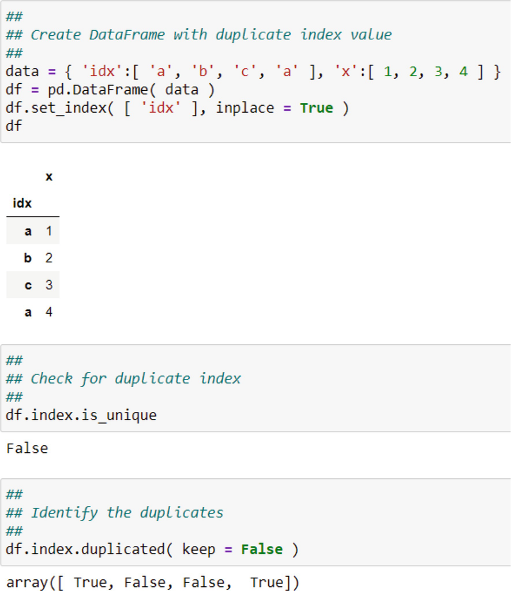

# 业务数据分析的高级数据处理
> 沃尔特·R·帕茨科夫斯基1
> (1)
> 数据分析公司，美国新泽西州普莱恩斯伯勒

在本章中，我将为超越前几章所讨论的分析奠定基础。我在高层次上介绍了该材料。专业书籍更详细地介绍了它们；事实上，整卷都是关于这些主题的。本章中的内容有所不同。它们涵盖了高级数据处理主题。

## 9.1 有监督和无监督学习

在机器学习中，我们并不是说模型的参数是使用数据估计的，因为并非所有涉及数据的过程都与估计参数有关。但是有些模型甚至可能没有参数。带参数的模型是参数模型；没有的是非参数模型。参数模型具有有限数量的参数，据说这些参数存在于被调查的群体中，并且是固定的和未知的。任务是使用数据来估计它们。由于参数的数量是有限的，因此参数模型受到约束。没有多少数据会改变参数的数量。 Russell 和 Norvig (2020, p. 737) 强烈指出了这一点：“用一组固定大小的参数汇总数据的……模型称为参数模型。无论您向参数模型提供多少数据，它都不会改变它需要多少参数的想法。”^1^ 非参数模型不依赖于参数，因此，它们不像参数模型那样受到约束。他们只依靠数据来寻找如何进行的线索。 Russell 和 Norvig (2020, p. 757) 也指出：“当您拥有大量数据且没有先验知识，并且您不想过多担心选择正确的特征时，非参数方法非常有用。” ^2^ 为避免对估计或不估计的混淆，这两种情况都涉及数据的使用，机器学习从业者说一种方法是从数据中学习的。
当涉及参数时，方法会从数据中了解它们。但由于它们是有限且固定的，它们限制了数据可以揭示的内容。除了参数之外，参数模型还具有由参数定义的目标或因变量或标签。例如，定义可以是线性的。非参数模型没有目标。目标在参数的学习中指导方法。因此，从某种意义上说，目标通过参数控制或监督该方法能够学习的内容。涉及一组有限的固定但未知参数的正式模型是监督学习方法。不涉及参数的方法是无监督学习方法
在机器学习中，自变量称为特征。在回归分析（监督学习的一个例子）中，目标是根据特征估计未知参数，以给出目标的最佳估计。由于无监督学习既没有目标也没有一组参数，因此目标是使用算法找到特征的集群或组。与 OLS 等参数识别方法的监督学习方法不同，无监督学习方法是聚类、模式识别和分类标识符。
大学班级类比有助于澄清区别和术语。在大学环境中，教授指导学生（即“学习者”）学习课程材料（即数据），然后测试学习者的表现。教授建立了一组参数来获得目标课程成绩，例如“A”。有老师、学习者、数据、一组参数、一个绩效指标和一个目标。这是有监督的教育学习。对于统计类比，有一个带有目标因变量或标签的模型，它指导学习者（即估计技术）处理数据，其处理性能由拟合优度度量（如 R 2）测量，以给出最佳目标的预测。参数限制了学习技术如何达到目标。这是统计和机器学习中的监督学习。
没有教授，学生只能靠自己；他们是无人监督的、自定进度的，他们唯一的数据是他们找到的一些书，也许还有互联网。对于那些自学的人来说就是这种情况，比如说，为了获得专业执照。他们是自学的。没有教授设置约束（即参数），他们可以自由定义自己的最佳学习和成就。可能还有考试，但它不像大学课程那样正式。测试可以是在工作中或公共领域（例如投票）的非正式环境中应用所学知识。在统计和机器学习中，算法而不是模型对具有（可能）性能标准的数据进行操作；该算法是无监督的，不受参数和目标的约束。
有许多监督和非监督方法旨在解决不同的问题和数据，包括目标（如果有）和特征。 我在表 9.1 中提供了一个小列表。 我将在其余章节中讨论这些方法。
表 9.1 这是按功能列出的有监督和无监督方法列表

| 监督学习方法        | 无监督学习 |
| ------------------- | ---------- |
| 广义线性模型（GLM） | 聚类       |
| OLS                 | 分层       |
| 逻辑回归            | K-均值     |
| 分类                | Mixture    |
| 朴素贝叶斯          |            |
| 决策树              |            |
| 支持向量机          |            |

## 9.2 使用数据立方体
我在第 1 章介绍了 Data Cube 范式。 1 并在随后的章节中多次提及。我对 Cube 提出的一个主要观点是，您可以折叠空间或时间维度，以获取您可能从统计学或计量经济学课程中熟悉的传统数据集之一：横截面数据集或时间序列数据集.我提供了一些示例来说明这种崩溃。事实上，所有的章。图 7 是基于在空间维度上折叠 Cube 得到时间序列。然而，使用 Data Cube 的工作比我之前向您展示的要多。您可以使用整个多维数据集，在这种情况下，您将使用时间序列和横截面数据的组合。我在第一章中指出。 2 并在第 2 章中再次出现。从图 6 可以看出，这称为面板数据集，有时也称为纵向数据集。时间序列和横截面数据都有自己的特殊问题，虽然我在第 1 章只强调了时间序列问题。 7.面板数据存在这些问题等等。您可以将它们视为反映可加性。这意味着问题的数量以及分析数据的方法的数量不仅仅是单独的问题。基本上，问题的总和大于单个问题。
面板数据分析必须考虑空间和时间维度的联合行为以及它们各自的行为和影响。是联合行为导致总和大于其部分。例如，对于交易数据，您可以看到客户订单的变化和时间段（比如月份）的订单变化。但是您也有不同时间段的客户变化。因此，您在客户内部和客户之间存在差异。内部变化是在客户的每个时间段内（例如，几个月），而间变化是在客户之间（例如，横截面单位）。如果您只有横截面数据，那么您有组间变量，但没有组内变量。时间序列也是如此，尽管它可能会变得复杂，因为您可能会在几年之间或几年之内。对于面板数据，所有单位都存在总变异。因此，面板中存在三种可能的变化来源：

1. 客户和时间段的总体变化；
2. 客户内部的变化；
3. 客户之间的差异。

加性效应是由于包含了整体变化。
关于面板数据集建模的计量经济学文献非常庞大且复杂。例如，参见 Baltagi (1995)、Hsiao (1986) 和 Wooldridge (2002)。目前，重要的是要认识到与整个数据立方体相关的问题至少可以说是复杂的。我将在第一章回到这些。 10. 我的重点是简化 Data Cube。

## 9.3 Data Cube 和 DataFrame 索引
Pandas DataFrame 使用其索引功能模仿 Data Cube。索引有两种形式：一种用于行，一种用于列。列索引只是使组织特征变得更容易，以更直观的顺序排列它们，而不影响分析或建模。这只是一个便利功能。这些列模拟了数据立方体的度量维度。然而，行索引不仅对组织数据有明确的影响，而且对数据帧的子集、查询、排序和采样也有明确的影响。它是模拟数据立方体的空间和时间维度的行索引的一般形式。但请记住，这两个维度本身不一定是空间和时间。它们可以是列中度量的任何复杂分类。
行索引是每一行的标识符。它不必是唯一的，但如果它是唯一的就更好了。如果索引是唯一的，则 Index.is_unique 方法返回 True，否则返回 False。我在图 9.1 中展示了一些选项。方法 duplicated 有一些用于 keep 参数的选项，以指示如何标记重复项：

- “first”：将重复项标记为 True，但第一次出现除外；
    
    图 9.1 这里显示了几个用于识别重复索引值的选项
- “last”：将重复项标记为 True，除了最后一次出现；和
- False（无引号）：将所有重复项标记为 True。

注意我是如何使用图 9.1 顶部面板中的 set_index 方法的。最初，索引只是一系列从零开始的整数。您可以使用此 set_index 方法将其设置为特定列。 inplace = True 参数覆盖 DataFrame；否则将制作一份必须注明姓名的副本。如果使用 inplace = False（默认值），则该方法返回 None。您可以使用任何列、列列表或其他对象的列表，例如其他整数或字符串。例如，如果您正在处理状态级数据，则逻辑索引是两个字符的状态代码。
图 9.1 中的新索引是一系列字符串对象。以前，它是从零开始的整数。作为另一种选择，您可以使用 DatetimeIndex，这是一个使用日期时间值的索引。 DatetimeIndex 是一个日期时间值数组，可以通过多种方式创建。您可以将 Pandas 的 to_datetime 函数与日期列表一起使用。例如，您可以使用 pd.to_datetime( df.date )，其中“date”是 DataFrame df 中的日期变量。这些日期会自动转换为日期时间值并放入一个数组中，即 DatetimeIndex。然后，您可以使用 set_index 方法将 DataFrame 索引设置为 DatetimeIndex。请注意，DatetimeIndex 本身不是索引；您仍然必须将其设置为 DataFrame 索引。创建 DatetimeIndex 的另一种方法是使用 date_range 函数，该函数具有日期范围开始和结束时间、要包括的期间数和期间类型（例如，月、季度）的参数。 “start”参数是必需的； “结束”不是必需的，但必须指定周期数。您指定范围的结尾或句点数，而不是两者。周期的类型是可选的，默认为“天”，否则必须指定类型。我在表 9.2 中提供了一个简短的日期类型列表，最初在第 1 章中显示。 7. date_range 函数的一个例子是 pd.date_range( start = ‘1/1/2021’, end = ‘8/1/2021’, freq = ‘M’ )。另一个是 pd.date_range(start = ‘1/1/2021’, period = 8, freq = ‘M’)。
表 9.2 这是与 date_range 函数的“freq”参数一起使用的可用频率和别名的简短列表。完整列表可在 McKinney (2018, p. 331) 中找到

| Frequency alias | 描述     |
| --------------- | -------- |
| B               | 工作日   |
| D               | 日历日   |
| W               | 周末     |
| M               | 月末     |
| Q               | 季度末   |
| A or Y          | Year end |

您还可以从 DatetimeIndex 创建一个 PeriodIndex。 PeriodIndex 与 DatatimeIndex 类似，但用于期间。周期是一个时间跨度，例如一天、一个月或一个季度。 DateTimeIndex 是一个特定的时刻，但这有时是模糊的。 PeriodIndex 中的值是有序的，表示时间的固定周期。我提供了一个属性列表以在表 9.3 中指定一个周期。^3^ 您可以使用诸如 pd.period_range( '2021–02', period = 8, freq = 'M' ) 之类的语句创建一个 PeriodIndex ，它将创建从 2021 年 2 月开始的八个月度周期。您还可以使用 to_period 方法将 DatatimeIndex 转换为 PeriodIndex。我在图 9.2 中展示了一个示例，因此您可以看到这是如何完成的。

图 9.2 这说明了如何将 DatetimeIndex 转换为 PeriodIndex
表 9.3 这是 PeriodIndex 的属性列表。完整列表可在 McKinney (2018, p. 331) 中找到

| 属性          | 描述                           |
| ------------- | ------------------------------ |
| day           | 期间天数                       |
| dayofweek     | 星期几，星期一 = 0，星期日 = 6 |
| dayofyear     | Ordinal day of the year        |
| days_in_month | 一个月的天数                   |
| daysinmonth   | 一个月的天数                   |
| hour          | 期间的小时                     |
| is_leap_year  | 日期是否属于闰年的逻辑指示符   |
| minute        | 期间的分钟                     |
| month         | 月份为 1 月 = 1，12 月 = 12    |
| quarter       | Quarter of the date            |
| second        | Second of the period           |
| week          | 一年中的第几周                 |
| weekday       | 星期几，星期一 = 0，星期日 = 6 |
| weekofyear    | 一年中的第几周                 |
| year          | 期间的年份                     |

索引的一个重要功能允许您使用查询方法基于索引查询 DataFrame。例如，您可以使用 df.query(“index == ‘a”’) 查询图 9.1 中的 DataFrame。注意单引号和双引号的使用。如果索引是 DatetimeIndex，您可以使用 df.query(“index == ‘2020-11-04”’) 或 df.query(“index == ‘November 4, 2020”’)。 Pandas 将在内部将不同的日期表示形式转换为单个日期时间表示形式。
图 9.1 有一个索引。您可以创建一个称为 MultiIndex 的多级索引。您可以使用我上面描述的相同 set_index 方法创建它，但参数是几个 DataFrame 列或其他列表的列表。列表中的每个元素按照它们在列表中出现的顺序成为整体索引中的一个级别。这是 DataFrames 的一个非常重要和有用的特性，因为它更接近于模仿 Data Cube 的概念。回想一下，数据立方体具有度量 × 空间 × 时间配置。您可以将空间和时间维度视为数据立方体的索引：它们定义了度量的不同视图。例如，如果数据立方体代表五个工厂在四个日历季度生产的产品数量，则工厂和季度索引产品生产。相应的 DataFrame 有一列用于生产量和一个两级索引：一个用于工厂标识符，一个用于日历季度。
MultiIndex 的一个好处是您可以对数据施加层次结构。例如，您可能拥有每个州内各州和地区的销售数据。显然，地方嵌套在相应的状态中。 MultiIndex 反映了这种层次结构，其中状态为第一（外）层，局部性为第二（内）层。您可以将第二层视为嵌套在第一层中。这种能力是有代价的：增加了访问和操作 MultiIndex 结构的复杂性。在线 Pandas 文档为处理和操作 MultiIndexes 提供了详尽的指南。
MultiIndex 还有另一个问题。整体索引实际上是一个由元组组成的数组。元组的数量等于 DataFrame 的行数，每个元组中的元素数等于 MultiIndex 中的级别数。元组的每个元素都是级别的名称或标识符。例如，如果 MultiIndex 有两个级别“Product”和“Period”，那么每个元组有两个元素按此顺序排列。这种结构的问题是，如果您想更改其中一个级别的值，您必须重新创建元组，然后再创建 MultiIndex。你不能改变
元组直接因为元组是不可变的。例如，假设您首先创建一个具有两个级别“Product”和“Period”的 MultiIndex，其中“Period”作为 DatetimeIndex。现在您要将“Period”更改为 PeriodIndex。您必须首先通过将每个 DatetimeIndex 值更改为 PeriodIndex 值来重新创建元组，然后覆盖 DataFrame 索引。我在图 9.3 中向您展示了如何做到这一点。^4^

图 9.3 将 MultiIndex 更改为新的 MultiIndex
您可以使用 query 方法根据 MultiIndex 查询 DataFrame。例如，您可以使用 df_pan.query(“Product == ‘A”’) 查询图 9.3 中的“产品”，以获取产品“A”的所有记录。你也可以查询一个周期，但这样做略有不同，因为图 9.3 中的“周期”是一个周期索引。您需要另一个 PeriodIndex 值进行比较。我在图 9.4 中展示了一种解决方案。您可以使用两个表达式来查询 MultiIndex 的两个组件，其中符号和或单词 and 用于“逻辑与”语句或符号 ∣ 或单词或“逻辑或”语句。

图 9.4 这是在 MultiIndex 中查询 PeriodIndex 的一种方法。注意@。使用 this 然后变量在环境中，而不是在 DataFrame 中。 “x”就是这种情况

## 9.4 从数据帧中采样

我在前面的章节中开发了基本的数据分析方法，并说明了如何在整个数据集上使用它们。我使用这种方法的原因有两个。首先，这就是这些方法的典型开发和呈现方式。这将使您与其他书籍保持一致。我的目标是开发可以在工作中快速使用的工具。其次，您可能并不总是拥有非常大的数据集，因此使用您拥有的所有数据是常态而不是例外。现在必须放弃这两个原因。更复杂的方法需要先进的数据处理，至少可以说，现代业务问题的许多数据集的规模很大。
使用许多业务数据集中可用的所有数据通常是不切实际的。您可能必须使用子集。问题是如何对数据进行子集化。答案取决于您是否折叠了数据立方体。如果您确实在空间上折叠它以便使用时间序列，那么您很可能还通过重新采样将时间序列折叠到可管理的水平。如果您按时折叠以生成横截面数据集，您可能还必须通过求和或平均将这些数据进一步折叠到更易于管理的水平。但是，如果您两者都不做，并且想保持现有的粒度怎么办？你必须取样。
有三种方法可以对 DataFrame 进行采样：

1. 简单随机抽样（SRS）；
2. 分层随机抽样；
3. 整群随机抽样。

### 9.4.1 简单随机抽样（SRS）

当您使用面板数据集（即数据立方体格式）时，您的直接倾向可能是从整个数据集中抽取一个大小为 n 的简单随机样本。这种方法的问题在于，您可能并且很可能会生成一个较小的数据集，该数据集在每个横截面单元的时间维度的连续性方面存在中断。例如，如果您有一个横截面单位的 1 年 1 月至 12 月的月度数据，则生成的采样数据可能包含该年 3 月、5 月、6 月和 9 月的数据。采样时没有理由保持连续性，但连续性是时间序列的理想特征；必须保持时间序列的连续性。然而，横截面单元没有连续性。从技术上讲，您可以采用纯横截面数据集，估计回归模型，打乱数据，然后重新估计模型。估计的参数将是相同的。这表明您应该抽取横截面单位的随机样本，保留每个抽样单位的所有时间序列元素。
抽取横截面单元的随机样本，并保持每个采样单元的时间维度数据完整无缺，就等于选择了一个随机聚类样本，将每个横截面单元视为一个聚类。在抽样方法中，集群抽样涉及抽取一组随机样本（也称为集群），然后使用每个抽样集群中的所有对象。抽样是在集群级别上进行的。5 对于回归建模等建模有明确的含义。有关整群抽样的讨论，请参阅任何有关抽样方法的教科书，例如 Cochrane (1963)、Levy 和 Lemeshow (2008) 和 Thompson (1992)。有关聚类抽样在回归分析中影响的讨论，请参见 Wooldridge (2003)。
您可以使用 Pandas 方法示例随机采样 DataFrame。用于此的参数是样本大小（n 作为整数）或要采样的整个 DataFrame 的分数（frac 作为 0 和 1 之间的浮点数），尽管您不能同时使用两者。您还需要指明采样是否有替换（替换为 False 作为默认值）。采样是随机的，因此为了每次使用该方法都能得到相同的样本，您应该指定随机种子（random_state 为整数，例如 42）。有关随机数和随机数种子的一些背景信息，请参见附录。您还可以为分层随机样本指定权重。我在第 4 章讨论可视化大 N 数据集时使用了示例方法，因此您应该查看这些示例。

### 9.4.2 分层随机抽样
要选择分层随机样本，您需要 DataFrame 中的分层标识符。例如，这可以是产品或营销区域。您将使用带有此分层标识符的 groupby 方法对数据进行分组。您应该包含参数 group_keys = False 以避免分组级别在返回的 DataFrame 中显示为索引。对于创建的每个组，使用 sample 方法抽取样本。但是，由于 apply 需要一个函数，因此使用 apply 函数和 lambda 函数中的 sample 方法将其应用于每个组。这一切都可以链接到一个表达式中。例如，如果“产品”是分层标识符，那么您将使用我在图 9.5 中说明的设置。^6^

图 9.5 这说明了如何从 DataFrame 中抽取分层随机样本

### 9.4.3 聚类随机抽样

整群抽样是一个两步过程。您首先必须选择集群，然后在所选集群中选择一个样本。这与分层随机抽样不同，分层随机抽样是从每个层中选择一个随机样本。对于第一阶段，您可以使用随机包中的 Numpy 选择功能。此函数从数组中随机选择一组值（即选项）。选择作为数组返回。然后在第二阶段使用该数组使用查询方法对 DataFrame 进行子集化。我在图 9.6 中说明了如何做到这一点。^7^

图 9.6 这说明了如何从 DataFrame 中抽取集群随机样本。请注意，如果选择了重复的集群标签，则使用 Numpy 唯一函数

## 9.5 DataFrame的索引排序

您可以按一列或多列中的值或按索引对 DataFrame 进行排序。要按值排序，请使用 Pandas sort_values 方法。参数为by、axis（默认为0）、ascending（默认为True）、inplace（默认为False）。如果使用axis = 0或axis = index，则可以按索引级别排序，在这种情况下，by参数可能包含MultiIndex的级别名称。
您还可以使用 sort_index 对索引进行排序。使用axis = 0（默认）对行进行排序。您可以使用整数、级别名称或级别名称列表来指定级别。如果您有 MultiIndex，那么您可以按级别排序。排序顺序由 level 参数指定。

## 9.6 拆分数据帧：训练-测试拆分
到目前为止，我已经说明了如何进行统计和计量经济分析以从数据集中提取丰富的信息。这些方法可以让您获得足够丰富的信息来回答大多数实际的业务问题。但是，有时您需要更深入地挖掘数据以提取更丰富的信息，因为基于该信息的决策对您的业务非常重要，以至于任何较少的信息都是不可接受的。有些决定是“关键任务”；其他人不是。 “关键任务”需要更复杂的方法。
这些复杂方法的一部分涉及检查分析的准确性。例如，如果您训练了一个客户信用违约风险的逻辑回归模型 8，目的是根据客户的信用对客户进行分类，那么您应该在实施之前了解该模型对他们进行分类的准确程度。您的目标是预测客户的信誉。如果您的预测不正确，您可能会失去一位有价值的客户，因此您蒙受损失，或者保留一个违约的客户，因此您也会蒙受损失。犯错的风险太高了。
您可能倾向于检查与我在第 1 章中讨论的那些相比较的“拟合优度”统计数据。 6. 这是不正确的，因为这些统计数据只告诉你你的模型是如何被数据训练的。训练模型和使用它进行预测是两个不同且独立的任务。显而易见的解决方案似乎是使用经过训练的模型来检查模型的残差。可以计算预测误差的分数，例如均方误差 (MSE)，并用于判断模型是否令人满意。该分数是性能错误率。当以这种方式使用残差时，性能错误率有时称为重新替换错误率，因为训练数据被代入预测计算，然后再次代入预测误差计算。参见 Witten 等人。 （2011 年，第 148 页）。使用它们来检查预测同样不正确，因为它涉及两次使用相同的数据：一次用于训练模型，然后再次通过残差对其进行测试。从某种意义上说，经过训练的模型已经知道这些数据。因此，您正试图使用相同的数据来执行双重任务。由于经过训练的模型已经知道数据，因此再次使用它们会导致预测偏差。
最佳实践，无论是否用于模型训练，都是使用一个数据集进行模型训练，使用另一个单独且独立绘制的数据集进行性能测试，而不是计算拟合优度统计数据。性能测试涉及检查您可以使用经过训练的模型进行预测的程度。这就是我在第 1 章中介绍的预测误差分析 (PEA)。
最佳实践涉及使用至少两个数据集：一个严格用于训练模型，另一个用于测试训练模型的性能。这两个集合，除了是独立的，还应该是互斥的，完全穷举的。互斥意味着任何一条记录只出现在两组中的一组中。完全穷举意味着主数据集中的所有记录都被分配；没有记录被忽略。
所有这些数据的来源都是一个问题。一种可能性是收集独立于“旧”数据的新数据。这种独立性很重要，因为这意味着您有两个独立的随机样本。基于测试随机样本数据的预测将是真实值的无偏估计。
在大多数情况下，收集一个单独的、独立的随机样本是不切实际或不可行的。一种可能性是通过所谓的交叉验证以迭代方式重用完整或主数据集。这意味着您拆分数据集的一部分并将其作为保留样本保留在一边，使用剩余部分训练模型，然后使用保留部分测试训练后的模型。您可以通过每次拆分一个新部分来重复执行此操作。如果您的数据集在观察数量方面很小，这是一个很好的策略。如果您的数据集很大，则此过程可能会变得计算密集，具体取决于拆分的块的大小。
一种简化的替代方法是将您的数据集拆分为两部分：一个称为训练数据集，另一个称为测试数据集。测试数据放在一边（如果您愿意，可以锁定在保险箱中），以便模型在准备好测试之前永远不会看到它。如果您有一个非常大的数据集，则可以使用最终变体。这涉及将您的数据分为三部分：一用于训练，一用于验证，一用于测试。测试数据集仍被锁定在保险箱中。验证集用于在训练期间迭代地检查模型，但不用于测试。验证和测试是两种不同的操作。验证数据集在我在下一节中描述的微调模型中扮演着一个专门的、独立的角色。参见 Reitermanov (2010) 对该过程的一个很好的总结。大多数 PEA 只使用两个数据集。我在图 9.7 中说明了可能的分裂，在图 9.8 中说明了划分。

图 9.7 此示意图说明了如何拆分主数据集

图 9.8 这说明了开发模型的一般正确方案。主数据集被拆分为用于基本模型开发的训练和测试数据集，但训练数据集再次被拆分以进行验证。如果训练数据集本身没有拆分，可能是因为太小了，那么直接用测试数据集对训练好的模型进行测试。这说明了虚线箭头

### 9.6.1 超参数模型调优

在前面的章节中，我讨论了一个建模框架，用于连续目标的 OLS。这是从一个简单的角度呈现的：一个特征。当然可以有很多功能，因此您可以拥有更复杂的 OLS 模型。我将在下一章中讨论其中的一些复杂性。除了 OLS 之外，可能还有其他类型的模型用于不同类型的目标和目的，例如识别影响或开发连续测量 (OLS)、估计概率或对对象进行分类。事实上，正如我上面所讨论的，甚至可能没有目标，而目标可能只是对对象进行分组。所有这些模型或方案都开辟了巨大的可能性。但是对于每一个，都有许多由参数决定的从属可能性，这些参数不是模型的一部分，而是模型之外的，而不是从数据中估计的。这些是超参数。
作为超参数的示例，考虑我将在第 11 章和第 12 章介绍的模型。我将在第 11 章介绍 K-最近邻（KNN）分类模型。“K”决定了必须有多少对象（例如，客户） 接近或接近被视为“邻居”的特定点。 这个“K”是一个超参数：你指定什么是可接受的。 我还将介绍生长到特定深度的决策树。 深度是一个超参数。 最后，在第一章。 12 我将介绍 K-Means 聚类，其中“K”是要创建的聚类数。 “K”是一个超参数。 在高级学习中还有更多的例子。
超参数的每个设置都指定一个新模型或基本模型的变体。什么是最佳或最优的超参数设置？这是一个非常复杂的问题。可以这么说，一个答案是为它们尝试不同但合理的值，并评估每个结果模型的预测性能。基本上，您为超参数建立一个合理的值范围，然后在该范围内迭代移动，尝试每个值来确定最佳值。这可以细化为网格搜索。这是模型调整，因为寻找最佳超参数就是寻找经过微调的预测模型。这是使用验证集的地方。因此，“验证”一词具有误导性。它使人们相信这是另一个测试数据集。这是不正确的。它是一个调整数据集，应该这样引用。参见 Ripley (1996, p. 354)，他为这个特定目的提供了一个非常明确的验证数据集定义。
底线暗示是您有一个候选模型方案，其变化由超参数确定。对于每个变体，您使用调整数据集进行预测并计算预测误差分数。可以对变体进行排名，其中最佳变体（即最佳超参数设置）成为最终模型。您可能想要测试分数之间的统计差异，而不仅仅是对它们进行评分。维滕等人。例如，(2011) 推荐配对 t 检验，但这是不正确的，因为多重比较问题会导致显着性水平（即 α）膨胀。有关该问题以及如何处理该问题的讨论，请参见 Paczkowski (2021b)。无论您如何分析分数，您都将拥有一个最终模型，然后将其与测试数据集一起用于计算最终错误预测率。我将在第 10 章和第 11 章中结合实际预测示例讨论错误率计算。

### 9.6.2 测试数据的错误使用
测试数据经常被错误地使用，如图 9.9 所示。在这种使用中，训练数据集用于训练模型，然后用测试数据对模型进行测试。这部分没问题。但如果测试结果不可接受，分析师会回到模型训练，重新训练模型，然后使用相同的测试数据集重新测试。其原因是错误地认为测试数据集应该以这种方式使用。在这个过程中，测试数据是模型训练的一部分，因此否定了它的独立地位。测试数据集将只使用一次，如图 9.8 所示。

图 9.9 这说明了开发模型的一般错误方案。测试数据与经过训练的模型一起使用，如果模型未通过测试，则重新训练并再次测试。测试数据用作训练过程的一部分

### 9.6.3 创建训练/测试数据集

说必须拆分数据集会引发一个问题：“如何将主数据集拆分为两部分？”这并不容易回答。首先，必须解决训练和测试数据的相对大小问题。显然，在培训和测试的大小任务之间存在权衡。你分配给测试的次数越多，显然你分配给训练的次数就越少。我在图 9.10 中说明了这种权衡。这意味着较小的训练数据集会危及训练，因为您的自由度较低。此外，如果您在训练-测试拆分之前有 n > p，那么如果您将太多数据分配给测试，您可能会遇到问题，因为您可能会产生训练数据集中现在有 n < p 的情况。现在训练线性模型成为一个问题——你无法估计模型的参数。降维方法，例如主成分，变得很重要。

图 9.10 将数据分配到训练数据集和测试数据集之间存在线性权衡。您分配给测试的越多，可用于培训的就越少
当然，如果您为训练数据集分配过多，您将遇到不同的问题。然后你会危及测试，因为你可能在较小的测试集中有模式，这些模式要么不能代表整体模式，要么不切实际。如果测试数据更大，您可能会发现经过训练的模型比使用较小测试数据集的模型做得更好。参见 Faraway (2016) 和 Picard 和 Berk (1990)。
每个子集中的相对比例没有明确的规则。相反，有经验法则（ROT）。一种是使用四分之三的主数据集进行训练，剩下的四分之一用于测试。第二个是三分之二的训练和三分之一的测试。无论相对比例如何，训练数据集都必须更大，因为训练通常需要比测试更多的数据。我在图 9.11 中向你展示了这种分裂。参见 Picard 和 Berk (1990)，他们针对小型数据集表明，对于最佳分割，分配给测试的数据比例应小于 1 / 2，最好在 1 / 4–1 / 3 范围内，这是我引用的比例多于。另请参阅 Dobbin 和 Simon (2011)，他们发现使用 1 / 3 数据进行测试的 ROT 策略接近最优。

图 9.11 作为经验法则，将您的数据分成四分之三的训练和四分之一的测试。另一种是三分之二的训练和三分之一的测试
第二个问题是：“作业是怎么做的？”答案取决于您的数据类型。再次考虑数据立方体。一个轴是时间，另一个是案例或对象，第三个是措施。横截面数据是按时间折叠的Cube；时间序列是立方体倒塌的案例。如果你的数据是横截面的，那么随机分配是合适的，因为正如我在 Sect. 9.4.1，你可以打乱横截面数据并得到相同的答案。如果您的数据是时间序列，则必须保留时间连续性，以便您选择一个时间段，以便在训练之前和之后进行测试。顺便说一句，测试数据用于确定时间序列模型预测的好坏，这是预测的一种特殊情况；这是一个不同的问题，我稍后会解决。如果您的数据是一个面板（即整个 Cube），那么您有三个选项：

1. 折叠时间维度，随机分配横截面单元；
2. 折叠横截面单元并选择一个时间段；
3. 使用随机分配的横截面单元进行培训和测试，以保持时间的完整性。

我将在以下小节中考虑每种情况。

#### 9.6.3.1 策略评论

拆分策略的使用既不罕见也不不合逻辑。然而也有批评。例如，Romano 和 DiCiccio (2019) 指出，随机分配可能仍然会产生相互矛盾的结果，这仅仅是因为抽取样本的运气。两位分析师（甚至是同一位分析师）可以随机分配数据进行训练和测试，并获得可能产生不同结果的不同数据。结果应该独立于分配，但由于抽签，情况可能并非如此。当然，如果两者都使用相同的随机数种子，结果将是相同的，但是进行第二次研究有什么意义呢？有关随机数和随机数种子，请参见附录。另一种批评是，分析师认为如果只使用一部分可用数据进行训练，结果的可接受性就会降低。试图解释为什么要进行拆分可能比他们认为的需要更加繁重。请参阅 Romano 和 DiCiccio (2019) 对此的评论。此外，当数据被拆分并使用较小的集合进行推理时，存在一个潜在的统计能力损失问题。这是一个开放的问题。请参阅 Romano 和 DiCiccio (2019) 的评论。最后，用于拆分的比例将对结果产生影响。如果一位分析师使用三分之一 ROT 而另一位分析师使用四分之一 ROT，那么他们的结果将仅仅因为比例不同而不同。

#### 9.6.3.2 处理横截面数据
对于涉及横截面数据的第一个采样选项，可以使用 Python 库 scikit-learn（在子模块模型选择中）名为 train_test_split 的函数来拆分主数据集。您可以使用 from sklearn.model_selection import train_test_split 导入这个重要的函数。
分裂是一个简单的机械过程。有三个主要参数：

- 要拆分的数据：列表、Numpy 数组、scipy-sparse 矩阵或 Pandas DataFrames。我推荐DataFrame。
- 训练或测试数据集的比例：指定一个；第二个是自动计算的。
- 随机状态或种子。

如果您想重现您的拆分并因此重现您的工作，则需要随机状态。根据主数据集中的记录数生成一个随机数序列。然后主数据集在拆分之前根据此序列随机打乱。每次拆分主数据集时，此顺序都会有所不同，这将导致每次完全不同的拆分。差异是生成序列的起点的结果。然而，指定一个随机状态或种子，每次都会从同一点（即种子）开始生成。因此，每次拆分都将完全相同。因此，再现性。
我在图 9.12 中说明了这个过程。在此示例中，主数据集 df_cs 是一个包含 150 行和 2 列的 Pandas DataFrame。这用作函数 train_test_split 中的数据参数。我将训练规模比例设置为 0.75。我可以使用 test_size = 0.25 将测试大小设置为 0.25。我会得到同样的结果。随机种子设置为 42，一个任意数字。这样可以确保每次运行此示例时拆分都完全相同。该函数返回一个列表，该列表按顺序解压缩为两个 DataFrame，即训练和测试。结果拆分在训练数据集中有 112 条（= 0.75 × 150）条记录，其余 38 条在测试数据集中。请注意，显示集中的索引号是随机的，反映了我上面描述的随机改组。您现在可以使用训练数据集来训练模型，并使用测试数据集来测试训练模型的预测。

图 9.12 这是在模拟横截面数据上进行训练测试拆分的示例
您可以使用参数 shuffle = False 覆盖改组（True 是默认值）。这将导致分层分配，但您必须指定分层标签。
9.6.3.3 处理时间序列数据
将主时间序列拆分为训练和测试序列看似简单。诀窍是选择一个时间点来划分大师系列。所有时间序列都是按时间自然排序的，所以这应该不是问题。请参阅我之前提供的时间序列的定义。我在图 9.13 中展示了一种方法。参见 Picard 和 Berk (1990)，他们也解决了按时拆分的问题。

图 9.13 这是在模拟时间序列数据上进行训练测试拆分的示例。随机生成 60 个月的观察结果，然后分为四分之一的测试和四分之三的训练。时间序列图显示拆分，表格汇总拆分大小
正如您将在第 10 章中学习的那样，在使用测试数据集对该模型进行“最终”测试之前，可能必须进一步拆分训练数据以对经过训练的监督模型进行交叉验证。换句话说，一个模型可能要经过多次测试，然后才能说它是“好”模型，并且应该遵循或使用它的预测。交叉验证增加的复杂性是选择训练数据的子集，以便在每个子集中保留数据的时间顺序。交叉验证的工作原理是保留训练数据集的子集，使用学习模型和剩余数据进行预测，然后将预测与保留的数据进行比较。这会重复多次或折叠，每次折叠都是对学习模型预测能力的验证。您可以进行 5 折验证、10 折验证或 k 折验证。不管折叠的数量是多少，其含义是显而易见的：您不能选择违反时间自然顺序的子集；必须保持连续性。因此，一个折叠中的最后一个日期值必须在下一个折叠中的第一个日期值之前。目前，仅我在图 9.13 中说明的简单时间序列拆分就足以训练模型，但它将成为我稍后将讨论的 k-fold 验证的基础。
#### 9.6.3.4 处理面板数据
将面板数据集（即整个数据立方体）拆分为训练和测试部分更加复杂。由于对象（即观察）的顺序无关紧要，因此通过随机分配来拆分横截面数据集。拆分时间序列是通过选择而不是随机完成的，因为必须保留对象（即观察）的时间序列顺序。但是面板是两者的组合，那么您应该使用哪种拆分程序？保留数据的时间方面是对您的选择的限制。您唯一的自由度是横截面方面。将主面板数据集拆分为训练和测试数据的方法是随机分配横截面单元，并与每个单元一起携带其所有时间序列数据。我在图 9.14 中示意性地展示了这一点。

图 9.14 这说明了一个由五个横截面单元组成的主面板数据集，每个单元有三个时间段和每个组合的两个测量值（X 和 Y ）。显示了横截面单元的随机分配。请注意，每个单元都分配有其整个时间段集
为了说明如何实现该过程，我创建了一个小示例 DataFrame，它是 MultiIndexed 并且只有一个数据列。参见图 9.3。该指数有两个级别：产品和期间。一个数据列是产品在指定期间的平均折扣。图 9.15 展示了如何根据 Product 索引级别将此 DataFrame 拆分为训练和测试子集。 Product 索引的唯一标签首先被提取到一个列表中，然后使用我上面描述的 train_test_split 函数将该列表拆分为训练和测试子集。这些是培训和测试产品标签。然后使用训练产品标签查询一次主面板 DataFrame，然后再次使用测试产品标签。每个查询都返回主面板 DataFrame 的相应完整部分。您现在拥有用于分析的训练和测试数据集。

图 9.15 这说明了图 9.3 的主面板数据集如何被分成两个所需的部分。请注意，我将训练大小参数设置为 0.60

### 9.6.4 重新组合数据集

由于数据通常稀缺，您可能希望在最终模型测试后重新组合数据，然后最后一次重新训练最终模型。正是这个最终模型被部署用于其预期目的。估计的参数将与重新组合之前的倒数第二个模型略有不同，但这不应该是戏剧性的。参见 Witten 等人。 （2011 年，第 149 页）。

## 9.7 附录

我将简要描述一般情况下以及在 Python 中如何生成随机数。

### 9.7.1 随机数入门

包括分析师在内的许多人都认为计算机实际上可以生成随机数，这是一种误解。被称为“随机”的数字实际上是由算法生成的。产生的数字具有允许我们称它们为“随机”的属性，但它们不是随机的。它们被称为伪随机数，因为它们是生成的。
现在仅在少数遗留系统中使用的旧算法是基于确定性公式的线性同余生成器
$$
\displaystyle \begin{aligned} \begin{array}{rcl} X_{n+1} = (c + a \times X_n) ~ \text{mod m} \end{array} \end{aligned}
$$
其中 n 是迭代次数，0 ≤ c < m 是基值，0 < a < m 是乘数，mod 是以 m 作为模除数的模运算符，通常为 2 的幂，例如 m = 2^32^ 或m = 2^64^. 这是一个递归公式，意味着它会根据需要重复多次以提供所需的伪随机数的数量，但它生成的先验值用于公式的每次重复。起点 X 0 是种子，通常是计算机上的当前时钟时间。但是，您可以将种子设置为您希望的任何值。我在本章的例子中使用了 42。实际上，许多极客都在使用 42。它来自道格拉斯·亚当斯的小说《银河系漫游指南》。它也来自一个数学问题：三个立方体的总和问题。简单来说，对于k在1到100之间，x^3^ + y^3^ + z^3^ = k 的解是什么？除了 33 和 42 之外，所有数字都被发现有解或没有解。最终解出了 33，而最近解出了 42。解是 42 = (−80538738812075974)^3^ + 80435758145817515^3^ + 12602123297335631^3^。有关讨论，请参见“麻省理工学院新闻”。^9^ 顺便说一句，在 2021 年初，找到了 k = 3 的第二个解。
Python 通过 random 包使用基于素数的 Mersenne Twister。这方面的技术细节超出了本书的范围。可以这么说，这个生成器产生的数字是在 219937 − 1 次运行之后发生重复的，因此重复的可能性很小；因此，随机数。请参阅有关随机数生成的维基百科文章（https://en.wikipedia.org/wiki/Random_number_generation）、伪随机数生成（https://en.wikipedia.org/wiki/Pseudorandom_number_generator）和 Mersenne Twister（https://en.wikipedia.org/wiki/Mersenne_Twister#Advantages）。
Python random 包将生成随机数。要使用它，您首先使用 import random 导入它。我展示了如何使用这个包和计算机的时钟时间为图 9.16 中的种子生成一个随机数。我还在图 9.17 中展示了如何使用种子值。

图 9.16 这显示了如何根据计算机的时钟时间生成一个随机数。使用随机包

图 9.17 这显示了如何根据种子生成随机数。我用的是 42 随机包用的
你也可以使用 Numpy 的 random 模块来生成随机数。这个模块的优点是你可以生成一个数字数组。我在图 9.18 中提供了一个示例。图 9.6 中的集群抽样示例使用 Numpy 随机模块中的选择函数从值数组中随机选择。它基本上从数组中选择一个随机样本。

图 9.18 这显示了如何基于种子和使用 Numpy 随机包生成随机数

## 参考

- 巴尔塔吉，B.H. 1995. 面板数据的计量经济学分析。纽约：威利。
- Cochrane, W.G. 1963 年。采样技术。第 2 版。纽约：威利。
- 多宾，K.K.和 R.M.西蒙。 2011. 优化分割案例以训练和测试高维分类器。 BMC 医学基因组学 4（1），1-8。
- 遥远，J.J. 2016. 数据拆分能提高预测吗？统计与计算 26、49-60。
- Hsiao, C. 1986。面板数据分析。剑桥：剑桥大学。
- 征税，P.S.和 S. Lemeshow。 2008. 人口抽样：方法和应用。第 4 版。纽约：威利。
- McKinney, W. 2018。用于数据分析的 Python：与 Pandas、Numpy 和 ipython 的数据争论。第 2 版。牛顿：奥莱利。
- 帕茨科夫斯基，W.R. 2021b。现代调查分析：使用 Python 获得更深入的见解。柏林：施普林格。
- Picard、R.R. 和 K.N.伯克。 1990. 数据拆分。美国统计学家 44(2), 140–147。
- Reitermanov, Z. 2010。数据拆分。在 WDS'10 投稿论文集，31-36。第一部分。
- 里普利，B.D. 1996. 模式识别和神经网络。剑桥：剑桥大学。
- Romano, J.P. 和 C. DiCiccio。 2019. 用于测试的多个数据拆分。 techreport 技术报告第 2019-03 号。斯坦福：斯坦福大学。
- Russell, S. 和 P. Norvig。 2020.人工智能：现代方法第 4 版。 Pearson 人工智能系列。伦敦：皮尔逊。
- 汤普森，S.K. 1992. 抽样。纽约：威利。
- Witten、I.H.、E. Frank 和 M.A. Hall。 2011. 数据挖掘：实用机器学习工具和技术。第三版。阿姆斯特丹：爱思唯尔公司
- Wooldridge, J.M. 2002。横截面和面板数据的计量经济学分析。剑桥：麻省理工学院出版社。
- Wooldridge, J.M. 2003。应用计量经济学中的聚类样本方法。美国经济评论 93（2），133-138。

## 脚注

1. 由 Jason Brownlee 在 https://machinelearningmastery.com/parametric-and-nonparametric-machine-learning-algorithms/ 引用。最后访问时间为 2020 年 10 月 7 日。
2. Jason Brownlee 在 https://machinelearningmastery.com/parametric-and-nonparametric-machine-learning-algorithms/ 上也引用了它。最后访问时间为 2020 年 10 月 7 日。
3. 请参阅 https://pandas.pydata.org/pandas-docs/stable/reference/api/pandas.PeriodIndex.html。了解更多详情。最后访问时间为 2021 年 1 月 21 日。
4. 更改索引的步骤基于 https://stackoverflow.com/questions/45243291/parse-pandas-multiindex-to-datetime。最后访问时间为 2021 年 1 月 21 日。
5. 您可以使用两阶段聚类方法，其中在第一阶段随机抽样集群，然后在第二阶段随机抽样每个集群的对象。
6. 基于 https://stackoverflow.com/questions/44114463/stratified-sampling-in-pandas。最后访问时间为 2021 年 1 月 23 日。
7. 基于 https://www.statology.org/cluster-sampling-in-pandas/ 。最后访问时间为 2021 年 1 月 23 日。
8. 我在第 11 章讨论逻辑回归建模。 
9. 可在 https://news.mit.edu/2019/answer-life-universe-and-everything-sum-three-cubes-mathematics-0910 获取。最后访问时间为 2021 年 2 月 12 日。