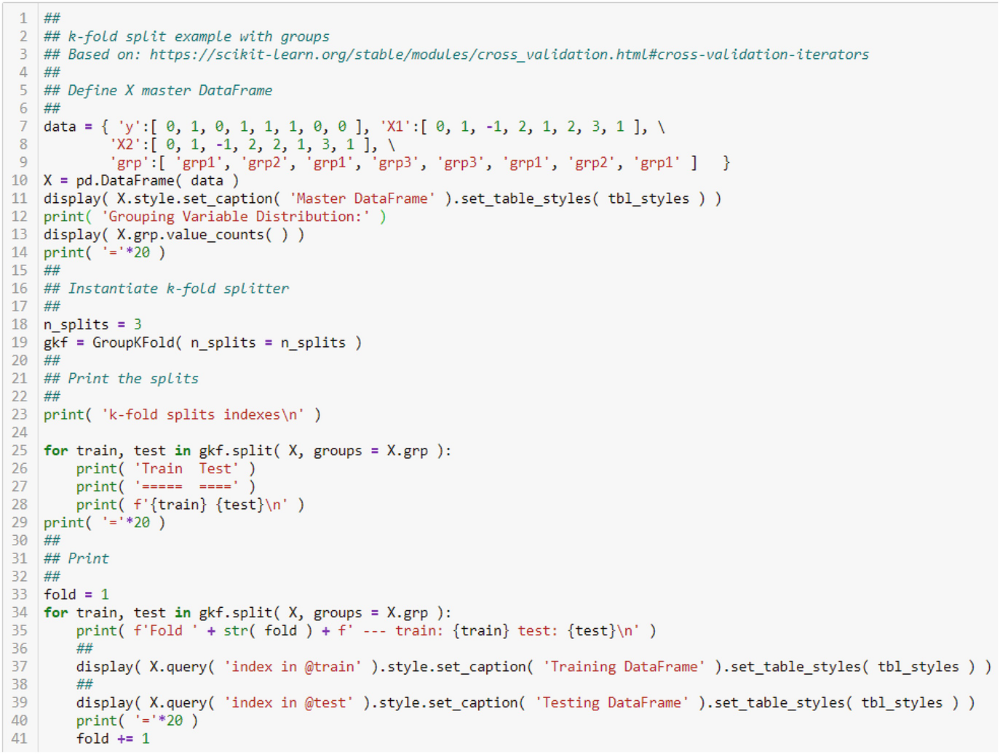
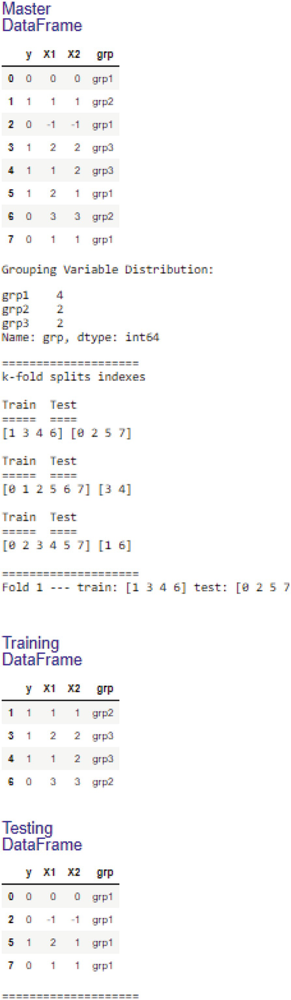

# 用于业务数据分析的高级 OLS
> 沃尔特·R·帕茨科夫斯基1
> (1)
> 数据分析公司，美国新泽西州普莱恩斯伯勒

我在前一章中介绍了监督学习和非监督学习的双重概念，作为对数据立方体高级操作的讨论的延续。 segue 的原因是业务数据分析不仅仅涉及建模。它还涉及分类。两者都是从数据中学习的方法，前者以监督方式，后者以无监督方式。更重要的是，两者都涉及更多的“步骤”，而不仅仅是建模或分类。它们还涉及测试、预测和验证。这就是训练测试拆分讨论进入画面的地方。
在本章中，我将开始深入讨论监督学习。我将专注于对回归建模进行更广泛的讨论，主要是我在第 6 章中首次介绍的 OLS。 我将在本章之后讨论逻辑回归。最后，我将在最后一章介绍关于分类的材料，这是一组无监督学习过程。

## 10.1 链接功能：简介

最重要的监督分析工具是回归模型，主要是 OLS。它是用于估计模型的最古老的正式技术，但它也只是一系列方法的一个成员：广义线性模型 (GLM) 系列。 GLM 系列很大，超出了基本的 OLS。根据目标的性质，有不同的家庭成员。每个都具有与特征的线性函数相关联的目标平均值的函数。均值是目标的期望值。均值函数称为链接函数。链接函数转换随机变量的平均值，使其等于特征的线性组合。也就是说，如果μ tr 是目标的均值（期望值），那么变换就是其中 g( ⋅ ) 是链接函数。有大量的链接功能，因此是大家庭。有关链接函数和 GLM 系列的主要参考资料，请参见 McCullagh 和 Nelder (1989)。有关 GLM 系列的详细讨论，另请参见 Dobson (2002)。
模型族是一个通用族，因为实际上只有一个模型具有连接目标和特征的变体。链接功能识别变体（即家庭表亲）。我在表 10.1 中列出了几个链接函数。我将只考虑 BDA 中常用的两个链接函数：

1. 身份链接；
    表 10.1 这是最常用的链接函数列表
    | 方法     | 因变量     | 关联     |
    | -------- | ---------- | -------- |
    | OLS      | Continuous | Identity |
    | Logistic | Binary     | Logit    |
    | Poisson  | Count      | Log      |
2. 登录链接。

OLS 的链接称为标识链接，因为目标的期望值（即其均值）已经完全等于特征的线性组合；不需要进一步的转换。回想一下我在第 6 章中的讨论，基本回归模型是 $$Y_i = \beta _0 + \sum _{j = 1}^p \beta _j \times X_{ij} + \epsilon _i$$，其中 $$\epsilon _i \sim \mathcal {N}( 0, \sigma ^2), \forall i$$。由于干扰项 𝜖~i~ 是随机变量，因此目标 Y~i~ 也是随机变量。目标的期望值为 $$E(Y) = \beta _0 + \sum _{j = 1}^p \beta _j \times X_{ij}$$，因此它同样是特征的线性组合。由此得名。我将在第 11 章讨论具有不同含义的 Logit Link。

## 10.2 数据预处理
我不得不说一下我在第 5 章中介绍的数据预处理。特别是，我必须涵盖：

1. 标准化；
2. 分类数据的编码；
3. 数据缩减主要是为了处理多重共线性。

我将在本节中介绍前两个，在后面的部分中介绍多重共线性。

### 10.2.1 回归分析的数据标准化

数据标准化是任何数据分析的重要第一步。你会记得，标准化的目标是将所有变量放在同一基础上，以便任何一个变量都不会过度影响分析结果。例如，这种不当影响可能会发生，因为测量尺度差异很大，其中一个变量仅因为其尺度而支配另一个变量。因此，它似乎也应该是回归分析的第一步。然而，这是有争议的。有两个营地。当然，一个说你应该标准化，而另一个说你不需要标准化，因为回归系数会自动调整 p 值、R^2^ 和 F 统计量不变的尺度差异。因此，实质性结果没有改变：什么是统计显着的，多少方差被解释是没有改变的。此外，使用参数估计值计算的弹性也没有变化，因此特征变化的影响程度的度量也没有变化。问题实际上只是对参数估计的解释。
回想一下我在 Sect 的讨论。 5. 1. 1 一个线性变换是 Z 变换，它将变量线性映射到具有零均值和单位方差的尺度。转换方程有两个部分：一个使数据居中的分子和一个对数据进行缩放的分母。因此，有两个同时进行的转换：居中和缩放。你实际上可以只应用一个或两个。换句话说，如果 X 是你的特征变量，你可以这样做 $$Z_i = X_i - \bar {X}$$, Z~i~ = X~i~ / s~X~, or $$Z_i = {X_i - \bar {X}}/{s_X}$$。
无论你使用哪一个，你都必须为数据拟合一个统计函数，然后使用该拟合统计量来转换特征变量。平均值和/或标准偏差适合数据，然后它们用于进行 Z 变换。有拟合步骤和变换步骤。在 Python 的 SciKit 库中，它们是 fit()、transform() 和 fit_transform()，它们只需一次调用即可完成。稍后你将看到这些示例，尽管你已经在第 6 章中看到了 fit() 的用法。
对于 OLS，你不需要缩放特征变量。要看到这一点，假设你有一个简单的单变量模型：Y~i~ = β~0~ + β~1~ × X~i~ + 𝜖~i~。假设你通过缩放因子 f~X~ 调整 X，因此现在的特征是 $$X_i^* = f_X \times X_i$$。这个因子可以是 f~X~ = 1 用于无缩放或 f~X~ = 1 / s~X~ 用于按标准偏差缩放。新模型为 $$Y_i = \beta _0 + \beta _1^* \times X_i^* + \epsilon _i$$。要查看对估计斜率参数的影响，首先注意 $$X_i^*$$ 的样本均值仅通过 f~X~ 调整：$$\bar {X^*} = f_X \times \bar {X }$$。那么，$$\bar {X^*} = \bar {X}$$ 表示不做任何调整； $$\bar {X^*} = {1}/{s_X} \times \bar {X}$$ 用于缩放。接下来，回忆第 6 章中计算斜率估计的公式，并代入新的 X：
$$
\displaystyle \begin{aligned} \begin{array}{rcl} \hat{\beta_1^*}=\displaystyle \dfrac{\sum (Y_i - \bar{Y}) \times (X_i^* - \bar{X^*})}{\sum (X_i^* - \bar{X^*})^2} \\ =\displaystyle \dfrac{f_X \times \sum (Y_i - \bar{Y}) \times (X_i - \bar{X})}{f_X^2 \times \sum (X_i - \bar{X})^2} \\=\displaystyle \dfrac{1}{f_X} \times \hat{\beta_1}. \end{array} \end{aligned}
$$
估计斜率是按因子的倒数缩放的真实估计。 Kmenta (1971) 表明标准误差也按因子的倒数进行缩放。这意味着 t 比不变，这进一步意味着显着性的 p 值不变。由于简单模型的 F 统计量是 t 统计量的平方，因此 F 统计量也不变。最后，R^2^ 不变，如 Kmenta (1971) 所示。我们可以多走一步注意到弹性也没有变化，因为

$$
\displaystyle \begin{aligned} \begin{array}{rcl} \eta_{X^*}^{Y}=\displaystyle \hat{\beta_1^*} \times \dfrac{\bar{X^*}}{\bar{Y}} \\=\displaystyle \hat{\beta_1} \times \dfrac{\bar{X}}{\bar{Y}} \end{array} \end{aligned} 
$$
这是没有缩放的弹性。
拦截呢？很容易证明截距不变。因此，基本上，缩放并不能完成任何事情。
如果目标同样按因子 f~Y~ 缩放，那么你可以证明估计的斜率是 $$f_Y \times \hat {\beta _1}$$。截距是 $$\hat {\beta _0^*} = f_Y \times \bar {Y} - \hat {\beta _1} \times \bar {X}$$，所以它被因子调整。通常，为了标准化 Y 和 X，估计的斜率是 $${f_Y}/{f_X} \times \hat {\beta _1}$$ 并且截距被适当地调整。
现在考虑通过减去平均值来居中。如果减去 X 的平均值或 Y 的平均值或两者都减去，则很容易证明斜率估计量不变。只需认识到与平均值的偏差的平均值为零。结论是居中没有效果。
最后的含义是标准化对于 OLS 来说不是必需的。

### 10.2.2 One-Hot 和 Effect（或 Sum）编码

在回归模型中包含分类变量以估计非定量因素对目标的影响并不罕见。它可能是通过经验知道的，也可能是由于轶事证据而怀疑一个因素有影响，因此不仅应该包括在回归模型中，而且还应该测试它的影响。非量化因素的影响是否超出了单纯的怀疑？示例包括用于营销研究的营销区域和商店类型；人力资源研究的教育水平或学位；用于成本效率研究的机器人/非机器人制造工厂；等等。
由于这些因素是非定量的，因此它们不能直接用于仅使用数值数据估计参数的回归模型中。估计公式依赖于均值和与这些均值的偏差；分类变量没有均值。它们必须被编码或转换为数字度量。我在第 5 章研究了不同的编码方法。计量经济学和机器学习空间中最常用的编码是虚拟编码或 one-hot 编码。这两个名称都指代相同的编码方案，并且可以互换使用。我使用“虚拟编码”。
还有另一种编码形式，称为效果编码，它使用 - 1 和 + 1 编码方案，而不是 0 和 1 方案。与虚拟编码一样，为分类变量的每个级别创建一个效果编码变量。对于虚拟编码，必须从线性模型中排除这些效应编码变量之一，以避免虚拟变量陷阱。这种编码的优点是包含效应编码变量的估计系数之和等于排除效应编码变量的系数的负值。包含和一个排除效应编码估计值的总和必须为 0.0。因此，如果需要，你可以始终“检索”省略的系数。效果编码通常用于市场研究和实验的统计设计。我不会在本书中使用它，而是将我的讨论仅限于虚拟编码。有关效果编码的讨论，请参见 Paczkowski (2018)。
我提到对于虚拟编码，删除其中一个虚拟变量以避免数字问题。这个问题被称为我多次提到的虚拟变量陷阱。如果单个分类变量的所有可能虚拟变量都包含在线性模型中，则这些变量的总和等于常数项。所有观测值的常数项实际上是 1.0，虚拟变量的总和也是 1.0。我在表 10.2 中对此进行了说明。所以，
表 10.2 该表说明了虚拟变量陷阱。常数项是 1.0 是定义。因此，无论观测值位于哪个区域，常数都具有相同的值：1.0。然而，虚拟变量的值因地区而异，如图所示。每个观测值的虚拟值之和为 1.0。这个总和和常数项是相等的。这是完美的多重共线性。陷阱没有认识到这种平等

| 观察 | 地区      | 常数项 | D1   | D2   | D3   | D4   | Sum  |
| ---- | --------- | ------ | ---- | ---- | ---- | ---- | ---- |
| 1    | Midwest   | 1      | 1    | 0    | 0    | 0    | 1    |
| 2    | Northeast | 1      | 0    | 1    | 0    | 0    | 1    |
| 3    | South     | 1      | 0    | 0    | 1    | 0    | 1    |
| 4    | West      | 1      | 0    | 0    | 0    | 1    | 1    |

常数和虚拟变量之间存在完美的线性关系。这是完美的多重共线性。在数值上，在这种情况下无法估计未知参数，因此所有估计都会失败并停止。一些软件会检测到这个问题并删除其中一个虚拟变量，但并非总是如此。
Statsmodels 包提供了另一种解决方案。回想一下，你使用 Patsy 包公式范例将模型的公式指定为字符串。2 我在第 6 章中提供了一个示例。有一个 Patsy 函数 C(·)，它将分类变量作为参数并创建所需的编码变量。注意大写的“C”。有几种可用的编码方案，默认为虚拟编码。 Patsy 中的虚拟编码称为处理编码，在输出中由大写 T 表示，只是为了使命名约定混乱。此函数检测分类变量的水平并创建正确数量的虚拟变量。它还会掉落其中一个假人；该级别在 Patsy 文档中称为参考级别。参考水平是分类水平的字母数字顺序的第一个水平。例如，参考家具案例研究，有一个 Region 变量有四个级别：Midwest、Northeast、South 和 West。在 Patsy 公式字符串中添加“C( Region )”会产生三个虚拟变量：Northeast、South 和 West 各一个；中西部在参考水平，被省略。

## 10.3 案例研究应用

考虑我在第 6 章中讨论的家具回归模型。该模型公式只有一个解释变量：家具口袋价格的对数。该模型可以扩展到包括销售人员提供的折扣率。有四种：经销商（Ddisc）、竞争者（Cdisc）、订单量（Odisc）和提货（Pdisc）。如果客户开车到制造商的仓库取货，则提供最后一个。该模型还应扩展到包括营销区域，因为在此示例中，销售人员是区域性的，而不是集中管理的，因此每个区域基本上都有自己的折扣政策；只有标价是集中确定的。有四个营销区域与美国人口普查区域一致：中西部、东北部、南部和西部。
第一步是折叠数据立方体，它是一个面板数据集：客户按订单的时间段。对于此示例，我折叠时间段以创建包含总订单、平均价格和每个 CID 的平均折扣的客户 ID (CID) 数据集。由于每个客户仅位于一个营销区域，因此该区域被包括在内。我在图 10.1 中展示了这个聚合的代码片段。这是现在的横截面数据。

图 10.1 这是聚合订单数据的代码。我之前创建了一个包含所有订单、客户特定数据和营销数据的 DataFrame
然后，我使用 train_test_split 函数将聚合的横截面数据拆分为训练和测试数据集。我将随机分配设置为四分之三的训练和四分之一的测试。随机种子设置为 42，以便每次运行拆分功能时都会产生相同的拆分。我在图 10.2 中显示了它的代码片段。

图 10.2 这是将聚合订单数据拆分为训练和测试数据集的代码。我使用了四分之三的测试和随机查看 42。只显示了训练数据的头部
获得训练数据后，我就设置了回归。我在图 10.3 中显示了设置。这遵循我在第 1 章中概述的相同四个步骤。 6.公式是关键部分。我把它写成一个字符串：公式 = 'log_totalUsales ∼log_meanPprice + meanDdisc + meanOdisc + meanCdisc + meanPdisc + C( Region )'。请注意，营销区域有一个术语：C( Region )。如上所述，Region 变量是具有四个级别的分类变量。 C( ) 函数评估级别的数量并为每个级别创建一个虚拟变量，省略按字母数字顺序排列的第一个级别，即中西部。除了公式修改外，其他一切都与我在第 1 章中概述的相同。 6. 我在图 10.4 中展示了回归结果。

图 10.3 这是为聚合订单数据设置回归的代码。注意公式语句的形式

图 10.4 这是聚合订单数据的回归结果
R^2^ 表明目标变量中只有大约 27% 的变化可以由自变量集解释。不幸的是，这个度量被自变量的数量夸大了。 R^2^ 的一个属性是随着更多变量的添加而膨胀。这是因为每个新变量添加到模型中都会减少误差平方和 (SSE)。由于总平方和 (SST) 是固定的，因此增加了回归平方和 (SSR)。由于R^2^ = SSR / SST，R^2^ 必须增加。我们可以以反映自由度的调整的形式对添加更多变量施加惩罚。新的度量称为 R^2^ -adjusted 或 Adjusted R^2^ or ；名称各不相同。确实，调整后的 R^2^ ≤ R^2^。
我描述了 F 统计量在测试零假设时的用途，即该模型与我所说的 Stat 101 模型没有什么不同。后者是一个只有常数项的模型。据说这是受限制的，因为除了常数之外的所有参数都为零。我们正在考虑的模型是不受限制的，因为所有参数都包括在内。因此，零假设是 H~O~ : β~1~ = β~2~ = ... = β~p~ = 0，而替代假设是这些参数中至少有一个不为零。如果一个非零参数大于或小于零，则无关紧要；它必须是非零的。 F 检验是对受限模型与非受限模型的检验。 F 统计量的 p 值告诉你获得大于计算值的 F 值的概率。小于 0.05 的 p 值告诉你拒绝零假设。图 10.4 中的 p 值为 7.65e-35，这绝对是零。3 应该拒绝零假设。
对数价格变量 log_meanPprice 的估计系数为负 (− 2.8279)，p 值为 0.000。 Null 假设是这个变量的参数为零，这个 Null 必须被拒绝。这意味着（原木）价格对（原木）销售有（负面）影响。这个估计系数就是我在第 6 章中展示的价格弹性。 客厅百叶窗仍然具有很高的价格弹性。
折扣是轻微的混合。竞争性折扣 Cdisc 意义重大，而其他三个则微不足道。你可以只使用 Cdisc 运行第二次回归，看看会发生什么。
区域假人需要一些解释。虚拟对象由标签 C(Region)[T.XXX] 表示，其中 XXX 是东北部、南部或西部。 C(Region) 部分告诉你该变量是由 C( ) 函数创建的，“Region”部分告诉你这是针对营销区域变量的。 “T”代表“治疗”，这是 Statsmodels 的虚拟变量术语。因此，语句 C(Region)[T.Northeast] 表示东北营销区域的虚拟变量。
你会注意到估计的虚拟系数是正值和负值的混合，这可能会导致你得出结论，某些区域具有积极影响，而其他地区则没有。但是，你还必须查看它们的 p 值。他们也是一个混合体。与折扣不同，这会导致问题。对于折扣，你可以放弃我上面提到的无关紧要的折扣。但是，对于假人，你必须将它们全部丢弃或保留它们；这是一个“非此即彼”的决定。原因是区域是一个概念，而假人只是这个概念的编码。你不能放弃一个概念的一部分。但是，假设你丢弃了无关紧要的假人。怎么了？你重新定义了它们所代表的东西。你必须测试所有假人的重要性，以确定你是否保留营销区域的概念。该检验是另一个 F 检验。
F 统计量的一般形式是
$$
\displaystyle \begin{aligned} \begin{array}{rcl} F_C=\displaystyle \dfrac{\left(SSR_U - SSR_R\right)/(df_U - df_R)}{SSE_U/(n - p - 1)} \end{array} \end{aligned} 
$$

$$
\displaystyle \begin{aligned} \begin{array}{rcl}=\displaystyle \dfrac{\left(SSE_R - SSE_U\right)/(df_U - df_R)}{SSE_U/(n - p - 1)} {} \end{array} \end{aligned} 
$$

其中“U”表示不受限制的模型“R”表示受限制的模型。如果受限模型是仅具有常数项的 Stat 101 模型，则 SSR R = 0（和 df R = 0），因为没有自变量。
你现在可以运行两种回归：一种有虚拟变量，另一种没有虚拟变量。零假设是假人的所有系数都为零，而替代假设是至少一个不是。可以通过检查两个模型的残差均方的差异来比较结果。例如，考虑一个具有两个变量和 15 个观察值的模拟数据的 DataFrame。一个变量是定量度量，另一个是具有三个级别的分类变量。后一个变量必须在回归模型中进行虚拟化。我运行了两个单独的回归，一个有虚拟变量，一个没有虚拟变量。我简洁地总结了图 10.5 中的结果，而不是呈现整个回归输出。我还创建了相关的方差分析表，如图 10.6 所示。使用图 10.6 中的数据，我使用 (10.3.2) 手动计算了 F 统计量，并将其显示在图 10.7 中。请注意，手动计算的 F 统计量与图 10.5 中的一致。如图 10.8 所示，你可以只对两个模型进行 F 检验。请注意，结果与我在其他图中显示的一致。

图 10.5 这些是模拟数据的回归结果。 R^2^ 的两条线是 R^2^ 本身和调整后的版本

图 10.6 面板 (a) 是模拟数据的无限制 ANOVA 表，面板 (b) 是限制版本

图 10.7 这是使用图 10.6 中的数据手动计算的 F 统计量。这里的 F 统计量与图 10.5 中的一致

图 10.8 这是我在图 1 中总结的两个回归的 F 检验。

## 10.4 异方差问题和检验
一个关键的经典假设是扰动项的方差是常数，$$\sigma ^2_{\epsilon _i} = \sigma ^2$$, ∀i。这称为同方差。如果方差不是恒定的，那么你有异方差：$$\sigma ^2_{\epsilon _i} = \sigma ^2_i$$, ∀i。这对于涉及不同单位（例如家庭、公司、行业、州或国家）的横截面数据来说是典型的。它们随某个时间点的某些测量特性而变化，并且这些特性在单元之间的差异会导致干扰项的变化。然而，在时间序列数据中，同一单位是在不同时间点测量的，问题在于不同点测量值之间的关系。
异方差对 OLS 估计量的性质有何影响？回想第 6 章，有四个理想的估计量属性。有关这些属性，请参见 Kmenta (1971)。他们将估计器定义为最佳线性无偏估计器 (BLU)。仍然满足线性，因为这与方差无关。估计量的无偏性和一致性也是如此。但是，不满足最小方差属性，因为这与扰动项的方差有关。结果是非常数方差使 OLS 估计量与 BLU 估计量不同。对于 BLU 估计器，期望的属性被强加在估计器的推导中，因此根据定义，即使在异方差下它也具有最小的方差。
对于单个特征模型，BLU 估计器是

$$
\displaystyle \begin{aligned} \begin{array}{rcl} \hat{\beta^*_1}=\displaystyle \dfrac{\sum w_i \left(X_i - \overline{X^*}\right)\left(Y_i - \overline{Y^*}\right)}{\sum w_i \left(X_i - \overline{X^*}\right) ^2} {} \end{array} \end{aligned}
$$

$$
\displaystyle \begin{aligned} \begin{array}{rcl} \overline{X^*}=\displaystyle \sum \frac{w_i X_i}{\sum w_i} \text{ ~ ; similarly for {$\overline{Y^*}$}} \end{array} \end{aligned}
$$

$$
\displaystyle \begin{aligned} \begin{array}{rcl} w_i=\displaystyle \frac{1}{\sigma_i^2}. \end{array} \end{aligned}
$$

(10.4.1) 的推导参见 Kmenta (1971)。显然，在经典假设下，OLS 估计量是
$$
\displaystyle \begin{aligned} \begin{array}{rcl} \widehat{\beta_1} = \frac{\sum (X_i - \overline{X})(Y_i - \overline{Y})}{\sum (X_i - \overline{X})^2}. \end{array} \end{aligned}
$$
因为权重是恒定的，所以从分子和分母中抵消了。这表明存在一个估计器族。事实上，有。它被称为广义最小二乘法（GLS）。 OLS 是这个更大系列的一个特例。所以，是的，一个家庭成员中的另一个家庭。
权重 w i 很重要。它们是方差的倒数。一个问题是实现 BLU 估计器的权重来源。几种可能性是：

- 从其他研究的信息中构建它们；
- 基于数据分析对方差生成过程（VGP）做出假设；
- 在研究的数据收集阶段重复观察；
- 使用其他估计技术。

我将在下面探讨第二个和第四个选项。

### 10.4.1 异方差问题
异方差在 OLS 估计中会产生什么问题？ Kmenta (1971) 清楚地表明了其中的含义。他表明，如果你坚持使用 OLS 并忽略异方差性，你将计算出在线性、无偏估计量类中效率不高的估计值，因为 BLU 具有较小的方差，如上所述。异方差下正确的最小方差是

$$
\displaystyle \begin{aligned} \begin{array}{rcl} \sigma^2_{\widehat{\beta^*_1}}=\displaystyle \frac{\sum w_i}{\sum w_i \sum w_i X^2_i - (\sum w_i X_i)^2} \end{array} \end{aligned} 
$$
这显然不同于经典假设下的 OLS 方差，但在那些易于证明的假设下简化为它。我们可以证明。你需要一个估计器方差的估计器。在同方差下，对于单变量模型，这是 s 2 = SSE∕n − 2。如果你在异方差下使用它，你将使用有偏估计量。不幸的是，我们不知道偏差的方向。正如 Kmenta (1971) 所指出的，如果偏差为负，即太小，则 t 统计量将太大，并且当你不应该拒绝零假设时，你将拒绝它。然后，你将做出错误的决定，这可能对你的业务决策造成极大的损害。你不会提供所需的丰富信息。这是由于异方差引起的问题。参见 Kmenta (1971)、Gujarati (2003) 和 Hill 等人。 （2008）对异方差性的广泛讨论。

### 10.4.2 异方差检测

你可以使用图形显示或正式的统计测试来检测异方差问题。我将对两者发表评论。
图形方法是最简单的。你只需绘制 OLS 残差并寻找异方差的特征模式。将残差与估计的因变量结合使用，该因变量可以捕捉特征的影响。如果只有一个功能，那么使用它就足够了；如果有多个，则使用估计的因变量。与所有图形一样，你必须寻找我在第 4 章中强调的模式。所需的模式是围绕一条具有零截距和零斜率的线的恒定随机分布。零截距的原因是零是残差的平均值。零斜率是由于残差缺乏趋势。我在图 10.9 的面板 (a) 中说明了这种理想的模式。另一方面，图 10.9 的面板 (b) 显示了不希望的模式。残差随着 x 轴变量值的增加呈扇形散开。这种扇形图案是指示异方差性的特征。

图 10.9 这些是异方差的特征模式。残差随机分布在面板 (a) 中的平均值周围；这表明同方差性。随着 X 轴变量的增加，它们在面板 (b) 中呈扇形分布；这表明异方差
残差图很容易产生。回想一下，订单数据被分成训练和测试数据集。训练数据用于训练上面图 10.4 所示的模型。检索并绘制残差和预测（即拟合）值。我在图 10.10 中显示了该图。请注意，该模式类似于图 10.9 中的模式，面板 (a) 表明没有异方差。

图 10.10 这是图 10.4 中残差的残差图
尽管这些图表在存在问题时可以突出显示问题，但它们也需要解释。不同的人可以并且将会在图表中看到不同的模式。更好的方法是使用正式的统计检验，尽管关于 p 值的解释存在争议。尽管如此，统计测试应始终与图形检查一起进行。
异方差性有许多统计检验。我将描述的一个是白色测试。见希尔等人。 （2008 年）对该测试进行了很好的讨论，以及 Greene（2003 年）进行了高级治疗。对于这个解释，首先假设只有一个特征，所以 p = 1。零假设是 H 0 : 同方差性，替代假设是 H~A~ : 异方差性。测试包括几个步骤：

1. 估计模型并保存残差。
2. 将残差平方并估计第二个辅助模型：
    $$
    \displaystyle \begin{aligned} \begin{array}{rcl} e^2_i=\displaystyle \gamma_0 + \gamma_1 X_i + \gamma_2 X^2_i + u_i \\ u_i \sim \displaystyle \mathcal{N}(0, \sigma_u^2) \end{array} \end{aligned}
    $$
    平方残差是干扰项方差的代理，因此你正在对方差进行建模。
3. 保存 R^2^。
4. 计算 $$\chi ^2_C = n \times R^2 \sim \chi ^2_2$$ 其中 $$\chi ^2_C$$ 是计算出的卡方，是其具有两个自由度的理论值。 “2”来自 X~i~ 和项。
5. 如果 p 值 < 0.05，则拒绝 H 0 的同方差。

如果涉及多个特征，请使用各个项、它们的平方值和所有交互（即交叉乘积）。例如，对于 p = 2，你有

$$
\displaystyle \begin{aligned} \begin{array}{rcl} e^2_i=\displaystyle \gamma_0 + \gamma_1 X_{i1} + \gamma_2 X^2_{i1} + \gamma_3 X_{i2} + \gamma_4 X^2_{i2} + \gamma_5 X_{i1}X_{i2} + u_i \\ \end{array} \end{aligned} 
$$
卡方检验现在有五个自由度。一般来说，检验统计量是

$$
\displaystyle \begin{aligned} \begin{array}{rcl} nR^2 \sim \chi^2_{2^p + p -1} \end{array} \end{aligned} 
$$

其中自由度是辅助模型中参数的数量减去常数的 1。我在图 10.11 中显示了白色测试的设置和结果。我在 stats.diagnostics 子模块中使用了 statsmodels 的 het_white 函数。这有两个参数：回归残差和特征。我从估计的模型中检索了特征，如图 10.11 所示。这些结果清楚地为拒绝同方差的零假设提供了证据，这与基于图 10.10 的结论不同。我将在下一节讨论如何解决这个问题。

图 10.11 这些是白色测试结果

### 10.4.3 异方差补救

如果根据 White Test 怀疑或显示异方差性是一个问题，那么你必须解决它；也就是说，它必须被修复。 MacKinnon 和 White (1985) 开发了纠正标准误差的程序，标准误差是受异方差影响的因素。我在表 10.3 中列出了四种版本的补救措施。有关描述和讨论，请参见 Hausman 和 Palmery (2012)。另见 White (1980) 和 MacKinnon 和 White (1985)。 Hausman 和 Palmery (2012, p. 232) 指出 HC0_se “在计量经济学中很普遍。然而，人们早就知道，当原假设为真且样本不大时，基于 White 标准误差的 t 检验会过度拒绝。事实上，当标称尺寸通常为 0.05 时，测试的实际尺寸为 0.15 的情况并不少见。”尽管如此，他们后来指出HC1_se 是最常用的，所以这是推荐的版本。我在图 10.12 中展示了它是如何实现的。

图 10.12 这是基于 MacKinnon 和 White (1985) 的 HC1_se 的标准误差校正
表 10.3 这些是 statsmodels 中可用的四种 White 和 MacKinnon 校正方法。测试命令符号是 statsmodels 符号。描述基于 Hausman 和 Palmery (2012)

| 测试命令 | 描述                                                         |
| -------- | ------------------------------------------------------------ |
| HC0_se   | White (1980) 最初的稳健标准误差校正                          |
| HC1_se   | MacKinnon 和 White (1985) 的替代方案； 调整自由度，是最常用的 |
| HC2_se   | MacKinnon 和 White (1985) 的替代方案； 调整杠杆值            |
| HC3_se   | MacKinnon 和 White (1985) 的替代方案； 对#2的轻微修改        |

## 10.5 多重共线性

当使用高维数据集时，多重共线性是业务数据潜在的主要问题。这些数据集包含许多可用于线性模型的变量。这可能是一个问题，因为任何两个或更多变量相关的概率随着更多变量的考虑而增加。例如，参见赵等人。 （2020）和范等人。 （2009 年）。对于这种情况，有一些可互换的术语：

- 多重共线性；
- 共线性；
- 病态（主要由数值分析师使用）。

### 10.5.1 关于多重共线性的题外话

多重共线性是 BDA 中的一个重要主题，比人们认为的要重要。当特征的数量很大时，它会产生重大影响，因为其中几个线性相关的概率会变高。在本节中，我想离题讨论一下多重共线性。我在前面的章节中多次提到它，但从未完全讨论过它。
回想一下 OLS 估计量由 (6. 4. 2) 给出，为了方便起见，我在此重复：
$$
\displaystyle \begin{aligned} \begin{array}{rcl} \hat{\boldsymbol{\beta}} = \left({\mathbf{X}}^{\top} \mathbf{X}\right)^{-1}{\mathbf{X}}^{\top} \mathbf{Y} \end{array} \end{aligned}
$$
其关键部分是平方和和叉积矩阵的逆矩阵 $$\left ({\mathbf {X}}^{\top } \mathbf {X}\right )^{-1}$$，它是所有特征的函数。如果两个或多个特征是线性相关的，那么计算它不是微不足道的，也是不可能的。在这种情况下，你无法估计线性模型的未知参数。
假设三个特征是 X~1~、X~2~ 和 X~3~。如果说，它们是线性相关的，
$$
\displaystyle \begin{aligned} \begin{array}{rcl} \mathbf{X_1} = \alpha_1 \mathbf{X_2} + \alpha_2 \mathbf{X_3} \end{array} \end{aligned}
$$
这意味着包含在 X 2 和 X 3 中的信息也包含在 X~1~ 中，因此将所有三个都包含在模型中不会获得任何信息。例如，从基础经济学中回忆起实际 GDP 定义为 C + I + G + NX 其中 C 是实际个人消费支出，I 是实际私人国内投资总额，G 是实际净政府支出和投资，NX 是真实的商品和服务的净出口。所有关于 Real GDP 的信息都包含在 C + I + G + NX 中。在X矩阵中包含Real GDP、C、I、G、NX，就等于包含了信息冗余；这是多重共线性。
需要考虑三种多重共线性情况：

1. 完美多重共线性
    1. 变量之间的完美线性关系。
    2. 一个或多个变量是多余的。
    3. 适用于数据集中的所有观察。
    4. 通常是偶然引入一个问题。示例：虚拟变量陷阱。
2. 一些多重共线性
    1. 某种线性关系。
    2. 典型的业务数据。
3. 没有多重共线性
    1. 完全没有线性关系。
    2. 不是典型的业务数据。

由于你将使用的数据集的大小^4^以及许多业务数据相关的事实，你的业务分析数据中通常会存在某种程度的多重共线性。例如，生产和销售。没有多重共线性的情况不是问题，因为它很少发生在商业和经济数据中。
当你具有完美多重共线性时，你无法反转矩阵。这是一个严格的计算问题。不可逆矩阵称为奇异矩阵或病态矩阵。某些软件包会发出警告，例如 MATRIX IS SINGULAR。如果无法找到逆，则无法找到参数估计值。整个估计过程崩溃了。
当你有一些多重共线性时，你可以反转 $$\left ({\mathbf {X}}^{\prime } \mathbf {X}\right )$$ 矩阵并计算估计值。然而，问题在于估计是不稳定的。在这种情况下，倒置矩阵是“膨胀的”，因此结果可能与反转的符号和幅度相反，这些可能会随着数据的轻微变化而变化。一个比不稳定估计更重要的问题是估计量的方差“膨胀”。从宗门召回。 6. 4 那
$$
\displaystyle \begin{aligned} \begin{array}{rcl} \sigma_{\hat{\boldsymbol{\beta}}}^2 =\displaystyle \sigma^2 \left({\mathbf{X}}^{\top} \mathbf{X}\right)^{-1}. \end{array} \end{aligned}
$$
如果 $$\left ({\mathbf {X}}^{\top } \mathbf {X}\right )^{-1}$$ 被夸大，那么方差也是如此。
假设你只有两个特征，X~1~ 和 X~2~。那么 X~1~ 的 $$\hat {\beta _1}$$ 的方差为
$$
\displaystyle \begin{aligned} \begin{array}{rcl} \sigma_{\hat{\beta_1}}^2=\displaystyle \dfrac{1}{1 - r^2_{12}} \times \dfrac{\sigma^2}{\sum (X_1 - \overline{X_1})^2}{} \end{array} \end{aligned}
$$
其中 $$0 \leq r^2_{12} \leq 1$$ 是 X~1~ 和 X~2~ 之间的平方相关，所以 $$0 \leq (1 - r^2_{12}) \leq 1$$ .本质上，分母中的乘法因子 $$(1 - r^2_{12})$$ 缩小了分母中的另一个因子 $$\sum (X_1 - \bar {X_1})^2$$ , 从而膨胀 $${1}/{\sum (X_1 - \overline {X_1})^2}$$。如果 $$r^2_{12} = 0$$，那么 $$\sigma _{\hat {\beta _1}}^2$$ 和以前一样。如果 $$r^2_{12} = 1$$，那么 $$\sigma _{\hat {\beta _1}}^2$$ 是未定义的，所以它“爆炸了”。对于 $$r^2_{12}$$ 的大值，$$\sigma _{\hat {\beta _1}}^2$$ 被夸大了。
更一般地，让 V IF j 是参数 j 的方差膨胀因子，j = 1, 2, ..., p。这是由于多重共线性而导致方差膨胀的量。它是 (10.5.3) 中因子 $${1}/{(1 - r^2_{12})}$$ 的推广。你可以将 j 的这个方差写为
$$
\displaystyle \begin{aligned} \begin{array}{rcl} \sigma_{\hat{\beta_j}}^2=\displaystyle \sigma^2 \times f\left[\left({\mathbf{X}}^{\top} \mathbf{X}\right)^{-1}\right] \times VIF_j. \end{array} \end{aligned}
$$
V IF~j~ 与变量 j 与所有其他变量之间的相关性有关。如果 V IF~j~ = 1（即无相关性），则不存在方差膨胀；不存在多重共线性。你应该期待 V IF~j~ ≥ 1。基本上，

$$
\displaystyle \begin{aligned} \begin{array}{rcl} \sigma_{\hat{\beta_j}}^2=\displaystyle \sigma^2 \times \dfrac{1}{\sum(x_{ij} - \bar{x_{j}})^2 (1 - R^2_{j, x_1, x_2, x_{j - 1}, x_{j + 1}, \ldots, x_p})}. \end{array} \end{aligned}
$$
如果 VIF 夸大了方差，则 t 统计量太小。回顾

$$
\displaystyle \begin{aligned} \begin{array}{rcl} t_{C,\hat{\beta_j}} = \dfrac{\hat{\beta_j}}{s_{\hat{\beta_j}}}. \end{array} \end{aligned}
$$
因此，你不会像应有的那样经常拒绝零假设。这将导致你相信系数在统计上为零，而实际上并非如此，因此你将做出错误的决定。

### 10.5.2 使用 VIF 和 Condition Index 进行检测

如何检测多重共线性？这不是存在/不存在的问题，而是程度的问题。你必须检查多重共线性的严重性，而不是它的存在或不存在。始终假设它存在于你的业务数据中，尤其是高维数据中。
检查它的一种方法是寻找 t-statistics 和 R^2^ 之间的矛盾。t-statistics 由于膨胀的标准误差而被压缩，但 R^2^ 被膨胀，因为它是膨胀的参数向量的函数。可以证明$$SSR = \hat {\beta _1}^2 S_{XX}$$ 所以R 2 = SSR / SST 太大了。
你还可以检查 Pearson 相关矩阵。相关性接近 |1|如果两个特征之间存在线性关系。 “两个”很重要，因为相关性是成对的。如果线性关系中涉及两个以上的特征，则尽管存在高度的多重共线性，但相关性可能很低。但是如果相关性很高，那么两个特征之间就存在多重共线性；如果相关性较低，则进行另一次检查。
另一种检查是查看每个特征与所有其他特征之间的线性关系。设 X~j~ 与模型中所有其他特征之间的平方多重相关性。这是我们之前看到的 $$R^2_{j, X_1, X_2, X_{j - 1}, X_{j + 1}, \ldots , X_p}$$。也就是说，在其他特征上回归 X~j~ 并保存 R^2^。这些是辅助回归。如果你有五个特征，那么你就有五个辅助回归。
回想一下我上面介绍的方差膨胀因子 V IF。基于该定义，
$$
\displaystyle \begin{aligned} \begin{array}{rcl} VIF_j = \dfrac{1}{1 - R^2_j}. \end{array} \end{aligned} 
$$
没有线性关系意味着V IF~j~ = 1。V IF~j~的值大表示高度的多重共线性。这表明了用于评估多重共线性的经验法则 (ROT)：V IF j 的最大值大于 10 表明存在高度的多重共线性。
多重共线性的另一个指标是条件数。这是 X^⊤^X 矩阵的最大特征值与最小特征值之比的平方根。特征值是从该矩阵的奇异值分解 (SVD) 中找到的。 ROT 是如果条件数大于 20，则多重共线性是一个问题。参见 Belsley 等人。 (1980) 和 Greene (2003) 讨论了条件数，尤其是前者的参考。
图 10.4 的回归输出为检查多重共线性提供了基础。首先，我检查了我在图 10.13 中显示的相关矩阵。你可以看到相关性都非常低，表明多重共线性不是问题。图 10.14 显示了该问题的 VIF，另有说明。 VIF 是相关矩阵的逆矩阵的对角元素。因此，他们“衡量（独立）变量对估计系数方差的影响”。参见Snee (1977, p, 417)。对于高 VIF，相关特征可能“由于特征之间的相关性而被较差地估计”。参见Snee (1977, p, 417)。从图 10.14 中，你可以看到突出显示的特征揭示了多重共线性。南部地区和经销商折扣 (Ddisc) 的估计系数存在高度共线性。

图 10.13 这是检查图 10.4 中多重共线性的相关矩阵

图 10.14 这些是检查图 10.4 中多重共线性的 VIF

### 10.5.3 主成分回归和高维数据

如果 VIF 或条件编号表明存在问题，你有多种解决方法或修复多重共线性的方法。一种推荐的补救措施是从模型中删除一个特征。如果你有冗余，则存在多重共线性，因此只需删除冗余特征。 VIF 措施是丢弃哪些措施的指南。另一种补救措施是使用 Sect 的主成分分析 (PCA)。 5. 3.提取的组件在设计上是线性独立的，并且数量少于原始特征集。这些组件可用于有时称为主成分回归 (PCR) 的回归。有关讨论，请参见 Johnston (1972)。

## 10.6 预测与情景分析

估计线性模型的目标不仅是产生关键驱动特征的估计效果，而且是使用该模型进行预测。回想一下我在第一章的讨论。 BDA 关注将要发生的事情，而商业智能则关注已经发生的事情。会发生什么是预测。
有两种预测方法。第一个是确定模型在它未见过的数据集上的运行情况，第二个是对全新的情况进行预测。第一个使用测试数据集，到目前为止，该数据集一直未被使用。第二个涉及情景分析，其中为线性模型中的关键驱动因素指定值。为此不需要测试数据集。我将首先描述测试数据集的使用，然后展示如何指定场景。情景分析才是做出预测的真正原因。我将继续使用聚合订单数据和相关的回归模型来说明做出预测。

### 10.6.1 做出预测

当估计回归模型并将其存储在对象变量中时，例如图 10.4 中的 reg01，会自动创建预测方法并将其附加到该对象。此方法的参数只是测试数据集。该模型将此测试数据集中的特征应用于线性模型的估计参数，并为线性模型的目标生成预测值或估计值。然后可以使用度量将预测值与也在测试数据集中的实际值进行比较。我在图 10.15 中说明了这种方法。对于这个例子，单位销售额是预测的，但预测是（自然）对数项，因为训练集有对数销售额。预测的对数销售额通过指数转换回“正常”术语的单位销售额。可以使用 R^2^ 度量将预测与测试数据集中的实际值进行比较。

图 10.15 这说明了使用附加到回归对象的 predict 方法进行预测。测试数据集，使用ols_test
10.6.2 场景分析
一个常见的业务问题是假设的形式，其中指定了假设案例并且需要对该案例进行预测。例如，对于订单数据模型，业务经理可能会问：“如果口袋价格为 2.50 美元，订单大小折扣设置为 5%，其他折扣都设置为 3，那么西部营销区域的销售额会是多少？ ％ 每个？”这是一个可以使用估计模型来回答的特定场景。我在图 10.16 中说明了这个场景的设置。

图 10.16 这说明了使用附加到回归对象的 predict 方法进行场景假设预测。将场景放入 DataFrame 中，然后与 predict 方法一起使用

### 10.6.3 预测误差分析（PEA）

我在上面描述了一种简单的预测准确性度量。这只是一个与实际值和预测值相关的 R 2 统计量。有更复杂的方法来确定预测精度，我将在本节中介绍这些方法。
这些方法称为交叉验证方法，涉及将整个数据集连续分为两部分：训练和验证。这相当于将整个数据集划分为训练和测试数据集，但这里略有不同。它是数据的划分方式以及它们在整个建模过程中的位置。我将简要介绍的两种验证方法位于图 9. 8 中标记为“验证数据”的一个通用描述符框中的左侧。
一种方法是一次从主数据集中删除一个观察结果，并将该观察结果视为测试数据。另一种是一次删除k个观察值，并将它们作为测试数据。第一个称为留一法交叉验证 (LOOCV)，另一个称为 k 折交叉验证。我将在接下来的小节中描述每一个。一些评论的参考文献是 Paczkowski (2018)。

#### 10.6.3.1 LOOCV 方法

LOOCV 是一个迭代过程。对于我的描述，我将整个数据集称为主数据集，以将整个数据集与训练集和验证集区分开来。正如 Paczkowski (2018) 所述，有四个步骤：

1. 从主数据集中删除第一个观察并将其作为验证集放在一边。
2. 使用剩余的 n − 1 个观测值来训练模型。
3. 对遍历所有 n 的整个数据集重复步骤 1 和 2。使用每次迭代的验证集计算均方误差 (MSE)。应该有 n 个 MSE 值。
4. 估计验证错误分数为 $$Score_{(n)} = {1}/{\sum _{i = 1}^n e_i^2} = MSE$$ 其中 $$e_i = Y_i - \hat {Y} _i$$ 是与我在 OLS 第 6 章中定义的残差相当的预测残差。该误差分数是均方误差 (MSE)。

LOOCV 的优点是它避免了偏差。缺点是如果 n 很大，则计算成本很高，因为你必须遍历所有情况。据估计，LOOCV 需要 O(n^2^) 计算时间。如果样本大小为 n，那么在每次迭代中，它将使用 n − 1 个值进行训练，使用 1 个值进行测试。此外，如果 n 很大，则使用所有 n 个样本和使用 n − 1 个样本之间没有区别。估计的结果应该几乎（如果不完全相同）相同。这意味着增加的计算成本将几乎没有回报。

#### 10.6.3.2 k 折方法

第二种方法是 k-fold，它是 LOOCV 的扩展，适用于没有一个样本被留下但有几个样本被遗漏的情况。这涉及与 LOOCV 类似的五个步骤：

1. 将数据集分成大小大致相等的 k 组（即折叠）。通常k = 5或k = 10。如果n是总样本量，则$$\sum _{i = 1}^k n
2. 使用第一个折叠作为验证集。
3. 用剩余的 k − 1 折训练模型。
4. 对剩余的折叠重复步骤 2 和 3，使用验证集计算每次迭代的 MSE。这些应该有k个。如果 e ij 是残差 j, j = 1, ..., ni for fold i, i = 1, ..., k, 那么 $$MSE_i = {1}/{n_i} \sum _{j = 1}
5. 估计验证错误分数为 $$Score_{(k)} = \dfrac {1}{k} \times \sum _{i = 1}^k MSE_i$$。

如果n是样本大小，k是折叠数，那么每次训练将使用n − n∕k = (k − 1) × n∕k个样本。显然，当 k 变大时，该方法接近 LOOCV。它在计算上比 LOOCV 更便宜，因为你处理的是大块数据，而不是每个单独的案例。尽管如此，一些计算时间的估计是 O(kn 2) 和 O(n 3)。 ROT 是应该使用 5 或 10 折。

#### 10.6.3.3 评分措施

我提到 MSE 作为比较模型或评估 LOOCV 或 k 折方法的模型的分数。这可能是最常用的一种。还有其他可用的，例如

- 平均绝对误差；
- 均方对数误差；
- 中值绝对误差；
- 解释方差分数；
- 最大误差。

这些措施适用于回归模型。对于分类模型，我将在下一章讨论不同的度量。请参阅 scikit-learn 文档，了解其中的每一个和其他几个的讨论。^5^

#### 10.6.3.4 验证方法的变化

k-fold 方法有一些变化：^6^

- 重复k折: k-fold 方法执行 m 次，而 k-fold 本身执行 m = 1 次。这是一个有 m 次迭代的迭代过程。对于每次迭代，主数据集被分成 k 折。这意味着每次迭代都会有不同的折叠。
- LPOCV: 与 LOOCV 类似，但省略了 p > 1。如果 p = 1，那么这只是 LOOCV。
- 洗牌和拆分: 打乱主数据集，而不仅仅是随机拆分。
- 分层 k 倍: 使用类分组。
- 重复分层 k 折: 重复 k 折和分层 k 折的组合。
- 分层洗牌和拆分: Shuffle 和 Split 以及 Stratified k-fold 的组合。
- 组 k 折: 使用组进行 k 折验证。
- 洛格CV: 与 LOOCV 类似，但基于数据组。
- LOPGCV: 就像基于组的 LOPCV。
- 组洗牌和拆分: 像 Shuffle 和 Split 但使用组。

我在表 10.4 中总结了这些交叉验证函数。
表 10.4 这些是可用的交叉验证函数。有关完整说明，请参见 https://scikit-learn.org/stable/modules/classes.html。网站上次访问时间为 2020 年 11 月 27 日

| 功能                   | 描述                          |
| ---------------------- | ----------------------------- |
| GroupKFold             | 具有非重叠组的 k 折迭代器变体 |
| GroupShuffleSplit      | Shuffle-Group(s)-Out          |
| KFold                  | K-Folds                       |
| LeaveOneGroupOut       | Leave One Group Out (LOOGCV)  |
| LeavePGroupsOut        | Leave P Group(s) Out (LOPGCV) |
| LeaveOneOut            | Leave-One-Out (LOOCV)         |
| LeavePOut(p)           | Leave-P-Out (LPOCV)           |
| PredefinedSplit        | 预定义拆分                    |
| RepeatedKFold          | Repeated K-Fold               |
| ShuffleSplit           | 随机排列                      |
| StratifiedKFold        | Stratified K-Folds            |
| StratifiedShuffleSplit | 分层洗牌拆分                  |
| TimeSeriesSplit        | Time Series                   |

使用上述任何方法实现交叉验证都有一个警告。使用我在第 5 章中讨论的任何方法完成的任何预处理。 然后应该对训练和测试数据集进行相同的预处理。回想一下，预处理实际上分两步完成：拟合（即计算）必要的统计数据，然后使用这些统计数据转换数据。例如，标准化涉及首先计算数据的平均值和标准差，然后将它们应用于每个观察值。第一步是拟合，第二步是转换。你可以使用 fit() 方法和 transform() 方法分别执行它们，或者你可以使用一个命令来执行它们：fit_transform()。对于交叉验证，你应该使用 fit() 方法拟合训练数据；使用 transform() 方法转换训练数据；然后对测试数据使用相同的 transform() 方法。使用这种方法可以保持训练和测试数据集之间的连续性。

#### 10.6.3.5 测试的复杂性

交叉验证方法家族引入了一个新的复杂程度。我最初提出测试的方式只是将主 DataFrame 分为训练和测试两部分：用训练数据集训练模型，然后用测试数据集对其进行测试。这个简单的过程仍然有效，但还有更多的中间步骤。首先，通常会考虑一个以上的模型，每个模型都由不同的超参数或一组超参数定义。设有 m 个模型，模型 i 表示为 M~i~, i = 1, 2, ..., m。主 DataFrame 仍分为两部分，测试数据集放入“安全”中，直到所有训练和交叉验证完成。然后对于每个模型，M~i~，对训练数据进行 k 折拆分，使用验证数据计算每个折的分数，然后计算并存储分数。当模型 M~i~ 的所有折叠都已使用时，平均该模型的分数。设该平均值为 S~i~, i = 1, 2, ..., m。对所有型号重复此操作。你应该有 m 个分数。对m个分数进行排序，选出最优的，就等于选择了最优的模型。然后使用“保险箱”中的测试数据集再次测试该模型。如果你对评估测试模型的某些标准感到满意，那么你就有了最终模型。最终标准可能是另一个分数，例如均方误差。我在图 10.17 中说明了这个扩展的、更复杂的过程。

图 10.17 这是我在正文中概述的扩展的、更复杂的 train-validate-test 过程

#### 10.6.3.6 k-Fold 拆分示例

我在图 10.18 中提供了一个代码片段来说明如何进行 k 折拆分。这个片段相当长，但基本上它使用一个包含三个变量和四个样本的 DataFrame，对 DataFrame 进行 2 倍拆分，并为训练和测试组件保存每个折叠的行索引。然后它根据训练索引打印训练 DataFrame，并为各个测试索引打印测试 DataFrame。它对两个折叠中的每一个进行此打印。然后我在图 10.19 中展示了第一个折叠数据帧。你可以从这个示例中看到折叠是如何工作的，以及主 DataFrame 是如何“折叠”的。

图 10.18 这是 DataFrame 的示例 k-fold 拆分的代码片段。结果见图 10.19

图 10.19 这是图 10.18 中代码片段的折叠 1 的结果。折叠 2 将是相同的，但对于不同的索引
我在图 2 中重复这个 DataFrame 拆分示例。 10.20 和 10.21，但在主 DataFrame 中添加了一个分组变量。这些组可以代表营销区域、客户群、制造工厂等。我在图 10.21 的输出中显示了组的分布。在此示例中，我分别处理组，以便函数将与组关联的 DataFrame 的所有行提取为一个单元，然后将该单元拆分为训练和测试组件。该函数的要求是组数必须至少等于折叠数。在这种情况下，有三组和三折；仅显示折叠 1 结果。分组功能为测试数据集维护一组。虽然我没有展示所有的折叠，但每个折叠中的测试数据集确实只代表了一组。训练数据集代表了几个组。你可以在图 10.21 中看到，训练数据集有第 2 组和第 3 组，而测试数据集只有第 1 组。

图 10.20 这是一个包含三个组的 DataFrame 的示例 k-fold 拆分的代码片段。结果见图 10.21

图 10.21 这是图 10.20 中代码片段折叠 1 的结果。折叠 2 和 3 相同，但索引和组不同

## 10.7 面板数据模型

该文献讨论了几种类型的模型，特别是，它们是

1. 合并模型；
2. 固定效应模型；
3. 随机效应模型。

第一个，池化模型，是基于将整个面板数据集中的数据池化，使模型
$$
\displaystyle \begin{aligned} \begin{array}{rcl} Y_{it}=\displaystyle \alpha + \boldsymbol{\beta} \times \mathbf{X_{it}} + \boldsymbol{\epsilon}_{\mathbf{it}} \end{array} \end{aligned}
$$
其中 Y 是对象 i 在时期 t 的因变量度量； α 是一个常数项，不随对象或时间而变化（因此，这就是为什么它是“常数”：它是所有对象和时间段的常数）； X~it~ 是一个特征矩阵，其值因对象和时间段而异； β 是每个对象和每个时间段的恒定权重向量；和 𝜖 它是一个随机扰动项，随对象和时间段而变化。 “对象”可以是通过在线订购系统购买产品的消费者；零售商订购产品进行转售；业务部门的员工；通过不同工厂的机器人系统进行生产；不同的原材料供应商；等等。
池化模型基于将所有数据放入一个估计中。不允许参数因对象或时间而发生变化。参数是恒定的。这是不现实的，因为正如我已经指出的那样，这两个维度都存在差异，这就是存在数据立方体的原因。如果确实没有变化，则不需要 Cube。由于缺乏变化的这种不切实际的假设，该模型在实践中很少使用。
第二个模型，固定效应模型，允许从一个组到另一个组的变化，以便识别组间的变化。模型是
$$
\displaystyle \begin{aligned} \begin{array}{rcl} Y_{it}=\displaystyle \alpha_i + \boldsymbol{\beta} \times \mathbf{X_{it}} + \boldsymbol{\epsilon}_{\mathbf{it}} \end{array} \end{aligned}
$$
其中 α~i~ 是对象 i 的常数，它从一个对象到另一个对象而变化，因此它允许群体效应。这些群体可以是个人消费者、公司、制造厂、供应商等。这个术语很重要，因为它允许跨对象的异质性。例如，它允许你考虑客户的差异，而池模型不允许任何异质性。
一个问题是这种异质性因素与特征之间的关系。如果组效应和特征之间存在相关性，则该模型是固定效应模型。如果组效应 α~i~ 和特征之间没有相关性，那么你就有了一个随机效应模型。该截距项独立于特征而变化，遵循其自己的随机生成过程。这与干扰项 𝜖 it 的假设相同。回想一下，该术语也被假定为独立于特征。因此，在该随机扰动中添加了第二个随机变化项以产生复合随机扰动：u~it~ = α~i~ + 𝜖~it~。模型现在
$$
\displaystyle \begin{aligned} \begin{array}{rcl} Y_{it}=\displaystyle \boldsymbol{\beta} \times {\mathbf{X}}_{\mathbf{it}} + {\mathbf{u}}_{\mathbf{it}} \end{array} \end{aligned}
$$
其中 u~it~ = α~i~ + 𝜖~it~ 与 $$\sigma _{u}^2 = \sigma _{\alpha }^2 + \sigma _{\epsilon }^2$$ 和 $$cov(u_{it}, u_{is}) = \sigma _{\alpha }^2$$。我们经常使用相关性而不是协方差，因此相关性为 $$\rho = cor(u_{it}, u_{is}) = {\sigma _{\alpha }^2}/{\sigma _{\alpha }^2 + \sigma _{\epsilon }^2}$$。
从模型规范中可以看出，这些面板模型的估计更复杂。有一个 Python 包来处理它们。使用 pip install linearmodels 或 conda install -c conda-forge linearmodels 安装包 linearmodels。

## 参考
- Belsley、D.A.、E. Kuh 和 R.E.威尔士。 1980. 回归诊断：识别有影响的数据和共线性的来源。纽约：威利。
- 多布森，A.J. 2002. 广义线性模型简介。第 2 版。统计科学文本。伦敦：查普曼和霍尔/CRC。
- Fan, J., R. Samworth 和 Y. Wu。 2009. 超高维特征选择：超越线性模型。机器学习研究杂志 10，2013-2038。
- 格林，W.H. 2003. 计量经济分析。第 5 版。恩格尔伍德：普伦蒂斯霍尔。
- Gujarati, D. 2003。基础计量经济学。第 4 版。纽约：麦格劳-希尔/欧文。
- Hausman, J. 和 C. Palmery。 2012. 有限样本中的异方差稳健推断。经济通讯 116(2), 232–235。
- 希尔，R.C.，W.E.格里菲斯和 G.C.林。 2008. 计量经济学原理。第 4 版。纽约：威利。
- Johnston, J. 1972。计量经济学方法。第 2 版。纽约：麦格劳-希尔图书公司。
- Kmenta, J. 1971。计量经济学要素。纽约：麦克米伦公司。
- 麦金农，J.G.和 H.怀特。 1985. 一些具有改进的有限样本属性的异方差一致协方差矩阵估计器。计量经济学杂志 29（3），305–325。
- McCullagh, P. 和 J.A.内尔德。 1989. 广义线性模型。第 2 版。伦敦：查普曼和霍尔。
- Paczkowski, W.R.（2018 年。定价分析：产品定价模型和高级定量技术。伦敦：Routledge。
- Snee, R.D. 1977。回归模型的验证：方法和示例。技术计量学 19（4），415–428。
- White, H. 1980。异方差一致的协方差矩阵估计器和异方差的直接检验。计量经济学 48, 817–838。
- 赵，N.，Q. 徐，M.-L。 Tang、B. Jiang、Z. Chen 和 H. Wang。 2020.多重共线性下的高维变量筛选。统计 9(1)，e272。

## 脚注

1. 只要模型中有一个常数，就应该有。
2. 有关此公式范例的完整描述，请参阅 https://patsy.readthedocs.io/en/latest/ 。最后访问时间为 2020 年 10 月 27 日。
3. “e”符号是科学记数法。语句“e-35”告诉你将小数点左移 35 位。此处未显示的正号告诉你向右移动。
4. 请参阅我在第 1 章中关于数据集的大小和复杂性的讨论。 
5. 在 https://scikit-learn.org/stable/modules/model_evaluation.html#mean-squared-error。最后访问时间为 2020 年 11 月 24 日。
6. 有关更详尽的描述，请参阅 https:// scikit-learn. org/ stable/ modules/ cross_ validation. html 上的 scikit-learn 文档。网站上次访问时间为 2020 年 11 月 24 日。