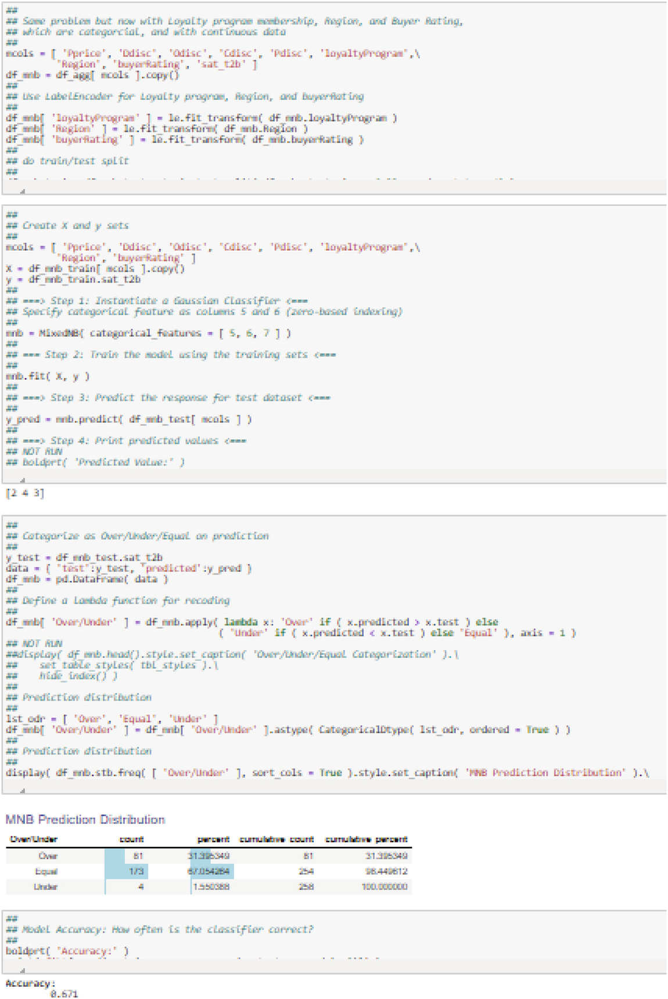

# 使用监督学习方法进行分类
> 沃尔特·R·帕茨科夫斯基1
> (1)
> 数据分析公司，美国新泽西州普莱恩斯伯勒

在前面的章节中，我将建模作为一种预测未来事件（即预测）或决策结果（即预测）的方法。回想一下，“预测”是一个广泛的标签，包括作为子集的预测：所有预测都是预测，但并非所有预测都是预测。一般来说，预测是业务数据分析的一个非常重要的功能，这就是我花了这么多时间在它上面的原因。但是，还有另一个重要功能：将新病例分类或分配给组。这些案例可能是新客户或现有客户、贷款或业务信贷额度申请人、开发管道中的新产品等。对于潜在的新客户，问题在于他们实际购买你的产品的可能性。对于现有客户，问题在于对他们进行细分，以便你可以制定差异化营销策略。对于贷款申请人来说，问题在于他们违约的可能性。对于新产品，问题是哪些产品可能会成功，因此应该继续开发。
对于每种情况，你可以想象将一组对象（例如客户）拆分或分成组，最小值当然是两个。如果创建了一个 2-D 图形，该图形以对象作为图形上的点来显示对象的度量，则通过在图形中画一条线来对对象进行分类。线一侧的对象被分类为一组，而另一侧的对象被分类为另一组。问题是如何画线。这是分类过程的高级概念化，可能过于简单化，但它仍然举例说明了这个问题。
有几种分类对象的方法。最常用的是：

- 基于 Logit Link 的 Logitistic 回归；
- K-最近邻（KNN）；
- 朴素贝叶斯；
- 决策树；
- 支持向量机。

逻辑回归有时用作分类器，有时用作估计效果的回归建模工具。我选择将它合并到本章中，因为它经常被用作业务应用程序中的分类器。因此，我将以 logit 链接开始本章，以继续上一章处理 Identity 链接的流程。

## 11.1 案例研究：背景

我将使用家具制造商的案例研究。特别是，我将重点关注客户提供的客户满意度分数。这些是五点李克特量表，其中 5 表示非常满意。虽然有很多方法可以分析这些评级，但最常见的是前两个盒子得分。我经常将前两个框称为 T2B，将后三个框称为 B3B。这是从五点到两点的转变。基本上，它是分数的二进制重新编码或虚拟化。一个指示函数将编码定义为$$\mathbb {I}(score \ge 4)$$，这样任何大于或等于4的分数都被编码为1；否则为 0。 “1”被称为前两个框。前两个框的客户被认为是满意的；其他人都不满意。这是通过列表推导创建新变量 sat_t2b 来完成的，该变量被添加到家具 DataFrame 中： df_agg[ 'sat_t2b' ] = [ 1 if x > = 4 else 0 for x in df_agg.buyerSatisfaction ] 其中 df_agg 是聚合数据框。
问题是预测随机选择的零售精品店客户是否对前两个盒子感到满意。

## 11.2 逻辑回归
我在第 10 章介绍了链接函数的概念，并举例说明了一个链接函数——OLS 回归的标识链接。该链接功能适用于目标连续时。但是，如果它是二进制的，那么这个链接是不合适的。二进制目标的示例是：

- 有人会购买产品吗？是还是不是
- 有人对服务满意吗？是还是不是
- 有人会参加会议吗？是还是不是
- 当前的协会成员会续约吗？是还是不是

目标不必是二进制的。例如，它们可能是 Yes/No/Maybe，在这种情况下它们是多项式的，我不会在本书中考虑这种情况。它们也可以是序数，如对产品的偏好排名：第一、第二、第三。 OLS 模型虽然对许多问题非常强大，但由于以下几个原因不适用于此类问题：

- 他们预测任何范围的值。这类问题只有两个，例如是和否。
- 它们有一个正态分布的干扰项。这类问题具有二项分布。
- 它们具有恒定的方差。这类问题具有非常量的方差。

### 11.2.1 选择解释

二元目标可以看作是由 J = 2 项组成的选择集。设 Ω = {item 1, item 2} 是这个选择集。最小尺寸为两个；少一点就意味着别无选择。选项可以简单地是“是”或“否”。对项目的限制是它们是相互排斥的并且完全详尽。互斥，因为你只能选择一项，并且完全详尽，因为它们涵盖或涵盖所有可能性。只能从集合中选择一个项目，没有中间项目，这是一个二项式问题。对于多项式问题，Ω = {item 1, ..., item J}, J > 2。
你可以将二进制情况的目标或选择变量的编码表示为
$$
\displaystyle \begin{aligned} \begin{array}{rcl} Y_{i1} = \begin{cases} 1 \text{ ~if object {$i$} chooses {$item_1$} from {$\Omega$}} \\ 0 \text{ ~otherwise} \end{cases} \end{array} \end{aligned}
$$
对于 i = 1, ..., n 个对象，例如客户。这只是应用于目标变量的虚拟变量定义。

### 11.2.2 这个问题的性质

解释选择的特征可以是任何类型的变量。它们在营销中被称为属性。例如价格、重量、颜色和时间。任务是衡量一个特征对项目选择的重要性。例如，衡量价格对购买产品的影响。在分类问题中，了解这些影响可以让你对对象（例如，客户、贷款申请人、员工）进行分类。将目标与特征相关联的可能模型是
$$
\displaystyle \begin{aligned} \begin{array}{rcl} Y_i = \beta_0 + \beta_1 X_i + \epsilon_i, i = 1, \ldots, n \end{array} \end{aligned}
$$
其中 X~i~ 是一个特征。这称为线性概率模型 (LPM)。假设E(𝜖~i~) = 0，在此假设下E(Y~i~) = β~0~ + β~1~ X~i~。要查看问题的二项式性质，令 Pr(Y~i~ = 1) = p~i~ 和 Pr(Y~i~ = 0) = 1 − p~i~。因此，E(Y~i~) = 1 × Pr(Y~i~ = 1) + 0 × Pr(Y~i~ = 0) = p~i~。这意味着
$$
\displaystyle \begin{aligned} \begin{array}{rcl} E(Y_i)=\displaystyle \beta_0 + \beta_1 X_i \quad \quad \text{(a linear model)} \end{array} \end{aligned}
$$

$$
\displaystyle \begin{aligned} \begin{array}{rcl}=\displaystyle p_i \quad \quad \quad \quad \quad \quad \text{(a probability)} \end{array} \end{aligned}
$$

所以平均值（X~i~ 的线性函数）必须介于 0 和 1 之间。因此得名：线性概率模型。显然，p~i~ = β~0~ + β~1~ × X~i~ 随着 X~i~ 的变化而变化。这就是为什么 p 上有一个下标。
假设模型为 Y~i~ = β~0~ + β~1~ X~i~ + 𝜖~i~。如果 Y~i~ = 1，你有 1 = β~0~ + β~1~ X~i~ + 𝜖~i~ 所以𝜖~i~ = 1 − β~0~ − β~1~ X~i~ 概率为 p~i~ ，即 1 出现的概率。如果 Y~i~ = 0，则𝜖~i~ = −β~0~ − β~1~ X~i~ 概率为 1 − p~i~。扰动项只能有两个值：1 − β~0~ − β~1~ X~i~ 概率为 p~i~ 和− β~0~ − β~1~ X~i~ 概率为 1 − p~i~ 所以它是二项式的，不是正态的。这不是问题，因为对于大样本，由于中心极限定理，二项式随机变量接近正态分布的随机变量。见古吉拉特语（2003 年）。
现在考虑扰动的方差：
$$
\displaystyle \begin{aligned} \begin{array}{rcl} V(\epsilon_i)=\displaystyle E\left[\epsilon_i - E(\epsilon_i)\right]^2 \end{array} \end{aligned}
$$

$$
\displaystyle \begin{aligned} \begin{array}{rcl}=\displaystyle E(\epsilon_i^2)\quad \text{Since } {E(\epsilon_i) = 0} \end{array} \end{aligned}
$$

$$
\displaystyle \begin{aligned} \begin{array}{rcl}=\displaystyle (1 - \beta_0 - \beta_1 X_i)^2 \cdot p_i + (- \beta_0 - \beta_1 X_i)^2 \cdot (1 - p_i) \end{array} \end{aligned}
$$

$$
\displaystyle \begin{aligned} \begin{array}{rcl}=\displaystyle (\beta_0 + \beta_1 X_i)(1 - \beta_0 - \beta_1 X_i) \end{array} \end{aligned} 
$$

$$
\displaystyle \begin{aligned} \begin{array}{rcl}=\displaystyle E(Y_i)\left[1 - E(Y_i)\right] \end{array} \end{aligned}
$$

$$
\displaystyle \begin{aligned} \begin{array}{rcl}=\displaystyle p_i(1 - p_i) \end{array} \end{aligned}
$$

它随着 X~i~ 的变化而明显变化，因此干扰是异方差的。这还不错，因为你可以使用加权最小二乘法进行估计。

### 11.2.3 二元问题的模型

一个大问题是 Y 的估计值 $$\hat {Y_i}$$ 可能不在 [0, 1] 范围内。所以，你可能会预测一些物理上不可能发生的事情。有人建议这也不麻烦，因为 Y i 可以缩放，也许使用第 5 章的 MinMax 标准化.  然而，对这个问题的应用只是给问题蒙上了一层面纱。问题仍然存在：预测可能是不可能的。正确的解决方案是在训练之前对目标进行转换，以确保正确的幅度。
你需要一个 0 ≤ p~i~ ≤ 1 的概率模型。可能的候选者是累积分布函数 (CDF)，定义为 Pr(X~i~ < x~i~)，例如
$$
\displaystyle \begin{aligned} \begin{array}{rcl} Pr(Y_i = 1)=\displaystyle p_i \end{array} \end{aligned} 
$$

$$
\displaystyle \begin{aligned} \begin{array}{rcl}=\displaystyle \dfrac{e^{Z_i}}{1 + e^{Z_i}} {} \end{array} \end{aligned}
$$

$$
\displaystyle \begin{aligned} \begin{array}{rcl}=\displaystyle \dfrac{e^{\beta_0 + \beta_1 X_i}}{1 + e^{\beta_0 + \beta_1 X_i}} \end{array} \end{aligned}
$$

$$
\displaystyle \begin{aligned} \begin{array}{rcl} Z_i=\displaystyle \beta_0 + \beta_1 X_i. \end{array} \end{aligned}
$$

这是一个逻辑 CDF，我在图 11.1 中进行了说明。对于 Z~i~ 更完整的定义，你可以写成 $$Z_i = \beta _0 + \sum _{j = 1}^p \beta _j \times X_{ij}$$。当 Z~i~ 变大或变小时会发生什么？注意
$$
\displaystyle \begin{aligned} \begin{array}{rcl} Pr(Y_i = 1)=\displaystyle p_i \end{array} \end{aligned}
$$

$$
\displaystyle \begin{aligned} \begin{array}{rcl}=\displaystyle \dfrac{e^{Z_i}}{1 + e^{Z_i}} \end{array} \end{aligned} 
$$

$$
\displaystyle \begin{aligned} \begin{array}{rcl}=\displaystyle \dfrac{1}{1 + e^{-Z_i}} \end{array} \end{aligned}
$$

图 11.1 这是一个逻辑 CDF 的示意图。 注意 sigmoid 的外观，它的高度在 0 和 1 之间。这是来自 Paczkowski (2021b)。 来自 Springer 的使用许可
若Z i → +∞，则$$e^{-Z_i} = 0$$，且p i = 1。同理，若Z i →−∞，则p i = 0。最后，注意

$$
\displaystyle \begin{aligned} \begin{array}{rcl} \dfrac{e^{Z_i}}{1 + e^{Z_i}} + \left(1 - \dfrac{e^{Z_i}}{1 + e^{Z_i}}\right) = 1 \end{array} \end{aligned}
$$
所以概率正确地相加。
你可以给（11.2.11）中的模型一个选择解释。 分子代表属性的影响，因此代表“选择”。 分母中的“1”表示“没有选择”（即 e~0~），因此因子 $$1 + e^{Z_i}$$ 表示总选择选项。 因此，(11.2.11) 是从包含两个项目的选择集中选择项目 i 的概率。 我偶尔会将 p~i~ 称为选择概率。
你可以通过编写进一步探索此模型以进行另一种解释
$$
\displaystyle \begin{aligned} \begin{array}{rcl} \dfrac{p_i}{1 - p_i}=\displaystyle \dfrac{\dfrac{e^{Z_i}}{1 + e^{Z_i}}}{1 - \dfrac{e^{Z_i}}{1 + e^{Z_i}}} \end{array} \end{aligned}
$$

$$
\displaystyle \begin{aligned} \begin{array}{rcl}=\displaystyle e^{Z_i} \end{array} \end{aligned}
$$

比率 p~i~ / 1 − p~i~ 是从选择集中选择项目 1 的几率。我在第 5 章中介绍了赔率。取赔率两边的自然对数，得到“对数赔率”，或者

$$
\displaystyle \begin{aligned} \begin{array}{rcl} L=\displaystyle \ln{\left(\dfrac{p_i}{1 - p_i}\right)} \end{array} \end{aligned}
$$

$$
\displaystyle \begin{aligned} \begin{array}{rcl}=\displaystyle \ln{\left(e^{Z_i}\right)} \end{array} \end{aligned}
$$

$$
\displaystyle \begin{aligned} \begin{array}{rcl}=\displaystyle Z_{i} \ln{\left(e\right)} \end{array} \end{aligned}
$$

$$
\displaystyle \begin{aligned} \begin{array}{rcl}=\displaystyle Z_i \quad \text{Since }\ln\text{ and }e\text{ are inverses} \end{array} \end{aligned}
$$

$$
\displaystyle \begin{aligned} \begin{array}{rcl}=\displaystyle \beta_0 + \sum_{j = 1}^p \beta_j \times X_{ij} \end{array} \end{aligned}
$$

其中 L 是对数几率或 logit。 logit 是“对数变换”的缩写。因此，逻辑回归模型通常称为 logit 模型。我倾向于交替使用这两个术语。最大似然与 logit 一起使用来估计未知参数，β~k~, k = 0, 1, ..., p。最大似然具有 OLS 的形式，因此它显然属于回归系列。有一些测试统计数据可以告诉你估计值与 OLS 中的情况一样好。
尽管你可以估计 logit 参数，但你将很难解释它们本身。当参数的相关变量变化一个单位时，每个估计的参数值都显示对数几率的变化。这对于 OLS 来说并不难理解，因为你可以查看 Y 的变化来了解 X 的变化；也就是边际效应。现在你已经改变了对数赔率。对数赔率的变化是什么意思？要回答这个问题，假设你有一个简单的单变量模型来购买 X 是分类的产品。例如，让 X 用虚拟编码表示潜在客户的性别：0 = 女性，1 = 男性。女性的对数赔率是 $$L_0 = \ln {\left ({p_0}/{1 - p_0}\right )} = \beta _0$$，男性的对数赔率是 $$L_1 = \ln {\left (\frac {p_1}{1 - p_1}\right )} = \beta _0 + \beta _1$$。将对数几率取幂并形成男性与女性的比率，你得到^1^
$$
\displaystyle \begin{aligned} \begin{array}{rcl} \dfrac{e^{\ln{\left(\dfrac{p_1}{1 - p_1}\right)}}}{e^{\ln{\left(\dfrac{p_0}{1 - p_0}\right)}}}=\displaystyle \dfrac{\dfrac{p_1}{1 - p_1}}{\dfrac{p_0}{1 - p_0}} \quad \text{Called the }\ odds\ ratio \end{array} \end{aligned}
$$

$$
\displaystyle \begin{aligned} \begin{array}{rcl}=\displaystyle \dfrac{e^{\beta_0 + \beta_1}}{e^{\beta_0}} \end{array} \end{aligned}
$$

$$
\displaystyle \begin{aligned} \begin{array}{rcl}=\displaystyle \dfrac{e^{\beta_0}e^{\beta_1}}{e^{\beta_0}} \end{array} \end{aligned}
$$

$$
\displaystyle \begin{aligned} \begin{array}{rcl}=\displaystyle e^{\beta_1} \end{array} \end{aligned}
$$

β~1~ 的幂是男性购买产品的几率与女性购买产品的几率之比。例如，如果优势比为 3，那么男性购买该产品的可能性是女性购买该产品的可能性的 3 倍。

### 11.2.4 案例研究：训练-测试数据拆分

我以与以前相同的方式将案例研究的聚合数据拆分为训练和测试数据集。每个数据子集的名称都以“logit_”为前缀，以将它们与其他数据集区分开来。我在图 11.2 中提供了执行此操作的代码片段。然后我使用训练数据集来训练 logit 模型。

图 11.2 这是 logit 模型的训练-测试分割的代码片段。每个子集都以“logit_”为前缀

### 11.2.5 案例研究：Logit 模型训练

你使用与 OLS 相同的设置来训练 logit 模型，但请记住使用的是最大似然，而不是 OLS。用于训练的 statsmodels 函数是 logit，它有两个参数：公式和 DataFrame。我在图 11.3 中展示了客户满意度问题的设置。客户要么满意，要么不满意，所以这是一个二元问题。目标是前两个框的满意度。

图 11.3 客户满意度 logit 模型估计设置和结果
由于使用了最大似然，因此未定义 R^2^ ，因为这需要平方和，特别是对于最大似然未定义的回归平方和。然而，还有一种替代方法是伪 R^2^，也称为 McFadden 伪 R^2^，定义为
$$
\displaystyle \begin{aligned} \begin{array}{rcl} \text{pseudo-}R^2=\displaystyle 1 - \dfrac{\text{Log-Likelihood}}{\text{LL-Null}} \end{array} \end{aligned}
$$
其中 Log-Likelihood 是模型的似然对数的最大值，LL-Null 是只有一个常数的模型的似然对数的值。我在第 6 章讨论了对数似然。只有一个常数的模型称为 Null 模型。使用图 11.3 中的数据，你可以看到伪 R^2^ = 1 −−313.28 / −319.69 = 0.02006，如图所示。在你想要接近 1.0 的值的意义上，伪 R^2^ 被解释为与 OLS R^2^ 类似。此示例的值为 0.02，这表明这不是一个很好的模型。

### 11.2.6 做出和评估预测

statsmodels 的 logit 函数有一个 predict 方法，它需要一个参数：测试数据。预测是属于某个类别的概率。然而，受访者使用两个词（“B3B”和“T2B”）进行分类，因此概率有些模糊。例如，如果某人的预测概率为 0.55，他们是否满意？答案取决于将 B3B 和 T2B 的概率分别重新编码为 0 和 1。截止值 θ ∈ 0, 1 是固定的，因此大于 θ 的估计概率被重新编码为 1，否则为 0。也就是说，$$T2B = \mathbb {I}(p_i \ge \theta )$$ 定义了 top-two box 满意度。 θ 的选择是任意的，尽管大多数分析师使用 θ = 0.50。如果你将 θ 设置为接近 1.0，那么几乎每个人都被归类为不满意，因为很少有预测值会大于 θ，但几乎所有预测值都会低于它。但是，如果你将其设置为接近 0.0，那么几乎每个人都会被归类为满意而很少有人不满意。 θ 没有正确的值，这就是通常使用 θ = 0.50 的原因。它基本上让你有 50-50 的机会以一种或另一种方式对人进行分类。参数 θ 是一个超参数。
你可以使用混淆表评估模型的预测能力，该混淆表使用测试数据集对受访者和预测类别的真实分类。该表基本上显示了模型在预测类别方面的混乱程度；也就是说，它做出正确分类或混淆并做出错误分类的频率。我在图 11.4 中展示了如何创建混淆表。由于你知道测试数据集中的真实分类和基于你选择的 θ 从模型中预测的分类，你可以确定预测是正确的（即 True）还是不正确的（即 False）。如果一个人真的不满意，而你预测他们不满意，那么他们将被视为真正的否定。 “负面”是不满意（即二进制刻度的底端）。第二个词指的是预测。第一个词，形容词，是指并阐明预测的正确性。如果你预测某人不满意并且他们不满意，那么预测是正确的并且他们被计为真阴性。有四种可能的标签，因为预测有两种可能状态，真实状态有两种：真阴性、假阳性、假阴性和真阳性。如图 11.4 所示，每个类别中的受访者数量的简单计数显示在 2 × 2 表中。这有时显示为我在图 11.5 中显示的热图矩阵。

图 11.4 基于测试数据集的 logit 模型混淆表。注意列表推导将预测概率重新编码为 0 和 1

图 11.5 logit 模型混淆矩阵是图 11.4 中混淆表的另一种显示方式。左下角的单元格有 3 个人被预测为不满意（即 Negative），但真正满意；这些是假阴性。右上角的单元格有 81 个误报。有 173 个真阳性和 1 个真阴性
有许多从混淆表中得出的总结性诊断措施。我展示了派生它们的设置和结果输出，称为图 11.6 中的准确度报告。需要注意的一点是我将 0 和 1 分别重新编码为“B3B”和“T2B”。前者是“不满意”，后者是“满意”。未编码的报告只有 0 和 1，不太可读；更改标签可解决此问题。我使用正则表达式来做到这一点。

图 11.6 基于测试数据集的客户满意度 logit 模型准确率报告
准确性报告有两半。上半部分是按两个满意度水平衡量的关键指标，而下半部分是综合指标。两者都有四列：“precision”、“recall”、“f1-score”和“support”。我在表 11.1 中展示了一个程式化的混淆矩阵，以帮助你理解这些度量。样本大小均由带双下标的 n 表示。下标的第一个元素表示矩阵的行，第二个元素表示矩阵的列。这只是标准的行列矩阵表示法。下标中的点表示求和。因此，n .P 表示“P”列的两行中的值的总和，即“正”。 n .. 表示总和或样本大小，因此 n .. = n。对于图 11.5 中的混淆矩阵 n .. = n = 258。案例总数 n .. 是支持度。图 11.2 有样式化的表格单元格，其中填充了满意度研究的值。
表 11.1 这说明了一个程式化的混淆矩阵。 n 个符号表示表格各个边缘的计数

|            |          | 预测状态            |                     |       |
| ---------- | -------- | ------------------- | ------------------- | ----- |
|            |          | Negative            | Positive            | Total |
| True state | Negative | True Negative (TN)  | False Positive (FP) | n~N~. |
|            | Positive | False Positive (FP) | True Positive (TP)  | n~P~. |
| Total      |          | n~N~.               | n~P~.               | n ..  |

表 11.2 这是表格 11.1 的程式化混淆矩阵，其中填充了基于图 11.5 的单元格

|            |          | 预测状态 |            |             |
| ---------- | -------- | -------- | ---------- | ----------- |
|            |          | Negative | Positive   | Total       |
| True state | Negative | TN: 1    | FP: 81     | n~N~. =  82 |
|            | Positive | FN: 3    | TP: 173    | n~P~. = 176 |
| Total      |          | n~N~.= 4 | n~P~.= 254 | n ..= 258   |

大多数分析师所做的第一个计算，也是客户想知道的，是错误率，然后是准确率，即 1 减去错误率。错误率是错误预测的数量，包括负面和正面。这就回答了这个问题：“平均而言，预测有多大的错误？”比率是两个相关量的比率，因此错误率是相对于案例总数的错误总和。根据表 11.2，错误率为

$$
\displaystyle \begin{aligned} \begin{array}{rcl} Error~Rate=\displaystyle \dfrac{FN + FP}{n_{..}} \\=\displaystyle \dfrac{84}{258} \\=\displaystyle 0.32558. \end{array} \end{aligned} 
$$
准确率，即正确预测的比率，回答了这个问题：“平均而言，预测的正确性如何？”并且是

$$
\displaystyle \begin{aligned} \begin{array}{rcl} Accuracy~Rate=\displaystyle \dfrac{TN + TP}{n_{..}} \\=\displaystyle \dfrac{174}{258} \\=\displaystyle 0.67442 = 1 - 0.32558. \end{array} \end{aligned}
$$
一个相关的概念是预测的精度，它回答了“一个类别的预测平均有多正确？”这个问题。对于二分类问题，有两种精度度量。当然，正确的预测是通过真阳性的数量和真阴性的数量来衡量的。满意类的精度，在这个问题中是“正的”，是

$$
\displaystyle \begin{aligned} \begin{array}{rcl} Precision_{T2B}=\displaystyle \dfrac{TP}{n_{.P}} \\=\displaystyle \dfrac{173}{254} \\=\displaystyle 0.68110 \end{array} \end{aligned}
$$
不满意类的精度为

$$
\displaystyle \begin{aligned} \begin{array}{rcl} Precision_{B3B}=\displaystyle \dfrac{TN}{n_{.N}} \\=\displaystyle \dfrac{1}{4} \\=\displaystyle 0.25 \end{array} \end{aligned}
$$
Precision T2B 的解释是，超过三分之二的真正满意的人被正确预测。对于 Precision B3B，四分之一的真正不满意的人被正确预测。因此，logit 模型在预测满意的人时并不十分混乱。
召回回答了这个问题：“平均而言，在捕捉班级中的那些人方面的预测有多正确？”这与精确度不同，精确度着眼于有多少预测是正确的，而召回率着眼于所有真正属于同一类的人中正确预测了多少。准确率和召回率的基础是不同的。你可以将精度视为预测类的条件（即列条件），并将召回率视为真实类的条件（即行条件）。满意类的召回率是

$$
\displaystyle \begin{aligned} \begin{array}{rcl} Recall_{T2B}=\displaystyle \dfrac{TP}{n_{P.}} \\=\displaystyle \dfrac{173}{176} \\=\displaystyle 0.98295 \end{array} \end{aligned}
$$
对于不满意的类是
$$
\displaystyle \begin{aligned} \begin{array}{rcl} Recall_{B3B}=\displaystyle \dfrac{TN}{n_{N.}} \end{array} \end{aligned}
$$

$$
\displaystyle \begin{aligned} \begin{array}{rcl}=\displaystyle \dfrac{1}{82} \end{array} \end{aligned}
$$

$$
\displaystyle \begin{aligned} \begin{array}{rcl}=\displaystyle 0.01220. \end{array} \end{aligned}
$$

该模型正确预测了 98.3% 的真正满意的人，但只有 1.2% 的真正不满意的人。同样，满意的人并没有混淆模型。
最后一个衡量标准是 f1-Score。这是每个类别的准确率和召回率的平均值，但平均值不是简单的算术平均值，因为准确率和召回率都是比率。平均费率时必须使用调和平均。如果你没有这样做，而是使用算术平均值，那么你就有夸大真实平均值的风险。这种夸大的原因是算术平均数-几何平均数-谐波平均数不等式。简单地说，这个不等式就是 AR ≥ GM ≥ HM 其中 AR 是算术平均数，GM 是几何平均数，HM 是调和平均数.^2^ 算术平均数是
$$
\displaystyle \begin{aligned} \begin{array}{rcl} AR = \dfrac{1}{n \times \sum_{i = 1}^n r_i}; \end{array} \end{aligned} 
$$
几何平均值是

$$
\displaystyle \begin{aligned} \begin{array}{rcl} GM = \left(\prod_{i =1}^n r_i \right)^{{1}/{n}}; \end{array} \end{aligned}
$$
调和平均值是

$$
\displaystyle \begin{aligned} \begin{array}{rcl} HR=\displaystyle \dfrac{n}{\sum_{i = 1}^n \dfrac{1}{r_i}} \end{array} \end{aligned}
$$
其中 r i 是第 i 个比率。对于双费率问题，HR 简化为

$$
\displaystyle \begin{aligned} \begin{array}{rcl} HR = 2 \times \left[\dfrac{r_1 \times r_2}{r_1 + r_2}\right]. \end{array} \end{aligned} 
$$
满意的人的 f1 分数，调和平均值，是

$$
\displaystyle \begin{aligned} \begin{array}{rcl} \text{f1-Score}_{T2B}=\displaystyle 2 \times \left[\dfrac{Precision_{T2B} \times Recall_{T2B}}{Precision_{T2B} + Recall_{T2B}}\right] \\=\displaystyle 2 \times \left[\dfrac{0.68110 \times 0.98295}{0.68110 + 0.98295}\right] \\=\displaystyle 0.805. \end{array} \end{aligned} 
$$
对于 f1-Score~B3B~，它是 0.023。
这些准确率、召回率和 f1-Score 总结在图 11.6 的顶部。底部显示准确度加上两个类别的平均值。准确性在所有类别中汇总。在 258 个观测值的支持下，它是 0.674，即混淆矩阵的总样本量。宏 avg（macro average 的缩写）是按列类别对两个类别的简单算术平均值：“precision”、“recall”和“f1-score”。例如，精度的宏观平均值是
$$
\displaystyle \begin{aligned} \begin{array}{rcl} macro~avg=\displaystyle \dfrac{0.250 + 0.681}{2} \\=\displaystyle 0.466. \end{array} \end{aligned}
$$
加权平均值是各个列类别的类的加权平均值。权重是相对于支持的类的真实计数。使用真实计数，因为预测计数显然取决于用于将对象分配到类的截止值 θ。如果你更改 θ，你显然会更改权重，这是不可接受的，因为你要使用的度量取决于你的选择。精度的加权平均值是
$$
\displaystyle \begin{aligned} \begin{array}{rcl} weighted~avg=\displaystyle \dfrac{82}{258} \times 0.250 + \dfrac{176}{258} \times 0.681 \\=\displaystyle 0.544. \end{array} \end{aligned}
$$

### 11.2.7 使用 Logit 模型进行分类

在实践中如何使用 logit 模型进行分类？混淆表和准确率报告仅告诉你模型如何根据测试数据执行。假设你对这些结果感到满意。怎么办？你如何实现模型？有两种可能：

1. 逐案分类
2. 批量分类。

你使用哪一个取决于你的任务，你的目标。第一个适用于对个人进行分类，几乎是“当场”。这是一个现场应用程序。例如，如果问题是将现场位置（例如银行分支机构）的信贷申请人分类为无风险或无风险，因此他们是否应该延长信贷，那么可以构建一个打字工具来“打字”或分类申请人。作为另一个例子，可以建立一个分类模型来预测潜在客户是否会向你的销售代表下订单。销售代表在销售拜访和演示之前可能对潜在客户了解不够，但是一旦在潜在客户面前，他们可以学到足够的知识，然后使用打字工具来预测销售的可能性并调整销售工作因此。两种情况下的打字工具都可以在笔记本电脑上。
批量分类还可以对客户进行分类，但不是在现场逐案进行，而是通过在集中式数据仓库或其他数据集市上运行的数据处理应用程序对所有客户进行处理。此应用程序可能会键入数以千计的潜在客户。例如，你的任务可能是将数据库中的客户分类为潜在买家或不是新产品的潜在买家。可以计划一个直接的电子邮件活动来向最有可能的买家推广产品。打字工具将内置在数据库处理系统中。
两种打字工具之间的主要区别在于功能的级别和范围。对于个案应用，模型中使用的特征和工具中实现的特征必须是销售代表可以通过直接观察或通过询问几个关键问题在现场轻松收集的特征。打字工具应提示代表提供这些数据点，然后处理响应以产生分类。对于大规模应用程序，功能应该在数据仓库中，或者可以从外部来源添加。
我提供了一个预测图 11.7 中场景的类别分配的示例。

图 11.7 这说明了如何使用经过训练的 logit 模型进行场景分类分析

## 11.3 K-最近邻（KNN）

K-最近邻（KNN）分类方法是一种直观且简单的对象分类方法。顾名思义，该方法基于对靠近其邻居的对象进行分组。要考虑的邻居数量基于你指定的 k。如果 k = 1，则仅使用最近邻。如果 k > 1，则一个对象与这 k 个对象分组。 k 是一个超参数。
该组必须被标记。满意还是不满意？与组关联的标签基于一个简单的规则：多数获胜。例如，假设将三个对象组合在一起，其中两个具有一个标签，而第三个具有不同的标签。组的标签基于共享相同标签的两个标签。如果涉及两个以上的标签，则多数规则变为多数规则。
由于标签分配规则是多数获胜，这立即表明用于分组最近对象的 k 应该是奇数；否则，可能会出现平局，在这种情况下不清楚使用什么标签。奇数 k 避免了这个问题。当我在本章后面讨论决策树时，你会看到同样的多数规则。我在图 11.8 中说明了 k = 3 和七个对象的情况：四个标记为“Sat”表示“满意”，三个标记为“Dissat”表示“不满意”。标记为 X 的第八个对象必须分类为满意或不满意。最接近 X 的三个对象显示在圆圈中。请注意，两个是“Sat”，一个是“Dissat”。因此，根据多数规则，X 被标记为满意，就像整个组一样。

图 11.8 这说明了多数规则如何适用于 k = 3 的 KNN 问题
多数规则的问题集中在类标签的分布上。如果标签分布是倾斜的，那么一些标签将仅仅因为它们经常出现而主导分配。这种情况的解决方法是对类进行加权，可能基于从要分类的点到其 k 个最近邻居中的每一个的距离的倒数。那些最接近该点的邻居将具有较大的权重；那些最远的将有一个小重量。
要分类的点与训练数据集中所有其他点之间的距离基于几个距离度量之一。其中三个是

- 欧几里得距离度量；
- 曼哈顿距离度量（又名 CityBlock）；
- Minkowski 距离度量。

欧几里得距离度量是最常用的。参见 Witten 等人。 （2011 年，第 131 页）。它基于所有点对之间的平方差之和的平方根：
$$
\displaystyle \begin{aligned} \begin{array}{rcl} d_{Euc}(x, y)=\displaystyle \left(\sum_{i = 1}^n w_i \times \mid (x_i - y_i) \mid ^2\right)^{{1}/{2}} \end{array} \end{aligned} 
$$
其中 x 和 y 是两个向量（想想 DataFrame 的列），每个长度为 n 和 w 是权重向量。权重是可选的，旨在解决我刚才提到的标签偏度问题。如果未提供，则默认为 w i = 1, ∀i。欧几里得度量也使用第 5 章中的 MinMax 缩放器进行缩放，因为仍然存在可能需要校正的缩放影响。参见 Witten 等人。 （2011 年，第 132 页）进行讨论。距离度量只是勾股定理的一个应用。
曼哈顿距离度量（又名 CityBlock）是所有点对之间差异的绝对值之和：

$$
\displaystyle \begin{aligned} \begin{array}{rcl} d_{Man}(x, y)=\displaystyle \sum_{i = 1}^n w_i \times \mid (x_i - y_i) \mid. \end{array} \end{aligned}
$$
Minkowski 距离度量是所有点对之间差异的绝对值的总和，每个绝对距离的幂，以及整个求和表达式的幂的倒数：

$$
\displaystyle \begin{aligned} \begin{array}{rcl} d_{Min}(x, y)=\displaystyle \left(\sum_{i = 1}^n w_i \times \mid (x_i - y_i) \mid ^p\right)^{{1}/{p}} \end{array} \end{aligned}
$$
其中 p 是一个整数。常见的值是 p = 1 和 p = 2。请注意，Minkowski 距离是欧几里得距离和曼哈顿距离的一般情况：p = 1 是曼哈顿距离，p = 2 是欧几里得距离。另请注意，对于 p = 1，距离公式等效于我在第 6 章中提到的残差函数的 L1-norm Loss，在这种情况下，偏差是实际值减去其预测值。你现在可以看到此名称中“1”的原因。同样，你可以看到对于 p = 2，你有 L2 范数损失。参数 p 是一个超参数。
你可以使用 scipy.spatial.distance 包或 sklearn.metrics.pairwise 包来计算这些距离，尽管在实践中对于 KNN 分类问题你不会这样做。前一个包允许权重，后者将进行所有成对组合。还有更多可用的距离度量。有关完整列表，请参阅 scipy 和 sklearn 文档。对于我在图 11.9 中以图形方式显示的数据，我在图 11.10 中说明了 scipy 函数。

图 11.9 这说明了图 11.10 中用于距离计算的三个点

图 11.10 这说明了使用 scipy 函数与图 11.9 中显示的三个点的距离计算
根据超参数 p 确定最近的邻居后，你可以使用它们对新对象进行分类。这是可以使用测试数据的地方。与其他方法一样，拟合模型具有预测方法。我用图 11.11 中的一些其他分析显示来说明如何做到这一点。 11.12 和 11.13。

图 11.11 这说明了如何为 KNN 问题创建混淆表

图 11.12 这说明了如何为 KNN 问题创建混淆矩阵

图 11.13 这说明了如何为 KNN 问题创建分类准确率报告

### 11.3.1 案例研究：预测

你还可以创建场景并预测特定结果。我在图 11.14 中展示了如何做到这一点。

图 11.14 这说明了如何为 KNN 问题创建场景分析

## 11.4 朴素贝叶斯
朴素贝叶斯，尽管它的名字，是一种强大但简单的分类方法，广泛用于贷款申请（例如，有风险或安全的贷款申请人）、医疗保健（例如，是否需要辅助生活）、垃圾邮件识别（例如，电子邮件和电话），仅举几例。该方法的名称有两个操作部分：朴素和贝叶斯。我将以相反的顺序解释这些，因为朴素部分是修饰第二部分的形容词。

### 11.4.1 背景：贝叶斯定理

名称的贝叶斯部分是由于该方法背后的统计定理。这是在引入条件概率后在统计入门课程中教授的贝叶斯定理。回想一下，以事件 B 为条件的事件 A 的概率写为
$$
\displaystyle \begin{aligned} \begin{array}{rcl}{} Pr(A \mid B) = \dfrac{Pr( A \cap B)}{Pr(B)} \end{array} \end{aligned}
$$
其中∩是交集算子。因此，Pr(A ∩ B) 是 A AND B 发生的概率。分母 Pr(B) 是 B 在 A 的所有可能性中出现的边际概率。你也可以写

$$
\displaystyle \begin{aligned} \begin{array}{rcl}{} Pr(B \mid A) = \dfrac{Pr( A \cap B)}{Pr(A)}. \end{array} \end{aligned}
$$
由于 Pr(A ∩ B) 在两个方程中，你可以求解 (11.4.2) 中的 Pr(A ∩ B) 并将结果代入 (11.4.1) 得到

$$
\displaystyle \begin{aligned} \begin{array}{rcl}{} Pr(A \mid B) = \dfrac{Pr(A) \times Pr(B \mid A)}{Pr(B)}. \end{array} \end{aligned}
$$
(11.4.3) 是贝叶斯定理。它指出，以 B 为条件的 A 的概率是给定 A 的 B 的概率，由 A 的边际概率调整，都相对于 B 的概率。 Pr(A) 是先验分布，这是我在第 1 章中介绍的术语。 Pr(A∣B) 是后验分布。 Pr(B∣A) 是给定 A 的 B 的可能性。因此，(11.4.3) 表示先验是由可能性调整的。

### 11.4.2 一般声明

假设你要将对象（例如，客户）分类为 C~k~ 个细分或类别之一，k = 1, ..., K。设 X 是 p 个因素、特征或自变量的矩阵，X~i~, i = 1， 2, ..., p，你将用于分类。问题是在给定分类数据的情况下为对象选择一个类。你可以将符号 A 等同于类，将符号 B 等同于特征。那么 (11.4.3) 是^3^
$$
\displaystyle \begin{aligned} \begin{array}{rcl}{} Pr(C_k \mid \mathbf{X}) = \dfrac{Pr(\mathbf{X} \mid C_k) \times Pr(C_k) }{Pr(\mathbf{X})}. \end{array} \end{aligned}
$$

- C~k~ 是第k组；
- X是分类特征或自变量的矩阵；
- Pr(C~k~∣X) 是后验分布；
- Pr(C~k~) 是先验分布；
- Pr(X∣C~k~) 是似然度；
- Pr(X) 是边际分布，有时也称为证据。

这有时写为
$$
\displaystyle \begin{aligned} \begin{array}{rcl} posterior = \dfrac{prior \times likelihood}{evidence}. \end{array} \end{aligned}
$$

证据部分与课堂作业无关，因此经常被忽略。先验分布 Pr(C~k~) 是一个对象被分配到没有数据或证据支持该分配的类的概率。对于每个类，一个可能的初始先验只是 Pr(C~k~) = 1 / k。这是一个统一的先验，我在第 1 章中也将其称为“脆弱”或“平坦”。你可能有样本数据，也许是训练数据，表明类成员资格，但这些数据不是 X 的一部分分类;对象已经在训练数据中分类。那么 Pr(C~k~) 就是来自训练数据的类别比例。该初始先验由该类的数据调整，以产生用于对对象进行分类的新概率；这是后面。可以获得类的新数据。在这种情况下，后验成为先验，类的新数据用于调整，并计算新的后验。

### 11.4.3 朴素Adjective：一个简化的假设

关注图 11.4.4 中的分子。先验和似然的乘积等于类成员和因子的联合分布。这等于以其他因素为条件的每个因素的概率与类成员资格的乘积。也就是说，^4^

$$
\displaystyle \begin{aligned} Pr(C_k) \times Pr(\mathbf{X} \mid C_k)= Pr( C_k, X_1, X_2, \ldots, X_p) \end{aligned}
$$

$$
\displaystyle \begin{aligned} = Pr(X_1 \mid X_2, \ldots, C_k) \times Pr(X_2 \mid X_3, \ldots, C_k) \times \end{aligned} 
$$

$$
\displaystyle \begin{aligned}\quad \ldots \times Pr(X_n \mid C_k) \times Pr(C_k) \end{aligned}
$$

使用该产品具有挑战性。一个简化的假设认为这些因素是独立的，但每个因素都以类别 C~k~ 为条件。独立性意味着每个因素的概率，取决于类别，是乘法的。因此，你可以编写：
$$
\displaystyle \begin{aligned} \begin{array}{rcl} Pr(C_k) \times Pr(\mathbf{X} \mid C_k)=\displaystyle Pr( C_k) \times \prod_{i = 1}^p Pr( X_i \mid C_k) \end{array} \end{aligned}
$$
这种独立性假设是“朴素贝叶斯”的“朴素”形容词的原因。虽然这确实是一个简化而不是幼稚的假设，但它使该方法易于处理且非常有用。使用朴素贝叶斯方法进行分类的唯一问题是条件概率 Pr(X i∣C k) 的性质。值得重申的是，这些条件是针对特征的，而不是针对目标的。

### 11.4.4 分布假设
有三种分布可用于这些概率：

1. 高斯;
2. 多项式；
3. 伯努利。

高斯分布适用于特征是连续的，而其他两个是离散的。当特征具有多个可能级别时，使用多项分布。它通常用于文本分析。伯努利分布用于二进制特征。高斯是最常用的。
这些分布的一个问题是它们适用于训练集中的所有特征。考虑一些特征是连续的而另一些是二元的情况。你可能想使用伯努利分布，因为某些特征是二元的。这是不合适的，因为伯努利只适用于其中的一部分。另一部分呢？另一方面，你可能想使用高斯分布，因为某些特征是连续的。使用这种分布同样不合适。你不能将伯努利分布应用于连续数据，也不能将高斯分布应用于二进制数据。简而言之，对于两种类型的数据，你不能在一次调用朴素贝叶斯 fit() 方法（我将在下面解释）中混合分布。
已经提出了几种补救措施。^5^假设你混合了连续数据和多项数据。你可以使用我在 Sect 中概述的 Pandas cut 和 qcut 函数对连续数据进行分箱。 5. 2. 4，从而创建新的多项式特征。然后对所有多项式特征使用多项式分布。如果你有连续的和二元的特征，你可以将连续的特征分成两个箱子：“顶层”和“底层”。例如，前 5% 和后 95% 以及应用我在第 5 章中讨论的 sklearn Binarizer 函数。然后使用伯努利分布。最后，如果你有多项式和二进制数据的混合，则以类似于处理五点李克特量表转换的方式将多项式转换为二进制。总的来说，这个转换选项的建议是从高频数据转换到低频数据；你不能朝另一个方向走。
转换选项的问题是你丢失了信息。当你对连续特征进行分箱时，将值放入分箱时会隐藏数据中的所有变化；数据被“简化”。处理混合特征的第二个建议是在一次朴素贝叶斯估计中使用一种类型的所有特征，在第二次估计中使用另一种类型的所有特征。例如，假设连续特征和二元特征，估计连续特征的高斯朴素贝叶斯和二元特征的伯努利朴素贝叶斯。然后估计每个的后验概率，将它们添加到你的特征集中，然后仅在这两个新（概率）特征上估计最终的高斯朴素贝叶斯。高斯朴素贝叶斯适用于这个最终估计，因为条件概率是连续的。
第三个选项是第二个选项的变体。计算两种可能性，一种用于高斯特征，一种用于离散特征，然后将它们与先验相乘。也就是说，如果 Pr G(X~i~∣C~k~) 是连续数据的高斯似然，则 Pr B(X~i~∣C~k~) 是二进制数据的伯努利似然函数，而 Pr(C~k~) 是先验，那么你可以简单地做 Pr G(X~i~∣C~k~) × Pr B(X~i~∣C~k~) × Pr(C~k~)。由于独立性假设，这是一种合理的方法。通过“证据”对该产品进行规范化可以为你提供相关的后验。这种方法在 Python 包混合朴素贝叶斯中实现。请注意，你不能简单地估计高斯朴素贝叶斯和伯努利朴素贝叶斯，然后将估计的概率相乘。这些概率都是通过先验和证据调整各自的可能性而产生的，因此将后验相乘将产生一个新的后验，该后验与证据的先验因子相乘。 mixed-naive-bayes 包中的函数可以正确处理这个问题。你可以使用 pip install mixed-naive-bayes 安装混合朴素贝叶斯包。

### 11.4.5 案例研究：朴素贝叶斯训练
我将演示交易数据集的朴素贝叶斯 (NB)。首先，我将演示价格和折扣等连续变量的高斯 NB。我将聚合交易的主数据集拆分为训练集和测试集。然后我使用前两个框的客户满意度和五个连续特征来拟合高斯 NB。我在图 11.15 中总结了结果。准确度得分为 0.678，因此准确预测了大约三分之二的案例。伯努利 NB 如图 11.16 所示。准确度得分为 0.682，略胜一筹。最后，我在图 11.17 中展示了混合 NB。这一项的准确度得分为 0.671，略低于其他两项。混合 NB 的得分较低可能是由于分类变量无法解释客户满意度的任何变化。

图 11.15 高斯 NB 与连续分类变量一起使用。准确度得分为 0.678

图 11.16 Bernoulli NB 与二元分类变量一起使用。准确度得分为 0.682

图 11.17 混合 NB 与分类变量和连续分类变量一起使用。准确度得分为 0.671

## 11.5 分类决策树

决策树是识别目标变量的关键驱动因素的替代方法。但它也可用于根据这些对象对于确定或解释目标的重要性来对对象进行分类。我的重点是后者，尽管我会对前者发表评论。
决策树有几个优点：

1. 无需使用例如对数来转换自变量或特征。倾斜的数据不会影响树。对于异常值也是如此。
2. 它们会自动识别特征之间的局部交互。这是基于节点的拆分方式，如下所述。
3. 丢失数据可能是一个问题，但通常它们并不那么严重。缺失的程度决定了影响的严重程度。
4. 它们易于管理层和客户理解和解释。

当然，它们也有缺点：

1. 树可以变成大树，因此可能需要任意/主观的“修剪”。
2. 他们假设所有变量都相互作用，这是我上面提到的局部相互作用。所以这可能是祝福或诅咒。
3. 交互是本地的，而不是全局的，因此它们特定于节点的条件。
4. 对于大量特征，执行性能可能很差。

由于目标变量，树属于监督学习技术家族。该方法被称为树方法，因为结果显示为树，尽管它是倒置的。适用自然树术语：有根、枝和叶。一棵树也被种植和修剪，使其更小，更容易解释。树的深度（即它的大小）是一个超参数。树的根包含所有目标数据 (100%)，目标是在你沿着树向下移动时将这些数据划分为更小的单元。树的每个最终叶子都有一小部分目标数据。可以指定叶子中的最小数量，以便没有叶子具有总目标数据的 0%。
目标的性质决定了所种植的树木的类型。如果目标是连续的，则生成回归树；否则，生成分类树。在任何一种情况下，对象仍然根据它们对目标的解释方式进行分类。名称“分类树”和“回归树”仅指确定树实际生长方式的标准。树的最后叶子表示或识别分类。用于生长树的特征可以是连续的或离散的。
树是通过将特征分成两组来生长的，也就是说，它将每个特征分叉。因此，这些树有时被称为分区树。特征的划分或分叉是该特征可能的最佳分割。分割是最好的基于用于分割特征来解释目标的标准函数。有些特征只有一个自然分裂（例如，性别），所以没有“最好的”。其他可以以多种方式拆分（连续特征的方式有无限种），但并非所有拆分都是最好的。确定每个特征在其最佳分割时的重要性，并根据这些重要性对特征进行排名。解释目标及其最佳分割的最重要特征位于树的顶部，就在根的下方。

### 11.5.1 常量分区
以下是分类树。分区是在目标数据空间中绘制的常数。如果目标是客户满意度，特征是性别，自然分为男性和女性，年龄，分为年轻和年长，则绘制两个常数（即直线）分隔满意度度量。一些目标对象落入被常数截断的每个区域。落入每个区域的物体数量简单地由目标的级别来计算。我在图 11.18 的左侧显示了一个示例，其中客户满意度是目标，它有两个级别：不满意和满意（按字母数字顺序）。有 13 个人（即对象）和两个特征（例如，性别和年龄）。对于此示例，确定特征 1 可以在值或级别 C~1~ 处进行最佳划分，而特征 2 可以在值或级别 C~2~ 处进行划分，但仅限于特征 1 的值大于 C~1~。这意味着特征 1 可以仅在 C~1~ 处最优拆分一次。在此示例中，特征 2 也仅在给定特征 1 拆分的情况下拆分一次。两个分裂产生三个区域。

图 11.18 这说明了两个特征以及特征空间中的划分和反映该空间的树
拆分的区域显示为倒树，总结了目标上的观察或测量如何分配到拆分定义的区域。我在图 11.18 的右侧部分显示了摘要树。所有的人都在根级别，所以不管他们的满意度如何，所有人的百分比都是 100%。这是图中左侧的所有人。你可以看到根处有 61.5% 的人感到满意，因此根处的预测满意度为“满意”。预测基于在该拆分中具有最高百分比的级别，因此对于 KNN 方法使用多数规则。
对于此示例，树首先在 C~1~ 处为特征 1 分叉。该特征被确定为对解释目标最重要，这就是为什么这是第一个被拆分的原因。根是拆分产生的两个部分的父级。这些部分是子部分，因此存在父子关系。整个树都存在父子关系。树中分裂的每个点都是一个节点，可以是内部的或终端的。无论节点位于何处，它都包含有关该点对象的信息。信息因软件实施而异。我在图 11.18 中显示了样本大小、分配给该子节点的父节点的百分比、该子节点处目标的每个级别的对象百分比（百分比显然总和为 100%）以及预测的该子节点的级别。
一个节点包含关于该节点中对象的信息，尽管是潜在的。我们可以通过拆分节点来提取潜在信息，从而获得关于什么对目标重要的有用、已实现或揭示的信息。从可能的拆分数量中将父节点拆分为两个最佳子节点是基于从可能的拆分中提取的已实现信息的增益。具有最大实现信息增益的分割是使用的分割。信息增益是由于分裂导致的节点处杂质的减少，或分裂导致的纯度增益。杂质只是异质性的程度。纯节点（即杂质为零）是同质的；不纯的（即具有一定程度的杂质）是异质的。目标是拥有一个同质的节点。杂质有两种测量方法：基尼指数和熵。

### 11.5.2 基尼指数和熵
基尼指数基于对对象进行错误分类的概率。假设有 C 个分类标签。例如，现有客户可能是新产品的买家或非买家，因此 C = 2 并且标签为“买家”和“非买家”。在训练数据集中，知道谁是买家，谁是非买家。随机选择一个对象，然后将该对象随机分配给一个类标签。然后有两个随机抽签，每个抽签都有一个概率：一个抽签针对一组对象，一个独立抽签来自一组类。设 p i 是选择实际属于第 i 类的随机对象的概率。将该对象错误地分配给类 k 的概率，k ≠ i，是 $$\sum _{k \neq i}^C p_k = 1 - p_i$$ 其中 C 是类的数量。由于随机选择对象的行为和随机分配对象的行为是独立的行为，因此选择和分配的概率为 p i × (1 − p i)。^6^ 节点处的基尼指数为

$$
\displaystyle \begin{aligned} \begin{array}{rcl} G(N_k)=\displaystyle \sum_{i = 1}^C p_i \times (1 - p_i) \end{array} \end{aligned}
$$

$$
\displaystyle \begin{aligned} \begin{array}{rcl}=\displaystyle 1 - \sum_{i = 1}^C p_i^2. \end{array} \end{aligned}
$$

其中 N~k~ 是节点 k，C 是节点 k 中的类或标签的数量。如果 C = 2，则基尼指数为 $$1 - (p_1^2 + p_2^2)$$。整个分成两个节点的基尼指数是各个节点基尼指数的加权平均值，权重等于父节点的类比例。
使用图 11.18 中的数据，根处的基尼指数为 1 − (0.385^2^ + 0.615^2^) = 0.473。可以使用功能 1 或功能 2 拆分此根。让我们先检查功能 1。对于 < C~1~ 为 0 且 > C~1~ 为 1 进行拆分，其中 0 表示不满意，1 表示此示例的满意。通过该图，基于频率计数的各自概率的估计值为 (1/4 = 0.25, 3/4 = 0.75) 和 (4/9 = 0.444, 5/9 = 0.555) 其中每个括号中的第一个比例是指对不满意的，第二对满意的。基尼指数为 1 − (0.25^2^ + 0.75^2^) = 0.375 和 1 − (0.444^2^ + 0.556^2^) = 0.494。使用来自父级的权重的加权平均值为 0.385 × 0.375 + 0.615 × 0.494 = 0.448。这是基于特征 1 的节点的加权基尼指数。信息增益，即在 C 1 处拆分特征 1 的纯度增益，超出父节点是 0.473 − 0.448 = 0.025。
现在检查特征 2 并以 < C~2~ 为 0 和 > C~2~ 为 1 进行拆分。根据图表，则 (2/6 = 0.333, 4/6 = 0.667) 和 (3/7 = 0.429, 4/7 = 0.571 ）。基尼指数是（1  - （0.333^2^ + 0.667^2^）= 0.444和1  - （0.429^2^ + 0.571^2^）= 0.490。加权平均值为0.472。来自父母的信息增益为0.473  -  0.472 = 0.001。清楚，在特征上分裂1首先在纯度方面提供了更好的改进：0.025 vs 0.001。
请注意，在图 11.18 中，特征 1 < C~1~ 的节点只有四个观察值。样本量现在太小了，所以这个节点没有被分割；这是一个终端节点或叶子。然而，特征 1 < C~1~ 的节点可以拆分，因为样本量足够大 (n = 9)，拆分现在发生在特征 2 上。C~2~ 处的基尼指数基于 (0.40, 0.60) 和(0.50, 0.50) 所以 1 − (0.40^2^ + 0.60^2^) = 0.48 和 1 − (0.50^2^ + 0.50^2^) = 0.50，如图所示
对于图 11.19 中的示例，我展示了基于两个特征的数据的生长树。正如上面的计算所示，这会拆分父级。 Feature 2的第二次拆分也是如此。该图还说明了每个节点处显示的内容。我在图 11.20 中展示了一个典型节点的内容。在每个节点，其所有对象的预测分类都基于多数规则。

图 11.19 使用基尼指数来生长图 11.18 所示的树。显示的值与文本中的值匹配

图 11.20 这是树节点的典型内容。这是一个分类问题
杂质的替代度量是熵。这是一个来自热力学的概念，指的是系统中无序的数量。熵值为 0 表示完全有序，1 表示完全无序。这个概念被带到了一个节点的杂质上。熵值为 0 表示节点完全同质（即无无序），1 表示完全异构（即完美或完全无序）。熵是使用在节点处观察到类标签的概率来计算的，其中概率基于节点处标签的比例。措施是

$$
\displaystyle \begin{aligned} \begin{array}{rcl} E(N_k) = - \sum_{i = 1}^C p_i \times log_2 p_i \end{array} \end{aligned}
$$
其中 N~k~ 是节点 k，C 是节点 k 中的类或标签的数量。如果 C = 1，则 p~i~ = 1 和 - 1 × log~2~1 = 0，因此节点是完全齐次的（因为只有一个标签，所以应该是这样！）。如果 C = 2 和 p~1~ = p~2~ = 0.5 使得标签均匀分布在节点中，则 - (0.5 × log~2~0.5 + 0.5 × log~2~0.5) = −(log~2~0.5) = 1 为完美异质性。但是，如果p~1~ = 1 且p~2~ = 0，则- (1 × log~2~1) = 0，节点是齐次的。我在图 11.21 中展示了熵与概率的关系图，在图 11.22 中展示了同质性和异质性的总结。我还展示了图 11.19 中基于图 11.23 中的熵重新生长的示例树。

图 11.21 二分类问题的熵图

图 11.22 这显示了熵与同质性/异质性之间的关系

图 11.23 熵用于生长图 11.18 所示的树。将此树与图 11.19 中的树进行比较
我上面的描述是针对分类问题的，所以树是分类树。这是基于目标的性质，而不是特征。目标与级别或标签是离散的。如果目标是连续的，则使用不同的标准来确定拆分。计算加权方差并确定每个候选节点的方差减少量。具有最大方差减少的特征用于拆分。本质上，这是信息增益的持续对应。
我上面的例子是基于离散特征的。也可以使用连续特征。这提出了一个轻微的挑战，因为连续特征可能存在无限数量的分割点。处理此问题的一种方法是识别连续特征的训练数据集中的唯一值，并将它们视为“离散的”。这样做的缺点是大量潜在的唯一值。

### 11.5.3 案例研究：种植一棵树

作为种植一棵树的例子，考虑客厅百叶窗的交易数据。假设产品经理想知道客户满意度的关键驱动因素。我在图 11.24 中展示了数据准备。我使用与 logit 示例相同的数据，但为这个示例制作一个副本。由于 Region 是带有类别字符串的分类，因此不能按原样使用；它必须被编码。我使用基于 Pandas get_dummies 函数的虚拟编码。准备好数据后，我从 sklearn 的树模块中实例化 DecisionTreeClassifier，如图 11.25 所示。然后我种了一棵树，如图 11.26 所示。

图 11.24 这说明了为家具案例研究生成决策树的数据准备

图 11.25 这说明了 DecisionTreeClassifier 函数的实例化，用于为家具案例研究生成决策树

图 11.26 这说明了家具案例研究的成长决策树
所有的训练数据都在根节点，满意率为 69.7%，因此所有的客户都被归类为满意。第一次拆分基于提货折扣，Pdics。 Pdisc ≤ 0.04的所有客户都分配到左侧节点（58.2%）；否则，向右。 （42.8%）。在左侧，65.0% 的人感到满意，因此所有人都被归类为满意。如图所示，左侧的基尼指数为 1 − (0.35^2^ + 0.65^2^) = 0.455。从数据中提取的丰富信息是，提货折扣不仅是最重要的特征，而且低于和高于4%的折扣是客户满意度的关键。

### 11.5.4 案例研究：用树进行预测

你可以使用树对象的 predict_proba 方法或使用 predict 的类分配来预测每个对象的类概率。后者基于类分配是最大类概率的规则。我在无花果树中展示了一个树的准确性报告。 11.27 和 11.28。

图 11.27 这说明了家具案例研究中生长的决策树的准确度得分

图 11.28 这说明了家具案例研究的成长决策树的预测分布

### 11.5.5 随机森林

我上面的讨论是关于种植一棵树的。你实际上可以种植许多树来有效地种植森林。森林中的每棵树都是随机生长的，因此森林是随机森林。这方面的发展和随后的分析超出了本书的范围。见詹姆斯等人。 (2013) 和 Hastie 等人。 (2008) 进行技术讨论。

## 11.6 支持向量机

最后一种分类对象的方法是支持向量机 (SVM)。这种方法的计算成本更高，但通常也会产生更准确的分类结果。基本概念很简单。如果你的数据分为两组，因此它们是二元的，则绘制一条线，以便你将数据点最好地划分为两组。这条线是三个维度的平面和超过三个维度的超平面。无论维数如何，概念都是相同的。
首先，一些术语。划分组的线称为决策线、决策面或决策超平面。它是一个决策面，因为它允许你决定哪些点属于哪个类。一侧的所有点都分配给一个类，而另一侧的所有点都分配给另一个类。这实际上反映了格式塔接近和相似原则。这是一种非概率的班级分配方法。我在本章中讨论和说明的其他方法是概率估计的概率和基于确定分配的概率的决策规则（即多数规则）。在这种方法中，分配是基于与决策面的距离。距离是从垂直于表面的点绘制的线的长度。使用垂直线是因为这是到表面的最短距离。
支持向量是最接近决策面的数据点。这些接近的数据点是最难分类的，因为只要对其中一个进行小的随机冲击就可以将其从一个类别转移到另一个类别。例如，随机冲击可能只是一个小的测量误差。这些点是在确定表面所在位置的意义上“支持”决策表面的点。远离表面的点对其所在位置几乎没有影响，因为对它们中的任何一个的小随机冲击都不会对表面产生影响。
一个例子最能说明这个想法。假设你有两个类的数据点，这些数据点是在两个特征上测量的，如图 11.29 所示。这两个类由实心圆和空心圆表示。快速查看该图确认了两个类：实心圆都在左上象限，空心圆在右下象限；这两个类显然是分开的。尽管如此，你还是想画一条直线，一个决策面，最能区分两组。我说明了两种可能性。标记为 DS 1 的那个将两组分开，但有两个点非常接近这条线“支持”它，但它们显然是有问题的。添加到任一点的少量随机噪声可能会改变类别分配。

图 11.29 这说明了 SVM 问题的数据点。显示了两条决策支持线（DS 1 和 DS 2）
第二条线 DS 2 也将这两个类分开，但与最接近这条线的点的距离更大。最接近它的点是形成支持向量的支持点，支持向量是数据的子集。支持向量是决策面的基础。支撑点和线之间的距离形成一条围绕线的通道，有时也称为“街道”。这正式称为保证金。这条线位于边距的中间，因此测量为边距宽度的中值。目标是找到支持点之间的最大边距，最宽的街道。决策面是中位数。这方面的数学更具挑战性。参见 Deisenroth 等人。 （2020 年，第 12 章）进行技术讨论。

### 11.6.1 案例研究：SVC 应用

sklearn 包有两个支持分类和回归问题的模块，就像它有两个用于朴素贝叶斯和决策树一样。分类模块是SV C，回归模块是SV R，本书只关注分类。我在图 11.30 中说明了用于客户满意度分类问题的 SV C 模块。我将使用与客户满意度 logit 模型相同的训练/测试数据集。问题是一样的：根据人们的前两个盒子满意度对他们进行分类。对于这个 SVM 应用程序，存在一个问题。 logit 模型使用价格和折扣作为特征，但它也使用营销区域作为特征。 Region 变量是分类的，类别为单词：“Midwest”、“Northeast”、“South”和“West”。这些不能直接使用，因为单词不能用于计算。使用公式语句中的函数对它们进行了虚拟化。 SVM 方法也有同样的问题。然而，在这种情况下，本身没有公式，因此没有创建虚拟变量的函数。 Pandas 有一个 get_dummies 方法来处理这种情况。处理这个问题的另一种方法是使用我在第 1 章中讨论的 LabelEncoder。 5. 该函数将分类变量的类别转换为整数。使用这个编码器的一个很好的特性是它有一个反向方法，这样你就可以随时检索与整数关联的标签。我决定使用 Pandas get_dummies 函数来解决这个问题。

图 11.30 这说明了 SVM 问题的 DataFrame 设置

### 11.6.2 案例研究：预测

我在图 11.31 中提供了拟合和准确度度量。你可以对 SVM 分类进行场景分析。我在图 11.32 中展示了如何做到这一点。设置实际上就像我在本章中展示的其他设置一样。

图 11.31 这说明了 SVM 问题的拟合和准确度度量

图 11.32 这说明了如何使用 SVM 进行场景分析

## 11.7 分类器精度比较

可以比较六种方法的准确性。我在图 11.33 中展示了这一点。可以看到，对于这个问题，决策树的准确率最高，但度量值都很接近。在这种情况下，由于图形输出，我的建议是使用决策树。

图 11.33 这说明了 SVM 问题的拟合和准确度度量

## 参考

- Deisenroth, M.P., A.A. Faisl 和 C.S. Ong。 2020. 机器学习数学。剑桥：剑桥大学。
- Gujarati, D. 2003。基础计量经济学。第 4 版。纽约：麦格劳-希尔/欧文。
- Hastie, T., R. Tibshirani 和 J. Friedman。 2008. 统计学习的要素：数据挖掘、推理和预测。第 2 版。柏林：施普林格。
- James, G., D. Witten, T. Hastie 和 R. Tibshirani。 2013. 统计学习简介：R. New York 的应用：Springer Science+Business Media。
- 帕茨科夫斯基，W.R. 2021b。现代调查分析：使用 Python 获得更深入的见解。柏林：施普林格。
- Witten、I.H.、E. Frank 和 M.A. Hall。 2011. 数据挖掘：实用机器学习工具和技术。第三版。阿姆斯特丹：爱思唯尔公司

## 脚注

1. 注意：$$e^{\ln {x}} = x$$。
2. 见 https://en.wikipedia.org/wiki/Average。最后访问时间为 2020 年 12 月 30 日。
3. 以下内容大量来自 https://en.wikipedia.org/wiki/Naive_Bayes_classifier。最后访问时间为 2020 年 12 月 1 日。
4. 请参阅 https://en.wikipedia.org/wiki/Naive_Bayes_classifier.
5. 请参阅 StackOverFlow 上的讨论：https://stackoverflow.com/questions/14254203/mixing-categorial-and-continuous-data-in-naive-bayes-classifier-using-scikit-lea 和https://stackoverflow.com/questions/39173169/hybrid-naive-bayes-how-to-train-naive-bayes-classifer-with-numeric-and-category?noredirect=1&lq=1.两者最后一次访问时间为 2020 年 12 月 4 日。
6. 注意 $$\sum _{k = 1}^C p_k = 1$$ 所以，如果 C = 3 则 p~1~ + p~2~ + p~3~ = 1。所以，p~1~ + p~3~ = 1 − p~2~。