# 使用无监督学习方法进行分组
> 沃尔特·R·帕茨科夫斯基
> 数据分析公司，美国新泽西州普莱恩斯伯勒

在本章中，我将把注意力转向无监督学习方法。回想一下，这些方法没有引导它们从一组特征中学习的目标变量。仍然有一些功能，但没有目标，需要另一种方法来提取隐藏在数据中的信息。监督学习方法有一个目标和一组参数，这些参数指示特征如何与目标相关。因此，学习是参数的识别，因此关系也可以被识别。没有目标就没有参数，因为与不存在的事物没有关系。唯一的问题是作为独立实体的特征之间的关系。与使用估计程序的监督学习方法不同，无监督学习方法使用算法来识别特征之间的关系。广泛用于计算机科学、机器学习和其他无法估计的定量领域的算法是产生结果的启发式方法。参见 Cormen 等人。 （2009）对算法的经典处理。
我将在本章中描述的无监督学习算法与对象分组有关。这与我在前一章回顾的分类方法的目标没有什么不同。这些方法涉及从预测的角度进行分类。这些类是已知的，问题是一个新的、以前未分类的对象属于哪个类。现在，由于组是未知的，因此不会预测对象属于一个组或另一个组。相反，组是根据数据创建的。问题是："什么是组？"算法对对象进行分组，使它们属于一个组或另一个组；不涉及对新对象的预测。事实上，预测是不可能的，因为类别是先验未知的。分配到组和预测类成员是不同的活动。
我们有许多措施来评估预测准确性，因为我们有进行这些评估的目标。现在我们正在对对象进行分组。是什么造就了一个好团体？这是一个很难回答的问题，如果不是不可能的话，因为没有评估的基础。手等人。 （2001 年，第 295 页，原文强调）指出，存在"对测试数据集进行泛化的直接概念"，这意味着"聚类的有效性通常在旁观者的眼中"。
我将介绍以下两种无监督学习的分组方法：

- 聚类
- 混合模型

聚类是一个复杂的话题，而且并非没有争议。有人曾经说过，聚类解决方案的数量是无限的。那个人估计是低估了！这部分是由于方法的数量及其可用的变体。我将介绍两种广泛的聚类方法：

- 层次聚类
- K-Means 聚类

混合模型属于聚类方法类，但我将在本章中将它们分开处理，因为它们是概率性的，更符合逻辑回归、朴素贝叶斯和分类决策树。决策树是概率性的，因为对节点中类的分配（例如，满意、不满意）是基于节点中对象的比例。 K-Nearest Neighbor 方法也是如此。事实上，决策树和 K-Nearest Neighbor 方法都使用多数获胜策略来分配类别标签，这意味着它们都依赖于比例：比例最高的标签获胜。
比例是概率的无偏最大似然估计。逻辑回归和朴素贝叶斯以概率陈述开始，以预测概率结束。决策树和 K-Nearest Neighbor 不是以概率声明开始，而是以一个结束。

## 12.1 训练和测试数据集
我在前几章中描述的监督方法都有一个目标变量。这是监督学习的主要特征。这个目标很重要，因为它位于主数据集中，分为两部分：训练和测试。目标与拆分一起携带，因此它出现在两个子集中。你可以使用经过训练的模型对目标进行预测，然后测试模型的预测效果，因为目标在测试数据集中。
你无法使用无监督聚类进行此测试，因为没有目标。你始终可以将主数据集拆分为训练和测试部分。 split 函数不知道目标。这并不完全正确，因为 train_test_split 函数具有 X 和 y 的参数（注意情况），其中 X 是特征集，y 是目标。 y 参数是选项； X 是必需的。我选择在我展示的内容中仅使用 X 作为 DataFrame，因为否则最终需要合并特征和目标数据集。只传递 X 避免了这个额外的步骤。
当你进行预测时，问题就出现了。预测什么？你所拥有的只是一系列功能。在对对象进行聚类之前，你不知道对象（例如客户）是如何分组的，因此你无法测试算法对对象的聚类程度。使用训练和测试数据集进行预测的概念。其实我下面要讨论的sklearn层次聚类函数并没有predict方法。 KMeans 函数可以，但仅用于分配给最近的集群。但是，这些方法确实具有超参数，因此可以进行调整来设置它们。然后，你需要一个调整数据集，它是如何使用 train-test-split 的。

## 12.2 层次聚类

顾名思义，层次聚类的工作原理是创建对象组的层次结构。对象是在几个特征上测量的，这些特征可以是连续的、有序的或名义上的。后两者必须适当编码，通常是虚拟编码。可以使用字符特征，但当然，它们也必须进行适当的编码。层次结构通常显示为一棵树，称为树状图，所有单独的对象在树的一端作为单独的单独叶子，在另一端或根端作为对象的完整集合。在这方面，层次聚类树状图就像一棵决策树。不同之处在于树状图的创建方式。
决策树方法使用杂质度量（基尼指数或熵）对特征值进行分组，以便组中的对象是同质的。对于我使用的客户满意度示例，客户根据其特征值进行分组。最后的客户分组是树上的终端叶子。每一个都是同质的客户组（即集群），每个客户都是通过从终端叶读取树来定义或识别的。目标类是根据属于一个类的最大概率在每个终端叶处预测的。根是完全异质的。
对于层次聚类树状图，根也是完全异构的，因为它包含所有对象。每个终端叶都是同质的，因为它只包含一个对象。这些组是基于具有杂质测量意义的距离测量形成的。杂质是物体的异质程度，距离是物体的相似程度（即同质性）。

### 12.2.1 层次聚类的形式
层次聚类有两种形式：

1. 凝聚，其中所有对象都从它们自己的集群开始（即每个初始集群只有一个对象），并且从该点向上构建层次结构。较高级别的集群是从较低级别的集群构建的。因此，树状图是自下而上构建的；这是一种自下而上的方法。
2. 分裂，其中所有对象都在一个初始簇中（即，初始簇具有所有对象），它是根。然后将对象依次从该集群中拉出，以在高级集群之下形成新的集群。因此，树状图是自上而下构建的；这是一种自上而下的方法。

Divisive 方法的计算量更大，因为你必须检查所有案例以确定要提取哪些案例，一次一个对象。凝聚方法更有效，是最常用的方法。这是我将在下面描述的。有关这两种方法的简要比较，请参见 Paczkowski (2016)，有关更多详细信息，请参见 (Everitt et al., 2001)。

### 12.2.2 凝聚算法描述

层次聚类使用算法方法对对象进行分组。对象是单个对象或对象簇。事实上，在某些时候，对象总是其他集群。集群的形成使得它们的成员基于特征是同质的，尽管同质程度会随着你向上移动树而下降。根是完全异质的分组，底部的末端叶子是完全同质的。
层次聚类算法通过基于作为特征函数的距离度量测量对象的相似或不相似来对对象进行分组。 "接近"的对象被认为是相似的，因此被加入到一个组中；对象链接在一起。该过程是迭代的。一旦创建了一个组，该组就成为一个新对象（因此一个组和一个对象成为同一事物）并且重复该过程直到所有对象形成一个组：根。
这个迭代过程有四个步骤：

- 步骤1：
    创建初始集群，每个对象都作为自己的集群。
    如果有 5 个对象，则有 5 个初始集群。
    启动时，所有对象都是叶子或终端节点。
    这些集群是单例集群。
    每个集群都是完全同质的。
- 步骤2：
    计算所有集群对的距离度量。
    距离表示相似程度：相距小距离⇒相似。
- 步骤3：
    合并或链接两个最相似的集群以形成一个新的集群。新聚类是基于新聚类中对象的相似性的同质聚类。
    同质化程度降低。
- 步骤4：
    从步骤 2 开始重复，否则如果所有对象都已分组，则停止。
    停止时，所有对象都在根。
    同质化程度为零。
    这是一种算法，而不是估计过程，因为不涉及任何参数；只是使用了一系列步骤或规则。要实现此聚类算法，你需要两件事：集群对之间的距离度量以及基于距离度量如何连接或链接集群的规则。

### 12.2.3 度量和联系
度量标准是如何根据一组特征计算距离。 scipy 中有很多指标。最常用的有：欧几里得距离（L2）、曼哈顿距离、余弦距离。余弦相似度是两个特征向量之间夹角的余弦值。欧几里得是 scipy 默认值。
在树状图的最底部，所有簇都是单例；所有的集群都只有一个对象，因为每个对象都是它自己的集群。查找所有对之间的距离是使用简单的度量，例如欧几里得距离。然而，当你向上移动树状图时，这些簇中包含多个对象。这就是集群的概念：同质对象的集合。一旦集群由两个或更多对象组成，问题就变成了寻找集群对之间的距离。簇中的哪个点（这些点是构成簇的对象）用于计算新的簇距离？换句话说，"你从集群中的哪个位置测量距离"？中心点？最远还是最近的点？平均点还是中点？这就是链接的用武之地。链接方法基于集群内的点。 Python 包 scipy 有七种链接方法，用于确定当两个集群由多个对象组成时如何确定两个集群之间的距离。联动方法有：

1. Ward 的最小方差联系；
2. 最大或完全联动；
3. 平均联动；
4. 单联动；
5. 加权联动；
6. 质心连杆；
7. 中位联动。

单链接，也称为"最近点算法"，是 scipy 中的默认值。它使用从一个集群到另一个集群的所有点对距离中的最小值。平均距离法使用所有对的平均距离。 Ward 的方法是最常用的，尽管它在 scipy 中不是默认的。
根据你选择的链接和距离度量，将那些最接近（即最相似或最不相似）的集群连接起来形成一个新集群。一旦形成了新的集群，则将组件集群从进一步考虑中删除；他们现在在新集群中。这个过程一直持续到所有对象都在根处连接。

### 12.2.4 预处理数据

一些对象由于它们的比例，会对距离计算产生很大的影响。这与影响均值的异常值完全相同。在这种情况下，标准化会减少这些点的影响。标准化对于层次聚类是必要的，因为尺度会对距离计算产生不利影响，从而扭曲结果。以标准偏差为中心的平均值和缩放是典型的。我在第 5 章中讨论了这些。
当类别是字符串时，类别变量也会出现问题。定义为中西部、东北部、南部和西部的地区就是一个例子。它们通常被标记为基于排序级别的标称值编码。
最后，必须处理任何特征的缺失值。无法使用缺失值计算加入集群的距离。必须填写它们，否则必须删除包含至少一个缺失值的整条记录。如果你估算缺失值，则必须注意估算值不是基于太代表整个样本的其他值。如果是这样，那么你将面临无法获得良好聚类解决方案的风险，因为估算值本身可能会扭曲结果。最好使用围绕缺失观测值的小窗口进行插值。

### 12.2.5 案例研究应用

我将继续家具案例研究，现在重点关注基于七个特征的客户群：区域、单位销售额、口袋价格和四个折扣。数据立方体在时间维度上被折叠，因此必须聚合一些特征。特别是，将单位销售额相加，并对价格和折扣进行平均。当然，Region 没有受到影响，因为它对每个当地的精品零售商来说都是独一无二的。我在图 12.1 中展示了一些汇总数据。

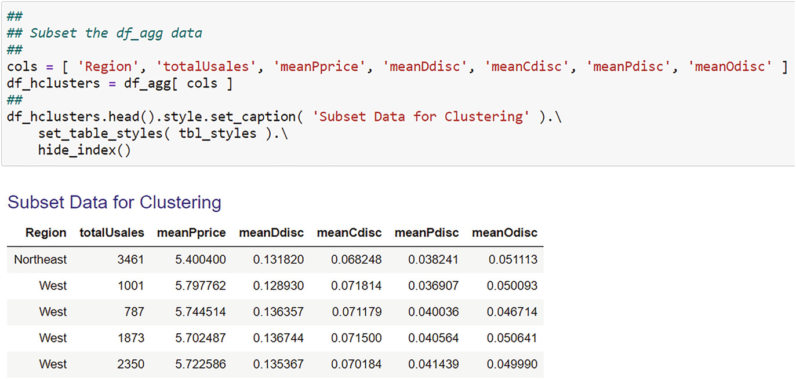

图 12.1 这是家具案例研究客户层次聚类的聚合数据样本
一旦数据立方体被子集化并且子集数据被适当地聚合，它们必须被预处理。我分两步做到了这一点。首先，我标准化了总销售额、平均口袋价格和四个折扣中的每一个。我使用了标准缩放器。我检查了描述性统计数据以确保每个平均值为零，每个标准差为 1.0。我在图 12.2 中显示了这个代码。我还标记了 Region 变量的编码。我使用了 labelEncoder 函数，正如我在第 1 章中描述的那样。 5. 我在图 12.3 中展示了这一点

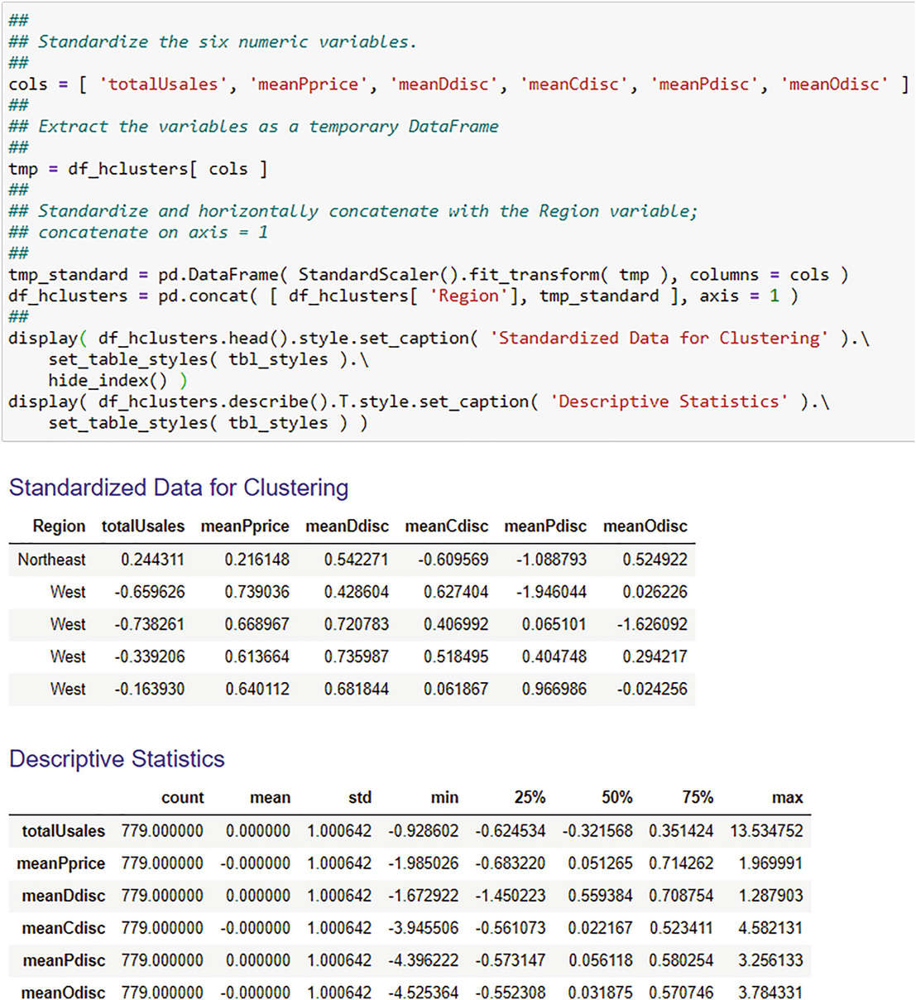

图 12.2 这显示了家具案例研究的聚合数据的标准化

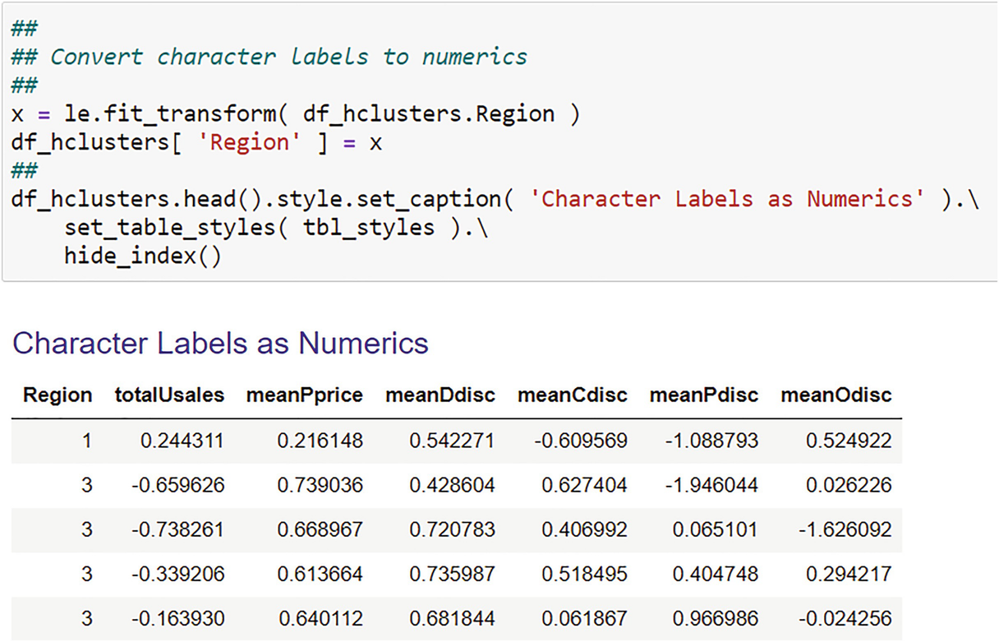

图 12.3 这显示了家具案例研究的 Region 变量的标签编码
一旦数据被正确聚合和预处理，我就可以创建集群了。这是一个迭代过程：尝试几种解决方案，看看哪种解决方案最适合你的问题。在这个例子中，我只创建了一个解决方案。我使用了 scipy 包层次聚类函数，我使用命令 import scipy.cluster.hierarchy as shc 在 Jupyter 笔记本的"最佳实践"部分中导入了该函数。 sklearn 包还具有层次聚类功能集，但 scipy 具有更多功能。我提供了代码来创建集群并在图 12.4 中绘制树状图。我把它分为四个步骤：

1. 实例化函数。我使用了 Ward 的链接方法和默认的欧几里得距离度量。

    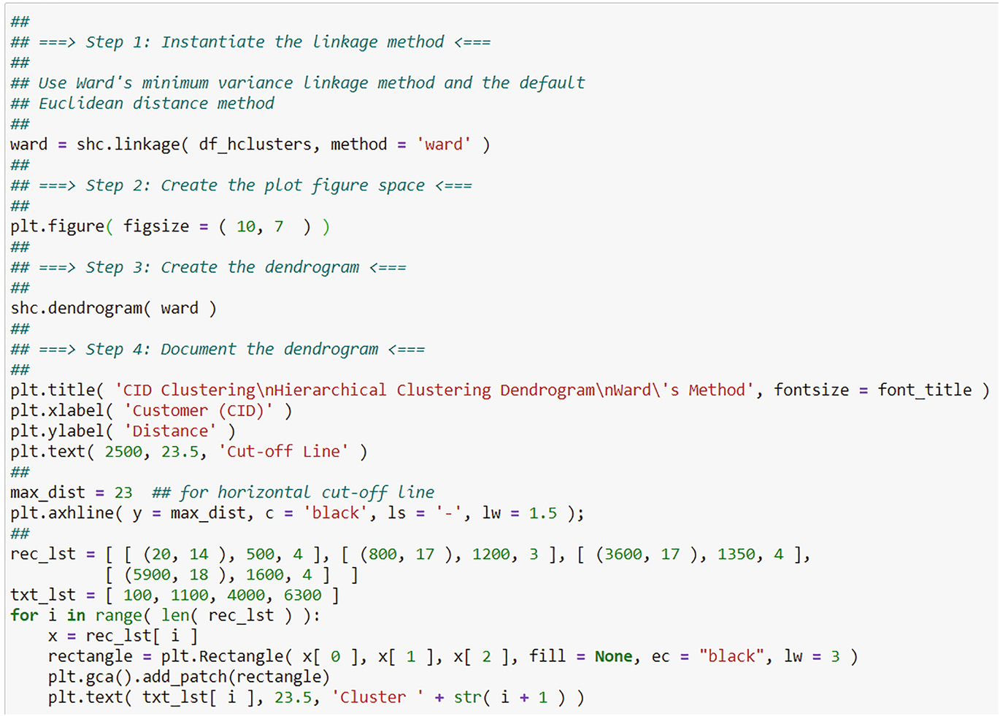

    图 12.4 这显示了家具案例研究的层次聚类代码

2. 创建图形空间。这是绘制树状图的地方。如果你接受默认图形大小，则不需要这样做。
3. 创建树状图。我使用了树状图功能。
4. 记录树状图。我指定了一个距离为 23 的坐标，用于绘制一条水平线作为截止线，我将在下面解释。我还包括了一些框，以根据截止线突出显示集群。

我在图 12.5 中显示了生成的树状图。首先，请注意所有客户都位于树状图的底部，每个客户都是一个单独的叶子；如上所述，每个客户都是他/她自己的集群。你还可以看到，终端叶子与决策树的终端叶子相当，除了树状图的叶子样本大小为 1 而决策树的样本大小大于 1。最后，你可以看到根位于所有客户的树状图顶部，因此样本量为 100%；决策树也是如此。正如我上面提到的，树状图和决策树之间的区别在于，前者不会告诉你为什么会形成集群，除非对象是相似的（即它们很接近）。

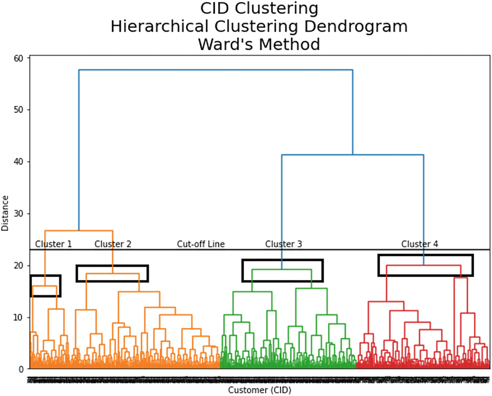

图 12.5 这显示了家具案例研究的层次聚类的树状图。距离 23 处的水平线是分界线：在这条线下方形成的集群是我们将研究的集群
使用我上面描述的逐步迭代算法过程对客户进行分组。如果你跟进树状图，你可以看到集群形成时的样子。但是你使用哪些集群？在识别集群时，你在哪里"划清界限"？如图 12.4 所示，我实际上在 23 的距离处画了一条线（参见变量 max_dist）。在这条线下方形成的集群是要研究的集群。线以上的不是要研究的集群。当然，根表示一个簇，在线之上，当然不值得研究。
我在 23 的分界线是任意的。它是一个超参数。在这个级别，有四个集群需要研究。我用方框突出显示了这些。你现在可以更进一步并确定每个集群中的客户吗？你可以使用 scipy 函数 fcluster 展平聚类数据，该函数具有来自链接的变量（例如，此问题中的"ward"）、最大距离（即 max_dist）以及将最大距离用作参数的标准。扁平化集群文件只是分层数据的 2D 平面文件。我在图 12.6 中展示了一个例子。请注意，这给出了每个客户的集群分配。集群分配取决于 max_dist 值；较低的值将产生更多的集群。你现在可以检查这些集群，例如，使用频率分布、箱线图和集群均值表。我在图中展示了一些可能性。 12.7、12.8 和 12.9。

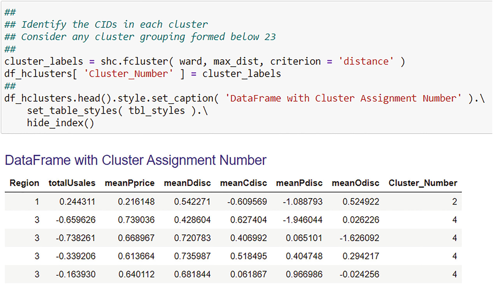

图 12.6 这是扁平的层次聚类解决方案。注意集群编号

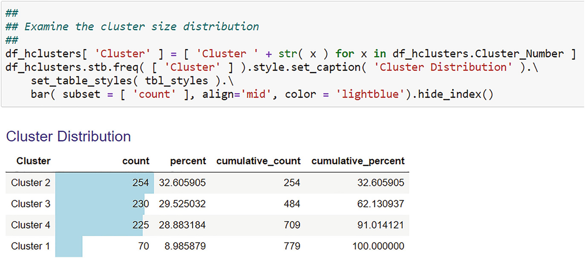

图 12.7 这是层次聚类解决方案的聚类大小的频率分布

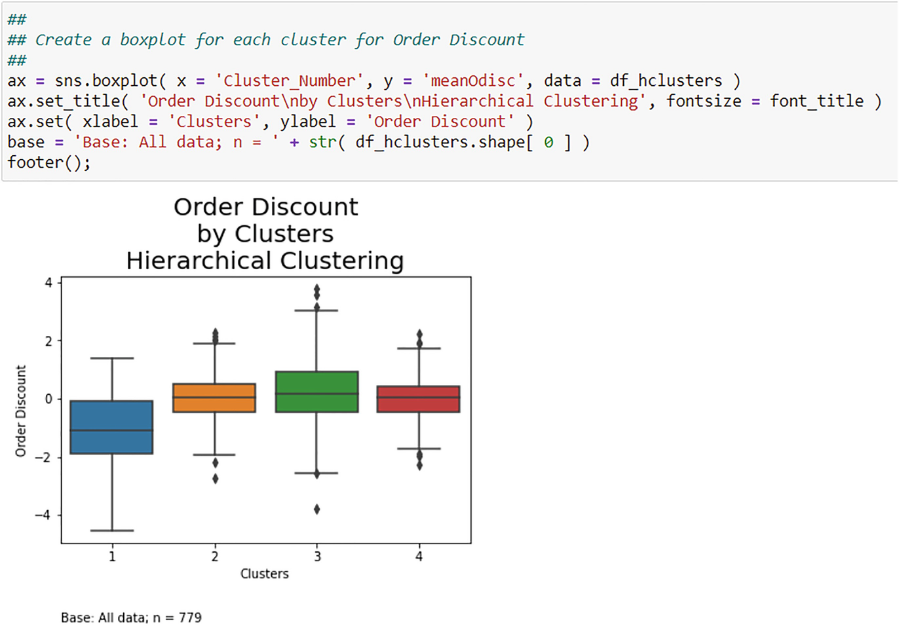

图 12.8 这是层次聚类解决方案的聚类大小箱线图

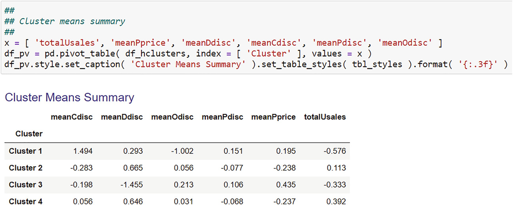

图 12.9 这是层次聚类解决方案的聚类均值总结

### 12.2.6 检查多个解

应该清楚的是，你可以创建许多层次聚类解决方案。你可以通过改变这些超参数来创建它们：

1. 距离度量；
2. 联动方式；
3. 截止线；
4. 特征。

你如何判断哪种解决方案是最好的？一件事你可以看看它的集群大小。你应该需要包含多个对象（例如客户）的集群。这种形式的聚类通常用于市场细分，营销经理希望在各个细分市场之间实现均匀分布。你还可以查看集群的数量。你不想要一个太难以管理的数字，也不应该想要两个或三个。对于市场细分，我经常推荐四五个。但最终，正如 Hand 等人所强调的那样。 (2001, p. 295)，解决方案就在旁观者的眼中。

## 12.3 K-Means 聚类
K-Means 聚类不是分层的，因此不会生成树状图。此外，它要求你指定集群的数量 k；设置 k = 3 意味着你想要 3 个集群。你可以尝试不同的 k 值来获得不同的解决方案。 k 是一个超参数。

### 12.3.1 算法描述

该算法是迭代的，因为它用于层次聚类。在这种情况下，对象是基于特征的手段连续连接起来的。这立即表明特征必须至少处于区间级别，以便可以计算均值。算法是：

1. 创建 k 个初始簇，有时称为种子簇或种子点。
2. 根据与种子的最短距离，将对象与 k 个种子中的每一个进行分组。
3. 创建新种子作为组的平均值（或质心）。
4. 根据对象与质心之间的最短距离将对象合并到每个组中。
5. 从步骤 3 开始重复，否则在所有对象都分配到 k 个组时停止。

因此，度量是最短距离，链接是质心。

### 12.3.2 案例研究应用

我在图 12.10 中展示了家具案例研究的初始数据设置。请注意，这与图 12.1 中的分层数据相同。该聚类算法的数据必须在使用该算法之前进行标准化。 K-Means 算法的数据必须被白化，这意味着每个特征必须按其标准差进行缩放。这些特征不是以均值为中心的，因为该算法通过计算每个特征的均值来工作；居中将所有均值设置为零。该算法当然不会产生任何有意义的东西，如果它产生任何东西的话，因为所有的手段都是一样的：零。你在 scipy 中使用 whiten 函数。该函数使用特征数据作为参数。数据白化后，使用sklearn函数KMeans链接质心，得到聚类分配。我将 sklearn 用于此应用程序，因为它具有更多功能。我在图 12.11 中显示了这个代码。该算法从随机选择观察值作为初始质心开始。你可以为可重复性指定随机种子。我使用了 42。一旦你有了集群分配，你可以将它们附加到原始数据的 DataFrame 中，并按集群分析数据。例如，你可以创建一个如图 12.12 所示的频率表，而集群意味着如图 12.13 所示。

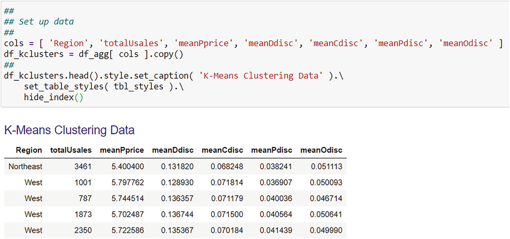

图 12.10 这是家具案例研究中客户 K-Means 聚类的聚合数据样本

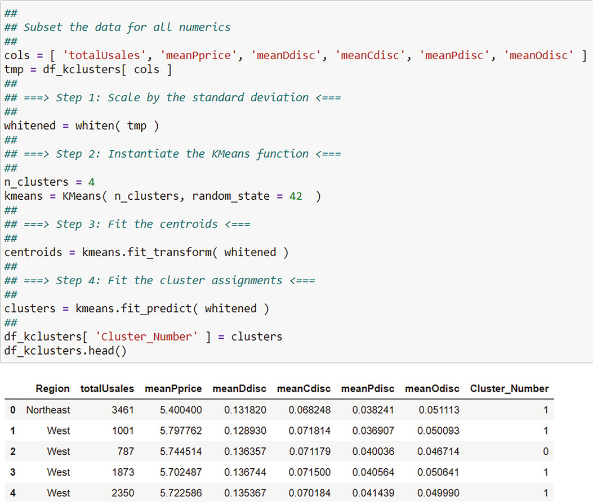

图 12.11 这是 K-Means 聚类的设置。请注意，为了重现性，随机种子设置为 42

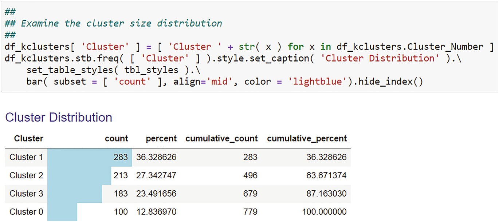

图 12.12 这是图 12.11 中 K-Means 集群分配的示例频率表

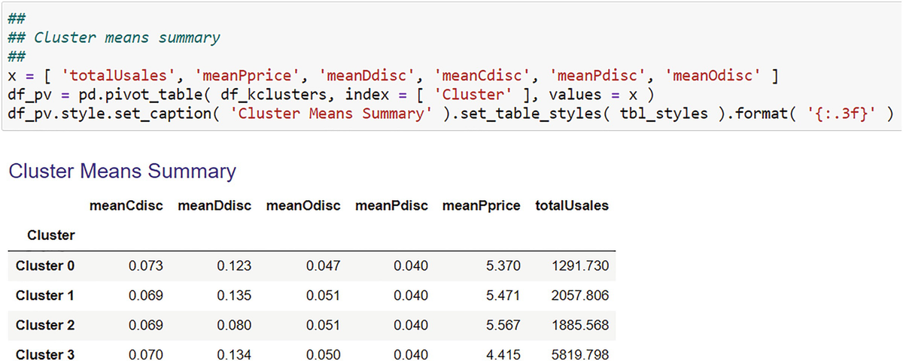

图 12.13 这是图 12.11 中 K-Means 聚类分配的聚类均值总结

## 12.4 混合模型聚类

当你的数据来自多个分布时，就会出现混合模型。你在基础统计课程中了解到你的数据来自单一分布，通常是正态分布。然而，数据可能来自多个分布。如果直方图是倾斜的和/或多峰的，这很明显。多峰性总是由于反映不同人群的两种或多种单峰分布的混合。对各个单峰分布进行加权。有关讨论和示例，请参见 Paczkowski (2016)。
K-Means 聚类有两个缺点：
它在处理不同形状的集群方面缺乏灵活性。它在每个集群周围放置一个圆或超球体，但集群可能不是球形的。
它缺乏概率聚类分配。但是分配到一个集群并不总是确定的。大多数作业都存在不确定性，这是一个概率概念。
混合模型处理这些问题。连续数据最常见的分布是正态分布或高斯分布。我在图 12.14 中展示了这种聚类方法的设置和结果。我还在图 2 中展示了两种类型的摘要。 12.15 和 12.16 与我展示的其他两种聚类方法相当。

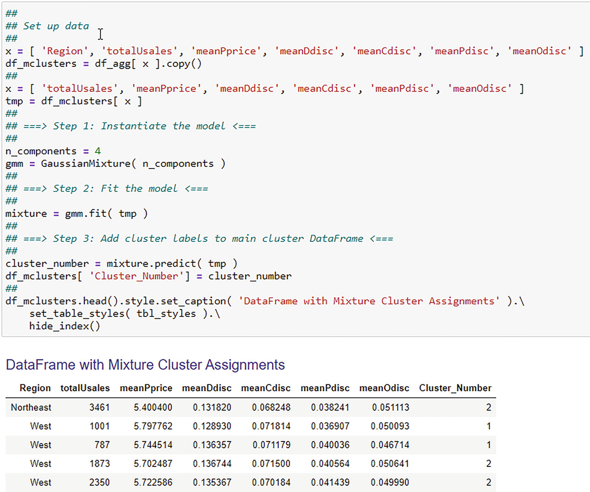

图 12.14 这是一个高斯混合聚类的设置

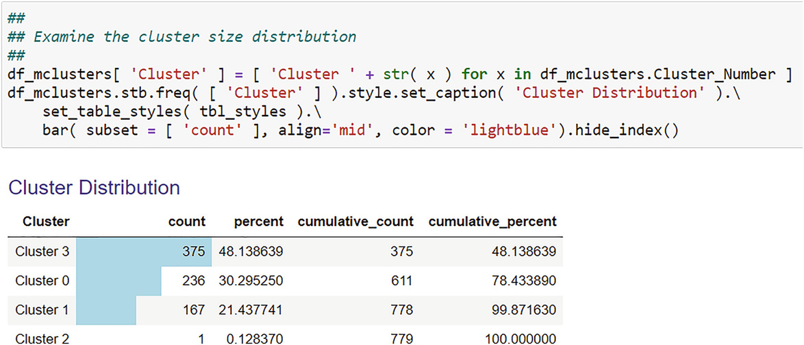

图 12.15 这是图 12.14 中的高斯混合集群分配的示例频率表

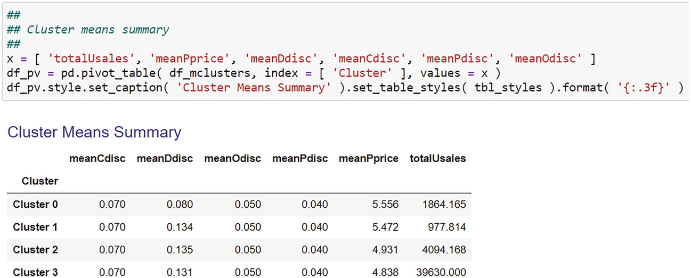

图 12.16 这是图 12.14 中高斯混合聚类分配的聚类均值的总结

## 参考

- Cormen、T.H.、C.E. Leiserson、R.L. Rivest 和 C. Stein。 2009. 算法导论第 3 版。纽约：MI 出版社。
- Everitt, B.S., S. Landau 和 M. Leese。 2001. 聚类分析。第 4 版。伦敦：阿诺德出版社。
- Hand、D.、H. Mannila 和 P. Smyth。 2001. 数据挖掘原理。剑桥：麻省理工学院出版社。
- Paczkowski, W.R. 2016。使用 JMP 进行市场数据分析。班加罗尔：SAS 出版社。