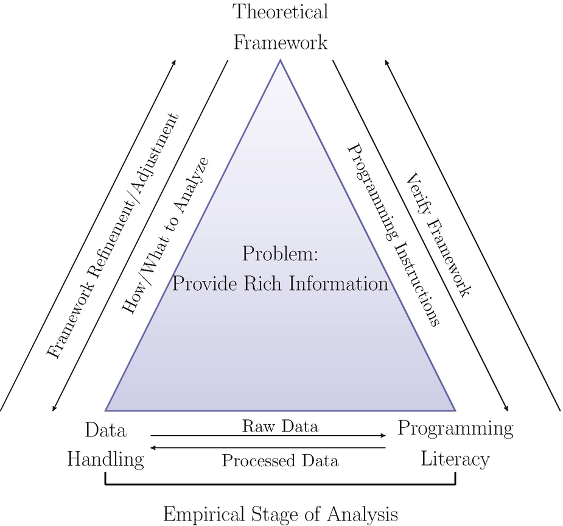
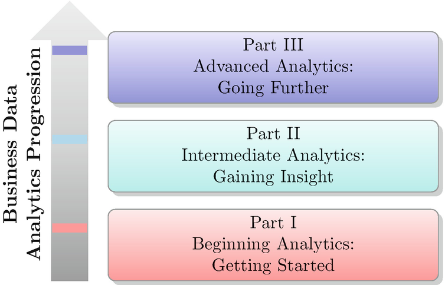

## 前言
我分析业务数据——我已经这样做了很长时间。我是一名分析师和部门主管、顾问和培训师，解决了无数问题，撰写了许多书籍和报告，并向各级管理人员发表了许多演讲。我学到了很多。这本书反映了我从这次业务数据分析的经验中获得的见解，我想分享。
关于本次分享，您应该快速提出三个问题。第一个很明显：“分享什么？”第二个逻辑如下：“与谁分享？”第三个更微妙：“这本书与其他数据分析书籍有何不同？”一是专注，二是目标，三是竞争比较。那么，让我来解决每个问题。
本书的重点
我的经验是处理实际的业务问题。当我以博士学位完成学术培训时。在经济学和大量统计数据方面，我立即在 AT&T 内部咨询小组分析支持中心 (ASC) 开始了我的职业生涯。我很快了解到，我需要对定量工作有理论和技术上的理解——例如，如何估计回归模型——以及如何处理除了我作为研究生使用的漂亮、干净的数据集之外的杂乱数据。我在 ASC 的这段时间是一段很棒的学习经历，我在 AT&T 的整个职业生涯（包括贝尔实验室）以及我自己的咨询业务中都带着它。我学到的教训是，针对实际业务问题的良好、可靠的数据分析需要：

1. 对统计、计量经济学和（在当前时代）机器学习方法的理论理解
2. 数据处理能力，包括数据组织、预处理和整理
3. 至少有一种软件语言的编程知识

这三个组件形成了一个协同的整体，如果您愿意，这是一种统一的方法，用于进行业务数据分析，实际上，任何类型的数据分析。这种协同作用意味着一个部分不会主导其他两个部分。他们一起工作，互相支持，只解决一个首要问题：如何为决策者提供从数据中提取的丰富信息。认识到这个问题是最有价值的一课。所有的分析工具和知识都必须有一个目的，解决这个问题就是这个目的——没有其他的。
我在图 1 中将这个问题以及解决它的三个组件的协同作用显示为三角形。这个三角形代表了我对任何形式的业务数据分析所采用的几乎哲学方法，并且是我提倡的所有数据分析的方法。

图 1 此三角流程图说明了针对总体问题的有效数据分析的三个组成部分的协同连接。每个组件都依赖于其他组件，没有一个组件支配其他组件。无论三角形的方向如何，相同的关系都将成立
三角形中心的总体问题并不明显。这是微妙的。但由于它在任何决策者面临的问题万神殿中的突出地位，我决定将整个第一章都分配给它。在数据分析书中花这么多篇幅谈论信息可能看起来很奇怪，但理解我们为什么要做我们所做的事情非常重要，即分析数据以从数据中提取丰富的信息。
理论上的理解应该是显而易见的。您不仅需要了解方法，还需要了解它们的局限性，以便您可以有效地应用它们来解决问题。这些限制可能会阻碍您或只是给您错误的答案。假设您受雇于业务决策者（例如 CEO）或委托您提供与其问题相关的可操作、有见地且有用的丰富信息。如果一种方法的局限性阻止你完成你的任务，那么你作为分析师的生命将是短暂的，至少可以这么说。如果您不知道这些限制或只是选择忽略它们，这将成立。另一种方法可能更好，问题更少，或者更适用。
方法论培训存在二分法。大多数研究生水平的统计和计量经济学课程，以及较新的数据科学课程，在指导学生了解方法论背后的理论方面做得非常出色。这些学术课程的重点主要是培养下一代学术专业人士，而不是下一代业务分析专业人士。数据科学课程，现在有很多在线和“面对面”的课程，通常会略过理论基础的表面，因为他们的重点是培养下一代业务分析师，他们将解决业务决策者的难题，而不是学术研究人员。成功的业务数据分析师需要介于学术和数据科学培训之间的东西。
数据处理并不那么明显，因为它在学术课程中很少被教授和谈论。在这些程序中，初学者使用干净的数据，几乎没有问题，并且数据集很好，整洁。他们经常只是得到数据。更高级的学生可能需要收集数据，通常是在他们的论文或论文培训的最后阶段，但这些都是很小的努力，尤其是与他们必须处理的后期培训相比。培训后的工作包括：

- 从不同的、不同的、经常断开的数据源中识别所需的数据，这些数据源可能对同一量化概念有多个定义
- 处理数据字典
- 处理超大数据库的样本——如何抽取样本并确定样本量
- 合并来自不同来源的数据
- 将数据组织成适合所选统计/计量经济学/机器学习方法的连贯框架
- 可视化复杂的多元数据以了解数据集中的关系、趋势、模式和异常

这超出了大多数培训计划所能提供的范围。
最后是编程。首先，让我说有编程，然后有编程。区别在于规模和重点。大多数人在听到编程和编程语言时会立即想到大型系统，尤其是那些需要大量时间（几年？）来完全指定、开发、测试和部署的系统。对于处理大量相互关联的操作的大型复杂系统，它们是正确的。很容易想到在线订购系统。客户界面、库存管理、生产协调、供应链管理、价格维护和动态定价平台、运输和跟踪、计费和收款只是这些系统的几个组成部分。至少可以说，这些程序的编程很复杂。
作为业务数据分析师，您不会参与这种类型的编程，尽管您可能必须了解和访问这些较大系统中的一个或多个的子系统。而主要的业务是由许多更大的系统组成的！您可能必须编写代码来访问数据、操作检索到的数据等等，基本上是编写编程代码来完成我上面描述的所有数据处理。为此，您需要了解编程和语言。
有许多可用的编程语言。大多数业务数据分析问题只需要少数几个。根据我的经验，这些是：

- SQL
- Python
- R

应该包括 Julia，因为它的性能和易用性使其越来越受欢迎。对于本书，我将使用 Python，因为它的生态系统强烈地面向机器学习，具有强大的建模、统计、数据可视化和编程功能。事实上，它的编程范式使用起来很清晰，这与其他语言相比是一个明显的优势。

## 目标受众
本书的目标读者包括私营部门的商业数据分析师、数据科学家和市场研究专业人士，或者那些渴望成为其中任何一位的人。您将参与或负责对业务问题进行大量定量分析，例如但不限于：

- 需求测量和预测
- 预测建模
- 定价分析，包括弹性估计
- 客户满意度评估
- 市场和广告研究
- 新产品开发与研究

为了完成这些任务，您将需要了解基本的数据分析方法和一些高级方法，包括数据处理和管理。本书将通过以下方式为您提供所需的背景知识：

- 解释分析概念背后的直觉
- 发展数学和统计分析概念
- 使用 Python 演示分析概念
- 用案例研究说明分析概念

本书也适用于提供商业数据分析、数据科学和市场研究方面的课程和认证的学院和大学。它可以用作主要或补充教科书。
由于目标受众由当前或有抱负的业务数据分析师组成，因此假设您已经或正在对“Stat 101”级别的基本统计有基本的了解：描述性统计、假设检验和回归分析。计量经济学和市场研究原则的知识虽然不是必需的，但将是有益的。此外，推荐使用一定程度的微积分和一些矩阵代数，但不是必需的。附录将根据需要为您提供一些背景知识。

## 本书的竞争比较
市场上有很多书讨论了本书的三个主题：分析方法、数据处理和编程语言。但他们是分开做的，而不是一个协同的、分析的整体。它们被单独处理，因此您必须涵盖广泛的文献才能找到特定业务问题所需的内容。此外，一旦找到，您必须将材料翻译成商业术语。本书将介绍这三个主题，以便您更轻松地掌握工作所需的内容。

## 本书的结构

我把这本书分成三个部分。在第一部分中，我将介绍业务数据分析的基础知识，包括数据处理、预处理和可视化。在某些情况下，您只需使用基本分析工具集即可解决业务主管提出的问题。第二部分专门介绍一组您至少应该知道的更丰富的分析工具。这些包括回归建模、时间序列分析和统计表分析。第三部分使用更高级的方法扩展了第二部分的工具：高级回归建模、分类方法和分组方法（也称为聚类）。
这三个部分自然而然地从基本原理和方法引向复杂的方法。我在图 2 中说明了这个逻辑顺序。

图2这是本书三个部分的流程图。零件逐步从基础到高级。在第一部分结束时，您应该能够对业务数据进行基本分析。在第二部分结束时，您应该能够进行回归和时间序列分析。在第三部分结束时，您应该能够进行高级机器学习工作
在这三个部分中嵌入了业务问题的案例研究示例，这些示例使用（尽管是虚构的、虚假的或模拟的）业务交易数据来指示分析师每天使用的业务数据。将模拟数据用于教学目的当然不是没有先例。例如，参见 Gelman 等人。 （2021 年）。数据处理、可视化和建模都使用 Python 进行说明。所有示例都在 Github 上的 Jupyter 笔记本中。
沃尔特·R·帕茨科夫斯基
美国新泽西州普莱恩斯伯勒

## 致谢

在我的上一本书中，我注意到我从我出色的妻子 Gail、我的两个女儿 Kristin 和 Melissa 以及我的女婿 David 那里得到的支持和鼓励。和以前一样，我的妻子盖尔鼓励我坐下来好好写，尤其是当我不想写的时候，而我的女儿们则提供了我需要的额外的眼睛来使这本书变得完美。他们为这本书提供了同样的支持和鼓励，所以我当时和现在都欠他们很多。我还想谈谈我的两个孙子，他们现在 5 岁和 9 岁，显然没有为这本书做出贡献，但我希望他们成年后会看到这本书并说：“我的祖父写了这本书，也。”